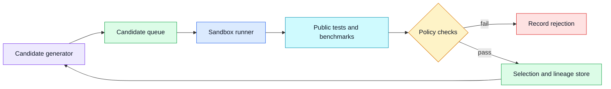
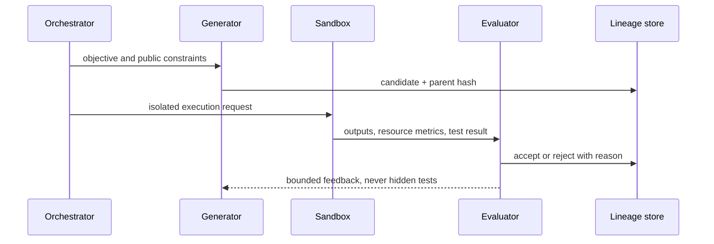

# Search over programs
Status: draft — expansion and review pending
Sources: [Google DeepMind — AlphaEvolve](https://deepmind.google/blog/alphaevolve-impact/)

## Draft lesson
Program search generates candidates, runs an evaluator, and retains candidates that improve a defined objective. The evaluator is the product: weak tests reward shortcuts. Run candidates in a sandbox, cap resources, preserve seeds and diffs, and keep hidden tests outside the generation context.

## In one sentence

Search over programs generates candidate implementations, evaluates them in a constrained environment, and keeps only changes that improve an explicitly measured objective without violating safety, cost, or correctness rules.

## Background

Engineers already search over programs in constrained ways: a compiler explores optimizations, a test runner validates a patch, and a tuning system tries configurations against a benchmark. Evolutionary program search makes this loop explicit. A generator proposes a mutation, an evaluator runs it, and a selection policy preserves useful candidates. The generator may use a language model, templates, random mutation, or all three; the evaluator determines whether the system is useful.

The baseline is ordinary software development: a human writes a change, tests it, reviews it, and merges it. Automated search can explore more alternatives, especially for a narrow numerical kernel, schedule, heuristic, or data transformation. It also creates a strong incentive to exploit whatever the evaluator forgets to measure. A program that passes a weak test may hard-code inputs, skip error handling, consume excessive memory, or rely on undefined behavior. Treat the benchmark as an attack surface.

## What changed

Google DeepMind presents AlphaEvolve as an evolutionary approach to improving algorithms. This is a vendor claim about a particular system, not proof that every code-search workload benefits from evolution. The useful engineering takeaway is that code generation and selection can be separated into an iterative system with artifacts, isolated execution, objective functions, and reproducible evidence.



## Impact on current processing

Make each candidate an immutable artifact with parent IDs, source hash, generator version, prompt or mutation configuration, random seed, dependency lockfile, and declared objective. The evaluator records environment image, resource limits, test version, benchmark inputs, measurements, and decision. This lineage is required to reproduce a winner and to distinguish an improvement from a changed compiler, cache state, or input distribution.

Run untrusted candidates in a sandbox with no network, read-only fixtures, a temporary filesystem, CPU and memory limits, wall-clock timeout, process limit, and output-size cap. A language model should not receive hidden tests or production credentials. Separate public tests, which guide iteration, from held-out tests and operational checks, which decide promotion. Otherwise the generator can optimize to the exact evaluator rather than the intended behavior.



## Engineering consequence

Define objectives as a vector, not one vanity score. A candidate may need functional correctness, latency under a fixed workload, bounded memory, deterministic output, dependency policy compliance, and readability or reviewability. Set minimum gates before optimization: no candidate can trade away a required security test for a faster benchmark result. Use statistical repeats when measurements are noisy and record the machine class and cache policy.

Search budgets are production controls. Limit candidate count, total CPU time, concurrent sandboxes, storage, and external dependency fetches. Cancel descendants when a parent is invalidated. Deduplicate exact and near-identical source artifacts so a generator cannot spend the budget rediscovering the same patch. The system should retain rejected artifacts and reason codes for debugging, without promoting them as viable alternatives.

### Designing an evaluator that resists shortcuts

Start from a specification, not a benchmark script. Identify invariants that must always hold, workloads that represent normal use, adversarial inputs that represent likely misuse, and constraints that may never be traded for a score. For a sorting routine, correctness includes ordering, preservation of all inputs, stable behavior if required, and defined handling of empty or malformed data. For a query optimizer, it includes equivalent results, cancellation behavior, memory limits, and tail latency on realistic data distributions. A single average runtime number cannot express those requirements.

Use a layered evaluator. First reject malformed source, forbidden imports, oversized diffs, or unapproved dependencies without starting expensive execution. Next run deterministic unit and property tests. Then use benchmark runs with warm-up policy, fixed machine class, repeated trials, and variance recording. Finally run held-out, fuzz, compatibility, and security checks that remain unavailable to the generator. A candidate must clear every hard gate before selection compares its optimization score. This ordering makes the evaluation cheaper and makes rejection reasons understandable.

Measurement noise needs an explicit policy. Modern hosts vary because of scheduling, thermal state, disk cache, network neighbors, and compiler behavior. Measure a baseline alongside candidates, discard only documented warm-up runs, compare distributions rather than one timing, and require an improvement larger than normal variance. If a candidate wins by one percent while repeat runs vary by five percent, record it as inconclusive. The correct action may be more measurement or a smaller claim, not automatic promotion.

Separate the fitness function from the admission policy. Fitness might rank eligible candidates by throughput, memory, or an application-specific utility score. Admission policy enforces licensing, reproducibility, dependency, security, and review rules. This prevents a tempting score increase from overriding a non-negotiable constraint. Store both decisions: “functionally correct but rejected because it opens a socket” is much more useful than a generic failure.

### Isolation and execution controls

A sandbox must defend both the host and the evaluation. Use a disposable container or virtual machine with a fixed image, no production credentials, no writable host mounts, no outbound network unless a narrowly approved fixture requires it, and a separate unprivileged user. Apply CPU, memory, file-size, process-count, and wall-clock limits. Capture bounded stdout and stderr because a candidate can consume storage simply by printing. The sandbox is not a substitute for code review, but it reduces the impact of a candidate that loops, forks processes, reads unintended files, or attempts to call an external service.

Fixtures should be immutable and scoped. Give candidates only the input corpus needed for the current public test and mount it read-only. Hidden tests should run in a separate evaluation stage whose data and result details are not supplied to the generator. For data that cannot leave a secure environment, place the evaluator near the data and return aggregate measurements or failure categories. Do not copy production records into a prompt merely because a candidate needs realism.

Treat every run as an event with a candidate hash, parent hash, evaluator version, environment image digest, resource policy, input-set version, and start and end timestamps. Store outputs by content hash, not an unbounded transcript. If a run crashes, its status must distinguish timeout, resource limit, sandbox policy denial, evaluator failure, and candidate test failure. These categories drive different remediation and avoid wrongly penalizing a candidate for an infrastructure outage.

### Selection, promotion, and rollback

Selection should maintain a small Pareto set when objectives conflict. One candidate may be fastest but use more memory; another may be slightly slower but much simpler or more stable. A Pareto frontier keeps candidates that are not worse on every objective, then an explicit product policy chooses among them. This is safer than hiding business choices inside a weighted score whose coefficients nobody can explain after an incident.

Promotion is a separate workflow from evaluation. A selected candidate enters code review with its diff, lineage, evaluator report, limitations, and rollback plan. Deploy first to an offline replay or shadow path, then a canary with error, correctness, latency, and resource monitors. Define automatic rollback thresholds before traffic begins. A candidate that improves a synthetic benchmark but increases production timeouts should be removed promptly, while its artifacts remain available for investigation.

Maintain a known-good baseline and make rollback cheap. Pin the deployed artifact by immutable hash; do not label a moving branch as “best.” If a promotion touches configuration, compiler flags, dependencies, or generated code, version those with the candidate. Operators need a one-step way to restore the previous trusted state and a dashboard that connects production behavior to the evaluator report.

## Operational monitoring and incident response

Monitor the search service itself as well as its winners. Track submitted, deduplicated, rejected, timed-out, and promoted candidates; sandbox queue time; CPU-hours; evaluator error rate; score distribution; and the fraction of candidates that fail each gate. A sudden shift can indicate a generator prompt change, a broken benchmark, a malicious dependency, or an infrastructure regression. Per-tenant quotas and global circuit breakers keep exploratory work from consuming capacity needed by ordinary builds.

When an evaluator defect is found, invalidate affected decisions by evaluator version and input-set version. Re-run promotion checks against the corrected evaluator before trusting prior winners. When a generated candidate causes a production incident, stop new promotions, roll back to the known-good hash, preserve the exact run record, and determine whether the failure came from missing requirements, test leakage, nonrepresentative data, sandbox escape, or deployment drift. Add a regression fixture for the root cause rather than simply increasing the search budget.

### Choosing an appropriate search target

The best early targets have a narrow interface, an executable oracle, and a low-cost rollback. Examples include selecting a batching threshold, generating alternative query plans, tuning an allocation heuristic, or optimizing a pure numerical kernel. Each has a measurable input-output contract and can be evaluated offline. Avoid targets that mix unbounded product behavior with vague quality judgments, such as an entire customer-facing workflow, until the task has been broken into independently testable components.

Write the objective in a way that exposes trade-offs. A scheduler may optimize throughput subject to a maximum queue age and a fairness floor. A compiler transformation may optimize runtime subject to exact output equivalence, a memory cap, and a maximum build-time increase. A data transformation may optimize cost subject to no loss of required fields and a privacy rule. This formulation reveals where a human policy decision is required instead of letting a generator discover an accidental loophole.

Search can also aid engineers without autonomous promotion. Present a ranked set of candidates with diffs, benchmark evidence, and known limitations to a developer who chooses the next experiment. This human-in-the-loop mode is often the right first deployment because it tests the evaluator and improves the candidate interface while preserving normal review ownership. Automation should follow demonstrated evaluator reliability, not precede it.

## Mini exercise (15–30 min)

Pick a small pure function in an existing project and write three gates before trying any optimization: a property test for correctness, a resource budget, and a held-out input set. Create two intentionally flawed alternatives—one fast but wrong, one correct but too memory-intensive—and ensure the evaluator rejects both for distinct reason codes. Then add one candidate that improves a real metric while passing all gates. The exercise demonstrates that selection policy, not candidate volume, determines whether program search produces usable changes.

## What changed this month

DeepMind presents AlphaEvolve as an evolutionary approach to algorithm improvement; that description is a vendor claim about the named system. The general lesson is an engineering inference: generation can be scalable, but safe selection depends on a testable evaluator, isolated execution, reproducible lineage, and a promotion process independent of the generator. Those controls are what let a team learn from thousands of candidates without granting any candidate production authority by default.

## Real-world applications

Program search is suited to bounded targets: a numerical routine, query rewrite, schedule heuristic, compiler flag set, data-layout transformation, or test-case generator. It is poorly suited to unrestricted application changes with unclear tests or broad security impact. For production services, start with offline benchmarks and shadow traffic; do not allow a search loop to deploy its own code.

In scientific computing, it can explore algorithms against known datasets, but validation must include held-out distributions and numerical-stability checks. In infrastructure, it can suggest an allocation or batching policy, but rollback, quota, and service-level objectives remain external controls. A faster result that increases tail latency or makes failures unrecoverable is not an improvement.

## Mental model

Think of program search as continuous integration with a very prolific contributor. It can submit many patches, but every patch still needs isolated execution, tests, policy gates, provenance, and a promotion process. The evaluator is the maintainers' contract with the search system.

## Limits and failure modes

Goodhart's law is the central risk: once a score becomes the target, candidates can exploit it. Include hidden tests, adversarial inputs, fuzzing, static analysis, and resource checks. Beware benchmark leakage, cached outputs, nondeterminism, flaky tests, and dependency substitution. A candidate that merely memorizes public fixtures may look excellent until it sees a real input.

## Build it locally

```python
from dataclasses import dataclass

@dataclass(frozen=True)
class Candidate:
    name: str
    correct: bool
    latency_ms: float
    memory_mb: int

def select(candidates: list[Candidate]) -> Candidate | None:
    eligible = [c for c in candidates if c.correct and c.memory_mb <= 128]
    return min(eligible, key=lambda c: c.latency_ms, default=None)

pool = [Candidate("fast-but-wrong", False, 2.0, 32),
        Candidate("safe", True, 7.0, 64),
        Candidate("oversized", True, 3.0, 512)]
winner = select(pool)
print(winner)
assert winner and winner.name == "safe"
```

1. Save as `program_search.py` and run `python3 program_search.py`.
2. Add a held-out test field that the generator cannot inspect.
3. Add repeated measurements and reject candidates with unstable latency.
4. Store candidate parent IDs and evaluator configuration in a JSONL log.
5. Add a policy check that rejects new dependencies or network access.

## Interview Q&A

**Why is the evaluator more important than the generator?** Selection decides what survives. A capable generator paired with weak tests will optimize loopholes rather than the real requirement.

**How do you make search reproducible?** Persist source hashes, parent lineage, seed, environment image, dependency lockfile, test version, inputs, resource limits, and measurements.

**Why hide some tests?** Public tests guide iteration; held-out tests measure generalization and reduce direct benchmark overfitting.

## Glossary

**Candidate:** One generated program or mutation submitted for evaluation.

**Evaluator:** System that runs tests, measures objectives, and records a decision.

**Lineage:** Parent and environment records needed to reproduce a candidate.

**Sandbox:** Restricted execution environment for untrusted code.

## References

- [Google DeepMind, “AlphaEvolve impact”](https://deepmind.google/blog/alphaevolve-impact/)
- [NIST Secure Software Development Framework](https://csrc.nist.gov/Projects/ssdf)

## Claim ledger
| Claim | Source | Fact or inference |
|---|---|---|
| AlphaEvolve is presented as an evolutionary approach to improving algorithms. | [Source](https://deepmind.google/blog/alphaevolve-impact/) | Fact, vendor claim |
| Sandboxed evaluation and hidden tests reduce optimization loopholes. | Systems-design reasoning | Inference |
