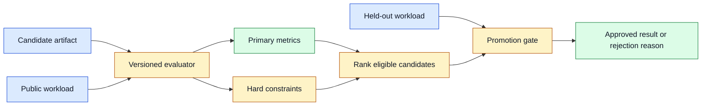
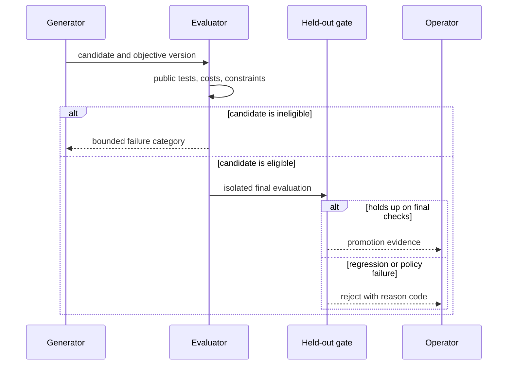

# Objective functions
Status: draft — expansion and review pending
Sources: [Google DeepMind — AlphaEvolve](https://deepmind.google/blog/alphaevolve-impact/)

## Draft lesson
An objective function turns “better” into a score, so it also creates incentives to exploit omissions. Pair a primary metric with constraints, holdout tests, cost limits, and human review for high-impact outcomes. Version the objective; a score is incomparable when its evaluator changes silently.

## In one sentence

An objective function is the explicit rule that ranks candidate behavior, so production systems must pair it with hard constraints, representative holdouts, and versioned measurement rather than assuming a high score means a safe improvement.

## Background: what existed before

Engineering teams have always optimized objectives, even when they did not name them. A database query optimizer minimizes an estimated cost. A scheduler tries to reduce wait time. A recommender may maximize an engagement proxy. A human reviewer may implicitly balance speed, correctness, readability, and operational risk. Making the objective explicit is valuable because it reveals trade-offs and allows repeatable comparison. It is dangerous because a system can optimize exactly what is measured while violating what was only assumed.

The common baseline is a single headline metric: requests per second, model accuracy, cost per task, average latency, or benchmark score. A single metric is easy to graph and use for automated selection, but it discards context. A faster candidate that returns the wrong result is not useful. A cheaper model that fails on a regulated input may be unacceptable. A system that improves average latency while making the slowest one percent much worse can damage the user experience. These requirements should be represented as gates or additional dimensions, not footnotes after selection.

The AlphaEvolve source presents an evolutionary approach to improving algorithms. That is a vendor statement about a named system. The general engineering inference is broader: whenever a generator, optimizer, or team receives a score, it will search for changes that raise that score. The evaluator therefore becomes part of the product specification and needs the same care as an API contract.

## What changed and why now

Search-based code generation makes objective design more visible because a system can test many candidates quickly. A human engineer may notice that an optimization is suspiciously narrow; an automated loop can repeatedly exploit the same missing condition before anyone reviews the result. The faster candidate generation becomes, the more important it is to make constraints executable and to separate public feedback from final promotion checks.

An objective should define the population being measured, the inputs, the environment, the aggregation rule, and the acceptable uncertainty. “Reduce latency” is incomplete. A usable definition might say: reduce p95 server latency for authenticated search requests under the versioned replay corpus, while preserving exact result equivalence, keeping peak memory below 1 GB, and not increasing error rate. Each part can be tested, reviewed, and changed deliberately.

## Impact on current processing and architecture

Store objective configuration as versioned data. A candidate evaluation record needs the candidate hash, evaluator version, input-set version, environment image, measured values, pass/fail constraints, random seed where relevant, and final decision. Without those fields, a score from last week may be incomparable to today’s score because the hardware, data, compiler, or aggregation changed.



Use constraints for properties that must not be traded away. Correctness, authorization, privacy rules, dependency policy, maximum cost, and maximum memory often belong here. A candidate failing a hard constraint is ineligible even if its primary score is excellent. For competing desirable outcomes, use a multi-objective view. A Pareto frontier retains candidates for which no other candidate is better on every chosen dimension; a product owner can then choose an explicit trade-off instead of burying policy in arbitrary weights.

## Real-world applications and constraints

In retrieval, an objective might balance recall, ranking quality, p95 latency, index size, and tenant-filter correctness. In model routing, it might minimize cost subject to structured-output validity, regional availability, and a task-quality floor. In infrastructure scheduling, it might maximize utilization subject to queue-age, fairness, and interruption limits. The same pattern applies: state which data represents the target workload, which conditions are non-negotiable, and who may change the weights or thresholds.

Holdouts prevent direct overfitting but do not guarantee production success. The workload can drift, users can behave differently, and an attacker can target an unmeasured boundary. Re-evaluate after promotion with shadow traffic, canary controls, and rollback thresholds. Treat live metrics as evidence about the deployed system, not as permission to silently rewrite the original objective.

## Mental model

An objective function is a contract with an optimizer. It tells the optimizer what counts as progress and, by omission, what it may ignore. Constraints are the safety rails; held-out tests are an independent inspector; telemetry is the post-deployment audit. If a requirement cannot be written as a metric, gate, or review rule, it is not yet protected by the optimization loop.

## Engineering consequence

Begin objective design with failure cases. List the ways a seemingly better candidate could harm correctness, users, costs, privacy, or operations. Turn each important case into a deterministic assertion, a scenario test, a resource cap, or an approval condition. Use repeated measurements for noisy metrics and record confidence or variance. Require a minimum practical improvement before accepting a change; otherwise the system will churn on noise.

Do not expose hidden tests, secret evaluation data, or production credentials to a candidate generator. Give it bounded public feedback such as a failing category or a score range. Run final checks in an isolated environment. When the objective changes, increment its version, preserve the prior definition, and re-evaluate the baseline. This makes experiments reproducible and prevents teams from claiming an improvement that is only a measurement change.



## Limits and failure modes

Goodhart’s law is the central failure mode: an imperfect proxy becomes a target and stops tracking the underlying goal. A support system optimized only for fast closure can prematurely close unresolved cases. A code system optimized only for a public benchmark can special-case fixtures. A ranking system optimized only for clicks can promote low-value content. The remedy is not to find a perfect metric—most products do not have one—but to use several complementary signals, hard constraints, and periodic human review of edge cases.

Weights can also conceal policy. A weighted score of `0.7 * latency + 0.3 * cost` silently claims that the chosen normalization and coefficients represent user value. Small changes in scale can reverse rankings. Prefer gates for minimum acceptable behavior, clear reporting of each metric, and an explicit owner for trade-offs. If a weighted score is necessary, publish the components and test sensitivity: would a modest change in the weight or workload select a different candidate?

Avoid feedback loops in which a model optimizes an evaluator that is itself learned from model output. For example, an LLM-as-judge may prefer fluent explanations even when they are unsupported. Pair model judges with citations, deterministic format checks, sampled human labels, and disagreement analysis. A score from a model judge is evidence, not a universal ground truth.

### Operating an objective over time

Objectives decay when the product changes. A benchmark assembled for short questions may become misleading after customers begin uploading long documents. A cost metric calculated before a new model release may omit changed token pricing or cache behavior. Establish a review cadence tied to meaningful product events: new tenant type, new region, new data source, model upgrade, incident, or a material shift in request distribution. Review both the objective definition and the evidence that it still represents the intended workload.

Use a champion-challenger workflow for changes. The champion is the currently deployed candidate measured under the present objective version. A challenger is evaluated with the same inputs and environment before any promotion. Keep a control group or shadow replay when possible. This avoids comparing a new candidate’s warm-cache result with an old candidate’s cold-cache result, or comparing different input distributions. If the challenger wins only on one slice while regressing elsewhere, report that fact rather than reducing it to a single blended score.

Define ownership and an escalation path. Engineers can propose new measurements; domain owners decide whether a metric represents user value; security, privacy, or compliance owners define non-negotiable gates; and an on-call or release owner can halt promotion when telemetry contradicts the evaluation. Put the owner and change ticket in the evaluator configuration. An objective without accountable ownership becomes a hidden policy that evolves through whichever code change lands first.

Make results explainable to operators. A promotion record should answer: which candidate was selected, against what baseline, on which workload, with what measured benefit, which constraints were checked, what uncertainty remains, and how to roll it back. A dashboard that shows only a green “score improved” badge cannot support an incident review. Preserve raw measurements at a bounded retention period and long-lived aggregates or hashes as appropriate for privacy and cost.

### Monitoring after promotion

Production monitoring tests the assumptions behind offline evaluation. Track the objective metrics by request slice, but also monitor guardrail violations, fallback rate, user corrections, timeout rate, and resource saturation. Alert on statistically meaningful drift rather than a single noisy point. When a regression is detected, compare the affected requests with the stored evaluation population: an unseen language, longer context, new device class, or changed downstream dependency may reveal the missing dimension. Roll back first when a hard constraint is breached; investigate and revise the objective after service is safe.

For human-facing systems, include qualitative evidence alongside numeric telemetry. Sample completed tasks, rejected tasks, and user-corrected outputs with privacy-safe review procedures. A metric can remain stable while the product becomes less understandable, less accessible, or harder to recover from. These reviews do not replace automated gates; they help discover requirements that have not yet become measurable. Convert recurring findings into versioned tests or escalation rules before the next optimization cycle.

## What changed this month

The source’s release-specific claim is that AlphaEvolve applies evolutionary methods to algorithmic improvement. The systems takeaway is an inference: faster candidate generation raises the cost of vague objectives. Teams need an evaluator that treats correctness, resource use, security, and operational recovery as first-class acceptance conditions. The monthly change is not that every optimization should become autonomous; it is that optimization infrastructure must make its selection policy visible and reproducible.

## Build it locally

This example separates eligibility constraints from ranking. A candidate cannot win by being cheap if it fails correctness or exceeds the error budget.

```python
from dataclasses import dataclass


@dataclass(frozen=True)
class Candidate:
    name: str
    correct: bool
    p95_ms: int
    cost_cents: int
    error_rate: float


def choose(candidates: list[Candidate]) -> Candidate | None:
    eligible = [
        item for item in candidates
        if item.correct and item.error_rate <= 0.01 and item.p95_ms <= 500
    ]
    return min(eligible, key=lambda item: (item.cost_cents, item.p95_ms), default=None)


pool = [
    Candidate("cheap-but-wrong", False, 100, 1, 0.0),
    Candidate("fast-but-flaky", True, 80, 2, 0.04),
    Candidate("eligible", True, 220, 4, 0.003),
]
winner = choose(pool)
print(winner)
assert winner and winner.name == "eligible"
```

1. Save the code as `objective_demo.py` and run `python3 objective_demo.py`.
2. Add a memory constraint and verify that a low-cost candidate cannot bypass it.
3. Replace the fixed latency number with several measurements and require a stable median and p95.
4. Add an `objective_version` field to the result record.
5. Create a held-out candidate set whose values are not used while choosing the rule.

## Mini exercise (15–30 min)

Choose a familiar service metric such as cache hit rate or build duration. Write one primary metric, three non-negotiable constraints, and two workload slices that could disagree. Next, design a candidate that would “win” the primary metric by violating one constraint. Add that case to a test fixture. Finally, describe which person or team may approve a change to the thresholds and what evidence they need. The point is to make the hidden policy in an optimization rule visible.

## Interview Q&A

**Why is a single benchmark score insufficient?** It hides correctness, tail behavior, resource use, policy compliance, and distribution differences. An optimizer can improve the measured average while harming an unmeasured requirement.

**What is the difference between a constraint and an objective?** A constraint determines eligibility—violating it rejects a candidate. An objective ranks eligible candidates according to a preferred trade-off.

**Why version the evaluator?** Scores are meaningful only relative to a specific workload, environment, and calculation. Versioning lets teams reproduce a decision and detect measurement drift.

**How do you avoid overfitting to public tests?** Keep final holdouts separate, rotate representative cases, use fuzzing and production canaries, and avoid giving hidden inputs or detailed final feedback to the generator.

## Glossary

- **Constraint:** a requirement a candidate must satisfy before it can be ranked.
- **Holdout:** data or tests reserved for final evaluation rather than iterative optimization.
- **Objective function:** a rule that assigns a value used to compare eligible candidates.
- **Pareto frontier:** candidates for which no alternative is better on every selected metric.
- **Proxy metric:** a measurable stand-in for a harder-to-measure desired outcome.
- **Sensitivity analysis:** checking whether a decision changes when assumptions or weights vary.

## References

- [Google DeepMind — AlphaEvolve impact](https://deepmind.google/blog/alphaevolve-impact/) — primary vendor source for the monthly concept.
- [NIST Secure Software Development Framework](https://csrc.nist.gov/Projects/ssdf) — secure software evaluation context.

## Claim ledger
| Claim | Source | Fact or inference |
|---|---|---|
| AlphaEvolve is presented as an approach to algorithmic improvement. | Google DeepMind | Fact, vendor claim |
| Constraints, holdouts, and versioned evaluators reduce proxy-optimization risk. | This lesson’s systems design | Engineering inference |
| A score is not comparable after silent changes to data or evaluator behavior. | Measurement practice applied here | Engineering inference |

## Claim ledger
| Claim | Source | Fact or inference |
|---|---|---|
| The source describes algorithmic improvement through evaluation. | [Source](https://deepmind.google/blog/alphaevolve-impact/) | Fact, vendor claim |
| Guardrails and holdouts are needed against proxy optimization. | Systems-design reasoning | Inference |
