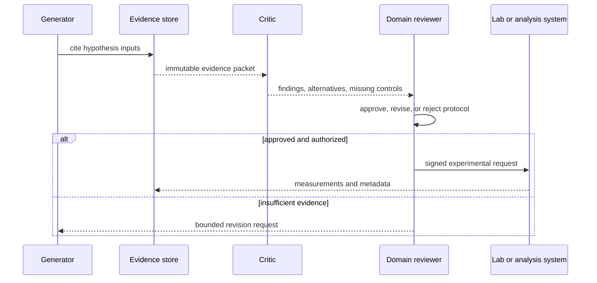

# Scientific hypothesis generation
Status: draft — expansion and review pending
Sources: [Google DeepMind — Co-Scientist](https://deepmind.google/blog/co-scientist-a-multi-agent-ai-partner-to-accelerate-research/)

## Draft lesson
An AI can prioritize hypotheses, summarize literature, and propose experiments; experiments and domain experts remain the oracle. Preserve provenance from claim to paper, dataset, tool result, and interpretation. Separate idea ranking from experimental authorization and report negative results.

## In one sentence

Scientific hypothesis generation systems can help researchers search a large possibility space, but they are useful only when every proposed claim remains traceable to evidence and every consequential experiment stays under domain-governed authorization.

## Background: what existed before

Research begins with incomplete evidence. Scientists observe a phenomenon, read literature, form candidate explanations, select an experiment, measure an outcome, and revise their understanding. This process is already a workflow with specialist roles: literature review, experimental design, statistics, laboratory execution, peer critique, and ethics or safety review. The hard part is not producing a plausible sentence about what might be true. The hard part is deciding which uncertainty is worth testing and whether an experiment can distinguish competing explanations.

Earlier computational tools supported narrow portions of this loop. Search engines retrieved papers, databases stored measurements, simulation systems explored models, and optimization tools selected promising parameter ranges. Each had a defined input and an observable output. Generative systems can synthesize across these artifacts, propose mechanistic explanations, and draft experimental plans in natural language. That makes them helpful for brainstorming, but it also creates a risk: a fluent synthesis can blur source-backed observation, logical inference, and speculative novelty.

The baseline for trustworthy work is provenance. A research note should show which paper supports a background fact, which dataset produced an observation, which analysis transformed it, and which interpretation is still uncertain. A hypothesis generator must preserve this chain rather than converting citations into a decorative bibliography. If a later result contradicts an assumption, researchers need to find every downstream proposal that depended on it.

Google DeepMind presents Co-Scientist as an AI partner for research. This is a vendor description of a particular system, not proof that generated hypotheses are experimentally valid. The durable lesson is narrower: AI can increase the number of candidates considered, while experiments, datasets, statistical analysis, and qualified human judgment remain independent evidence sources.

## What changed and why now

Language models can now combine literature search, structured data tools, and iterative critique in one workflow. A system can retrieve related work, extract variables, identify missing controls, propose several candidate mechanisms, and rank them according to a stated rubric. The engineering challenge is to prevent that convenience from turning an unverified chain of text into a recommendation with implied authority.

Treat a hypothesis as a typed artifact. It needs an ID, a precise claim, assumed mechanism, expected observation, disconfirming observation, supporting source IDs, data references, uncertainty level, required resources, and author or model version. The artifact can then move through an evidence workflow without relying on a long conversation transcript. An unstructured paragraph such as “compound X may improve outcome Y” is not enough to plan a safe experiment or compare candidates.

## Impact on current processing and architecture

Separate discovery, evidence assembly, ranking, and execution. A retrieval component searches approved corpora and returns source records with provenance. A generator creates candidate hypotheses only from an explicit evidence packet. A critic searches for contradictions, missing controls, and alternative explanations. A deterministic validator checks required fields, citation reachability, data access policy, and budget. A human domain owner decides whether a candidate may become an experimental protocol.

```mermaid
flowchart LR
    Q[Research question] --> R[Provenance-aware retrieval]
    R --> E[Evidence packet]
    E --> G[Hypothesis generator]
    G --> C[Critique and counterexample search]
    C --> V[Schema, source, and policy checks]
    V --> H[Domain expert review]
    H --> X[Authorized experiment]
    X --> D[Results and negative findings]
    D --> E
    classDef data fill:#dbeafe,stroke:#1d4ed8,color:#111827;
    classDef control fill:#fef3c7,stroke:#b45309,color:#111827;
    classDef result fill:#dcfce7,stroke:#15803d,color:#111827;
    class Q,R,E,D data;
    class G,C,V,H control;
    class X result;
```



The evidence store is central. Keep immutable source references, extraction version, retrieval query, timestamp, and permissions. Store generated summaries separately from source excerpts and label them as derived text. A model should never be able to replace a source record or promote its own inference into a measured fact. When evidence is updated or retracted, lineage enables invalidation of affected candidates.

Experimental planning needs explicit resource and safety boundaries. A hypothesis may suggest a simulation, a public-data analysis, a lab assay, or a clinical intervention; these have radically different cost, risk, and authorization requirements. The system can estimate required inputs and propose controls, but it must route actual execution through existing laboratory information management systems, ethics review, procurement, and change-control processes. A generated plan is not a permission grant.



## Real-world applications and constraints

In drug discovery, an assistant may rank targets, summarize known pathways, or suggest assays. It should not present a plausible mechanism as clinical evidence, select patient populations, or bypass biosafety and regulatory review. In materials research, it may propose candidate compositions and simulation sweeps, but measurement calibration, supply constraints, and reproducibility still determine whether a result is useful. In software engineering research, it can suggest performance hypotheses, yet benchmark design and controlled experiments remain the test of the claim.

Data access is a major constraint. Research often crosses proprietary, personally sensitive, or regulated datasets. Retrieve only approved records; make tenant, institution, and region boundaries part of the query; and avoid placing raw sensitive data in general-purpose prompts. Retention policies must cover generated notes, tool traces, and experiment metadata, not only the final report.

## Mental model

Think of the model as a research assistant preparing a well-labeled lab notebook, not as the laboratory. It can organize possibilities and make gaps visible. The notebook’s citations, measurements, controls, and negative results are what allow a scientist to judge the work. A hypothesis is valuable when it exposes a test that could prove it wrong, not when it merely sounds novel.

## Engineering consequence

Evaluate the system on evidence quality as well as idea volume. Track the fraction of hypotheses with complete provenance, citation precision, rate of contradicted claims, reviewer revision rate, experiment success and negative-result capture, cost per reviewed candidate, and time from question to an authorized protocol. Compare against a non-agent baseline. If the system produces many candidates but few have traceable evidence or useful discrimination, reduce generation and improve retrieval or the rubric.

Use a hypothesis schema that requires falsifiability. Demand a predicted observation, an alternative explanation, a proposed control, a measurement method, and conditions that would change the conclusion. This prevents the workflow from rewarding broad claims that cannot be tested. Enforce a budget for retrieval, computation, and experiments, because unlimited exploration is not a scientific method or an operational plan.

## Limits and failure modes

Literature synthesis can amplify publication bias. A model that retrieves only positive results may propose a mechanism that looks well supported because negative findings are harder to discover or were never published. Search for replications, null results, retractions, contradictory measurements, and differences in population or protocol. Record absence of evidence separately from evidence of absence. A hypothesis may be reasonable to explore while still having weak support.

Correlation is another trap. A generator can notice that two variables co-occur and propose a causal story, even when both are driven by an unobserved factor. Require an explicit causal assumption and a proposed intervention or control that could distinguish alternatives. For observational data, clearly label associations, possible confounders, and limits on inference. Do not let a generated chart or narrative upgrade correlation into causation.

Scientific terms are often overloaded across disciplines. A source may use “efficiency,” “significance,” “response,” or “improvement” with a precise local definition that a general model blurs. Preserve units, population, measurement window, confidence intervals, and experimental conditions in structured fields. An agent should quote a compact source excerpt for review rather than paraphrase a quantitative result without context.

Human review can fail too if it receives a flood of nearly identical candidates. Deduplicate claims by mechanism and predicted observation, cap the candidate set, and rank by evidence coverage and experimental discriminability. Present reviewers with the central claim, direct evidence, contradictions, proposed test, cost, risk tier, and missing information. A concise evidence packet is more reviewable than a long conversational transcript.

### Reproducibility and decision quality

An attractive hypothesis can still be a poor experiment if it cannot discriminate between explanations. Require the proposed test to state what each competing hypothesis predicts, which variable changes, which controls remain fixed, and how the result will be interpreted. Record sample size, measurement precision, randomization or selection procedure, stopping rule, and analysis version. These fields help a reviewer spot an underpowered design before resources are spent.

Track the boundary between generated novelty and retrieved precedent. A model may recombine known mechanisms and describe the result as new, or it may fail to find an earlier contradictory paper. Label novelty as a hypothesis about the literature, not as an established fact, until a domain expert performs an appropriate search. Keep search queries, corpus date, excluded sources, and uncertainty with the candidate.

When an experiment is authorized, freeze the protocol before measurement begins except for documented safety changes. If the protocol changes, create a new version and explain which outcomes remain comparable. Store raw observations, transformations, failed runs, and inconclusive results under governance. A result that does not support the hypothesis is still valuable because it prevents repeated expenditure and improves the next candidate’s prior assumptions.

## Operational rollout and governance

Begin with read-only use cases: literature navigation, claim extraction, evidence-gap detection, and experiment-plan drafts. Compare outputs with existing review practice in shadow mode. Track whether the system finds sources or controls that experts consider genuinely useful, not merely whether it produces fluent hypotheses. Next, enable creation of structured protocol drafts that require a named human owner to approve them. Do not connect the generator directly to laboratory equipment, clinical systems, procurement, or external communications.

Define safety tiers for proposed work. A public-data analysis may be low risk after access checks. A simulation that consumes significant compute may need a budget approval. A wet-lab, clinical, biological, chemical, or high-impact operational experiment may require domain review, ethics approval, and separate systems for execution. The routing rule should depend on the proposed action, materials, data, and impact—not on a model’s confidence score.

Audit trails should connect an experimental result to the exact hypothesis and protocol version. Store the evidence IDs, model or prompt version, reviewer decision, authorization record, execution environment, measurement instrument or dataset version, and result status. Include negative and inconclusive results. Without that lineage, future systems may repeatedly suggest already disproven ideas or misrepresent a failed protocol as untested opportunity.

## Build it locally

This example accepts a hypothesis only when it includes a predicted observation, a falsifier, and at least one evidence ID. It is a small structural gate, not a scientific evaluator.

```python
from dataclasses import dataclass


@dataclass(frozen=True)
class Hypothesis:
    claim: str
    prediction: str
    falsifier: str
    evidence_ids: tuple[str, ...]
    risk: str


def review(item: Hypothesis) -> str:
    if not item.evidence_ids:
        return "REVISE: provenance is missing"
    if not item.prediction or not item.falsifier:
        return "REVISE: hypothesis is not falsifiable"
    if item.risk in {"high", "unknown"}:
        return "ESCALATE: domain approval required"
    return "READY: draft protocol may be reviewed"


candidate = Hypothesis(
    "Changing parameter A affects outcome B", "B increases by 10%",
    "B does not change in a controlled comparison", ("paper-17",), "low"
)
print(review(candidate))
assert review(candidate).startswith("READY")
```

1. Save the example as `hypothesis_gate.py` and run `python3 hypothesis_gate.py`.
2. Remove the falsifier and verify that the gate requests revision.
3. Add source type and publication date fields; require a primary source for high-impact claims.
4. Persist accepted drafts with an immutable ID and reviewer identity.
5. Add a result record that marks a hypothesis supported, contradicted, or inconclusive without deleting the original claim.

## Mini exercise (15–30 min)

Pick a non-sensitive engineering question, such as whether a cache configuration reduces p95 latency. Write two competing hypotheses, the measurement that would distinguish them, a confounder, a control, and a condition that would make you stop believing each hypothesis. Then design a small replay experiment and record the environment assumptions. This applies the same provenance discipline without treating a model-generated suggestion as evidence.

## Interview Q&A

**What should an AI hypothesis generator return?** A typed candidate with direct evidence references, assumptions, a prediction, a falsifier, alternative explanations, and a risk or authorization tier.

**Why are experiments still the oracle?** Text synthesis can identify possibilities but cannot establish that a mechanism holds in a specific system, population, or measurement environment.

**How do you prevent unsupported claims from spreading?** Preserve provenance, distinguish observation from inference, require reviewer gates, invalidate dependent artifacts when evidence changes, and retain negative results.

**What is a useful success metric?** Reviewer-validated evidence quality and useful, discriminating experiments—not the raw count of generated hypotheses.

## Glossary

- **Confounder:** a variable that can create a misleading association between observed variables.
- **Falsifier:** an observation that would count against a hypothesis.
- **Lineage:** links from a candidate to its sources, transformations, decisions, and results.
- **Provenance:** information about where evidence came from and how it was produced.
- **Protocol:** a specified procedure for conducting an experiment or analysis.

## References

- [Google DeepMind — Co-Scientist](https://deepmind.google/blog/co-scientist-a-multi-agent-ai-partner-to-accelerate-research/) — primary vendor description.
- [NIST AI Risk Management Framework](https://www.nist.gov/itl/ai-risk-management-framework) — governance context.

## Claim ledger
| Claim | Source | Fact or inference |
|---|---|---|
| Co-Scientist is presented as AI assistance for research. | Google DeepMind | Fact, vendor claim |
| Provenance, falsifiability, and domain approval should govern generated research candidates. | This lesson’s systems design | Engineering inference |
| Negative and inconclusive results are necessary lineage data. | Scientific workflow practice applied here | Engineering inference |
