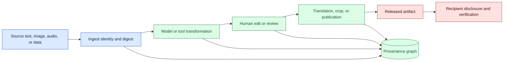
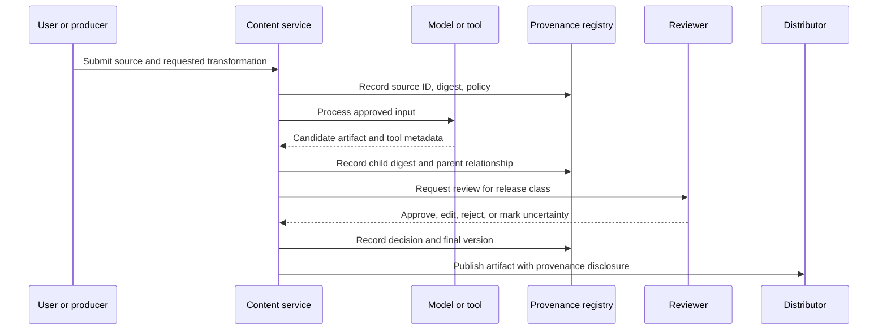

# Content provenance
Status: emerging
Sources: [Google DeepMind — AI-powered pointing](https://deepmind.google/blog/ai-pointer/)

## In one sentence

Content provenance records where an artifact came from, which transformations produced it, and what evidence supports its identity without claiming that provenance makes the content true.

## Background: what existed before

Before generative systems, publishing workflows already tracked authors, source documents, edits, approvals, and file versions. A document-management system might record a creator and revision history; a build system might attach a commit and artifact digest; a camera might store capture metadata. These records help answer who handled an artifact and how it changed, but they do not prove that a claim is correct or that every transformation was captured.

Generated content makes the chain longer. A request can include a user instruction, retrieved sources, images, audio, a model response, a tool result, a human edit, a translation, and a published derivative. Each step can introduce error or change responsibility. Provenance connects these steps with identifiers and timestamps so a reviewer can inspect the history and a recipient can understand what is known and what is missing.

The prerequisites are hashing, signatures, parent-child relationships, transformation metadata, access control, retention, and claim verification. A digest identifies bytes. A signature binds bytes or metadata to a signer. A parent ID links a derivative to an input. A transformation record names the software, configuration, and operator or service that created the derivative. Provenance is identity and history; truth verification is a separate evidence process.

## What changed and why now

The May source is a primary starting point for natural interaction and AI-powered pointing. Its capability claims should be read as source-specific descriptions, not as proof that every generated or selected artifact has a complete provenance chain. The engineering change is that multimodal systems can create or manipulate content through natural instructions, making it easier for users to lose track of the source and transformation history.

The historical baseline often placed a human editor between source and publication. An agent can crop, summarize, translate, retouch, select, or publish quickly, possibly across multiple tools. A final artifact may look authoritative even when its source is unknown, its image was altered, or its text was generated from stale evidence. Provenance gives the workflow a durable vocabulary for source, derivative, uncertainty, and review.

## Impact on current processing and architecture

Create an append-only provenance graph. Intake assigns an artifact ID and digest. Each transformation creates a new artifact with parent IDs, tool and configuration versions, time, purpose, and actor. A policy gate checks whether the operation is permitted. A release service packages provenance for downstream consumers and marks gaps explicitly.



The graph should distinguish copied, transformed, generated, reviewed, and unknown relationships. A generated caption is not the same relationship as a crop. A human review can establish approval of a version but not truth of every claim. A missing parent is a provenance gap; it should not be filled with a guessed source.



For multimodal content, capture modality-specific metadata: image dimensions and crop, audio sample rate and segments, video frame ranges, text encoding, and source timestamps. Keep transformations reproducible where possible. If a model output cannot be regenerated exactly, preserve the model, prompt template, input references, generation settings, and result digest. Do not expose private prompts or source data merely to make a public provenance record complete.

## Real-world applications and constraints

In news, research, or policy publishing, provenance can identify source documents, translations, edits, and approval. It does not certify that a quoted claim is accurate. Pair provenance with source verification, citation checks, and correction workflows. A missing chain should trigger disclosure or review rather than automatic rejection if the content is still useful for a low-risk draft.

In marketing and design, a generated image or copy can retain parent assets, model or tool identity, edits, and license decisions. A final composite may include stock media with different terms. Record the relationship and attribution obligations. A provenance badge should not imply that the image is a photograph or that the model’s depiction is factual.

In software delivery, code generated by an assistant can be linked to a request, repository commit, tool version, tests, reviewer, and merge. This helps investigation and license review, but provenance does not prove the code is secure. Run tests, static analysis, dependency scans, and human review at the appropriate boundary.

In education and research, track source papers, extracted claims, generated summaries, human corrections, and experiment results. Preserve negative and inconclusive findings. A generated bibliography with links is not provenance if the cited source did not support the claim or the transformation history is missing.

In customer support, a response can link to policy version, retrieved article, model route, human edit, and delivery receipt. Avoid exposing another customer’s data in the chain. If a support response is generated from a stale article, provenance makes the failure diagnosable but does not prevent it; freshness and policy checks are separate controls.

Constraints include storage, privacy, mutable external sources, deleted parents, proprietary tools, and user comprehension. A complete graph can be expensive and can expose sensitive relationships. Retain hashes and controlled references when raw content must expire. Explain provenance in plain language and show uncertainty. A cryptographic chain can be correct while the source itself is false.

## Mental model

Think of provenance as a family tree plus a shipping manifest. It shows parents and transformations, and it says which package was handled by which process. It does not tell you whether the family story is true or whether the contents are safe to use. For that, you need evidence, tests, and domain review.

Separate identity, history, and truth. Identity asks whether this is the same artifact that was reviewed. History asks what inputs and transformations produced it. Truth asks whether claims match evidence. Conflating these makes a signed false statement appear trustworthy.

## What changed this month

The May source provides a primary starting point for natural interaction and AI-powered pointing. The source claim is limited to its described capability. This lesson’s engineering shift is to preserve artifact history when natural-language and multimodal tools select or transform content, and to disclose gaps rather than inventing origins.

## Engineering consequence

Define an artifact record with ID, digest, type, parent IDs, source, creator or service, time, transformation, tool and model versions, settings, policy, license, reviewer, status, retention, and disclosure. Protect the registry from mutation and log corrections as new events. Use signatures for approved release manifests, with key ownership and revocation.

At each boundary, decide what provenance is required. Internal drafts may need source and model IDs; public media may need parent and edit disclosure; regulated records may need actor and approval; safety-critical actions need an immutable action receipt. Do not collect more raw content than the purpose requires.

Pair provenance with validation. Check source reachability, citation entailment, image or audio transformations, schema, authorization, and policy. Keep a separate confidence or evidence status. A provenance-complete artifact can still be rejected because its claim is unsupported; a provenance-incomplete draft can be allowed only with explicit disclosure and bounded use.

## Limits and failure modes

### Missing parent

An artifact can be copied without its source record. Mark the gap and require review; do not infer a parent from filename or appearance.

### Mutable source

An external page or dataset can change after capture. Store retrieval time and digest, and retain a governed snapshot or reference.

### Untracked transformation

Screenshots, manual edits, exports, and hidden tool calls can break the chain. Capture boundary events and make untracked export a visible status.

### False authenticity

A signature or provenance badge proves handling, not truth or human authorship. Explain what is and is not established.

### Privacy leakage

Parent links can reveal private people, projects, or data. Use access control, redaction, retention, and public/private views.

### Tool and model drift

Stable tool names may hide changed behavior. Record versions, settings, and runtime identity.

### Broken deletion

Deleting a source may leave derived copies. Track lineage and deletion status, and respect legal holds.

### User misunderstanding

Long technical metadata may be ignored. Present a concise disclosure linked to detailed records and explain uncertainty.

### Overcollection

Recording every prompt and payload increases risk and cost. Keep identifiers and restricted references where sufficient.

### Provenance at boundaries

A graph is only useful when it crosses the boundaries where content changes meaning. Ingest should record whether an input was user supplied, imported, captured, or generated. Retrieval should record the query and source versions. A model call should record the approved model and prompt contract. A human edit should record the editor role and resulting digest. Export should state whether metadata was preserved, stripped, or transformed. These events make an apparently simple copy operation inspectable without requiring a transcript of every internal token.

Define mandatory metadata by risk tier. A private brainstorming draft may need parent and model IDs. A public image may need source, edit, and disclosure information. A regulated report may need reviewer, approval, and retention metadata. A safety-critical command may need exact input, policy, action, and receipt references. Applying the same maximal record everywhere increases privacy and cost; applying the same minimal record everywhere loses the evidence needed for high-impact work.

### Correction and revocation

Provenance supports correction when a source is retracted, a transformation is discovered to be wrong, or a license changes. Mark affected descendants as under review, stale, or revoked and notify owners of published copies. Do not silently rewrite history. A correction event can point to a replacement artifact while preserving the original digest and decision. Downstream caches, indexes, summaries, and derived media need a propagation plan; changing the source registry alone does not remove every copy.

### Interoperability

Different tools may represent provenance differently. Normalize core concepts such as artifact ID, parent, actor, time, transformation, digest, policy, and status at the internal boundary. Preserve external credential formats when publishing, but do not assume a recipient will interpret every field identically. Test round trips through image export, document conversion, translation, and content-management systems. A provenance field lost during export should result in an explicit gap, not a claim of complete history.

### Review questions

Ask whether the displayed origin matches the stored parent, whether every transformation is named, whether the source remains accessible under its policy, and whether a reviewer can reproduce the released derivative. Check that the disclosure distinguishes generated, edited, and verified material. These questions turn provenance from a decorative badge into an operational control.

## Mini exercise (15–30 min)

Create a three-node provenance graph for a source paragraph, a generated summary, and a human-edited release. Store digests, parent IDs, transformation versions, and review status. Change the source and show that the child’s recorded parent digest no longer matches. Mark the release stale without deleting its history.

## Build it locally

```python
import hashlib

def digest(text):
    return hashlib.sha256(text.encode()).hexdigest()

def child(parent, text, tool):
    return {"digest": digest(text), "parent": parent["digest"], "tool": tool, "review": "pending"}

source = {"digest": digest("source paragraph")}
draft = child(source, "generated summary", "model-v1")
print(draft)
assert draft["parent"] == source["digest"]
```

1. Save the example as `provenance_graph.py` and run `python3 provenance_graph.py`.
2. Add source type, license, capture time, and access classification.
3. Add a second transformation and preserve both parent IDs.
4. Modify the source and mark descendants stale when its digest changes.
5. Add a reviewer state and prohibit publication while review is pending.
6. Emit a public disclosure that contains IDs and status but no private payload.

## Interview Q&A

**Does provenance prove truth?** No. It records identity and history; truth requires evidence verification and domain review.

**Why use digests?** They help detect content changes and connect a running or released artifact to the exact bytes that were reviewed.

**What should a generated derivative record?** Parent IDs, transformation, model or tool version, settings, time, actor, policy, and review state.

**How should missing provenance be handled?** Mark the gap, restrict or disclose use, and require review appropriate to consequence. Never invent an origin.

**How does provenance help incidents?** It identifies affected derivatives, transformations, versions, and reviewers so teams can correct or revoke a specific lineage.

### Provenance granularity

Choose the smallest useful provenance unit. A whole-document digest proves that a file existed but does not identify which passage supported a claim. A sentence-level citation improves inspection but can be brittle when a source is reflowed. Store both a stable source identifier and a locator such as page, section, timestamp, or byte range, then retain a normalized excerpt digest for change detection. The excerpt is evidence for review, not a replacement for the licensed source.

For generated media, provenance has at least three layers: source assets, the transformation graph, and the published representation. A resized image may preserve source identity while losing editing metadata; a composite may have several parents; a language-model response may combine retrieved passages with generated transitions. Record parent edges and transformation parameters rather than claiming that the final artifact is wholly generated or wholly sourced.

### Operational verification

Verification should run at ingestion, transformation, and publication. Ingestion checks signatures, repository or URL identity, and license metadata. Transformation records the actor, tool version, input digests, and output digest. Publication checks that required notices, rights restrictions, and review states travel with the asset. If a parent disappears or its license changes, mark descendants affected and route them for review instead of silently serving stale attribution.

Treat provenance as an availability problem as well as a truth problem. A source outage should produce `provenance-unavailable`, not a fabricated citation. A claim may remain visible only if policy permits an uncertainty label and a reviewer accepts the degraded evidence state.

## Glossary

**Content provenance:** Evidence about an artifact’s source, transformations, identity, and handling history.

**Digest:** Hash-based identifier for exact content.

**Parent artifact:** Input from which a derivative was copied or transformed.

**Derivative:** Artifact produced from one or more parent artifacts.

**Transformation:** Process that changes, selects, summarizes, translates, or combines content.

**Disclosure:** User-facing explanation of origin, modification, or uncertainty.

**Lineage:** Connected history from sources through transformations to a release.

## References

- [Google DeepMind — AI-powered pointing](https://deepmind.google/blog/ai-pointer/) — May source context for natural interaction.
- [C2PA Specifications](https://c2pa.org/specifications/specifications/2.2/index.html) — content-credential and provenance context.
- [NIST AI Risk Management Framework](https://www.nist.gov/itl/ai-risk-management-framework) — risk and accountability context.

## Claim ledger

| Claim | Source | Fact or inference |
| --- | --- | --- |
| The May source is a primary starting point for AI-powered pointing and natural interaction. | Google DeepMind AI-powered pointing | Source-selection fact |
| Provenance records identity and history but does not prove truth. | Information-integrity reasoning | Engineering distinction |
| Digests, parent IDs, transformation metadata, and review state improve traceability. | Provenance design reasoning | Engineering recommendation |
| Public disclosures should avoid exposing private source payloads. | Privacy and systems reasoning | Engineering recommendation |
| Content provenance, model capability, and safety evidence are separate claims. | Lesson synthesis | Engineering distinction |
