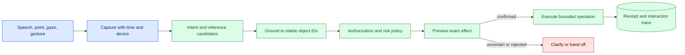
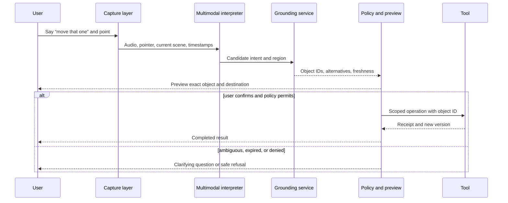

# Natural interaction
Status: emerging
Sources: [Google DeepMind — AI-powered pointing](https://deepmind.google/blog/ai-pointer/)

## In one sentence

Natural interaction lets people combine speech, pointing, gesture, gaze, and context, but every reference must resolve to an explicit object, operation, and authority before a tool changes state.

## Background: what existed before

Graphical interfaces use menus, forms, buttons, and stable identifiers to constrain what a user can select. Voice interfaces add speech recognition and intent classification. Computer-vision systems detect objects or gestures. Each modality has strengths and failure modes: a button is precise but rigid, speech is expressive but noisy, and a visual pointer can identify a region while leaving the intended action ambiguous.

Natural interaction combines these channels. A person may say “move that one there” while pointing at an object and a destination. The system must resolve “that one,” “there,” and “move” using the current scene, user identity, permissions, and task state. It should not infer a destructive or external effect merely because a language model can produce a plausible interpretation.

The prerequisites are grounding, disambiguation, identity, state, confirmation, accessibility, and authorization. Grounding maps language or gesture to an object or location. Disambiguation handles multiple possible referents. A stable object ID persists across frames or UI updates. Confirmation is an explicit user transition for a consequential action. Authorization determines whether the user and agent may perform the operation.

## What changed and why now

The May source concerns AI-powered pointing and natural interaction. That source fact describes a capability direction, not a guarantee that a pointer is accurate in every environment or that an interpreted gesture is safe to execute. The engineering change is that multimodal models can connect a vague human reference with visual context and tools, lowering interaction friction while increasing the need for visible interpretation and bounded effects.

The historical baseline required a user to select an object through a known control or type an exact identifier. Natural interaction can help users who cannot or do not want to navigate rigid interfaces, but it creates ambiguity across time. The object under a pointer can move, a page can rerender, two items can look alike, or a voice command can be interrupted. The system should preserve what was observed and why a reference resolved.

## Impact on current processing and architecture

Separate capture, interpretation, grounding, policy, preview, and execution. Capture records input modality and time. Interpretation produces candidate intent and references. Grounding maps candidates to stable IDs and confidence. Authorization checks scope. A preview shows the exact object and effect. Execution occurs only after the required confirmation, then returns a receipt.



The model should return structured candidates rather than directly calling tools. A candidate includes operation, object ID, destination, evidence frame, ambiguity set, confidence, and expiry. The UI or agent explains the interpretation in human terms: “Move the blue folder named Q2 from the shared drive to archive?” A user can correct the referent before any state change.



Grounding must be temporal. Keep the frame or UI state that supported the reference and invalidate it when the scene changes. A pointer coordinate can map to a different element after a scroll or rerender. A spoken “yes” can confirm the wrong preview if the interface changes between display and confirmation. Bind confirmation to a digest of the proposed operation and require a fresh check before execution.

## Real-world applications and constraints

In a desktop assistant, a user may point to a file and say “send it to her.” The system must identify the file, recipient, account, sharing permissions, and exact channel. Preview and confirmation are appropriate before sending. A read-only search can use a lower-risk path; external communication and deletion require stronger gates.

In a vehicle or robot, a person may point at an object or direction while giving a command. The system needs camera pose, coordinate frame, object identity, motion prediction, and safety envelope. A gesture can express intent without authorizing movement near a person. The controller must independently check speed, clearance, payload, and current state.

In accessibility interfaces, speech and pointing can reduce motor effort or support users who cannot use a conventional pointer. Confirmation should be accessible and not require an unavailable modality. Avoid designing ambiguity controls that exclude users with speech differences, tremor, low vision, or delayed input. Offer text, tactile, visual, or caregiver-supported alternatives where appropriate.

In customer support, “that order” depends on account, conversation, and current list. Display the resolved order number and proposed change. In document applications, a highlight may identify a paragraph but not whether the user wants to summarize, delete, or share it. Natural language must be grounded to an operation, not only an object.

Constraints include latency, privacy, camera and microphone access, device calibration, user fatigue, network loss, and changing scenes. Retain only necessary media, show capture indicators, and apply purpose and access controls. A local model may reduce media exposure but still needs secure traces and update governance. A remote model may improve capability while adding transport delay and provider dependency.

## Mental model

Think of natural interaction as a conversation with a map and a permission slip. The words express intent, the gesture points to candidates, the map identifies stable objects, and the permission slip authorizes an effect. A fluent interpretation is not the same as a confirmed operation. When the map is stale or candidates are tied, ask rather than guess.

Separate reference confidence from action confidence. The system may be confident that the user pointed at a folder but uncertain whether “send it” means email or upload. It may understand the operation but have no authority to perform it. Each uncertainty belongs to a different control and should be visible.

## What changed this month

The May source presents AI-powered pointing as a natural-interaction capability. The source claim is limited to its described system and examples. This lesson applies the idea to interaction architecture: multimodal interpretation should produce a visible, expiring, authorized proposal rather than an implicit command.

The practical shift is from exact UI selection to contextual grounding. That improves expressiveness but makes state, identity, preview, accessibility, and confirmation part of the processing contract. The system must be prepared to clarify, refuse, or hand off.

## Engineering consequence

Define an interaction record with session, user, modality, device, capture time, UI or scene version, candidate references, resolved IDs, operation, destination, evidence reference, confidence dimensions, policy result, confirmation digest, expiry, and receipt. Do not store raw audio or video by default. Link to governed evidence when investigation requires it.

Use a risk-tiered confirmation policy. Informational read actions may execute after grounding and authorization. Reversible edits may require a preview. External messages, purchases, deletion, physical motion, or cross-tenant changes need explicit confirmation and a final state check. A confirmation should name the exact effect, not merely ask “continue?”

Test ambiguity and temporal change: two similar objects, object movement, frame delay, scroll or rerender, interrupted speech, accent, gesture occlusion, changed permissions, and a stale confirmation. Measure grounding accuracy, clarification rate, wrong-object rate, confirmation abandonment, latency, accessibility outcomes, and unauthorized-action attempts.

## Limits and failure modes

### Ambiguous referent

Two objects or destinations may fit the words and gesture. Show alternatives and ask a concise question; do not choose by model confidence alone.

### Temporal drift

The scene or interface changes after pointing. Store state version, expire candidates, and re-ground before action.

### Wrong operation

The object is correct but the verb or destination is not. Preview operation and target, not only highlighted object.

### Confirmation confusion

The user may confirm a changed or hidden preview. Bind confirmation to an operation digest and refresh it before execution.

### Permission mismatch

Understanding intent does not grant authorization. Check user, tenant, resource, and operation at the tool boundary.

### Modality spoofing

Audio or visual input can be replayed or manipulated. Authenticate sessions, protect devices, and use higher assurance for consequences.

### Accessibility exclusion

An interaction path may fail for speech, vision, hearing, or motor differences. Provide equivalent alternatives and evaluate with intended users.

### Privacy exposure

Microphones, cameras, and interaction traces capture sensitive context. Minimize, disclose, restrict, and retain by purpose.

### Over-confirmation

Prompts for every harmless action train users to click through risk. Tier confirmations and make high-impact details prominent.

### Designing the interaction contract

The interaction contract should make ambiguity observable to both the user and the system. Store the source frame or interface version that produced a candidate, the coordinate or phrase used to identify it, alternative candidates, and the operation the system inferred. A user-facing preview can be short, but it must identify the concrete object, destination, and consequence. “I will update order 4812’s shipping address to 10 Main Street” is reviewable; “Proceed with the change?” is not.

Treat clarification as a normal result, not a model failure. A good question reduces uncertainty without asking the user to repeat the whole task. If three files are visually similar, name them with accessible labels and ask which one. If the operation is clear but authorization is missing, explain the required role or handoff. If the scene is stale, request a new observation rather than asking the user to confirm an old picture.

### Recovery and audit

After execution, read back the resulting state and show a receipt. If the tool times out, mark the effect unknown and search by idempotency key before retrying. If the user disputes an action, the trace should connect input modality, scene version, resolved object, preview digest, confirmation, policy decision, and tool receipt. Restrict raw media while retaining enough metadata to investigate. This record supports correction and helps distinguish grounding error from permission or provider failure.

### Evaluation with users

Evaluate with representative users performing realistic tasks, including interruption and correction. Measure how often users notice a wrong highlight, how quickly they recover from a clarification, and whether confirmation language is understood. Include users with assistive technologies and varied speech, motor, visual, or hearing characteristics. A lower task time is not an improvement if users lose control or cannot tell when the system acted. Collect qualitative reports alongside quantitative error rates.

### Performance and cost

Natural interaction can require audio capture, vision inference, tracking, retrieval, and tool verification. Set a latency budget for the conversational response and a stricter one for physical or external actions. Use smaller local components for wake-word or pointer tracking when appropriate, but preserve the same authorization boundary. Measure media bandwidth, inference cost, battery, queue age, clarification rate, and abandoned tasks. Optimize the whole interaction rather than merely the model call.

## Mini exercise (15–30 min)

Create a list of objects with stable IDs and a simulated pointer plus command. Implement grounding that returns one candidate, alternatives, or no match. Add a preview digest and require confirmation. Mutate the object list after preview and prove that a stale confirmation is rejected.

## Build it locally

```python
import hashlib

def proposal(command, object_id, scene_version):
    text = f"{command}|{object_id}|{scene_version}"
    return {"digest": hashlib.sha256(text.encode()).hexdigest(), "object": object_id, "scene": scene_version}

def execute(p, current_scene, confirmed):
    if not confirmed or p["scene"] != current_scene:
        return "clarify_or_refresh"
    return "execute:" + p["object"]

p = proposal("archive", "file-7", "scene-3")
print(execute(p, "scene-3", True))
print(execute(p, "scene-4", True))
```

1. Save the example as `grounded_interaction.py` and run `python3 grounded_interaction.py`.
2. Add alternative object IDs and return a clarification when scores tie.
3. Add user, tenant, operation, and permission fields.
4. Bind confirmation to the proposal digest and reject a changed operation.
5. Add a low-risk read path and a high-risk delete path with different confirmation rules.
6. Record modality, scene version, policy decision, and receipt without storing raw media.

## Interview Q&A

**What is grounding?** Mapping language, pointing, or gesture to a specific object, location, or state in the current environment.

**Why is a highlighted object not enough?** The user’s intended operation, destination, permissions, and current state may still be ambiguous or changed.

**When should the system ask a question?** When candidate references or operations remain ambiguous, stale, unauthorized, or too consequential for automatic execution.

**Why bind confirmation to a digest?** It prevents confirmation of one proposal from authorizing a later mutated operation.

**How do you evaluate natural interaction?** Measure grounding, wrong-reference, clarification, latency, accessibility, authorization, and final-effect outcomes across changing scenes and modalities.

## Glossary

**Natural interaction:** Use of speech, pointing, gesture, gaze, and context instead of only fixed controls.

**Grounding:** Linking an input reference to a concrete object, location, or state.

**Referent:** The object or entity a phrase such as “that one” denotes.

**Disambiguation:** Resolving multiple plausible interpretations.

**Stable object ID:** Identifier that remains tied to a resource across frames or interface changes.

**Confirmation digest:** Identifier binding a user confirmation to an exact proposal.

**Interaction receipt:** Evidence of the accepted operation and resulting state.

## References

- [Google DeepMind — AI-powered pointing](https://deepmind.google/blog/ai-pointer/) — May source context for natural interaction.
- [NIST AI Risk Management Framework](https://www.nist.gov/itl/ai-risk-management-framework) — risk, governance, and accountability context.
- [W3C Web Content Accessibility Guidelines](https://www.w3.org/TR/WCAG22/) — accessible interaction context.

## Claim ledger

| Claim | Source | Fact or inference |
| --- | --- | --- |
| The May source concerns AI-powered pointing and natural interaction. | Google DeepMind AI-powered pointing | Source-selection fact |
| Natural-language and gesture interpretation should resolve to stable IDs before an effect. | Interaction systems reasoning | Engineering recommendation |
| Confirmation should bind to the exact proposal and be revalidated against current state. | Safety design reasoning | Engineering recommendation |
| Reference confidence, authorization, and action safety are separate dimensions. | Lesson synthesis | Engineering distinction |
| Multimodal capability does not establish reliable or accessible operation in every environment. | Evaluation reasoning | Engineering inference |
