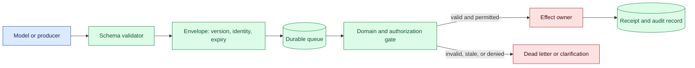
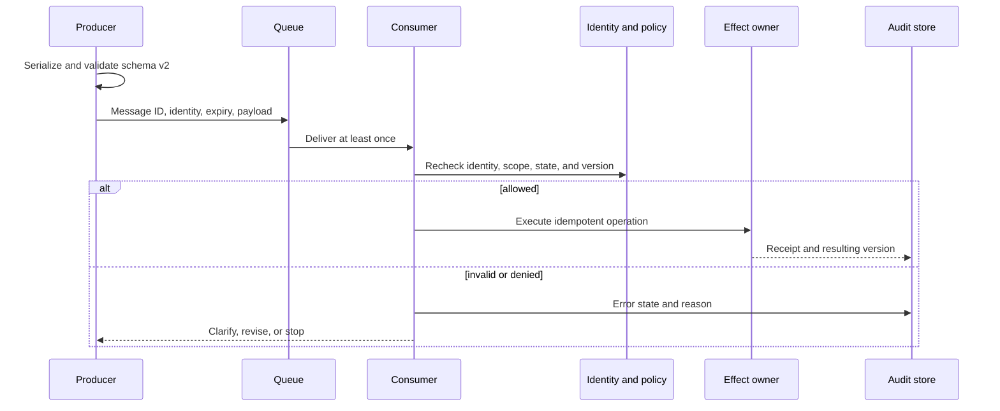

# Structured outputs
Status: emerging
Sources: [Google DeepMind — Co-Scientist](https://deepmind.google/blog/co-scientist-a-multi-agent-ai-partner-to-accelerate-research/)

## In one sentence

Structured outputs make model and agent messages parseable, but schema validity is only one gate alongside truth, identity, authorization, freshness, and effect verification.

## Background: what existed before

Software components communicate through contracts: JSON, protocol buffers, SQL schemas, command-line arguments, and typed function interfaces. A contract defines field names, types, required values, and sometimes allowed transitions. It lets a receiver reject malformed input before it changes state. Human language is flexible and useful for reasoning, but it is a poor direct interface to a queue or a payment API.

Language models naturally produce text. Early integrations parsed that text with regular expressions or asked the model to “return valid JSON.” These approaches reduce friction but do not guarantee that a field has the right meaning, that a number is safe, or that the caller is authorized. Structured output constrains the shape of a response using a schema or typed tool call. It improves interoperability without turning generated content into verified truth.

Prerequisites include schemas, serialization, validation, versioning, queues, identity, idempotency, and state machines. A schema describes shape and types. Serialization turns a value into a transport representation. Validation checks required structure and domain constraints. Versioning lets producers and consumers evolve a contract. Idempotency makes repeated delivery safe. Authorization determines whether the proposed operation may occur.

## What changed and why now

The source presents Co-Scientist as AI assistance for research and motivates collaboration among specialized components. This is a vendor description of a particular system, not proof that structured messages are truthful or safe. The engineering change is that agent workflows increasingly pass proposals, evidence, tasks, and results between model calls and software services. Those handoffs need explicit contracts and error states.

The historical baseline had humans read a report or service code call a fixed API. An agent can generate a plausible object with a valid `action` field, a real-looking resource ID, and an unsafe amount. A queue can deliver it after permission was revoked. A downstream service may trust the object because parsing succeeded. Structured outputs move the failure earlier, but domain validation and effect-owner authorization remain necessary.

## Impact on current processing and architecture

Define a message envelope containing schema version, message ID, run ID, actor or delegated identity, tenant, created time, expiry, purpose, payload, and provenance references. The producer validates shape. The queue boundary validates size, version, signature or integrity, and routing scope. The consumer validates domain invariants and authorization against current state. Only the effect owner commits a state change.



A valid schema does not imply a valid business request. A structured research hypothesis may lack evidence. A deployment command may target a production resource outside scope. A support update may contain fields the agent is not allowed to change. Build domain validators for ranges, cross-field relationships, resource ownership, policy, and current state.



Use explicit error states such as `malformed`, `unsupported_version`, `missing_evidence`, `expired`, `unauthorized`, `conflict`, `provider_unknown`, and `completed`. Do not overload `null` or an empty array to mean failure. A caller needs to know whether it should repair syntax, request evidence, ask for approval, reconcile an external effect, or stop.

## Real-world applications and constraints

In research agents, a message can contain hypothesis, prediction, falsifier, evidence IDs, risk tier, and required resources. The schema makes candidates comparable and routes high-risk work to domain review. It does not establish that citations support the hypothesis or that an experiment is authorized.

In customer support, structured intent can include customer ID, requested field, proposed value, evidence, confidence, and action state. The service must derive identity from authenticated context, compare resource ownership, and require confirmation for consequential changes. A syntactically valid customer ID supplied by a model is not authorization.

In coding agents, a patch proposal can include repository, base commit, file changes, tests, risk, and approval requirement. A merge service checks branch policy and current commit before committing. If the branch changed after proposal, return `conflict` and require regeneration or review; do not apply a stale patch because the JSON parsed.

In workflow orchestration, messages carry task IDs, dependencies, leases, deadlines, and retry policy. Versioned schemas support rolling deployments, but queues can contain old messages. Consumers need backward-compatible readers, migration rules, and dead-letter handling. Keep unrecognized fields where safe or reject them deliberately; silent dropping can lose security-relevant information.

Constraints include schema evolution, model adherence, token cost, privacy, serialization limits, and downstream compatibility. Complex schemas can consume context and encourage the model to fill fields with guesses. Keep the model-visible schema small, make uncertain fields nullable with an explicit reason, and validate server-side. Use JSON Schema, typed classes, or protocol buffers as appropriate, but do not confuse a formal schema with a domain proof.

## Mental model

Think of structured output as a shipping label, not a customs clearance. The label says which fields exist and how to parse them. Customs still checks identity, contents, destination, permissions, expiry, and safety. A beautifully formatted prohibited package remains prohibited.

Separate four questions: can the message be parsed, does it describe a coherent request, is the request authorized now, and did the intended effect occur? Put each question at the right boundary. This makes failures diagnosable and prevents a model’s confidence or formatting from becoming accidental authority.

## What changed this month

The source motivates structured collaboration in a research-oriented multi-agent system. The source claim is limited to its vendor description. The engineering shift is to make agent handoffs explicit and versioned while preserving evidence, identity, policy, and effect receipts.

The practical change is from passing prose between components to passing a typed proposal with an explicit lifecycle. The receiver can reject or clarify without pretending that a malformed, stale, or unsupported message is a model-quality failure.

## Engineering consequence

Define a stable envelope and a topic-specific payload. Required envelope fields should include message ID, schema version, run, actor, tenant, purpose, creation and expiry, correlation, and payload digest. Payload fields need types, ranges, maximum sizes, allowed enums, and field-level uncertainty. Use a schema registry and compatibility checks for rolling deployment.

Validate at producer, queue, and effect owner, but do not duplicate policy blindly. Producer validation improves feedback; queue validation protects routing and storage; effect-owner validation is authoritative because it has current resource and permission state. Record every rejection with version, reason, and correlation ID. Keep a dead-letter path with retention and access policy.

Test malformed types, missing fields, unknown fields, oversized arrays, stale versions, replayed IDs, wrong tenant, expired approvals, conflicting resource versions, partial provider effects, and model-filled guesses. Evaluate structured validity separately from task correctness and safety. A model can produce valid JSON that is wrong, unauthorized, or harmful.

## Limits and failure modes

### Valid but unsafe values

Schema types do not enforce safe ranges or relationships. Add domain checks and effect-owner policy.

### Hallucinated identifiers

A model can invent a plausible resource ID. Resolve against authoritative state and reject unknown or unauthorized resources.

### Version drift

An old producer may send a field a new consumer misunderstands. Define compatibility, migrations, and explicit unsupported states.

### Field omission

Optional fields can hide missing evidence or approval. Represent “unknown” and reason explicitly; require high-risk fields.

### Queue replay

At-least-once delivery duplicates messages. Use stable IDs, leases, and idempotent effects.

### Stale proposals

A valid message can expire before execution. Check state version, deadline, and policy immediately before the effect.

### Prompt injection through fields

Retrieved text in a structured `notes` field remains untrusted content. Keep instructions and data separate and do not let payload text redefine schema or policy.

### Oversized content

Unbounded arrays or strings can exhaust context and storage. Set limits before model generation and at transport boundaries.

### Hidden side effects

A downstream consumer may act merely because a message parsed. Separate proposal, approval, and execution types.

### Privacy leakage

Structured logs can expose personal data. Minimize fields, redact payloads, and restrict raw evidence.

### Contract ownership and evolution

The producer who defines a payload should not be the only owner of its meaning. The consumer that owns the resource must document which fields are authoritative and which are advisory. A schema registry can enforce required fields and compatibility, but a domain owner must decide whether a new enum value is safe, whether an old field can be removed, and whether a migration changes the effect contract. Record the decision with the schema version.

Prefer additive evolution when old consumers can safely ignore new fields, but reject unknown fields when silently dropping them would remove a permission, amount, destination, or safety constraint. For breaking changes, publish a new version and route messages deliberately. Drain or migrate queued messages before retiring a reader. Test mixed-version producers and consumers in a staging queue, including a rollback where old messages remain.

### Security of structured fields

Structured data can create a false sense of trust. A `role`, `approved`, or `source` field supplied by a model is a claim, not an authority. Derive identity, approval, and tenant from authenticated services. Treat free-text fields as untrusted content and keep them from changing instructions or policy. Sign the envelope when integrity across hops matters, but still check current authorization at the effect owner.

### Observability and repair

Log message ID, schema version, producer, consumer, route, decision, reason, latency, retry count, and receipt. Avoid logging full payloads by default. Group failures by malformed, unsupported, expired, unauthorized, conflict, provider unknown, and completed. A repair service can safely regenerate a malformed proposal, but it must not auto-retry an unknown external effect until reconciliation. Make dead-letter records searchable and assign ownership so they do not become silent data loss.

### Testing beyond parsing

Build contract tests that cover valid, boundary, and adversarial messages. Check numeric overflow, empty strings, unexpected Unicode, duplicate IDs, large nested arrays, missing evidence, cross-tenant resources, stale versions, and permission changes between validation and execution. Add property tests for invariants such as “no message can change a resource outside its tenant” and “a duplicate ID creates at most one receipt.” Parsing is the beginning of the test, not its conclusion.

## Mini exercise (15–30 min)

Create a versioned task message with ID, tenant, operation, resource, deadline, and status. Validate type and size, then simulate an expired message, wrong tenant, duplicate delivery, and a changed resource version. Ensure only an authorized effect-owner function can commit a state change.

## Build it locally

```python
def validate(msg, state):
    required = {"id", "version", "tenant", "operation", "resource", "expiry"}
    if not required.issubset(msg): return "malformed"
    if msg["expiry"] < state["now"]: return "expired"
    if msg["tenant"] != state["tenant"]: return "unauthorized"
    if msg["id"] in state["seen"]: return "duplicate"
    if msg["resource"] not in state["resources"]: return "unknown_resource"
    state["seen"].add(msg["id"])
    return "valid"

state = {"now": 10, "tenant": "acme", "resources": {"ticket-7"}, "seen": set()}
msg = {"id": "m-1", "version": 1, "tenant": "acme", "operation": "read", "resource": "ticket-7", "expiry": 12}
print(validate(msg, state))
print(validate(msg, state))
```

1. Save the example as `message_gate.py` and run `python3 message_gate.py`.
2. Add payload schema, maximum sizes, and explicit error details.
3. Add an authorization check for operation and resource, not only tenant.
4. Add resource version and reject a stale proposal.
5. Add a dead-letter record for malformed or expired messages.
6. Add an effect receipt and ensure replaying the message does not duplicate it.

## Interview Q&A

**What does a schema guarantee?** It helps define and validate message shape; it does not guarantee truth, authorization, freshness, or successful effects.

**Where should validation happen?** At production for fast feedback, at queue boundaries for integrity, and at the effect owner for authoritative current-state and policy checks.

**Why version messages?** Producers and consumers evolve independently, and old queued messages may arrive after deployment.

**How should uncertainty be represented?** Use explicit status and reason fields rather than empty values that could be mistaken for confirmed facts.

**Why separate proposal from execution?** A generated object can be syntactically valid but still require approval, reconciliation, or a different authority before changing state.

## Glossary

**Structured output:** Model or service response conforming to a defined machine-readable shape.

**Schema:** Formal description of fields, types, constraints, and versions.

**Envelope:** Common metadata surrounding a topic-specific payload.

**Domain validation:** Checks for meaning, ranges, relationships, policy, and current state.

**Schema evolution:** Changing a contract while preserving or explicitly managing compatibility.

**Dead letter:** Isolated record for a message that cannot be safely processed.

**Idempotency:** Property that repeated logical delivery does not duplicate the effect.

## References

- [Google DeepMind — Co-Scientist](https://deepmind.google/blog/co-scientist-a-multi-agent-ai-partner-to-accelerate-research/) — source context for AI-assisted research collaboration.
- [JSON Schema](https://json-schema.org/specification) — schema and validation context.
- [NIST AI Risk Management Framework](https://www.nist.gov/itl/ai-risk-management-framework) — risk and governance context.

## Claim ledger

| Claim | Source | Fact or inference |
| --- | --- | --- |
| The source presents Co-Scientist as AI assistance for research collaboration. | Google DeepMind Co-Scientist | Vendor source claim |
| Schema validity does not establish truth, authorization, freshness, or effect success. | Systems-design reasoning | Engineering inference |
| Producer, queue, and effect-owner validation serve different purposes. | Distributed-systems reasoning | Engineering recommendation |
| Versioned envelopes, explicit error states, and idempotency improve handoff reliability. | Lesson synthesis | Engineering recommendation |
| Structured output, model capability, and safety are separate claims. | Lesson synthesis | Engineering distinction |
