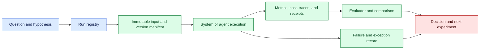
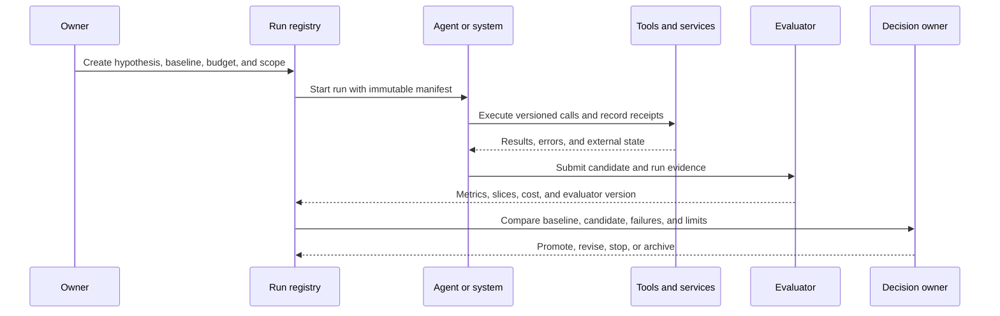

# Experiment tracking
Status: durable
Sources: [Google DeepMind — AlphaEvolve](https://deepmind.google/blog/alphaevolve-impact/)

## In one sentence

Experiment tracking records the inputs, versions, decisions, costs, outcomes, and failures of an AI run so a result can be reproduced, compared, and responsibly acted upon.

## Background: what existed before

Scientific and software teams have long recorded parameters, source revisions, datasets, logs, and results. A machine-learning experiment adds model weights, prompts, tokenizers, evaluators, seeds, hardware, and serving settings. An agent adds plans, tool calls, retrieved context, approvals, retries, budgets, and external receipts. Without a record, a successful output is an anecdote: the team cannot tell what changed or whether another run would produce the same result.

An experiment is a controlled change intended to answer a question. It may compare models, prompts, algorithms, routing policies, retrieval indexes, or system architectures. Tracking is not merely a dashboard of top scores. It is a lineage system for both winners and failures. The prerequisites are version control, content digests, run IDs, immutable artifacts, metrics, costs, logs, and access policy.

## What changed and why now

The May source presents AlphaEvolve as an iterative system for algorithmic improvement. That is a source-specific vendor description and does not independently establish every reported benefit or generalize to another workload. The engineering change is that AI systems can generate, evaluate, select, and repeatedly modify candidates, increasing the number and speed of experiments. At that pace, manual notes and winner-only dashboards become inadequate.

The historical baseline was a human choosing a small number of configurations and writing a report afterward. An agent may run hundreds of variants, call tools, change code, and use evaluator feedback to select the next candidate. If the system records only the best result, it creates selection bias and loses the evidence needed to understand regressions, cost, or invalid evaluations.

Tracking should answer five questions: what was attempted, under which conditions, what changed from the baseline, what happened to the real system, and who authorized the next step? A metric without its denominator, fixture version, evaluator, and resource cost is not enough to support a release decision.

## Impact on current processing and architecture

Use a run registry and immutable event log. The run starts with a hypothesis, owner, budget, scope, and baseline. It records inputs and versions, candidate generation, tool calls, evaluator results, artifacts, exceptions, and final decision. Artifacts live in controlled stores; the registry links by digest rather than copying sensitive payloads.



Capture model, prompt, tool schema, retrieval query and index, policy, dataset snapshot, evaluator, code, runtime, hardware, seed, and environment. For agent runs, record state transitions, approvals, retries, and external operation IDs. Redact secrets and sensitive payloads; use governed references to restricted evidence. A trace should explain route and cost without making every raw prompt broadly accessible.



Metrics need context. Store raw observations and aggregation rules, then report mean, tail, denominator, confidence or uncertainty, protected slices, cost, latency, and failure rate as appropriate. If an agent selects a candidate using a metric, record the selection rule and candidate pool. Otherwise a later reviewer cannot tell whether the result was tuned, cherry-picked, or invalid.

## Real-world applications and constraints

In model evaluation, track fixture set, model version, prompt, sampling settings, evaluator, and environment. Preserve both passes and failures. A score increase may come from leakage, changed labels, or an easier fixture set. Compare matched baselines and protect a holdout.

In algorithm search, an agent may generate code or parameter configurations. Track parent candidate, diff, compiler, tests, runtime, resource cost, and benchmark seed. A faster benchmark result can be invalid if the code changes the problem or skips required correctness checks. Run a deterministic correctness gate before performance comparison.

In prompt and retrieval optimization, record source corpus, index build, query, ranking configuration, context manifest, and protected cases. A prompt that improves common questions may expose private data or worsen rare languages. Track citation quality, refusal, policy, latency, and review outcomes alongside answer quality.

In production A/B tests, connect exposure, version, user or tenant scope, and outcome window. Monitor guardrails, not only conversion. A change may improve a business metric while increasing support contacts, latency, unsafe actions, or inequity. Track ramp decisions and stop rules so the final conclusion reflects actual exposure.

In infrastructure tuning, include queue, hardware, compiler, batch, and workload distribution. Report cost per accepted outcome, not only throughput. A configuration that wins on a warm cache may lose under cold start, failure recovery, or concurrent tenants.

Constraints include storage, privacy, cost, nondeterminism, evaluator drift, and selection bias. Full traces can be sensitive and expensive. Use tiered retention: compact metadata for all runs, restricted payload evidence for failures and high-impact routes, and longer retention for approved artifacts. A reproducible run may still vary across hardware; record tolerance and environment.

## Mental model

Think of an experiment tracker as a flight recorder plus a laboratory notebook. It captures the route, conditions, interventions, outcomes, and exceptions. The winning run is only one page; the failed and invalid runs explain why the conclusion is trustworthy or limited.

Separate observation from interpretation. The system observed latency 240 ms and a score of 0.82 under a specified fixture. The team interprets that as improvement for a target population. Record both and label the inference. A vendor claim, a local measurement, and a release decision are different evidence types.

## What changed this month

The May source presents iterative algorithmic improvement through AlphaEvolve. The source claim is limited to the vendor’s description and reported examples. The engineering shift is to treat candidate generation and evaluation as a repeatable, versioned run rather than a sequence of undocumented prompts.

The practical change is from tracking only final metrics to tracking the whole experiment graph: hypotheses, candidates, parents, tools, failures, evaluator versions, costs, and decisions. This supports reproducibility and makes it harder for a fast search process to hide invalid or unsafe outcomes.

## Engineering consequence

Define a run manifest with run ID, owner, hypothesis, baseline, data and policy versions, model and prompt, tool schemas, retrieval, evaluator, code, runtime, hardware, seed, budget, scope, and retention. Give every candidate an ID and parent IDs. Record status transitions such as `created`, `running`, `failed`, `evaluated`, `selected`, `promoted`, and `rejected`.

Make selection reproducible. Store candidate pool, scoring function, thresholds, tie-breaks, protected-slice results, and human overrides. If the agent modifies code or prompts, store a diff and test result. If it uses an external tool, store request type, authorization, receipt, and cost. Never allow the evaluator or candidate to edit its own run history.

Use budgets for tokens, calls, compute, time, and external effects. Stop experiments on policy violation, critical regression, resource exhaustion, or missing evidence. A failure is a result with a reason, not a blank cell. Add meaningful failures to a governed regression suite and link the incident or issue.

## Limits and failure modes

### Winner-only logging

Recording only the best result hides selection bias and failure modes. Keep all candidate outcomes or governed summaries.

### Metric drift

Changed evaluator, labels, denominator, or fixture can mimic improvement. Version and compare definitions.

### Hidden environment

Hardware, cache, dependency, and runtime changes affect results. Include environment identity and resource conditions.

### Evaluator gaming

Candidates can optimize a proxy while violating the real objective. Use independent checks, holdouts, and final-state validation.

### Cost blindness

More search can improve score while exceeding budget or increasing review burden. Track total cost and cost per accepted outcome.

### Data leakage

Tuning may see holdouts or sensitive records. Separate access, protect holdouts, and minimize payload retention.

### Nondeterminism

Sampling and distributed execution can vary. Pin seeds when practical, repeat runs, and record tolerances.

### Unbounded side effects

An agent may test a candidate by changing external state. Use sandboxes, scopes, approvals, and idempotent receipts.

### Incomplete lineage

An artifact without parents or input versions cannot be interpreted. Block promotion when required links are missing.

### Run state and concurrency

An experiment tracker should model state transitions explicitly. A run can be created, queued, running, paused, failed, evaluated, selected, promoted, rolled back, or archived. A worker heartbeat is not proof that a run is still making useful progress. Store the last event, owner, lease, queue position, and budget remaining. If a worker crashes, the scheduler should know whether to resume, abandon, or reconcile an external effect rather than starting a duplicate run.

Concurrent agents can modify related candidates at the same time. Use parent IDs, optimistic version checks, and a merge decision when two changes share a base. A candidate selected by one worker should not become active until the decision owner or release gate confirms its evidence. Record rejected merges and stale writes so the history explains why the final artifact differs from an early proposal.

### Reproducibility boundaries

Exact replay is not always possible. A provider can change behavior, a remote corpus can be updated, or a GPU kernel can produce small numerical differences. State the replay boundary: exact bytes and code, equivalent environment, or approximate behavioral comparison. Preserve request and response digests, sampling settings, tool receipts, and external version IDs. If a result cannot be reproduced, mark it as limited evidence rather than silently presenting a fresh rerun as the original.

### Review and communication

Experiment reports should lead with the question, baseline, change, population, result, uncertainty, cost, and limitations. Link to detailed traces for investigation. Explain whether a metric is a source fact, local measurement, or inference. Reviewers should be able to find failures and invalid runs without searching raw logs. Communicate a negative result when it changes the decision; otherwise future agents may spend resources rediscovering it.

### Governance and retention

Run metadata may contain prompts, source text, customer identifiers, code, or proprietary measurements. Apply purpose limitation and role-based access. Retain compact lineage and decision data longer when needed, while expiring raw payloads under policy. Deletion must account for caches, artifacts, replicas, and exports. If a legal hold prevents deletion, mark the state and owner. Governance is part of experiment quality because an untraceable or unauthorized run cannot be safely interpreted.

### Practical release checklist

Before accepting a result, confirm that the baseline and candidate used the same fixture contract, that the evaluator was not changed unnoticed, that failures and exclusions are counted, that costs and limits are recorded, and that a named owner can reproduce or explain the result. Confirm that any external action was sandboxed or authorized and that a rollback artifact exists. This short checklist catches the common situation where a technically impressive result cannot support a production decision.

## Mini exercise (15–30 min)

Create a local run registry for three candidates. Record a hypothesis, baseline, prompt version, evaluator version, score, cost, failure reason, and selection rule. Add a candidate with the highest score but a failed safety gate and verify that it cannot be promoted. Report all candidates, not only the winner.

## Build it locally

```python
def record(run, candidate, score, cost, safety_ok):
    item = {"id": candidate, "score": score, "cost": cost, "safety_ok": safety_ok}
    run["candidates"].append(item)
    return item

def select(run):
    valid = [x for x in run["candidates"] if x["safety_ok"]]
    return max(valid, key=lambda x: x["score"]) if valid else None

run = {"id": "run-1", "evaluator": "eval-v2", "candidates": []}
record(run, "c-1", .80, 2.0, True)
record(run, "c-2", .92, 5.0, False)
print(select(run))
```

1. Save the example as `experiment_registry.py` and run `python3 experiment_registry.py`.
2. Add model, prompt, data, and environment digests to each candidate.
3. Add a failed candidate with a reason and preserve it in the registry.
4. Add cost, latency, and protected-slice thresholds to selection.
5. Add a parent candidate and a diff reference for each generated variant.
6. Write a final decision with owner, timestamp, and rollback artifact.

## Interview Q&A

**What must an experiment tracker record?** Inputs, versions, candidates, tools, evaluator, metrics, cost, failures, artifacts, scope, and decision.

**Why track failed runs?** They expose invalid assumptions, selection bias, recovery behavior, and evidence limits.

**What makes a result reproducible?** Immutable or approved inputs, versioned system and evaluator, recorded environment and settings, and a defined tolerance for nondeterminism.

**Why is the best score not always selected?** A candidate can fail safety, correctness, cost, policy, or protected-slice gates despite a higher aggregate score.

**How do agents change tracking?** They create more candidates and actions, so parent lineage, budgets, state transitions, and external receipts must be first-class data.

## Glossary

**Experiment:** Controlled run intended to answer a question by comparing conditions.

**Run manifest:** Versioned description of inputs, systems, policies, environment, and budget.

**Lineage:** Parent and transformation history behind a candidate or artifact.

**Evaluator:** Program, model, human, or rule that measures an outcome.

**Protected holdout:** Evaluation data withheld from tuning to estimate generalization.

**Selection bias:** Distortion caused by recording or analyzing only favorable outcomes.

**Receipt:** Evidence returned by an external operation.

## References

- [Google DeepMind — AlphaEvolve](https://deepmind.google/blog/alphaevolve-impact/) — source context for iterative algorithmic improvement.
- [MLflow Tracking](https://mlflow.org/docs/latest/ml/tracking/) — experiment and artifact-tracking context.
- [NIST AI Risk Management Framework](https://www.nist.gov/itl/ai-risk-management-framework) — risk and measurement context.

## Claim ledger

| Claim | Source | Fact or inference |
| --- | --- | --- |
| The May source presents AlphaEvolve as an iterative system for algorithmic improvement. | Google DeepMind AlphaEvolve | Vendor source claim |
| Winner-only logging creates selection bias and weakens reproducibility. | Experiment-design reasoning | Engineering inference |
| Agent runs require lineage for candidates, tools, evaluators, costs, and external effects. | Lesson synthesis | Engineering recommendation |
| A higher score cannot override safety, correctness, authorization, or budget gates. | Systems-design reasoning | Engineering recommendation |
| Experiment tracking, model capability, and production reliability are separate claims. | Lesson synthesis | Engineering distinction |
