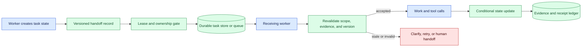
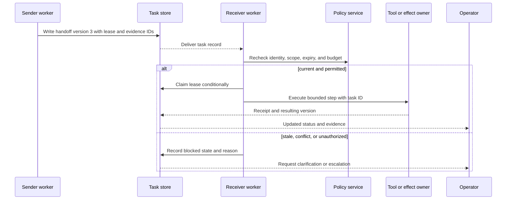

# Agent state handoffs
Status: emerging
Sources: [Google DeepMind — Co-Scientist](https://deepmind.google/blog/co-scientist-a-multi-agent-ai-partner-to-accelerate-research/)

## In one sentence

An agent state handoff transfers a durable, versioned task record between workers or people so work can resume with known ownership, evidence, scope, and failure state.

## Background: what existed before

Traditional services pass state through databases, queues, job records, and APIs. A worker claims a task, reads its inputs, performs work, writes outputs, and marks a terminal state. The record includes IDs, versions, retries, and ownership so another worker can recover after a crash. Humans use tickets, checklists, and documents for the same reason: conversation alone is difficult to search, reconcile, and audit.

Agents add conversational context, plans, tool results, and intermediate reasoning. That context is useful for the current model call but is not a reliable shared-state protocol. It may be truncated, contain untrusted instructions, omit a source version, or describe an action that never happened. A handoff must summarize the operational state in a typed record and link to evidence.

Prerequisites include task IDs, leases, optimistic concurrency, schemas, queues, authorization, provenance, idempotency, and state machines. A lease grants temporary ownership and expires if a worker stops renewing it. Optimistic concurrency rejects a write based on an old record version. Idempotency makes a retry safe. Provenance links a claimed result to source and tool evidence.

## What changed and why now

The source presents Co-Scientist as AI assistance for collaborative research. That is a vendor description, not proof that its internal handoff design is suitable for every workflow. The engineering change is that multiple model or tool workers can divide a task, critique one another, and pass candidates or findings at high speed. The system needs explicit ownership and evidence to prevent two workers from acting on incompatible assumptions.

The historical baseline had a human who could inspect the full task and decide what to do next. An agent handoff can occur between services with no shared conversational awareness. A receiving worker may see a plausible summary but not know whether data access expired, a tool call timed out, or another worker already committed an effect. Durable state turns an informal narrative into a recoverable contract.

## Impact on current processing and architecture

Define a handoff envelope: task ID, state version, sender, receiver role, tenant, purpose, input and output digests, evidence IDs, current status, owner lease, deadline, budget remaining, required action, scope, and expiry. Store it durably. The receiver validates schema, identity, state version, evidence access, and current policy before accepting ownership.



Do not put secrets or unrestricted raw context in the handoff. Include compact summaries, references, and explicit uncertainty. The receiving worker fetches authorized evidence under its own identity. A source may be unavailable, deleted, or changed; the handoff should state the expected digest and the receiver should report a conflict rather than silently using a replacement.



Use explicit states such as `created`, `claimed`, `in_progress`, `blocked`, `awaiting_review`, `completed`, `failed`, `expired`, `cancelled`, and `reconciling`. A handoff does not become complete merely because the sender wrote “done.” Completion requires the receiver or effect owner to record an output, evidence, and receipt appropriate to the task.

## Real-world applications and constraints

In research workflows, one agent retrieves literature, another proposes hypotheses, and a reviewer selects a protocol. The handoff should contain evidence IDs, claim status, alternatives, missing controls, and risk tier. A research assistant must not turn a candidate into an authorized experiment without the domain owner’s transition.

In coding workflows, a planning agent hands a task to an implementation worker. The state includes repository, base commit, files in scope, tests, policy, and approval requirement. If another change lands, the receiver returns `conflict` and regenerates or requests review. A prose summary that omits the base commit can produce a valid but unsafe patch.

In customer operations, a triage worker hands a case to a specialist. The record includes customer and case IDs, evidence references, privacy scope, deadline, priority, and proposed next step. The specialist rechecks that the case is still assigned and that the user has not revoked access. Do not copy sensitive conversation text into every queue.

In infrastructure, a diagnostic worker hands a remediation task to an operator or executor. The handoff identifies environment, resource, command class, blast radius, approval, rollback, and current observation. A stale observation should block a restart or deployment until the state is refreshed.

Constraints include serialization size, context loss, concurrency, privacy, lease expiry, and heterogeneous worker capabilities. A compact record may omit useful detail; a huge record increases cost and exposes data. Store a short operational summary with links to governed evidence. Advertise worker capabilities and schema versions so a receiver does not accept work it cannot safely perform.

## Mental model

Think of a handoff as a baton with a race number, owner, and event log. The sender does not throw a story over the wall; it places a numbered baton in a controlled exchange. The receiver checks that the race is current, the baton is genuine, and the next leg is within its authority. If two runners claim the same baton, a version check decides who can update it.

Separate context from state. Context helps a model reason; state determines what the system believes happened and what transition is allowed. Separate proposal from receipt. A proposed result may be useful, but a completed effect needs authoritative evidence. Separate ownership from identity: a worker can be authenticated yet not hold the lease for this task.

## What changed this month

The source’s research-collaboration framing makes agent handoffs timely. The source claim is limited to the vendor’s description. The engineering shift is to make cooperation durable, versioned, and auditable rather than passing unbounded conversation among workers.

The practical change is from “continue this conversation” to “claim task version 3, read evidence IDs, perform permitted step, and conditionally publish version 4.” This supports retries, human review, cancellation, and investigation.

## Engineering consequence

Define a handoff schema with task ID, version, owner, lease, sender and receiver roles, tenant, purpose, status, input and output digests, evidence IDs, scope, deadline, budget, retry count, required review, and expiry. Reject missing high-risk fields. Use conditional updates so a stale worker cannot overwrite a newer decision.

Make lease ownership visible and time-bound. A worker should renew only while active, and another worker may claim after expiry according to policy. Before tool calls, revalidate the lease, resource version, capability, and deadline. After a call, record receipt or unknown outcome. Do not infer completion from a network response if the external state is uncertain.

Build handoff contract tests for duplicate delivery, worker crash, lease expiry, cancellation, schema evolution, wrong tenant, unavailable evidence, stale resource, and retry after partial effect. Measure handoff latency, blocked rate, lease expiry, duplicate claims, evidence completeness, and time to human resolution.

## Limits and failure modes

### Lost context

A short handoff can omit a critical assumption. Require evidence links, decision rationale, constraints, and explicit unknowns; do not copy every raw transcript.

### Stale state

The task or resource changes after handoff. Include versions and use conditional updates at the receiver and effect owner.

### Split ownership

Two workers may believe they own one task. Use leases, fencing tokens, and visible claim transitions.

### Unsupported receiver

A worker may accept a schema or operation it cannot safely perform. Advertise capabilities and route incompatibilities to review.

### Evidence access loss

A referenced source may expire or become unauthorized. Return a blocked state and request reauthorization or a new source.

### Duplicate effects

Retries can repeat a write. Bind idempotency to task and step IDs, then reconcile uncertain receipts.

### Prompt injection

Untrusted text in a summary may look like an instruction. Separate data, policy, and commands; the receiver must follow trusted workflow state.

### Budget leakage

A handoff can hide token, tool, or monetary cost already spent. Carry budget remaining and reserve before work.

### Privacy leakage

Copying raw context into queues expands access. Use references, minimization, redaction, and retention controls.

### Handoff quality and compression

Summarization can make a handoff cheaper while losing a condition that controls the next action. Preserve the compact operational facts separately from a generated summary: current state, unresolved questions, constraints, evidence IDs, and exact versions. The receiver may use the summary for orientation, but it should fetch and verify authoritative evidence before a consequential step. If compression removed a required field, return `incomplete` rather than asking the model to guess it.

Assess handoff quality with reconstruction tests. Give a fresh worker the handoff without the original conversation and ask it to state the task, scope, evidence, remaining budget, and next permitted transition. Compare its reconstruction with the authoritative record. This tests whether the record is usable while avoiding a claim that a fluent summary is correct. Include an adversarial note that attempts to change policy or ownership and verify that it remains data.

### Cancellation and expiry

A task can be cancelled while a worker is generating or a tool call is in flight. Cancellation must be represented as durable state and rechecked before new effects. It may not undo an operation already accepted by an external system, so the handoff enters reconciliation and preserves the receipt or unknown outcome. Expiry should stop new work, release the lease, and notify an owner when a deadline matters. Do not allow a worker to extend its own authority without a new policy decision.

### Handoff across trust boundaries

Passing a task from an internal planner to an external provider or a lower-trust worker requires an explicit data and authority boundary. Send only the fields needed for the next step, use a scoped credential, and record what was disclosed. The receiver’s result remains untrusted until validated. When it returns a proposal, the original effect owner rechecks permissions and current state. This prevents delegation from becoming an invisible transfer of broad authority.

### Operational metrics

Track time from handoff creation to claim, lease renewal failures, stale-update rejections, blocked evidence lookups, duplicate attempts, cancellation latency, completion rate, human escalations, and cost per completed task. Break metrics down by worker type and task risk. A high completion rate with increasing reconciliation or human corrections may indicate that the handoff is losing important state. Review samples of both successful and failed transfers.

## Mini exercise (15–30 min)

Create a task record with version, lease, owner, evidence IDs, deadline, and status. Simulate two workers claiming it, a lease expiry, a stale update, and a duplicate delivery. Require conditional version updates and ensure only one worker records the effect receipt.

## Build it locally

```python
def claim(task, worker, now):
    if task["status"] not in {"created", "expired"}:
        return "blocked:already_claimed"
    if task["expiry"] <= now:
        return "blocked:expired"
    task.update({"status": "claimed", "owner": worker, "version": task["version"] + 1})
    return "claimed"

task = {"status": "created", "owner": None, "version": 1, "expiry": 20}
print(claim(task, "worker-a", 10))
print(claim(task, "worker-b", 10))
```

1. Save the example as `handoff_state.py` and run `python3 handoff_state.py`.
2. Add task ID, tenant, lease expiry, and evidence references.
3. Add an expected-version argument and reject stale conditional updates.
4. Add `completed`, `failed`, `cancelled`, and `reconciling` transitions.
5. Add an idempotency key for one tool step and a receipt record.
6. Test unavailable evidence and route the task to `awaiting_review`.

## Interview Q&A

**Why is conversation not reliable shared state?** It can be truncated, ambiguous, stale, unauthorized, or missing evidence of what actually happened.

**What must a handoff contain?** Durable task and version IDs, owner, scope, status, inputs, evidence, deadline, budget, required action, and expiry.

**How prevent two workers from acting?** Use leases, fencing or claim tokens, conditional version updates, and effect-owner idempotency.

**What if referenced evidence is unavailable?** Block or escalate with an explicit reason; do not silently substitute a different source.

**When is a handoff complete?** When the permitted step has a verified result, required evidence, and an authoritative receipt or terminal decision.

## Glossary

**Handoff:** Durable transfer of task state and responsibility between workers or people.

**Lease:** Temporary ownership that expires unless renewed.

**Fencing token:** Monotonic ownership token that prevents an old worker from writing after replacement.

**Conditional update:** Write accepted only when the record version still matches.

**Evidence ID:** Reference to a source, tool result, test, or receipt supporting a claim.

**Reconciliation:** Resolving local records against authoritative external state.

**Terminal state:** Completed, failed, cancelled, or otherwise no-longer-active task state.

## References

- [Google DeepMind — Co-Scientist](https://deepmind.google/blog/co-scientist-a-multi-agent-ai-partner-to-accelerate-research/) — source context for AI-assisted research collaboration.
- [NIST AI Risk Management Framework](https://www.nist.gov/itl/ai-risk-management-framework) — risk and accountability context.
- [Martin Kleppmann — Designing Data-Intensive Applications](https://dataintensive.net/) — distributed state and consistency context.

## Claim ledger

| Claim | Source | Fact or inference |
| --- | --- | --- |
| The source presents Co-Scientist as AI assistance for collaborative research. | Google DeepMind Co-Scientist | Vendor source claim |
| Conversation text is not a sufficient durable state protocol for multi-worker execution. | Distributed-systems reasoning | Engineering inference |
| Handoffs should carry version, ownership, scope, evidence, deadline, and status. | Lesson synthesis | Engineering recommendation |
| Schema validity and a claimed result do not establish authorization or effect completion. | Systems-design reasoning | Engineering distinction |
| Conditional updates, leases, and receipts reduce duplicate or stale work. | Lesson synthesis | Engineering recommendation |
