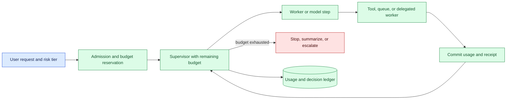
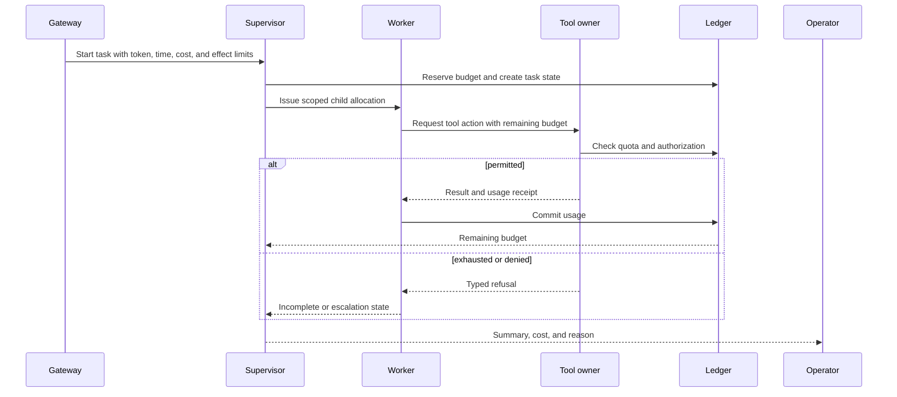

# Agent budgeting
Status: emerging
Sources: [Google DeepMind — Co-Scientist](https://deepmind.google/blog/co-scientist-a-multi-agent-ai-partner-to-accelerate-research/)

## In one sentence

Agent budgeting bounds tokens, tool calls, wall time, retries, concurrency, money, and external effects so an autonomous workflow cannot turn an open-ended loop into an unbounded operational cost or blast radius.

## Background: what existed before

Traditional services have quotas and timeouts: a request gets a deadline, a user receives a rate limit, and a job has a maximum runtime or resource reservation. Batch systems allocate CPU, memory, storage, and queue slots. Financial systems add transaction limits and approval thresholds. These controls assume a fairly predictable call graph.

An agent can choose its next step, call tools, ask for more context, retry failures, delegate to other workers, and continue until it believes the task is complete. A prompt saying “be efficient” is not a budget. A token limit controls generation length but not external writes, retrieval volume, reviewer load, or money spent by tools. Budgeting makes resource and effect limits explicit and enforceable by a supervisor or effect owner.

The prerequisites are admission control, leases, queues, rate limits, idempotency, deadlines, accounting, and state machines. A budget is a reservation or allowance for a resource. A lease grants temporary authority. Accounting records committed and estimated consumption. A terminal state tells the caller whether work completed, stopped, expired, or needs review.

## What changed and why now

The source presents Co-Scientist as AI assistance for research collaboration. That is a vendor description of one system, not evidence that its resource use or safety behavior generalizes. The engineering change is that agent loops can create many candidates, tool calls, and evaluations, so cost control becomes loop control and safety control.

The historical baseline often charged one request and one model response. Current workflows may fan out to multiple agents, run code, search corpora, invoke APIs, and schedule experiments. One local retry can become a distributed storm. A budget should cover the whole task and be carried through handoffs, queues, and delegated work.

## Impact on current processing and architecture

At admission, assign a task budget with token, tool, time, retry, concurrency, monetary, storage, and effect limits. Reserve shared resources before dispatch. Every worker receives a scoped budget record and reports usage. The supervisor checks remaining budget before planning another step. The effect owner enforces its own limits because a worker can be buggy or dishonest.



Use one task ID and child step IDs. A parent budget can reserve portions for retrieval, model calls, tools, and human review. Delegation cannot create authority or budget from nothing; the child receives a bounded allocation and reports unused or committed amount. Atomic reservation prevents two parallel workers from spending the same remaining allowance.



Budget consumption should distinguish reserved, estimated, committed, and refunded. A model request may have an estimated token cost but actual usage arrives later. A provider timeout may have consumed money or applied an external effect. Keep unknown usage in reconciliation. For high-impact operations, reserve before dispatch and release only after a receipt or explicit failure state.

## Real-world applications and constraints

In research agents, cap literature queries, candidates, code executions, compute minutes, and experiment requests. A search agent should stop when additional sources no longer improve evidence coverage or when a human review queue is full. A proposed wet-lab experiment needs an authorization boundary, not just a remaining token balance.

In coding agents, limit repository files, shell commands, test runtime, patch size, network access, and deployment effects. A loop that keeps running tests can exhaust compute without improving the patch. A command budget should differentiate read-only inspection from writes and production actions.

In customer support, cap records retrieved, model calls, outbound messages, and time to resolution. A budget exhaustion should return a clear handoff to a human or a draft, not silently send partial communication. Per-tenant quotas prevent one customer or workflow from consuming shared capacity.

In infrastructure, use action counts, blast-radius classes, rate, spend, and maintenance window. A remediation agent may restart one staging service but require approval for a production region. Budgeting helps enforce a maximum number of changes even when the model keeps proposing “one more fix.”

In data and evaluation pipelines, cap rows, media duration, storage, concurrency, and evaluator calls. A broad fixture search can create surprising cost. Cache immutable intermediate results with version identity, but do not treat cached output as free if it is stale or unauthorized.

Constraints include estimation error, shared capacity, fairness, latency, partial effects, and user expectations. A strict budget may stop useful work; a loose budget raises cost and risk. Choose limits by consequence and expected value, communicate them, and return partial progress with explicit incompleteness. Measure cost per accepted outcome, not only raw completion.

## Mental model

Think of a budget as fuel plus a fence. Fuel limits how far the workflow can travel; the fence limits where it may go. A model can choose a route, but it cannot refuel itself or move the fence. Each worker receives a measured allowance, and every external effect has its own gate.

Separate resource budgets from authority budgets. Ten read calls may be cheap but expose too much data. One write call may be expensive in consequence even if its token cost is small. Separate model confidence from remaining budget: confidence does not authorize overspend, and a low-cost task may still need review.

## What changed this month

The source’s multi-agent research framing makes bounded exploration a timely design concern. The source claim is limited to its vendor description. The engineering shift is to carry budgets through agent planning, delegation, tools, and review rather than pricing only the initial model call.

The practical change is from “run until done” to “run until done or until a typed budget state requires stop, summary, retry, or escalation.” This makes loops observable and gives operators control over cost, latency, and side effects.

## Engineering consequence

Define a budget record with task, owner, tenant, risk tier, token allowance, tool calls, wall deadline, retry allowance, concurrency, storage, monetary estimate, effect classes, reserved, committed, remaining, policy version, and expiry. Make it immutable by event rather than allowing a worker to overwrite usage. Use atomic reservations and idempotent commits.

Set child budgets before delegation. A child cannot exceed the parent’s remaining amount, and a failed child must report whether resources were actually consumed. For shared services, enforce per-tenant and global limits with queue fairness. For humans, budget review time and queue capacity; an escalation that cannot be handled is not a safe fallback.

Return typed terminal states: `completed`, `budget_exhausted`, `deadline_expired`, `denied`, `blocked`, `unknown_cost`, and `needs_review`. Include progress, usage, unresolved work, and safe next step. This helps callers decide whether to resume with a new approval or stop permanently.

## Limits and failure modes

### Hidden tool cost

A model token count may omit API, storage, compute, or human-review cost. Meter tools and queues separately.

### Parallel overspend

Workers can race for remaining allowance. Reserve atomically and enforce at the effect owner.

### Unknown consumption

Timeouts may still consume provider cost or apply effects. Record unknown usage and reconcile before retry.

### Budget laundering

A worker can delegate to many children unless parent limits are inherited. Cap aggregate child use and depth.

### Retry storms

Automatic retries can exhaust quota or duplicate effects. Use bounded retries, backoff, idempotency, and typed failures.

### Unfairness

One tenant can consume shared workers. Apply quotas, priorities, aging, and per-tenant metrics.

### Premature stopping

A budget too small can produce low-quality partial work. Return progress and allow an explicit, authorized extension rather than silently truncating.

### Metric gaming

Optimizing token or tool count can reduce quality or increase human correction. Track accepted outcomes and protected slices.

### Side-effect mismatch

A small budget does not make an irreversible action safe. Use separate authority and confirmation gates.

### Privacy

Usage logs may contain prompts, resource IDs, or customer data. Minimize, redact, restrict, and retain by purpose.

### Budget accounting across stages

A useful budget follows the task through its stages instead of assigning one number to the model call. Admission may reserve time and memory, retrieval may consume query and storage allowance, generation may consume tokens, validation may call another model, and execution may consume an external-effect allowance. The ledger should show planned, reserved, committed, refunded, and unknown amounts for each stage. When a tool reports usage late, the supervisor should reconcile it before deciding that more work is affordable.

Budgets should be expressed in units that match the resource. Token count is useful for model calls; wall time captures deadlines; request count bounds provider load; bytes bound media and storage; money bounds invoices; and effect count bounds changes to the world. Combining them into one score hides the reason a task stopped. Return the exhausted dimension and the safe next action so a caller can ask for an authorized extension or hand off to a person.

### Fair scheduling

Global limits protect the platform, while per-tenant and per-task limits protect fairness. A strict first-come queue can let one long task occupy workers and starve many short tasks. Use bounded concurrency, priorities tied to policy, aging for waiting work, and separate queues for interactive, batch, and high-risk tasks. Measure queue age and rejection by tenant. A budget system that blocks legitimate work without explaining why will encourage operators to bypass it.

### Extension and interruption

An extension is a new decision, not a worker changing its own allowance. Require the owner, reason, added amount, expiry, and risk review for extensions. If a task is interrupted, persist progress, usage, unresolved effects, and a resume contract. A resumed task must revalidate state and permissions; it cannot assume the old budget or observations remain valid. If stopping is safer than continuation, return the partial result and preserve the evidence.

### Cost-quality trade-offs

Reducing model calls may lower cost while increasing errors, retries, or human correction. A larger budget may improve exploration while creating a review bottleneck. Evaluate policies on accepted outcome, correction rate, latency, safety events, and total cost. For an agent that searches candidates, compare marginal value: stop when additional candidates do not improve protected evidence or when the remaining budget is better reserved for validation. Make that rule explicit and test it on historical or synthetic runs.

## Mini exercise (15–30 min)

Build a local supervisor with token, tool, and retry allowances. Run a loop that consumes one unit per step and stops with `budget_exhausted`. Add two parallel child tasks and prove that atomic reservation prevents overspend. Record committed and estimated usage separately.

## Build it locally

```python
def reserve(budget, amount):
    if amount > budget["remaining"]:
        return False
    budget["remaining"] -= amount
    budget["committed"] += amount
    return True

budget = {"remaining": 3, "committed": 0}
print(reserve(budget, 2))
print(reserve(budget, 2))
print(budget)
```

1. Save the example as `budget_supervisor.py` and run `python3 budget_supervisor.py`.
2. Add token, tool, retry, deadline, and monetary fields.
3. Add a child allocation that cannot exceed parent remaining budget.
4. Add an idempotency key so a repeated usage receipt commits once.
5. Add `budget_exhausted`, `deadline_expired`, and `needs_review` states.
6. Log estimated, reserved, committed, and unknown usage with task IDs.

## Interview Q&A

**Why is budgeting loop control?** It bounds how many steps, calls, retries, and delegated tasks an agent can create before stopping.

**What should a budget include?** Tokens, tools, time, retries, concurrency, storage, money, and external-effect limits appropriate to the task.

**Can a child worker create its own budget?** It can receive a bounded allocation from the parent, but it must not expand aggregate authority or spend without reservation.

**How handle a timeout?** Treat resource use and external effects as potentially unknown, reconcile receipts, and avoid blind retry.

**What is a good cost metric?** Cost per accepted, safe outcome with latency, correction, review, and protected-slice context—not raw tokens alone.

## Glossary

**Budget:** Enforced allowance for resources, time, or effects.

**Reservation:** Atomic claim on allowance before work begins.

**Committed usage:** Consumption confirmed by a worker, provider, or receipt.

**Child allocation:** Portion of a parent budget delegated to one worker or step.

**Budget exhaustion:** Typed state reached when remaining allowance cannot cover the next permitted step.

**Effect budget:** Limit on external state changes, not merely compute.

**Reconciliation:** Resolving estimated or unknown consumption against authoritative records.

## References

- [Google DeepMind — Co-Scientist](https://deepmind.google/blog/co-scientist-a-multi-agent-ai-partner-to-accelerate-research/) — source context for AI-assisted research collaboration.
- [NIST AI Risk Management Framework](https://www.nist.gov/itl/ai-risk-management-framework) — risk and accountability context.
- [Google SRE Book — Handling Overload](https://sre.google/sre-book/handling-overload/) — quotas, overload, and resource-control context.

## Claim ledger

| Claim | Source | Fact or inference |
| --- | --- | --- |
| The source presents Co-Scientist as AI assistance for collaborative research. | Google DeepMind Co-Scientist | Vendor source claim |
| Token limits alone do not bound tool, time, human, monetary, or external-effect cost. | Systems-design reasoning | Engineering inference |
| Parent and child budgets should be reserved and accounted for across delegation. | Distributed-systems reasoning | Engineering recommendation |
| Budget exhaustion should produce an explicit incomplete or escalation state. | Lesson synthesis | Engineering recommendation |
| Resource control, authority, and model capability are separate concerns. | Lesson synthesis | Engineering distinction |
