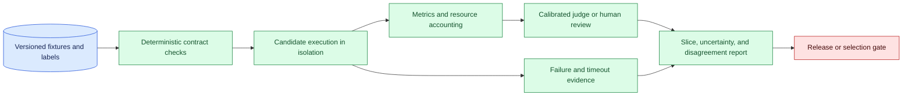
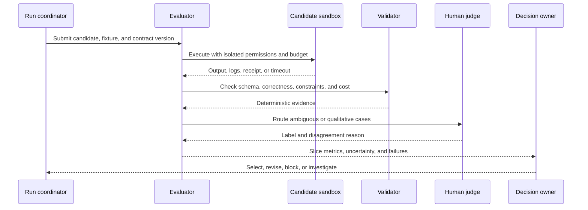

# Evaluator design
Status: durable
Sources: [Google DeepMind — AlphaEvolve](https://deepmind.google/blog/alphaevolve-impact/)

## In one sentence

Evaluator design turns an outcome into a measured decision by defining what counts as success, checking constraints independently, calibrating judges, and preserving disagreement and uncertainty.

## Background: what existed before

Software uses tests, assertions, linters, type checkers, benchmarks, and human review to assess a change. Machine-learning systems add labeled examples, statistical metrics, model-based graders, and expert judgment. An evaluator is the component that compares an observed result with a contract or reference and emits evidence for a decision.

The evaluator is not the objective itself. A score may measure a proxy, and an agent can optimize the proxy while violating the intended outcome. A candidate that runs without crashing may still be incorrect, insecure, expensive, or unauthorized. Good evaluator design starts with the decision the score will support and the failures that must not be hidden.

Prerequisites include metrics, baselines, fixtures, constraints, calibration, inter-rater agreement, protected slices, and statistical uncertainty. A baseline is the current system used for comparison. Calibration checks whether a score or confidence corresponds to observed outcomes. A protected slice is a subgroup or failure class whose result is reported separately. Agreement measures how consistently people or evaluators label the same case.

## What changed and why now

The May source presents AlphaEvolve as an iterative system for algorithmic improvement. That is a vendor description and reported capability claim, not evidence that its evaluator design generalizes to every task. The engineering change is that AI systems can generate many candidates and use evaluators to select the next one, making the evaluator an active part of the search loop.

The historical baseline often had a human inspect a small number of outputs. An agent can produce hundreds of variants, so evaluation must be automated enough to scale while remaining independent enough to resist gaming. A metric can become a target: candidates learn to exploit a parser, a benchmark quirk, a weak judge, or an unprotected holdout. The evaluator needs negative cases and independent gates.

## Impact on current processing and architecture

Define the evaluation contract before running candidates. It names input fixtures, expected outcome, hard constraints, quality metrics, protected slices, evaluator versions, runtime and cost limits, and decision thresholds. Run deterministic checks first, then calibrated model or human review for qualities that cannot be measured exactly.



Isolate candidate code and tools. An evaluator should not let a candidate rewrite fixtures, access the answer key, change scoring configuration, or make unbounded external calls. Set time, memory, network, file, and effect limits. Record stdout, stderr, exit state, resource use, and artifacts under access control. A timeout is a result with a reason, not a missing observation.



## Real-world applications and constraints

For generated code, use compilation, tests, static analysis, security checks, performance benchmarks, and human review. A candidate that passes visible tests may exploit a fixture or fail hidden cases. Run it in a sandbox and bind output to the requested repository and base commit.

For research hypotheses, evaluate evidence coverage, falsifiability, alternative explanations, source precision, and experimental discriminability. A language model judge can assess clarity but cannot establish a scientific result. Domain reviewers should inspect high-risk or novel claims.

For customer-support responses, measure factuality, policy compliance, resolution, tone, escalation, and privacy. A response can sound helpful while disclosing data or giving an unauthorized instruction. Use deterministic checks for identifiers and policy, and protected cases for rare languages or account states.

For multimodal and robotic systems, evaluate synchronization, final state, safety envelope, stop behavior, and operator handoff. A visual judge should not be the only evidence for collision or authorization. Use sensor and controller receipts where possible.

For algorithm search, combine correctness gates with performance and cost metrics. Test candidate outputs on held-out inputs, vary seeds, and verify that benchmark improvements do not change the problem. A fast but approximate candidate may be valuable only when its error and resource contract is explicit.

Constraints include labeling expense, judge bias, nondeterminism, rare harms, distribution shift, leakage, and evaluator cost. Use a funnel: cheap deterministic checks, replay and static analysis, calibrated judge, then expert review. Preserve representative failures and disagreements. A score without denominator, fixture version, evaluator version, or cost is difficult to interpret.

## Mental model

Think of an evaluator as a referee with a rulebook, replay footage, and conflict-of-interest policy. The referee checks whether the play was legal and successful; it does not award victory merely because the player looked confident or stayed on the field. A good report shows the rule, evidence, uncertainty, and disputed calls.

Separate capability, reliability, safety, and value. Capability asks whether the task can be performed. Reliability asks whether it works consistently. Safety asks whether it stays within constraints. Value asks whether the complete workflow improves outcomes after cost and human correction. One evaluator should not pretend to answer all four.

## What changed this month

The May source presents iterative algorithmic improvement through AlphaEvolve. The source claim is limited to the vendor’s description and examples. The engineering shift is to make the evaluator a governed, versioned system in the search loop, with independence, isolation, holdouts, and explicit failure states.

The practical change is from “choose the highest score” to “choose candidates that satisfy hard constraints and have evidence strong enough for the intended decision.” This prevents an optimization loop from converting an easy proxy into a false release signal.

## Engineering consequence

Write an evaluator specification with question, population, fixture digest, reference or invariant, metrics, constraints, slices, judge, calibration set, thresholds, uncertainty, budget, and escalation. Version it independently from the candidate. Keep a protected set unavailable to tuning and a challenge set designed to expose shortcuts.

Calibrate model judges against domain labels and inspect false positives and false negatives. Randomize or blind candidate identity when feasible. Measure agreement and adjudicate disagreement. For high-impact results, require a domain owner and preserve a human-readable evidence packet.

Record every outcome: pass, fail, timeout, invalid, unavailable, unsafe, or review-required. Include resource use and failure reason. A candidate that did not crash is not automatically valid. Block selection when required evidence is missing, even if the score is attractive.

## Limits and failure modes

### Proxy gaming

Candidates optimize the metric without satisfying the real objective. Add independent constraints, hidden cases, and final-state checks.

### Answer leakage

Candidate code or prompts can access reference labels. Isolate fixtures and restrict file, network, and process permissions.

### Judge bias

A model judge may reward style, verbosity, or agreement with its own blind spots. Calibrate, blind, compare, and use experts for consequential cases.

### Metric drift

Changed labels, evaluator, denominator, or thresholds can mimic improvement. Version all definitions.

### Nondeterminism

Sampling and distributed execution vary. Repeat cases, record seeds, and set tolerances.

### Rare failures

Average scores hide low-frequency harm. Use protected slices, challenge sets, and explicit critical gates.

### Resource blindness

Quality improvements can cost too much time, money, memory, or review. Track total and marginal cost.

### Correlated evaluators

Using the same model or data for candidate and judge can share blind spots. Add independent checks or human review.

### Evaluation contract design

Write the contract in terms of a decision, not a favorite metric. If the question is whether a code candidate is safe to merge, correctness, dependency policy, security checks, and review may be hard gates while runtime is a soft optimization. If the question is whether a research candidate deserves an experiment, evidence coverage and discriminating power matter more than prose quality. Naming the decision prevents a convenient score from silently becoming the objective.

Make each metric operationally precise. State the population, unit, numerator, denominator, exclusions, aggregation, confidence or tolerance, and direction of improvement. For latency, define start and end events and report tails. For quality, define accepted and rejected labels and review disagreements. For cost, include retries, tool calls, storage, and human correction when they affect the choice. A metric without these details cannot be compared across runs.

### Independence and red teams

Use challenge cases created by people who did not tune the candidate when the risk justifies it. Include adversarial inputs, malformed tools, stale evidence, missing fields, and cases where the obvious shortcut produces the wrong outcome. Keep the challenge set access-controlled and rotate examples. An evaluator can be deterministic and still be weak if its cases never exercise the actual boundary.

### Regression and change review

When the candidate or evaluator changes, run the prior suite before adding new cases. Compare the exact fixture and evaluator versions. Review any change to labels, thresholds, prompts, judge model, parser, or environment as a measurement change. If a score moves because the evaluator changed, record that separately from a system improvement. Preserve old results so trend lines remain interpretable.

### Human review economics

Human review is scarce evaluation capacity. Route only ambiguous, high-risk, or calibration cases when automation is reliable enough, and show reviewers the evidence needed to decide. Track review time, disagreement, overturns, queue age, and fatigue. A reviewer who sees only easy cases cannot calibrate a judge for difficult ones. Budget review alongside compute and model calls, and stop candidate generation when the adjudication queue is saturated.

### Release evidence packet

The release packet should contain the evaluation question, baseline, candidate manifest, fixture and holdout identities, evaluator version, hard constraints, slice results, uncertainty, costs, failures, reviewer decision, and rollback reference. Include examples of important passes and failures with governed evidence links. State what the evaluation does not establish: a benchmark may not represent production traffic, a simulator may not represent physical behavior, and a model judge may not represent domain expertise. This makes the final decision honest and reusable.

For an agent search loop, evaluate the evaluator itself. Seed it with known bad candidates, a candidate that exploits the score, and a candidate that is correct but expensive. Verify that the outputs receive the expected statuses and that the selection rule respects hard constraints. Re-run this meta-suite after changing parsers, judges, fixtures, or thresholds. A trustworthy selection system needs evidence that its referee is still enforcing the rules.

Finally, make the gate explainable. A candidate report should say which hard constraint failed, which slice moved, how much budget it consumed, and whether the result is reproducible. Reviewers can then choose a focused repair instead of rerunning a large search blindly.

### Invalid execution

Timeout or crash can be misread as a low-quality output. Return typed execution states and investigate repeated failures.

## Mini exercise (15–30 min)

Design an evaluator for a small code optimization task. Define correctness tests, performance metric, memory limit, protected input, timeout, and selection rule. Run three synthetic candidates, including one that is fast but incorrect, and verify that hard correctness beats the score.

## Build it locally

```python
def evaluate(candidate, expected):
    if candidate.get("timeout"):
        return {"state": "timeout"}
    correct = candidate.get("output") == expected
    safe = candidate.get("policy_ok", False)
    return {"state": "pass" if correct and safe else "fail",
            "correct": correct, "safe": safe, "score": candidate.get("score", 0)}

print(evaluate({"output": 4, "score": 10, "policy_ok": True}, 4))
print(evaluate({"output": 3, "score": 99, "policy_ok": True}, 4))
```

1. Save the example as `evaluator_gate.py` and run `python3 evaluator_gate.py`.
2. Add timeout, memory, runtime, and cost constraints.
3. Add protected fixtures and a failure reason taxonomy.
4. Add a model-judge result but keep correctness as a hard gate.
5. Repeat a nondeterministic candidate and report variance.
6. Store evaluator, fixture, candidate, and policy versions in the result.

## Interview Q&A

**What makes an evaluator trustworthy?** A clear contract, independent checks, isolation, versioning, calibration, protected cases, and explicit uncertainty and failures.

**Why isn’t “did not crash” a valid score?** A candidate can run and still be incorrect, unsafe, unauthorized, or too expensive.

**How do model judges need calibration?** Compare them with domain labels, inspect disagreement and error types, and restrict their authority to suitable decisions.

**Why use hard constraints?** They prevent a high proxy score from overriding correctness, safety, policy, or resource requirements.

**What should a timeout produce?** A typed timeout result with evidence and resource usage, not an empty result or automatic pass.

## Glossary

**Evaluator:** Component that measures an output or outcome against a contract.

**Metric:** Quantified measurement used to compare behavior.

**Hard constraint:** Condition that must hold regardless of score.

**Calibration:** Checking whether evaluator scores correspond to observed correctness.

**Protected slice:** Subset with separately reported or gated outcomes.

**Challenge set:** Cases designed to expose shortcuts and known failure modes.

**Adjudication:** Structured resolution of disagreement between evaluators or people.

## References

- [Google DeepMind — AlphaEvolve](https://deepmind.google/blog/alphaevolve-impact/) — source context for iterative algorithmic improvement.
- [OpenAI Evals](https://github.com/openai/evals) — evaluation framework and benchmark context.
- [NIST AI Risk Management Framework](https://www.nist.gov/itl/ai-risk-management-framework) — risk and evaluation context.

## Claim ledger

| Claim | Source | Fact or inference |
| --- | --- | --- |
| The May source presents AlphaEvolve as an iterative system for algorithmic improvement. | Google DeepMind AlphaEvolve | Vendor source claim |
| Evaluators can become optimization targets and need independent constraints and protected cases. | Evaluation reasoning | Engineering inference |
| Model-judge scores require calibration and should not replace deterministic checks for hard contracts. | Lesson synthesis | Engineering recommendation |
| Timeouts, invalid runs, and failures are evidence states that should be retained. | Systems-design reasoning | Engineering recommendation |
| Evaluator quality, candidate capability, and production safety are separate claims. | Lesson synthesis | Engineering distinction |
