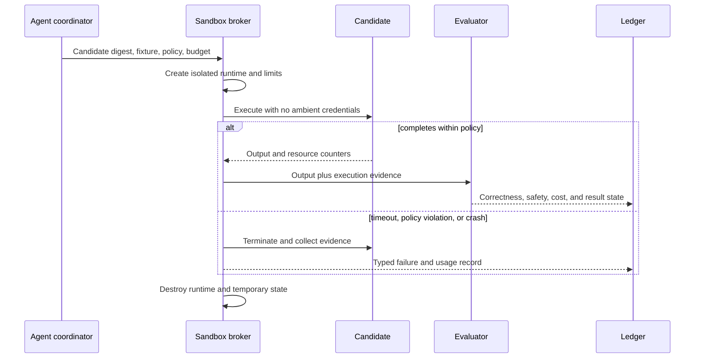

# Program sandboxing
Status: durable
Sources: [Google DeepMind — AlphaEvolve](https://deepmind.google/blog/alphaevolve-impact/)

## In one sentence

Program sandboxing runs generated or untrusted code with bounded CPU, memory, time, network, filesystem, process, and effect permissions before its output can influence a trusted system.

## Background: what existed before

Compilers, test runners, notebook environments, and build systems execute code to measure behavior. When the code is written by a trusted team, the main concerns are correctness, dependency failures, and resource use. Generated code changes the threat model: a candidate can contain an accidental infinite loop, read local secrets, open a network connection, fork processes, modify shared files, or exploit a dependency.

A sandbox is an execution boundary that limits what a program can see and do. It is not merely a temporary directory or a prompt instruction. The prerequisites are operating-system isolation, resource quotas, network policy, filesystem mounts, process limits, timeouts, input fixtures, output validation, and cleanup. The boundary must be enforced by trusted infrastructure and tested against escape attempts.

## What changed and why now

The May source presents AlphaEvolve as an iterative system for algorithmic improvement. That is a vendor capability claim, not proof that arbitrary generated programs are safe to run. The engineering change is that agents can produce and evaluate many code candidates, increasing the need for cheap, repeatable, isolated execution.

The historical baseline used a developer-controlled repository and CI runner. An agent may generate code from untrusted input and submit it to an evaluator. If the evaluator runs candidates with its own credentials, a benchmark task can become a supply-chain or data-exfiltration path. Sandboxing separates candidate execution from evaluator authority and makes resource use part of the score and release gate.

## Impact on current processing and architecture

The coordinator creates a disposable sandbox from a pinned image, injects synthetic or approved fixtures, applies limits, runs the candidate, collects output and resource evidence, and destroys the environment. The evaluator validates declared results independently. The candidate cannot modify the test oracle, registry, or host filesystem.

```mermaid
flowchart LR
 C[Candidate code and fixture] --> B[Sandbox broker]
 B --> I[Pinned isolated image]
 I --> L[CPU, memory, time, process, and disk limits]
 L --> N[Network and filesystem policy]
 N --> X[Candidate execution]
 X --> O[Output, logs, and usage evidence]
 O --> E[Independent evaluator]
 E --> D[Pass, fail, timeout, or quarantine]
 classDef input fill:#dbeafe,stroke:#1d4ed8,color:#172554
 classDef control fill:#dcfce7,stroke:#15803d,color:#14532d
 classDef risk fill:#fee2e2,stroke:#b91c1c,color:#172554
 class C input
 class B,I,L,N,O,E control
 class X,D risk
```



A sandbox policy should state allowed system calls, read-only mounts, writable scratch paths, environment variables, network destinations, maximum processes, file sizes, output size, and lifetime. Do not pass ambient credentials. If a candidate needs a dependency, preinstall a pinned package or expose a controlled service with a narrow identity. A network-disabled sandbox is simpler; if network is required, use an allowlist and log requests.



Treat output as untrusted data. Parse it with size and schema limits, validate against fixtures, and do not execute returned commands automatically. A candidate that writes a file called `success` has not passed unless the evaluator independently observes the required result. Preserve stdout, stderr, exit code, signal, resource usage, and policy violations for diagnosis, with secrets redacted.

## Real-world applications and constraints

In algorithm search, sandbox candidate programs before benchmark execution. Check correctness on visible and protected inputs, then measure runtime and memory. A fast candidate that skips work or changes the problem must fail correctness. Keep candidate digests and parent lineage so a result can be reproduced.

In coding agents, isolate tests and static analysis from production credentials and repository state. Mount only the target checkout, preferably read-only for analysis. A patch may need a writable workspace, but its writes should not escape the workspace or alter the evaluator. Require explicit approval before any external effect.

In research workflows, generated simulations can be useful but may consume unbounded compute or contact external services. Give them a synthetic dataset, bounded runtime, and no network unless needed. Store results and environment identity, and distinguish a simulation result from an empirical measurement.

In data processing, sandbox transformations to prevent accidental access to other tenants or unrelated files. Apply row, byte, and output limits. A transformation that silently drops records should fail data-quality checks even if it exits successfully.

In education or public notebooks, untrusted submissions need tenant isolation, quotas, and abuse monitoring. A process limit alone may not prevent timing, storage, or network abuse. Clean up after every run and measure queue age and cold-start cost.

Constraints include isolation strength, startup latency, image maintenance, dependency availability, GPU access, reproducibility, and cost. Containers alone are not a complete security boundary for hostile code; choose stronger isolation such as microVMs or restricted runtimes when the threat warrants it. GPU passthrough expands the attack surface and should be treated separately. A sandbox can reduce risk but cannot prove code correctness or eliminate every platform vulnerability.

## Mental model

Think of a sandbox as a laboratory room with locked doors, measured utilities, and disposable equipment. The researcher may run an experiment, but cannot access the building’s master keys or rewrite the measuring instruments. The result still needs an independent evaluator. A successful exit code is only a note that the program left the room without crashing.

Separate isolation, resource control, and correctness. Isolation limits where code can act. Resource control limits how much it can consume. Evaluation determines whether its result satisfies the task. None substitutes for the others.

## What changed this month

The source presents iterative algorithmic improvement through AlphaEvolve. The source fact is limited to the vendor’s description. The engineering shift is to make candidate execution a controlled, observable step in an automated search loop rather than running generated programs with trusted evaluator privileges.

## Engineering consequence

Define a sandbox manifest with candidate digest, base image, fixture digest, runtime, CPU, memory, time, process, disk, output, network, mounts, environment, policy version, and cleanup status. Make the broker own sandbox creation and teardown. Give evaluators separate credentials and prevent candidates from reaching the run registry or oracle.

Use disposable environments and pinned dependencies. Scan images, update them through a release process, and test the sandbox itself with known escape and resource-exhaustion cases. Monitor startup, execution, cleanup, queue, and resource metrics. A leaked process or temporary file is a failed cleanup invariant.

Classify execution states as `completed`, `incorrect`, `timeout`, `crash`, `resource_exhausted`, `policy_violation`, `unavailable`, or `quarantined`. Keep output and usage evidence. Do not retry policy violations automatically. If a dependency times out, record whether the candidate may have produced an external effect and reconcile before retrying.

## Limits and failure modes

### Ambient credentials

Inherited environment variables or mounted tokens can expose production authority. Remove them and use narrow, task-specific identities.

### Filesystem escape

Writable mounts, symlinks, or device access can reach host data. Use read-only mounts, path checks, namespaces, and stronger isolation for hostile code.

### Network exfiltration

Unrestricted network lets code send fixtures or secrets away. Disable it or enforce an allowlist and monitor destinations.

### Resource exhaustion

Fork bombs, huge allocations, disk filling, and output floods can harm the evaluator. Enforce process, memory, disk, CPU, time, and output quotas.

### Oracle access

Candidates may read expected answers or alter tests. Separate fixtures and evaluator secrets; use protected inputs.

### Dependency risk

Installing arbitrary packages expands supply-chain exposure. Use pinned, scanned images or a controlled dependency mirror.

### Non-reproducibility

Network, clocks, randomness, and hardware can change results. Pin environment and record permitted variance.

### Incomplete cleanup

Leaked workers or files accumulate cost and data risk. Verify teardown and alert on leftovers.

### False safety

A sandbox limits one run but does not prove application-level correctness. Keep independent policy, tests, and review.

### Threat modeling the runner

Threat-model the broker, image, fixture store, evaluator, and cleanup path separately. The broker can be attacked through candidate metadata, oversized requests, or a flood of launches. The image can contain vulnerable packages or a permissive entrypoint. Fixtures can contain secrets or answer keys. The evaluator can accidentally execute candidate output a second time with broader permissions. Cleanup can fail and leave a process, volume, or token alive. Assign an owner and a test for each boundary.

Do not assume a candidate is malicious in order to justify isolation. Accidental infinite loops, debug logging, dependency downloads, and path mistakes are common failure modes. A sandbox that handles only deliberate attacks but cannot stop a runaway allocation is operationally incomplete. Conversely, a resource limit that stops a program does not make its output correct. Preserve the distinction in the result and the runbook.

### Network and data policy

Most evaluations should use local fixtures and no network. When network access is required, give the sandbox a narrow proxy or allowlist, block metadata services and internal address ranges, and record destination, bytes, and response status. Never use production credentials to make a candidate’s experiment convenient. Use synthetic secrets to test that the runner detects attempted disclosure, and rotate any temporary credentials after the run.

### GPU and accelerator boundaries

GPU execution can be necessary for model or numerical candidates but introduces device sharing, memory, driver, and isolation concerns. Assign a device or partition deliberately, cap runtime and memory where the platform supports it, and do not expose management interfaces. Record driver, device, kernel, and runtime identities. If strong isolation cannot be established, keep candidate execution on CPU or in a restricted environment and state the limitation.

### Result integrity

The candidate should not decide whether it passed. The runner records process exit, signal, timing, resource counters, and policy events; the evaluator independently computes correctness from protected fixtures or trusted state. Hash outputs before post-processing and bind them to candidate, fixture, and evaluator IDs. If a result is missing or the runner itself fails, mark it `invalid` or `unavailable` instead of awarding a score.

### Promotion boundary

A sandbox pass supports one candidate decision; it does not authorize deployment. Promotion requires review of code or artifact provenance, tests, security findings, license, performance, and intended scope. Keep the sandbox and production credentials separate. A generated program that passes a benchmark should still be treated as untrusted until the release process establishes what it may do in production.

After each run, verify teardown: no process remains, temporary volumes are removed, network leases expire, and evidence is stored under the intended retention policy. Alert on cleanup failures because they can leak both cost and data. Periodically test the broker with synthetic secrets, malicious paths, process floods, and network attempts so the sandbox’s advertised boundary remains an observed property.

Before accepting a candidate, review the run summary: fixture identity, sandbox policy, resource usage, cleanup status, evaluator version, and any attempted boundary violation. This makes a small local result auditable and prevents a green exit code from becoming the whole release argument.

## Mini exercise (15–30 min)

Run a small candidate program with a timeout and output limit. Add a program that sleeps, writes a large file, and returns a wrong answer. Verify typed states, cleanup, and independent expected-result validation. Use synthetic data only and inspect the evidence record.

## Build it locally

```python
def run(candidate, expected, budget):
    if candidate.get("seconds", 0) > budget["seconds"]:
        return "timeout"
    if candidate.get("bytes", 0) > budget["bytes"]:
        return "resource_exhausted"
    if candidate.get("network"):
        return "policy_violation"
    return "pass" if candidate.get("output") == expected else "incorrect"

policy = {"seconds": 2, "bytes": 1000}
print(run({"output": 4, "seconds": 1, "bytes": 20}, 4, policy))
print(run({"output": 4, "seconds": 3, "bytes": 20}, 4, policy))
```

1. Save the example as `program_sandbox.py` and run `python3 program_sandbox.py`.
2. Add CPU, process, filesystem, output, and network fields.
3. Add a candidate that attempts network access and quarantine it.
4. Add a digest, fixture version, and policy version to the execution record.
5. Add a cleanup result and fail the run when cleanup is incomplete.
6. Compare a correct but expensive candidate with a fast incorrect candidate.

## Interview Q&A

**Why isn’t a temporary directory a sandbox?** It may not restrict processes, network, devices, credentials, CPU, memory, or access outside the directory.

**What does a sandbox prove?** It provides a bounded execution environment and evidence of resource or policy behavior; it does not prove correctness or eliminate platform risk.

**Why isolate the evaluator?** A candidate must not rewrite fixtures, read answer keys, or use the evaluator’s authority to influence its score.

**What should happen on timeout?** Terminate the run, collect typed evidence, clean up, and do not treat the partial output as a pass.

**When are stronger boundaries needed?** Use microVMs or restricted runtimes when code is hostile, multi-tenant, sensitive, or has access to valuable infrastructure.

## Glossary

**Sandbox:** Isolated environment with bounded permissions and resources for untrusted execution.

**Fixture:** Versioned input and expected outcome used for evaluation.

**Resource quota:** Maximum CPU, memory, time, disk, process, network, or output use.

**Escape:** Code reaching resources outside the intended sandbox boundary.

**Oracle:** Trusted expected result or evaluator logic that candidates must not access or modify.

**MicroVM:** Lightweight virtual machine providing stronger isolation than a basic process or container.

**Typed execution state:** Explicit result such as pass, timeout, crash, or policy violation.

## References

- [Google DeepMind — AlphaEvolve](https://deepmind.google/blog/alphaevolve-impact/) — source context for iterative algorithmic improvement.
- [OWASP — Docker Security Cheat Sheet](https://cheatsheetseries.owasp.org/cheatsheets/Docker_Security_Cheat_Sheet.html) — container-hardening context.
- [NIST AI Risk Management Framework](https://www.nist.gov/itl/ai-risk-management-framework) — risk and governance context.

## Claim ledger

| Claim | Source | Fact or inference |
| --- | --- | --- |
| The source presents AlphaEvolve as an iterative system for algorithmic improvement. | Google DeepMind AlphaEvolve | Vendor source claim |
| Generated or untrusted programs should run with bounded permissions and resources. | Security architecture reasoning | Engineering recommendation |
| Candidate output requires independent correctness and policy evaluation. | Systems-design reasoning | Engineering inference |
| Containers alone may be insufficient for hostile multi-tenant code. | Isolation reasoning | Engineering caution |
| Sandbox isolation, evaluator quality, and candidate capability are separate claims. | Lesson synthesis | Engineering distinction |
