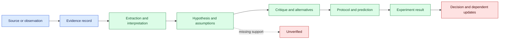
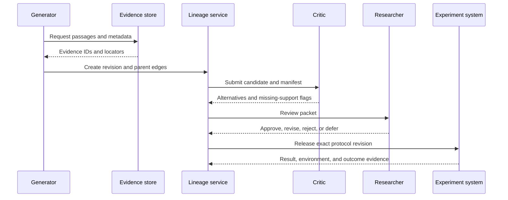

# Hypothesis provenance
Status: draft — expansion and review pending
Sources: [Google DeepMind — Co-Scientist](https://deepmind.google/blog/co-scientist-a-multi-agent-ai-partner-to-accelerate-research/)

## In one sentence
Hypothesis provenance makes an AI-generated research idea auditable by preserving the evidence, assumptions, transformations, decisions, and results that connect a suggestion to an experiment.

## Background: what existed before
Researchers used notebooks, citations, protocol versions, sample identifiers, and result tables. A reader could ask where an idea came from, but the answer often depended on prose notes and memory. AI assistants add retrieval, summaries, critique, ranking, and protocol generation. Each transformation can introduce an error, and a fluent hypothesis is not evidence. Provenance separates source observation, model inference, human interpretation, and experimental outcome.

Prerequisites are stable IDs, content digests, access-controlled evidence stores, versioned prompts and models, timestamps, role identity, and uncertainty states. A digest identifies exact bytes; it does not establish truth. A locator such as page, section, figure, timestamp, or query makes inspection possible. A lineage edge records which object depended on which parent and by what operation.

## What changed and why now
The May source presents Co-Scientist as a multi-agent system intended to assist research through generation, critique, ranking, and refinement. This is a vendor description and does not independently establish scientific validity. The engineering change is the volume and speed of candidate production. A search loop may create thousands of proposals and retain only a few; winner-only notes cannot explain selection, missing evidence, or invalid experiments.

## Impact on current processing and architecture
Represent a research idea as a graph. A hypothesis has an ID, statement, scope, status, owner, evidence IDs, assumptions, falsifier, and revision. Evidence records identify papers, datasets, observations, or tool results. Transformation records identify retrieval, extraction, synthesis, critique, or human edits. Experiment records link predictions to protocols and measured results. Decision records name the authority that approved, rejected, or revised the candidate.



The evidence service stores identity, version, locator, digest, and access policy. It should not copy confidential passages into a broadly readable hypothesis record. The experiment service consumes a reviewed protocol and emits observations with instrument, dataset, environment, and quality metadata. Use support states such as `source-observation`, `model-inference`, `experiment-pending`, `supported`, `contradicted`, and `unverified`; do not compress them into a single confidence number.



## Real-world applications and constraints
In drug discovery, connect pathway observations, assay results, proposed interventions, units, and safety review. In materials research, record simulation code, boundary conditions, temperature, purity, and seed because superficially similar results may not be comparable. In software performance work, link a hypothesis to traces, workload distribution, cache state, and a control; a model explanation cannot replace measurement. In policy analysis, preserve jurisdiction and effective date and distinguish a regulation from a generated summary.

Constraints include mutable web pages, licensing, private data, identifier collisions, inaccessible papers, and graph growth. Keep metadata and decision events longer than raw payloads when policy requires. If a source is unavailable, return `provenance-unavailable`; never fabricate a citation. If a source changes, mark descendants affected and route consequential reports for review rather than silently updating history.

## Mental model
Provenance is a bill of materials for a claim. It makes inspection and recall possible, but it does not guarantee that the claim is true. “Where did this statement come from?”, “does the source support it?”, and “does it hold in our experiment?” are separate questions.

## What changed this month
The source’s multi-agent research framing turns hypothesis generation into a pipeline of specialized roles. The source fact is the described system; the engineering inference is that generation, critique, ranking, and planning need durable lineage because each can change a candidate’s meaning.

## Engineering consequence
Define records for evidence, hypotheses, revisions, experiments, and decisions. Require a locator for factual premises and an explicit label for inference. Give human edits new revisions. Bind experiment approval to the exact protocol digest. When evidence changes, traverse dependencies and mark stale descendants without deleting the old record. Retain rejected and inconclusive candidates because they prevent repeated dead ends.

## Limits and failure modes
**Citation laundering:** a relevant citation is attached to an unsupported mechanism. Require locator-level inspection.

**Mutable sources:** store retrieval time, digest, and version or archive reference.

**False precision:** an uncalibrated model score is not scientific probability.

**Privacy leakage:** use restricted references and minimize copied excerpts.

**Lost negative results:** give failed and inconclusive experiments stable IDs.

**Stale approval:** expire decisions when a hypothesis or protocol revision changes.

**Graph explosion:** record meaningful transformations and governed summaries, not every token operation.

## Mini exercise (15–30 min)
Create three evidence records for a local engineering question. Give each an ID, locator, digest, and support type. Create two competing hypotheses with assumptions and falsifiers. Link a proposed experiment, record an inconclusive result, change one evidence record, and list the dependent objects requiring review.

## Build it locally
```python
from dataclasses import dataclass, field
@dataclass
class Hypothesis:
    ident: str; statement: str; evidence: list[str]
    status: str = "unverified"; events: list[dict] = field(default_factory=list)
    def transition(self, state, reason):
        if state not in {"unverified", "experiment-pending", "supported", "contradicted"}:
            raise ValueError("invalid support state")
        self.status = state; self.events.append({"state": state, "reason": reason})
h = Hypothesis("h-1", "batching lowers p95 latency", ["trace-7"])
h.transition("experiment-pending", "control approved")
h.transition("supported", "matched workload reduced p95")
print(h.status, h.events)
```

## Numbered local implementation steps
1. Create append-only tables for evidence, hypotheses, revisions, experiments, and decisions.
2. Require source locators and digests before review.
3. Validate support states at the API boundary.
4. Store model, prompt, tool, and corpus versions on each revision.
5. Query descendants when evidence changes.
6. Bind approval to the exact protocol revision.
7. Test missing sources, conflicting evidence, duplicate events, and late results.

## Interview Q&A
**Does provenance prove truth?** No; it makes production and evidence inspectable.

**Why retain rejected ideas?** They prevent repeated work and expose selection bias.

**What is the minimum evidence record?** Stable identity, version, locator, digest, access class, and extracted observation.

**Why is model confidence insufficient?** It is a model output unless calibrated against outcomes.

## Glossary
**Provenance:** information about origin, transformation, custody, and evidence.

**Lineage:** links connecting sources, transformations, hypotheses, and decisions.

**Locator:** a page, section, timestamp, query, or range identifying evidence.

**Falsifier:** an observation that counts against a hypothesis.

**Digest:** fingerprint of exact content bytes.

### Designing the lineage schema

A useful schema distinguishes identity from content. Store an object ID, object type, revision, content digest, creator identity, creation time, visibility class, and parent IDs. Store the operation separately: retrieval query, extraction rule, model ID, prompt digest, tool version, or human edit. This prevents a later reader from confusing “the model produced this wording” with “the model observed this fact.” A parent edge can carry a locator and a purpose such as premise, counterexample, control, or background.

Do not make the graph depend on a provider-specific trace format. Normalize the fields needed for decisions and retain a provider trace as an optional artifact. This makes lineage portable across model vendors and permits comparison of a local model with a hosted model. It also reduces the chance that an unavailable observability product makes the scientific record disappear.

Use event sourcing for decisions. A hypothesis may be proposed, enriched, criticized, approved for experiment, revised, supported, contradicted, or archived. Each event names the actor, prior revision, new revision, reason, and evidence references. A materialized view can show the current status, but the event history preserves what was known when a decision was made. This matters when a later result changes the interpretation of an earlier publication.

### Evidence quality and scope

Evidence needs scope, not only a link. Record population, environment, measurement method, units, sample size, uncertainty, and whether the item is a direct observation or a secondary report. A model may correctly retrieve a sentence while losing the qualifier that limits it to a particular cell line, language, or temperature. The review packet should show these qualifiers and ask whether the proposed hypothesis extends beyond them.

Use explicit counterevidence edges. A critic should be able to attach a source that disagrees, a failed replication, or a boundary case. Ranking should not discard a candidate merely because it has disagreement; it should expose the conflict and lower the confidence of an unsupported generalization. Store reviewer questions as first-class objects so the final experiment answers the question rather than only the original fluent summary.

### Replay and correction

Replaying a hypothesis run can mean several things. Exact replay uses the same model bytes, prompt, source bytes, tools, seed, and environment. A controlled replay may use equivalent versions and compare structured outputs. A behavioral replay may only test whether the resulting protocol and decision still follow the same policy. Label the boundary in the report. A fresh answer from a changed provider is not the original evidence.

When correcting a record, append a correction event and create a new revision. Do not edit the old source locator in place. Reports can then state that revision two superseded revision one because a figure was misread or a dataset was withdrawn. Downstream consumers can subscribe to correction events and mark stale work. The graph should support a dry-run impact report before anyone retracts or republishes an artifact.

### Security and privacy

Treat retrieved documents, generated summaries, tool results, and reviewer notes as different trust domains. A source can contain instructions aimed at the agent; those instructions are not authorization. A tool result can contain sensitive identifiers; it should be referenced through a restricted object rather than copied into prompts or public reports. Separate the lineage index from raw payload storage and enforce field-level access where necessary.

An audit trail must not become a shadow database of personal data. Hash or tokenize identifiers, redact secrets, limit retention, and record why an access occurred. If a deletion request removes raw evidence, retain only the minimum legally permitted tombstone and mark dependent claims unavailable. Security metadata—who accessed evidence, when, and under which purpose—belongs in the access log, not in the hypothesis narrative.

### Measuring provenance quality

Measure coverage and usefulness. Coverage can be the percentage of factual premises with valid locators, the percentage of transformations with model and prompt versions, and the percentage of experiments with protocol and environment manifests. Usefulness can be the time needed to answer an impact query, the rate at which reviewers find unsupported claims, and the percentage of corrections that reach all affected descendants.

Do not optimize only for filled fields. An agent can produce plausible but meaningless source IDs. Validate that locators resolve, digests match retrieved bytes, parent types are compatible, and status transitions follow policy. Sample generated claims for expert inspection. Report missing, inaccessible, conflicting, and low-quality evidence separately; combining them into a single provenance score hides the actual repair work.

### A practical acceptance checklist

Before an AI-generated hypothesis is promoted to an experiment, confirm that its statement has a defined population and mechanism; every factual premise has a source or observation; inference is labeled; a counterargument is recorded; the predicted observation and falsifier are concrete; the protocol version is linked; the data and safety classification are known; an owner and budget exist; and the approval is tied to the exact revision. After execution, attach raw result references, environment, deviations, and outcome state.

The checklist should be executable where possible. A service can reject a record with no digest, an expired source, an unresolved locator, a missing protocol, or a stale approval. Human review remains necessary for scientific interpretation and unusual conflicts. The purpose of automation is to make omissions visible and reduce clerical load, not to convert a weak evidence chain into a green badge.

### Worked lineage example

Suppose an assistant proposes that batching requests lowers tail latency. The source observation is a trace digest from a named workload, not the statement that batching is beneficial. The inference adds a mechanism: fewer per-request overheads should reduce service time. The protocol specifies batch size, arrival distribution, cold and warm cache conditions, error budget, and p95 measurement boundaries. The experiment result may support the claim only for that workload and configuration. If queue delay rises, the result should support a narrower statement or contradict the original one. Recording this distinction prevents a dashboard improvement from becoming a universal engineering rule.

## References
- [Google DeepMind — Co-Scientist](https://deepmind.google/blog/co-scientist-a-multi-agent-ai-partner-to-accelerate-research/) — primary source context.
- [W3C PROV Overview](https://www.w3.org/TR/prov-overview/) — provenance graph concepts.
- [NIST AI Risk Management Framework](https://www.nist.gov/itl/ai-risk-management-framework) — governance context.

## Claim ledger
| Claim | Source | Fact or inference |
|---|---|---|
| Co-Scientist is presented as multi-agent research assistance. | Google DeepMind | Fact, vendor claim |
| A citation does not establish experimental validity. | Scientific-method reasoning | Engineering distinction |
| IDs, locators, digests, and dependency edges improve auditability. | W3C PROV plus systems design | Engineering recommendation |
