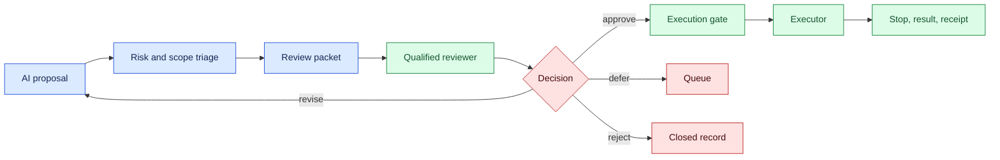
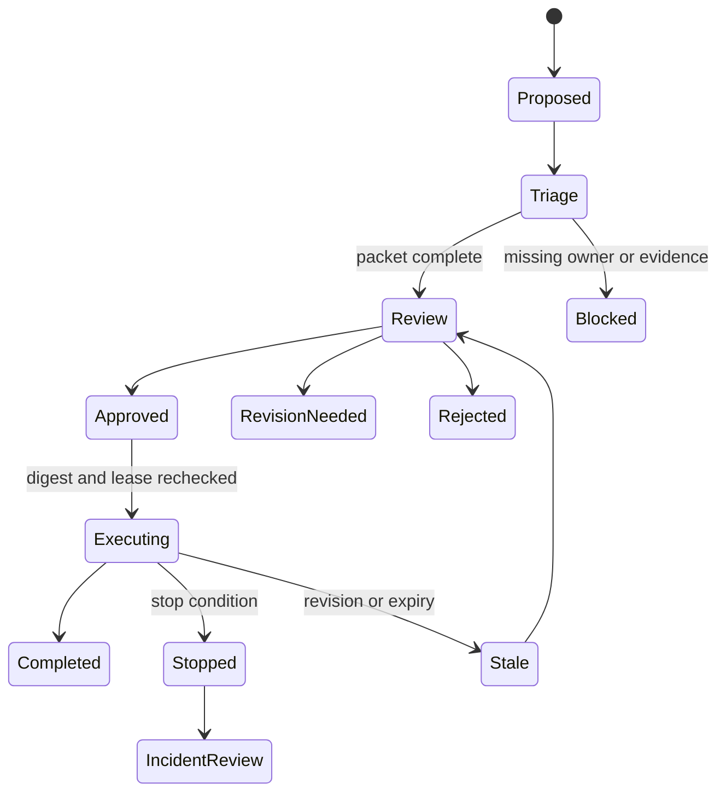

# Human experiment review
Status: draft — expansion and review pending
Sources: [Google DeepMind — Co-Scientist](https://deepmind.google/blog/co-scientist-a-multi-agent-ai-partner-to-accelerate-research/)

## Draft lesson
Require human approval before experiments with material cost, safety, privacy, or publication impact. The review packet names hypothesis, evidence, procedure, resources, rollback, and uncertainty; an assistant cannot approve its own plan.

## In one sentence

Human experiment review is an authorization boundary where a qualified person examines an AI-assisted experiment’s evidence, risk, resources, and rollback before execution.

## Background: what existed before

Laboratories use principal investigators, ethics committees, safety officers, and peer review to decide which work may proceed. Software teams use change review and production approval for the same reason: the proposer should not be the sole authority that declares an action safe. AI changes the volume and speed of proposals. It can generate protocols, parameter sweeps, code, and tool calls continuously, while still missing a hazard, invalid control, conflict of interest, or data restriction.

Prerequisites are risk classification, reviewer identity and qualification, evidence links, versioned protocol, resource estimate, stop conditions, approval expiry, and an execution gate. Review is not proofreading. The reviewer needs enough information and authority to accept, revise, defer, or reject the proposed action.

## What changed and why now

The May source presents Co-Scientist as a multi-agent research partner with roles for generation, critique, ranking, and refinement. This is a vendor description, not evidence that agents replace domain governance. The engineering change is that an automated loop can fill a queue faster than experts can inspect it deeply. Review must separate triage from authorization and route work by consequence.

## Impact on current processing and architecture

Create an immutable review packet containing hypothesis and revision, evidence manifest, protocol digest, prediction, controls, data classification, hazards, resources, stop procedure, rollback, uncertainty, and owner. Detailed traces can remain restricted, but the reviewer should not reconstruct the proposal from raw conversation.



Approval binds to protocol digest, data version, resource ceiling, and expiry. If the agent changes a parameter, source, or tool scope, the gate returns `stale-approval`. This prevents an approved simulation from becoming an unreviewed external action.



## Real-world applications and constraints

For biomedical work, review biosafety class, sample identity, dose, controls, waste, and approved scope. A generated summary may omit a contraindication. For infrastructure experiments, review blast radius, maintenance window, rollback, credentials, observability, and customer impact. For algorithm research, inspect baseline matching, holdout protection, leakage, and resource estimates. For sensitive data, review consent, minimization, retention, and third-party processing.

Reviewers should see question, baseline, predicted outcome, uncertainty, cost, hazards, data scope, stop condition, and rollback first. Link each factual premise to a source or observation and expose disagreement. A reviewer can authorize a protocol without endorsing the model’s explanation or guaranteeing its result.

Constraints include scarce reviewers, queue growth, fatigue, conflicts of interest, and incomplete evidence. Use risk-based routing without letting a classifier lower a high-risk tier merely because similar work was previously approved. Track queue age, deep-review sampling, overturns, and reviewer workload. Approval speed is not quality if controls are skipped.

## Mental model

Human review is a circuit breaker with expertise, not a ceremonial signature. The agent prepares evidence and alternatives; the reviewer authorizes a transition under stated conditions. The agent cannot grant itself permission or silently alter the approved object.

## What changed this month

The source’s multi-agent framing highlights coordination between generation, critique, and scientific judgment. The source fact is the described research-assistance system. The engineering inference is that automation needs a human boundary before costly, sensitive, or irreversible work.

## Engineering consequence

Separate proposer, reviewer, and executor roles. Store identity, qualification, decision, rationale, conditions, expiry, and protocol digest. Make conditions machine-checkable. Fail closed on missing authorization or unavailable review. Record stops and external receipts before retrying. Use two-person review where policy requires separation of duties.

## Limits and failure modes

**Rubber-stamp review:** sample packets for deep inspection and measure overturns.

**Authority mismatch:** require the qualification appropriate to the domain.

**Stale approval:** bind decisions to a revision digest and expiry.

**Hidden side effect:** separate read and write capabilities and display effect scope.

**Queue starvation:** reserve capacity for urgent or high-risk work.

**Incomplete rollback:** require a tested restoration operation or explicit irreversible classification.

**Data exposure:** reference restricted evidence instead of copying it into broad logs.

**Self-approval:** enforce independent identities at the authorization service.

## Mini exercise (15–30 min)

Write a review packet for a local benchmark that changes a shared configuration. Include baseline, risk, resource limit, rollback, stop condition, and reviewer role. Implement `approve`, `revise`, `defer`, and `reject`; ensure changing the protocol invalidates approval.

## Build it locally

```python
from dataclasses import dataclass
from hashlib import sha256
def digest(text): return sha256(text.encode()).hexdigest()
@dataclass
class Approval:
    protocol_digest: str; reviewer: str; state: str = "approved"
def gate(protocol, approval):
    if not approval or approval.state != "approved": return "blocked: no approval"
    return "ready" if digest(protocol) == approval.protocol_digest else "blocked: stale"
p = "benchmark-v1: read-only"
a = Approval(digest(p), "reviewer-7")
print(gate(p, a)); print(gate(p + ": changed", a))
```

## Numbered local implementation steps
1. Define risk tiers and reviewer qualifications.
2. Create immutable packets with protocol, evidence, data class, and rollback.
3. Hash the exact protocol and bind approval to it and an expiry.
4. Separate proposer, reviewer, and executor identities.
5. Recheck digest, scope, lease, and conditions at execution.
6. Record decisions, revisions, stops, receipts, and rationale.
7. Test stale approval, outage, duplicate execution, and emergency stop.

## Interview Q&A
**Why can’t an agent approve itself?** Proposal and authorization have different incentives and authority.

**What invalidates an approval?** Any change to protocol, data, model, scope, risk, owner, or expiry.

**Can low-risk review be automated?** Yes, for bounded reversible work with independent policy checks.

**Does approval prove the conclusion?** No; it authorizes execution under stated conditions.

## Glossary
**Review packet:** versioned evidence and authorization material for one action.

**Risk tier:** classification determining controls and qualifications.

**Execution gate:** service checking authorization immediately before an effect.

**Stop condition:** observable state requiring termination or escalation.

**Rollback:** tested operation restoring a prior state where possible.

## References
- [Google DeepMind — Co-Scientist](https://deepmind.google/blog/co-scientist-a-multi-agent-ai-partner-to-accelerate-research/) — primary source context.
- [NIST AI Risk Management Framework](https://www.nist.gov/itl/ai-risk-management-framework) — governance context.

## Claim ledger
| Claim | Source | Fact or inference |
|---|---|---|
| Co-Scientist is presented as AI research assistance. | Google DeepMind | Fact, vendor claim |
| Human approval is an appropriate boundary for consequential experiments. | Governance reasoning | Engineering recommendation |
| Digest-bound approvals reduce stale-approval risk. | Systems design | Engineering inference |
| Approval does not establish scientific validity. | Scientific-method reasoning | Engineering distinction |
