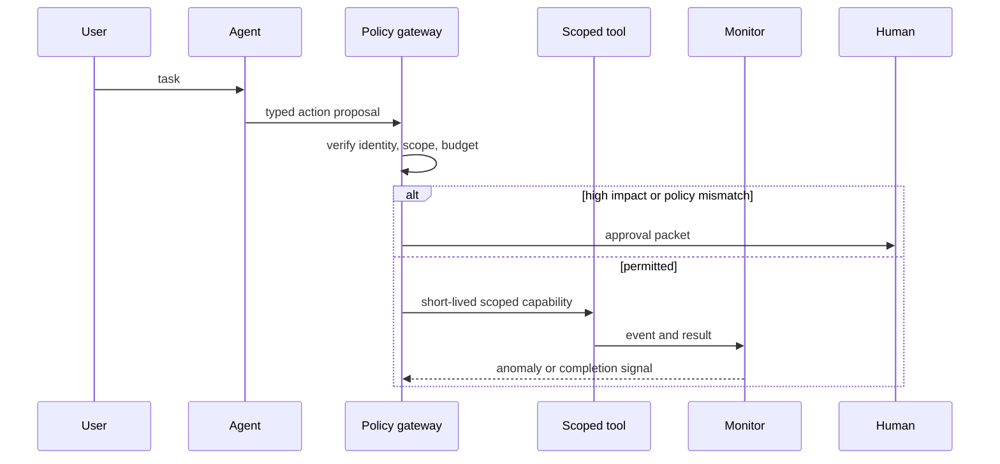

# Defense in depth
Status: draft — substantive review pending
Sources: [Google DeepMind — AI Control Roadmap](https://deepmind.google/blog/securing-the-future-of-ai-agents/)

## Draft lesson
Defense in depth combines authorization, sandboxing, monitoring, rate limits, approvals, and incident response because any one control can fail. Map each threat to prevention, detection, and recovery layers.

## In one sentence

Defense in depth protects an AI-enabled system by combining independent prevention, detection, containment, and recovery controls so that a mistaken model output or compromised component does not become an uncontrolled external effect.

## Background

Traditional application security does not trust a single perimeter. A user may authenticate, but the API still checks authorization; a service may be authorized, but the database still enforces tenant boundaries; an incident may bypass prevention, but monitoring and recovery reduce harm. AI agents make this layering more important because model outputs can be persuasive, variable, and influenced by untrusted content. A prompt that looks harmless can lead to a tool call, data export, code change, or external message unless the surrounding system constrains it.

The historical baseline for many assistants was a broad API key plus a prompt telling the model to use tools carefully. That is insufficient for consequential workflows. Instructions are not enforcement. A model can misunderstand a request, receive a prompt injection from a retrieved document, or select an action whose side effects are larger than expected. Treat the model as an untrusted decision component: useful for proposing actions, never the sole enforcement point for permission or safety.

## What changed

Google DeepMind's AI Control Roadmap discusses securing the future of AI agents. It is a vendor perspective, not a complete assurance standard. The relevant engineering direction is clear: as agents gain access to tools and long-running workflows, controls must exist at several layers—identity, policy, execution environment, observability, intervention, and recovery—rather than at the prompt layer alone.

```mermaid
flowchart LR
  I[User or untrusted content]:::input --> M[Model proposes action]:::model
  M --> A[Authorization policy]:::gate
  A --> S[Sandbox / scoped tool]:::safe
  S --> O[Observed execution]:::state
  O --> D[Detection and anomaly rules]:::gate
  D --> R[Rate limit, revoke, or escalate]:::warn
  R --> L[Audit and recovery]:::state
  classDef input fill:#dbeafe,stroke:#2563eb,color:#111827;
  classDef model fill:#ede9fe,stroke:#7c3aed,color:#111827;
  classDef gate fill:#fef3c7,stroke:#d97706,color:#111827;
  classDef safe fill:#dcfce7,stroke:#16a34a,color:#111827;
  classDef state fill:#cffafe,stroke:#0891b2,color:#111827;
  classDef warn fill:#fee2e2,stroke:#dc2626,color:#111827;
```



## Impact on current processing and architecture

Start with least privilege. Every agent run should have an identity, tenant, task ID, allowed tool set, expiry time, and cost or rate budget. Issue short-lived capabilities scoped to one operation rather than passing an administrator credential into model context. The tool gateway validates the requested verb and parameters against policy, independently of what the model claims the user intended.

Sandbox untrusted execution. Generated code, downloaded files, and data transformations should run without network access by default, with a read-only input mount, restricted filesystem, CPU and memory limits, process limits, and bounded output. A sandbox is not a policy engine: it limits blast radius, while authorization decides whether the task should run at all. Keep production credentials and hidden evaluation data outside the sandbox.

Use a durable audit trail for every meaningful transition: requesting identity, input artifact hashes, policy version, tool call, approval, result, and recovery action. Logs need correlation IDs so incident responders can reconstruct one run across queues and services. Redact sensitive payloads according to retention policy, but do not omit the metadata needed to answer who accessed which resource and why.



## Real-world applications and constraints

For a support agent, read access to a customer record can be distinct from authority to issue a refund or send an email. For a coding agent, repository read access can be distinct from creating a branch, running CI, or deploying. For a research assistant, retrieval can be allowed while data export remains blocked. This separation gives product teams useful automation without making every task an all-or-nothing trust decision.

Defense in depth has cost and usability trade-offs. More gates add latency and may create approval fatigue. The answer is not to remove controls; classify actions by consequence, automate low-risk checks, and reserve human approval for genuinely irreversible or high-impact actions. Measure false blocks and intervention latency so the control design improves over time.

## Mental model

Think of the model as a capable intern operating inside a well-designed facility. It can suggest a request, but doors need badges, sensitive rooms need separate approval, cameras record access, and staff can revoke badges or respond to an incident. No single safeguard is assumed perfect.

## Engineering consequence

Map each threat to prevention, detection, and recovery. Prompt injection can be reduced by tool isolation and input handling, detected by unusual tool arguments, and recovered through revocation and audit. Excessive spending can be limited by budgets, detected by rate anomalies, and recovered by cancelling queued work. Data exfiltration can be constrained by egress policy, detected through volume monitoring, and recovered through credential rotation and incident response.

## Limits and failure modes

Layers can share the same blind spot. A policy service and monitoring rule built from the same flawed assumption are not independent safeguards. Review common-mode failure: shared credentials, shared network paths, a single feature flag that disables several controls, and a single model judgment used both to authorize and detect misuse. High-impact systems benefit from a small number of diverse, testable controls rather than a large number of prompts that repeat the same policy.

Controls also fail when their ownership is unclear. A rate limit without an on-call owner, an audit log nobody reviews, or an approval queue with no deadline offers little protection during an incident. Assign owners, service-level objectives, and runbooks. Test revocation, account lockout, queue draining, rollback, and recovery using controlled exercises rather than discovering the gaps during an external incident.

## Designing the layers as a system

Start from the external effect, not the model feature. List each action the agent can take: read a record, write a record, call an internal API, execute code, download a file, send a message, make a purchase, or alter a deployment. For each action, record the asset affected, the largest plausible harm, the required identity, the normal volume, and the recovery path. This turns a vague requirement such as “make the agent safe” into concrete policy and operational work.

An effective design separates the planning plane from the execution plane. The planning plane can retrieve documents, keep task state, and ask the model to form a typed proposal such as `refund(customer_id, amount, reason)`. It cannot itself execute the refund. The execution plane receives that proposal through a gateway, validates its schema, checks an independent policy, attaches a short-lived credential, and records the decision. Tool services should accept structured fields rather than a free-form natural-language instruction. A typed request makes it possible to validate amount ranges, tenant ownership, destination allowlists, and idempotency keys before a side effect occurs.

Use a separate trust level for content and authority. A web page, ticket comment, retrieved PDF, or email may be useful evidence, but it must not grant permission merely by asking for it. Preserve its provenance in task state: where it came from, who supplied it, when it was fetched, and whether it is treated as untrusted. The agent may quote a document into its reasoning, but the gateway should derive authority from authenticated user intent and server-side policy. This distinction is a practical defense against indirect prompt injection, where hostile instructions arrive through material the system was otherwise allowed to read.

Layering also changes how teams store state. Durable workflow state should contain the smallest useful set of identifiers and decisions: task ID, actor, selected action, policy result, approval ID, capability expiration, and output artifact location. Avoid putting long-lived bearer tokens, secret-rich prompts, or raw customer records into a general agent transcript. A queue message may be replayed days later; if it carries a broad credential or omits the policy version, operators cannot determine whether replay remains safe. Make replay explicit: either mint a new capability after re-authorization or reject stale jobs.

## Detection, intervention, and recovery

Prevention cannot be the only success criterion. Some actions are allowed individually but suspicious in aggregate: a support agent may legitimately view one account, while reading hundreds of accounts in a few minutes is a different event. Emit compact, structured telemetry at the gateway and tool boundary: action type, tenant, actor, policy outcome, latency, result category, bytes transferred, cost, and correlation ID. Keep the model prompt separate from this event stream unless it is deliberately needed for debugging and retained under an approved data policy.

Detection rules should begin simple and explainable. Examples include a sudden rise in denied actions, an unusual destination domain, repeated retries after a policy failure, spending above a task budget, a request made outside the expected region, or a tool argument that does not match the task's approved resource. These are signals, not automatic proof of abuse. Pair them with a severity model and an intervention path: log for analysis, pause the task, require a second approval, revoke the current capability, disable one tool integration, or place the whole tenant in a safe mode.

Intervention needs bounded latency. A monitor that identifies a bad pattern after a deployment completes is useful evidence but not containment. For high-impact actions, make the gateway check a current revocation list or a fast policy decision immediately before execution. For queued work, store cancellation state where workers read it before starting the next step. For long-running code, use runtime limits and a supervisor that can terminate the process. The operational question is measurable: how long can a risky action continue after an on-call engineer or automated rule decides to stop it?

Recovery is not simply “turn the agent off.” Decide in advance what can be reversed, what requires human remediation, and what must be preserved as evidence. A mistakenly created draft document may be deleted. A sent email can sometimes be followed up but not unsent. A payment may require a refund workflow and accounting reconciliation. An access token should be revoked and rotated, while audit records should be retained in an access-controlled store. Runbooks should name the owner of each step and include a communications path for affected users.

## Testing the control design

Test each layer at its boundary. Unit-test policy rules with allowed and denied fixtures. Integration-test that a sandbox cannot reach a forbidden network target or read a host secret. Run contract tests that ensure the tool gateway rejects unknown fields and requests without a current capability. Then exercise the whole path with safe synthetic tenants: inject untrusted text that requests an unsafe action, cause a budget threshold to trip, and verify that the task pauses, the event reaches monitoring, and an operator can resume or cancel it.

Coverage matters more than a large count of tests. Build a small threat-to-control matrix and look for threats that have only one row of protection. For example, a malicious retrieved document could be handled by source labeling, tool-argument validation, a domain allowlist, egress monitoring, and an operator-visible audit record. The layers do not need to all be blocking controls; visibility and recovery are legitimate layers when they can change the outcome in time. The key is to make each dependency testable and owned.

Chaos-style exercises are valuable after the basic tests work. Temporarily make an approval service unavailable, delay telemetry delivery, expire a capability mid-workflow, or make the policy gateway return an error. The safest default for consequential actions is generally fail closed: do not perform the action when the decision service cannot establish authorization. For low-risk, reversible reads, a documented fail-open choice may be acceptable, but it should be deliberate and observable rather than an accident of error handling.

## What changed this month

The source's roadmap framing is a timely reminder that agent security is becoming an end-to-end systems problem. The durable lesson is not a particular product feature. It is the move from trusting a conversational interface to building explicit controls around identity, scoped tools, state transitions, observation, and interruption. Teams adding more capable models should review the authority and recovery model at the same time, because a model improvement can increase the number and speed of attempted side effects without changing the surrounding permission system.

## Mini exercise (15–30 min)

Pick one action in an existing automation, such as creating a support reply or modifying a configuration record. Draw the planning plane and execution plane. Then write down: the authenticated actor, the narrowly scoped capability, one preventive control, one detection signal, one revocation action, and the person or service that owns recovery. Finally, choose one failure to simulate locally—for example, a capability expiring before the tool call—and confirm the action is not performed.

## Build it locally

```python
from dataclasses import dataclass

@dataclass(frozen=True)
class Request:
    role: str
    action: str
    amount: int

POLICY = {"reader": {"search"}, "operator": {"search", "draft"}}

def authorize(request: Request) -> str:
    if request.action not in POLICY.get(request.role, set()):
        return "DENY: action is outside role scope"
    if request.amount > 10:
        return "ESCALATE: rate or budget threshold"
    return "ALLOW: issue short-lived capability"

print(authorize(Request("reader", "search", 1)))
print(authorize(Request("reader", "send_email", 1)))
assert authorize(Request("reader", "search", 1)).startswith("ALLOW")
assert authorize(Request("reader", "send_email", 1)).startswith("DENY")
```

1. Save the example as `defense_layers.py` and run `python3 defense_layers.py`.
2. Add a tenant ID and deny cross-tenant requests.
3. Add a capability expiry timestamp and reject an expired request.
4. Append every decision to a JSONL audit record with a correlation ID.
5. Simulate an anomaly that revokes all active capabilities for one task.

## Interview Q&A

**Why is prompt instruction not a security boundary?** A model can misunderstand, be manipulated by untrusted content, or behave inconsistently. Permissions must be enforced by services outside the prompt.

**What makes controls independent?** They use different mechanisms or assumptions—for example, an authorization check, a sandbox resource limit, and an external audit rule—not several model judgments over the same input.

**How do you reduce approval fatigue?** Classify actions by consequence, automate low-risk policy checks, batch related decisions carefully, and reserve human review for irreversible or high-impact effects.

## Glossary

**Capability:** Narrow, time-limited authority to perform a defined operation.

**Defense in depth:** Multiple controls that reduce harm when any one control fails.

**Least privilege:** Granting only the authority required for a task.

**Prompt injection:** Untrusted content attempting to alter an AI system's instructions or tool use.

**Revocation:** Removing authority before its normal expiry because risk changed.

## References

- [Google DeepMind, “Securing the future of AI agents”](https://deepmind.google/blog/securing-the-future-of-ai-agents/)
- [NIST AI Risk Management Framework](https://www.nist.gov/itl/ai-risk-management-framework)

## Claim ledger

| Claim | Source | Fact or inference |
|---|---|---|
| Google DeepMind discusses controls for securing AI agents. | [AI Control Roadmap](https://deepmind.google/blog/securing-the-future-of-ai-agents/) | Fact, vendor perspective |
| Layered authorization, sandboxing, monitoring, and recovery reduce single-control failure risk. | This lesson | Engineering inference |
