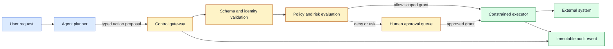
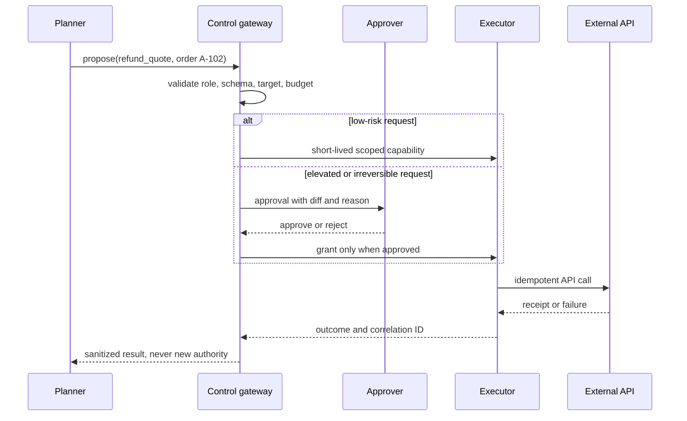

# Agent control
Status: draft — substantive review pending
Sources: [Google DeepMind — AI Control Roadmap](https://deepmind.google/blog/securing-the-future-of-ai-agents/)

## Draft lesson
Agent control limits runtime authority, observes proposals and effects, and escalates before irreversible actions. Treat a capable planner as untrusted at the effect boundary.

## In one sentence

Agent control is the runtime system that turns an agent's proposed next step into a narrowly authorized, observable, and recoverable operation rather than an unchecked side effect.

## Background: what existed before

Early application automation was mostly deterministic. A script received a fixed input, invoked a known API with a service account, and returned a result. The main operational question was whether the script had a bug. Conventional controls therefore focused on code review, credentials, network boundaries, input validation, and audit logs. A workflow engine could retry a failed job because its intended sequence was encoded ahead of time.

An agent changes this shape. A language model or another planner can select a tool, form arguments, decide which record to inspect next, and revise its plan after reading intermediate results. That flexibility is useful for support triage, research, coding assistance, and operations, but it means the precise action sequence is not fully known when the program is deployed. “The model is only suggesting text” ceases to be an adequate description once its output can create tickets, query internal systems, send messages, modify files, or initiate payments.

The historical baseline for authorization was often coarse: one API key for a whole integration, one role for an entire background worker, or one approval at the beginning of a long workflow. Coarse authority is convenient, but it creates a large blast radius. If an agent mistakenly interprets “close duplicate accounts” as “delete every account matching a weak heuristic,” a broadly privileged token makes the mistake executable. Logging after the fact explains the incident; it does not stop it.

Control systems instead put a decision point at the effect boundary: the moment an external state change, privileged read, or irreversible communication is about to occur. The planner can remain helpful, but it does not get to directly convert free-form intent into authority. A control plane validates the requested action against a typed contract, the actor's role, the target resource, contextual policy, and the current run state. This is analogous to a database transaction manager or an operating system kernel: a process may request an operation, but a separate mechanism decides whether and how it occurs.

## What changed and why now

The Google DeepMind AI Control Roadmap frames increasingly capable AI agents as systems needing controls that can prevent, detect, and respond to harmful behavior. This is a roadmap and a research-oriented perspective, not an independent guarantee that a particular product is controlled. Its practical implication for application engineers is immediate: safety cannot live only in the prompt, training data, or final user interface once an agent has tools.

This month’s useful shift is to treat control as an engineering subsystem with explicit interfaces. The agent proposes an action; an enforcement service evaluates it; an executor performs only the accepted, scoped operation; and telemetry records both the proposal and outcome. The control service must be able to reject an action even if the model is confident, the user asked for a broad outcome, or a prior step succeeded.

That separation also clarifies a common confusion. A policy prompt such as “never delete production data” is guidance to a probabilistic model. A control plane rule such as “the delete tool accepts only resources in a sandbox project and requires a signed approval ID” is an enforced constraint. Prompts can improve behavior and help the planner explain itself. Enforced interfaces limit what any planner, including a compromised one, can cause at runtime.

## Impact on current processing and architecture

The most important design choice is to make tools typed, small, and capability-scoped. Avoid a generic tool named `run_command` or `call_any_api` when the task can be represented as `create_draft_ticket`, `read_customer_case`, or `request_refund_quote`. Each tool should define allowed fields, resource boundaries, a maximum result size, timeout behavior, and whether its effect is reversible. This reduces ambiguity for the model and gives the policy layer meaningful facts to evaluate.

An action request should carry more than a tool name. At minimum it needs a run ID, authenticated user or service identity, agent identity and version, action type, target resource, structured parameters, declared risk level, and a reason. The control plane should add its own timestamp, policy version, decision, and correlation ID. Do not accept the model's self-reported identity, risk score, or approval state as authoritative; those are proposals or metadata until verified by a trusted service.

The executor should receive a short-lived capability rather than the agent's broad credentials. A capability is a token or signed grant that names one allowed operation, target, expiration, and sometimes a request hash. For example, approval to issue a refund quote for order `A-102` should not permit a refund, and approval for that order should not permit another order. A stolen or replayed capability then has a smaller useful window.



This layout changes data processing too. Tool outputs are untrusted input when they re-enter the model context: a web page, support note, document, or database field can contain instructions that conflict with the task. Store raw tool output separately from the model's summary, label its origin, and avoid allowing retrieved text to silently redefine authorization. A retrieval system may help decide *which* account deserves attention; it should not grant permission to change that account.

State needs careful ownership. The model can keep an ephemeral scratch plan, but durable run state—pending approval, completed action, compensation required, or blocked target—belongs in an application database or workflow service. Use idempotency keys for effectful operations so a retry after a timeout does not send two emails or charge twice. Record the policy decision before execution, then record the executor’s observed outcome, including an unknown outcome when a downstream timeout makes success uncertain.



## Real-world applications and constraints

In customer support, an agent can summarize a case, retrieve order status, draft a response, and propose a refund. Reading a case may be permitted for the assigned support region, while issuing money is limited by amount, currency, customer status, and an approval threshold. The safest interface does not ask the model to produce an arbitrary payment API body; it asks for a structured proposal that a payment service validates against its own ledger.

In software delivery, an agent may inspect logs and open a pull request, but production deployment needs an environment-specific gate. The gate can require passing tests, a change ticket, a deployment window, and a distinct human approver. “Create a pull request” and “merge to main” are separate capabilities. This distinction preserves useful automation while preventing an accidental broad command from becoming a production release.

For IT operations, a remediation agent can detect a failing instance, collect diagnostic data, and propose a restart. A restart can be allowed within a noncritical pool with a concurrency limit; database deletion, firewall changes, and identity policy updates require a different workflow. Rate limits matter here: even individually safe actions can cause an outage if hundreds of nodes are restarted at once.

Constraints are not only security rules. Latency affects whether an approval queue is usable during an incident. Availability affects what happens when the policy service is down: fail closed for sensitive changes, but perhaps permit a pre-authorized read-only diagnostic path. Cost affects how much evidence can be collected before each action. Privacy rules determine which tool output may be put into a model context or human approval screen. A workable control design makes these trade-offs explicit per operation.

## Mental model

Think of the model as a junior operator who is very fast at interpreting incomplete requests and proposing a next action. It is neither an identity provider nor a policy authority. The control plane is the shift manager who checks scope, current conditions, and required sign-off. The executor is a carefully constrained machine that carries out one approved operation and returns a receipt.

This metaphor also explains why a perfect planner is not enough. An operator can make a correct plan based on stale information, be manipulated by text in a document, or encounter an API with surprising semantics. Safe systems assume proposals can be wrong and make wrong proposals inexpensive to reject. They use narrow tools, validation, approvals for high-impact steps, observable effects, and compensating actions for operations that cannot be fully prevented.

## What changed this month

The source’s roadmap is a release-specific statement of a control research agenda. The durable engineering lesson is an inference: applications that delegate tool use should make every authority transition explicit. That means an agent goes from intent to proposal, from proposal to policy decision, and from decision to a narrowly scoped execution grant. The change is less about a new SDK primitive than about moving control from informal model instructions into service boundaries that can be tested and monitored.

## Engineering consequence

Start by inventorying effects, not prompts. List every tool the agent can call and classify it as read-only, reversible write, irreversible write, external communication, or privilege change. For each one, name the target boundary, required identity, maximum scope, approval rule, idempotency strategy, audit event, and recovery path. If any answer is “the model will know,” the operation is underspecified.

Policy evaluation should be deterministic where possible. A rule engine can check `role == support`, `amount <= 50`, `region == assigned_region`, and `approval_id is valid`. A model may still help classify an incoming request or summarize evidence, but its classification should be bounded by thresholds and fallbacks. For ambiguous cases, route to a human rather than inventing a broad allow rule.

Test the negative paths. Unit tests should confirm that malformed arguments, expired grants, cross-tenant targets, duplicate idempotency keys, budget overruns, and missing approvals are rejected. Integration tests should simulate an external API timeout after it may have applied an effect. The correct result is sometimes “unknown; reconcile before retry,” not an automatic retry. Security tests should include tool-output injection, where retrieved content asks the agent to ignore rules or exfiltrate data.

Operational dashboards need counts and distributions, not just a transcript. Track denied actions by rule, approval latency, policy-service errors, capability expiry failures, downstream unknown outcomes, retries, and effects by tenant or environment. A sudden rise in a formerly rare tool call may signal a prompt regression, a changed upstream document format, or abuse. Keep audit records structured enough to query without storing unnecessary sensitive content.

## Limits and failure modes

Controls reduce risk; they do not prove an agent is harmless. A narrow but dangerous tool can still be misused if its parameters are too expressive. For example, `update_record` is effectively broad write access if it accepts arbitrary tables, fields, and filters. Split it into business-specific operations or enforce a strict allowlist at the executor.

Approval is also not a magic answer. Humans can rubber-stamp long queues, miss subtle changes, or become the bottleneck during urgent work. Give approvers a concise diff, reason, target, expected impact, and the policy rule that triggered escalation. Sample low-risk actions for later review, and measure whether approvals actually catch problems. If a reviewer cannot understand the action, the tool contract is too vague.

An attacker may try to influence the planner through a document, an email, or an API response. The main defense is not detecting every malicious sentence; it is ensuring that text cannot directly become authority. Segregate instructions from data, validate all tool arguments, apply least privilege, and require independent approval for consequential effects. The same architecture helps with ordinary model mistakes.

Finally, an overly strict gate can push teams into bypasses. Build a usable path for legitimate work: clear policy errors, an escalation mechanism, pre-approved templates for common operations, and test environments where an agent can act freely enough to learn. Good controls make the safe path faster than copying a privileged token into an exception script.

## Build it locally

This small example keeps policy outside the planner. It accepts only named operations, enforces target scope and a spending cap, and returns a short-lived grant. It is intentionally not a complete authorization system; production systems need authenticated identities, durable logs, key management, and an executor that verifies the grant.

```python
from dataclasses import dataclass
from datetime import datetime, timedelta, timezone


@dataclass(frozen=True)
class Proposal:
    role: str
    action: str
    target: str
    amount: int = 0
    approval_id: str | None = None


def authorize(p: Proposal) -> dict:
    if p.action not in {"read_case", "draft_reply", "refund_quote"}:
        return {"decision": "deny", "reason": "unknown action"}
    if not p.target.startswith("case-"):
        return {"decision": "deny", "reason": "target outside case boundary"}
    if p.role != "support":
        return {"decision": "deny", "reason": "role is not allowed"}
    if p.action == "refund_quote" and p.amount > 50 and not p.approval_id:
        return {"decision": "escalate", "reason": "manager approval required"}
    expiry = datetime.now(timezone.utc) + timedelta(minutes=5)
    return {
        "decision": "allow",
        "grant": f"{p.action}:{p.target}",
        "expires_at": expiry.isoformat(),
    }


for proposal in [
    Proposal("support", "refund_quote", "case-42", 25),
    Proposal("support", "refund_quote", "case-42", 100),
    Proposal("support", "delete_customer", "case-42"),
]:
    print(proposal.action, authorize(proposal))
```

1. Save the code as `control_demo.py` and run `python3 control_demo.py`.
2. Change the target to `customer-42`; verify that the gateway denies it before any executor exists.
3. Add a `case_region` field and enforce that it matches the operator's assigned region.
4. Add an idempotency key to `Proposal`; keep a set of completed keys so a simulated retry cannot issue a second effect.
5. Replace the printed grant with a signed, short-lived token only after learning how the executor will independently verify it.

## Interview Q&A

**Why is a prompt not sufficient authorization?** A prompt is model input. It may shape a response, but it is not an independently enforced identity, scope, or policy check. The executor must reject unauthorized calls even when they originate from an apparently compliant model.

**Where should policy run?** Immediately before the effect boundary, with enough trusted context to evaluate the actor, target, operation, and current state. Earlier checks are helpful, but they can become stale after planning or retries.

**How do you handle a downstream timeout?** Mark the outcome unknown, query for a receipt or reconcile state, and retry only when the operation is idempotent or absence of effect is established.

**What is least privilege for an agent?** Give the runtime only the smallest, shortest-lived capability needed for the specific action, target, and time window—not a general integration credential.

## Glossary

- **Capability:** a scoped grant that permits a named operation for a limited target and time.
- **Control plane:** the policy, identity, approval, and audit components that govern execution.
- **Effect boundary:** the point where a system reads sensitive data or changes an external system.
- **Idempotency key:** a stable request identifier that lets a service treat repeated submissions as one logical operation.
- **Least privilege:** granting no more access than the immediate task requires.
- **Reconciliation:** checking an external system to resolve whether a timed-out operation took effect.

## References

- [Google DeepMind — Securing the future of AI agents](https://deepmind.google/blog/securing-the-future-of-ai-agents/) — primary vendor roadmap.
- [NIST AI Risk Management Framework](https://www.nist.gov/itl/ai-risk-management-framework) — governance context for managing AI risks.
- [OWASP Top 10 for LLM Applications](https://genai.owasp.org/llm-top-10/) — practitioner guidance on common LLM application risks.

## Claim ledger

| Claim | Source | Fact or inference |
|---|---|---|
| DeepMind presents an AI Control Roadmap for securing increasingly capable agents. | Google DeepMind roadmap | Release-specific fact |
| An enforcement service should independently validate tool calls at the effect boundary. | This lesson's system design | Engineering inference |
| Short-lived, target-scoped grants reduce the useful blast radius of a leaked runtime credential. | Capability-security practice applied here | Engineering inference |
| Timeouts after an effect require reconciliation rather than blind retry. | Distributed-systems practice applied here | Engineering inference |
