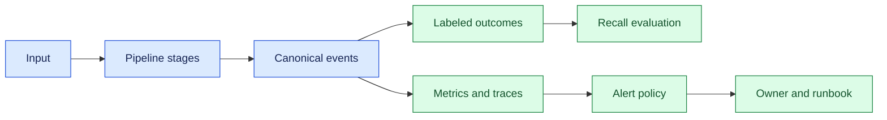
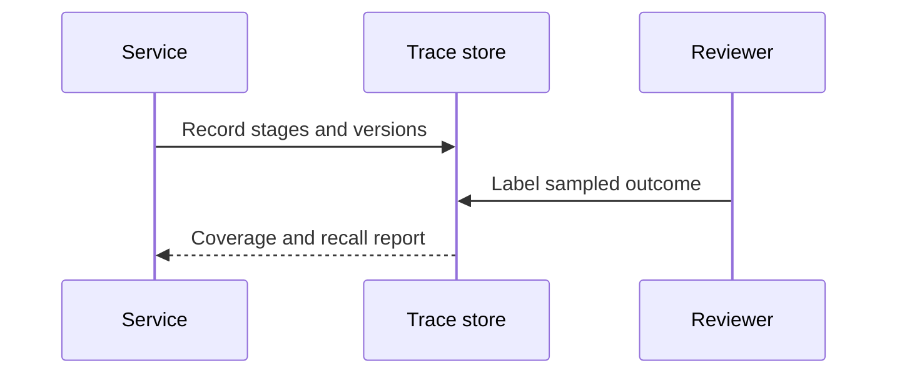

# Monitoring coverage and recall
Status: draft — expansion pending
Sources: [Google DeepMind — AI Control Roadmap](https://deepmind.google/blog/securing-the-future-of-ai-agents/)

## Draft lesson
Coverage measures observed traffic; recall measures harmful behavior caught. Track both by action class, tenant, tool, and policy version; high coverage can coexist with poor detection.

## In one sentence

Monitoring coverage and recall measures whether the AI pipeline observes expected stages and detects known failures.

## Background

Traditional monitoring watched CPU, errors, and latency. AI systems can return success while retrieving wrong evidence or producing an unsafe answer. Coverage asks whether telemetry exists; recall asks what fraction of reference failures are detected.

## What changed

Mixed queues, retrieval, model calls, tools, and human review create boundary failures. This month’s engineering lesson is to monitor slices and outcomes rather than dashboard volume. Source context describes modern AI operations; the monitoring design is an engineering inference.

## Impact on current processing

Emit a canonical event with trace ID, tenant, model version, stage, policy decision, tool result, and outcome. Keep content restricted and propagate hashes.



Stage coverage should be computed from expected events, not only successful requests. Keep a denominator for each slice and flag telemetry gaps separately from model-quality failures. A missing trace can hide a failure, so instrumentation health is itself a monitored outcome.



## Real-world applications

Retrieval assistants can measure citation coverage and unsupported-answer labels. Fraud systems can measure confirmed cases after labels mature. Coding agents can measure tool success, test receipts, rollbacks, and user corrections. Privacy, retention, sampling cost, and alert fatigue constrain every design.

## Mental model

Coverage is where a net is spread; recall is how many known failures it catches.

## What changed this month

Treat outcome labels and slice-aware alerts as architecture, not dashboard decoration.

## Engineering consequence

Define a monitor contract with population, query, threshold, owner, response, and expiry. Track event completeness, latency, precision, recall, and label maturity.

| Signal | Population | Response |
| --- | --- | --- |
| Missing stage | All requests | Page owner |
| Unsupported answer | Reviewed sample | Investigate retrieval |

## Limits and failure modes

Labels arrive late, distributions shift, and metrics can be gamed. Pair automation with human review.

### Building a reference set

Recall cannot be estimated from alerts alone. Create a reference set with a clear inclusion rule and maturity window. Incident tickets provide severe examples but reflect who noticed and reported a problem. Random production samples reveal ordinary errors, while stratified samples preserve rare tenants, languages, and risk classes. Synthetic probes exercise known failure modes on every deploy, but may be easier than real traffic. Keep these sources separate in reports and document their blind spots.

Delayed labels need explicit handling. A fraud decision may not be confirmed for weeks; a retrieval answer may receive a correction immediately; a coding agent’s rollback may be the strongest signal. Record observation and label times, exclude immature cases from recall denominators, and report pending labels. Otherwise a system can appear accurate simply because difficult failures have not been labeled yet.

Slice analysis compares coverage and recall by model version, route, tenant, language, input length, tool, and policy mode. A global average can hide a severe regression in a small slice. Use stable category IDs and hashes for correlation rather than raw user content. Alert thresholds should account for base rates and action cost; group repeated alerts and attach an owner and runbook to every signal.

Instrumentation needs tests. Assert that each stage emits a trace event, schemas handle versions safely, and redaction happens before export. In staging, drop retrieval events, delay labels, duplicate receipts, and send malformed responses. The expected result is a visible gap or safe error, not a green dashboard. Review monitors regularly, retire signals nobody can act on, and sample closed alerts to estimate false negatives.

For a retrieval service, define expected events for query receipt, candidate retrieval, reranking, citation assembly, response generation, and user correction. Coverage is the fraction of requests with all required events. Recall can be estimated from reviewed answers labeled for unsupported claims. Distinguish a retrieval miss from an instrumentation miss because the remediation differs.

For an agent, record proposed tool calls, policy decisions, execution receipts, and final task outcomes. A successful HTTP response is not a successful task if the tool wrote the wrong resource. Join delayed business outcomes to the original trace with an operation ID so operators can separate planning, authorization, execution, and evaluation failures.

Sampling affects cost and bias. Reserve a random sample for broad quality coverage, then oversample rare or high-risk slices. Keep the sampling decision in telemetry so analysts know the denominator. If a reviewer changes a label, preserve its revision and reason; silently overwriting labels makes recall trends impossible to explain.

### Alert and ownership design

An alert should answer five questions: what population changed, how large the change is, why it matters, who owns the response, and what evidence closes the incident. For example, “citation coverage fell from 96% to 81% for Spanish retrieval requests after model version v4” is actionable. “Quality low” is not. Store the baseline window and comparison method so a responder can reproduce the calculation.

Separate paging signals from investigation signals. Page when a safety-critical failure exceeds a tested threshold or telemetry disappears from a critical route. Send drift, cost, or slow label-maturity changes to a review queue. Add suppression for maintenance windows, but never suppress evidence of missing events without recording the reason. Alert policies themselves need versioning because a threshold change can look like a quality change.

Coverage has multiple layers. Instrumentation coverage asks whether a stage emits an event. Semantic coverage asks whether the event contains the fields needed for analysis. Population coverage asks whether all relevant tenants and routes are represented. A pipeline may score well on the first layer while dropping the only field that distinguishes a regulated workflow. Include schema validation and field-presence checks in CI.

Recall evaluation should be reproducible. Freeze a corpus snapshot, record the detector and model versions, and publish the sampling rule with the metric. For a detector, count true positives, false negatives, false positives, and cases still awaiting labels. Confidence intervals help distinguish a real change from small-sample noise. Never compare two recall numbers without checking that their reference populations and maturity windows match.

When a monitor fires, preserve a compact incident bundle: trace IDs, event counts, model and policy versions, detector output, owner, and timeline. Redact prompts, credentials, and customer content. The bundle supports rollback and learning without turning an alert channel into a data-exfiltration path. After mitigation, link the incident to a test or monitor change so the same failure has a chance of being caught earlier next time.

### Data contracts and privacy

Event schemas are APIs. Define required fields, allowed values, timestamp semantics, and compatibility rules. Include a schema version in every event. When a model or policy changes, retain its version rather than inferring it from deployment logs. This prevents old and new behavior from being mixed in one trend line.

Privacy changes coverage measurement. A reviewer may need to know that a response contained a personal identifier without seeing it. Use typed classifications, keyed hashes, and redacted snippets. Restrict raw evidence to a small incident role and enforce retention. Aggregate dashboards can be broad while per-customer traces require authorization.

### Choosing baselines and investigating failures

Baselines should match the decision. A seven-day average can hide a rapid regression; a five-minute window can overreact to a planned batch. Use stable windows, minimum sample counts, and confidence intervals. When recall drops, check denominator health first: label maturity, sampling changes, or missing events. Then compare slices and versions and classify false negatives as detector gaps, model behavior, data shift, policy change, or instrumentation loss. Each class maps to a different fix.

### Sustainable operations

Monitoring consumes compute and human attention. Sample large payloads, aggregate counters at the edge, and deduplicate repeated artifacts with hashes. Budget review hours as deliberately as GPU hours. Rehearse a dashboard outage so responders know which fallback evidence is available. A trustworthy program remains useful during incidents, when queues grow, labels are incomplete, and convenient data may be least reliable.

### Evaluation and drift

For a binary detector, define true positives as reference failures that were detected within the agreed window. False negatives are reference failures with no qualifying detection; false positives are alerts without a reference failure after review. Report counts and rates together because a percentage from ten examples is not comparable with one from ten thousand. For multilabel outcomes, compute per-class recall and a macro average so a common class cannot hide a rare critical miss.

Drift monitoring should compare input, prediction, and outcome distributions. Input drift can indicate a new language, route, or document type; prediction drift can indicate a model or policy change; outcome drift requires matured labels. Use drift as a prompt for investigation, not as proof that quality declined. A distribution change may be benign seasonality, while an unchanged distribution can still contain a new failure mode.

### Runbook procedure

When an alert fires, acknowledge it, confirm the population and window, and check telemetry completeness. Identify the affected model, policy, and deployment versions. Compare a healthy slice with the failing slice, then inspect a redacted sample or incident bundle. Choose mitigation—rollback, route freeze, threshold change, or additional review—and record the decision. After recovery, backfill labels if possible, recalculate recall, and link the fix to a regression test. This sequence prevents a dashboard screenshot from becoming the entire incident record.

### Practical trade-offs

High sampling rates improve confidence but increase storage and reviewer cost. Aggressive redaction protects privacy but can remove the context needed to classify a failure. Short alert windows reduce detection delay but increase noise. Make these trade-offs explicit in the monitor contract and revisit them when traffic, regulation, or model behavior changes. A monitor is a maintained product surface, not a one-time query.

### Designing for actionability

Every signal should map to a permitted action. If an owner can only observe a metric, call it a dashboard measure rather than an alert. If a threshold can trigger a route freeze, document the blast radius and rollback. Preserve a small redacted example set with hashes so reviewers can understand changes without searching raw customer data. Connect queue depth and worker health to the stage-level coverage they protect; a healthy queue is not evidence that outputs are correct.

Use separate budgets for detection and review. A critical workflow may justify near-complete event capture, while a low-risk batch can use sampling. Prioritize alerts by expected harm and confidence. When two monitors detect the same incident, group them under one case while retaining individual evidence. This reduces alert storms without losing diagnostic detail.

The strongest monitors close the loop with users. Offer a correction path, connect feedback to the original trace, and record whether the system changed its result. A correction is evidence for sampling, not automatic ground truth. Track latency from correction to label and from label to mitigation; these timings reveal process bottlenecks that model metrics cannot show.

### Rollout and regression prevention

Introduce new monitors in shadow mode first. Compute their result without paging, compare findings with existing alerts and reviewed outcomes, and estimate false positives before assigning an owner. During a canary, route only a small traffic slice and keep the previous monitor active. Record the monitor version, query, sample rule, and threshold with each alert so a rollback can restore the prior behavior without guessing.

Regression tests should cover both signal production and signal interpretation. A fixture that omits a retrieval event should fail the coverage check. A fixture with a known unsupported answer should appear in the recall reference set. A fixture with a valid answer but unusual wording should not create a false alert. Run these tests in CI and after model, prompt, schema, or policy changes. Review failures with the same taxonomy used in incident analysis so test results feed operational learning.

When a monitor is retired, preserve its historical definition and explain why it was removed. Otherwise a later analyst may mistake a missing time series for a healthy period. Archive dashboards with their data source and ownership metadata. Good monitoring includes the history of what was measured, what was not, and how those choices changed.

Publish a short weekly report with coverage, matured recall, pending labels, top false negatives, and open actions. A stable report makes gradual regressions visible and gives engineering, product, and operations one shared vocabulary for deciding what to fix next.

Keep the report linked to the runbook and review date so ownership never becomes ambiguous. Include an explicit escalation contact for critical findings and a documented response deadline for every alert class.

### A worked slice calculation

Suppose a coding agent handled 1,000 jobs during a canary. The trace collector received complete stage events for 940 jobs, so stage coverage is 94 percent. A review sample of 120 matured jobs contains 18 unsafe or incorrect outcomes; the detector identified 15, giving 83.3 percent recall for that reviewed population. Those denominators answer different questions: the first concerns visibility over all traffic, while the second concerns detection among labeled cases. Do not multiply them into a single monitoring score. Report the 60 jobs with incomplete traces and the three missed failures as separate queues because each requires a different repair.

The same calculation becomes misleading when the sample is selected by existing alerts. Alert-selected cases estimate confirmation quality, not recall, because undetected failures have no chance to enter the sample. Preserve a random sample, a risk-stratified sample, and incident-derived cases as separate cohorts. A reviewer can then see whether a detector finds ordinary mistakes, rare severe mistakes, or only incidents that humans already suspected.

### Review questions for a monitor change

Before shipping a new detector, ask which failure it can observe, which failure it cannot observe, and what evidence makes a label mature. Verify that the query survives schema evolution and that a late event is not counted as an immediate miss. Ask whether an operator can act within the stated response window and whether the action itself is authorized. Finally, run the detector against a frozen corpus containing near misses, benign unusual cases, and known failures. The review result should include false-negative examples, not only a headline recall percentage.

## Build it locally

```python
def recall(failures, detected):
    return len(set(failures) & set(detected)) / len(set(failures))

print(recall(['bad_retrieval', 'timeout'], ['bad_retrieval']))
```

1. Save as monitor.py and run python3 monitor.py.
2. Add tenant and model-version slices.
3. Add sampled labels and calculate precision.
4. Export only aggregates and trace IDs.

## Implementation exercises

1. Build a Dockerized producer that drops one event type and alerts on coverage.
2. Use Python and CLI tools to create a labeled failure corpus.
3. Write a Markdown dashboard specification with owner and runbook.
4. Capture synthetic local traffic with Wireshark and verify telemetry redaction.

## Interview Q&A

**Coverage versus recall?** Coverage measures observed expected signals; recall measures detected reference failures.

## Glossary

**Coverage:** Fraction of expected signals with usable telemetry.
**Recall:** Fraction of reference failures detected.
**Ground truth:** Reference label used to judge detections.

## References

- [OpenTelemetry](https://opentelemetry.io/docs/) — telemetry context.
- [NIST AI RMF](https://www.nist.gov/itl/ai-risk-management-framework) — measurement context.

## Claim ledger

| Claim | Source | Fact or inference |
| --- | --- | --- |
| Telemetry includes metrics, logs, and traces. | OpenTelemetry | Source-context fact |
| AI monitoring needs outcome labels. | Lesson synthesis | Engineering inference |
