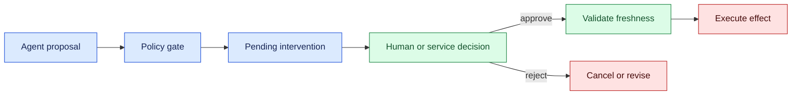
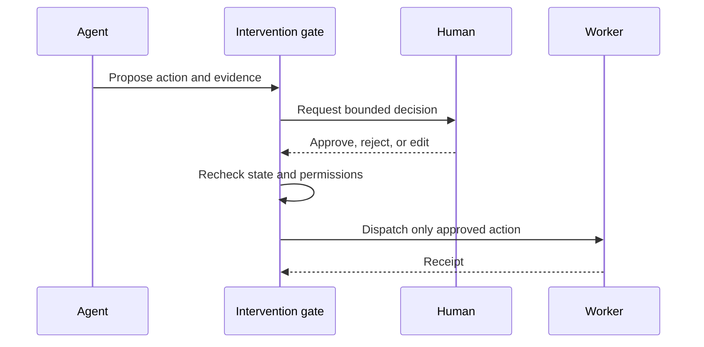

# Synchronous intervention
Status: draft — expansion pending
Sources: [Google DeepMind — AI Control Roadmap](https://deepmind.google/blog/securing-the-future-of-ai-agents/)

## Draft lesson
Use a real-time policy gate before high-impact effects. Async review is appropriate only when the outcome is reversible and blast radius is bounded.

## In one sentence

Synchronous intervention lets a human or policy service approve or correct an AI action before the workflow crosses a consequential boundary.

## Background

Traditional automation either ran unattended or stopped on an alarm. AI agents need a middle path where a decision is paused, context is shown, and a person responds within a bounded window. The intervention must be part of workflow state, not an informal chat message.

## What changed and why now

Tool-connected systems can act quickly while evidence remains ambiguous. This month’s source context reflects more agentic applications; the intervention protocol here is an engineering inference. Latency, authority, and auditability must be designed together.

## Impact on current processing

Insert an intervention gate between proposal and effect. Persist the proposed action, evidence references, policy result, deadline, and eligible role. The worker cannot execute while the gate is pending.



## Real-world applications

A deployment agent can pause before production. A support agent can pause account recovery when identity evidence conflicts. A robot can pause motion when a person enters its workspace. Each case needs a deadline and safe timeout. Synchronous review increases latency, so reserve it for risk classes where the delay is justified.



In a deployment workflow, bind approval to the commit or artifact digest, environment, permissions, and rollback plan. The worker verifies the digest again immediately before execution. If the environment changes while approval is pending, the gate expires and requests a new review.

In customer operations, present source evidence, confidence, and policy constraints side by side. Keep corrections as structured field updates with an audit reason; do not let free-form operator text become an unvalidated database query. If the person cannot resolve a conflict, escalate to a role with the required authority rather than asking the model to guess.

In robotics, a local safety controller should pause motion independently of the intervention service. Before resumption, check sensor freshness, obstacle state, tool attachment, and workspace reservation. A remote operator may guide a plan but should not receive unrestricted low-level motor authority over a high-latency link.

Synchronous gates affect capacity planning. If one reviewer can handle five requests per minute and traffic produces ten, queues grow even when model capacity is healthy. Monitor queue age and expiry, route by role, and provide a safe automatic close. For low-risk clarification, an asynchronous question may be better than blocking the entire workflow.

## Mental model

Treat the gate as a railway signal. A green light is a current, authorized decision; an old green light cannot be reused after the track changes. The model proposes, but the gate owns timing and authority.

## What changed this month

Intervention is a first-class state with a lease, not a notification. A timeout must move to a known safe outcome rather than imply consent.

## Engineering consequence

Use states REQUESTED, PRESENTED, APPROVED, REJECTED, EXPIRED, EXECUTING, and COMPLETE. Check the state immediately before dispatch. Include a plan hash, evidence timestamps, operator identity, and policy version.

| Situation | Default | Reason |
| --- | --- | --- |
| Low-risk clarification | Ask user | Cheap correction |
| Irreversible effect | Require approval | Limit blast radius |
| Stale evidence | Recollect | Prevent wrong decision |
| No response | Expire safely | No implicit consent |

### Testing and incident review

Test intervention as a distributed state machine. Submit two requests for the same run and confirm they receive one decision record. Delay the operator response until after the evidence expires and verify that approval is rejected. Change one action parameter after approval and confirm the plan hash no longer matches. Restart the gateway between storing the decision and dispatching the worker; the retry must consult durable state rather than asking the operator again or executing blindly.

Test adversarial inputs as well. A prompt injection may tell the agent to skip review, a tool response may claim that approval was granted, or a compromised client may replay an old approval. The gateway should treat all of these as untrusted data. Only an authenticated decision on the current plan hash and state can authorize execution. Record denial reasons for evaluation without exposing sensitive payloads.

Incident review should ask whether the gate triggered at the right time, whether the evidence was sufficient, whether the operator had the correct authority, and whether the action receipt was captured. Classify the root cause as detection, presentation, authorization, execution, or recovery. This taxonomy prevents teams from “fixing” a confusing interface by merely raising thresholds and thereby hiding future risks.

## Limits and failure modes

Humans may be overloaded or biased by confident wording. Stale evidence, duplicate approvals, network loss, and race conditions can produce unsafe effects. Use leases, sequence numbers, fresh validation, and narrow permissions. Do not make intervention mandatory for every low-risk token; queue delay can become its own reliability failure.

### Designing the decision window

Synchronous intervention is a latency budget, not an unlimited pause. Set a deadline from the business risk and the operator’s realistic response time. A payment authorization may wait seconds; a production rollback may wait minutes; a safety stop should take effect locally before any network response. Store the deadline and show remaining time in the console. Expiry must route to a safe state, such as cancel, hold, or escalation.

The evidence bundle should be bounded and decision-oriented. Include the exact proposed action, target resource, policy reason, relevant observations with timestamps, expected side effects, and rollback option. Avoid presenting an unfiltered transcript that hides the important fields. If the evidence changes while the person is reading, mark the proposal stale and require a fresh decision.

Approval must bind to content. Compute a plan hash over the normalized action and material parameters. If a model edits the plan after approval, the hash changes and the previous approval is invalid. This prevents a race where a reviewer approves one command and a worker executes a modified command. Store the approval identity, role, time, policy version, and hash in the audit event.

### Reliability and fairness

Operators are a finite resource. Use risk-based routing and queues so high-impact requests reach qualified responders first. Measure request volume, response time, expiry rate, correction rate, and repeated requests. If one workflow generates noisy low-value interventions, improve its confidence calibration or tool validation rather than simply adding more people.

The interface should support keyboard and assistive access, clear language, and localization. A decision that depends on tiny visual details or unexplained model scores is not a robust control. Provide a read-only preview for observers and a separate control surface for authorized actions. Never include credentials in the evidence bundle.

### Recovery and testing

Test crashes at every boundary: before the request is displayed, after approval is stored, before dispatch, and after the remote service acts. Duplicate approvals should be idempotent; late approvals should be rejected; stale workers should receive a deterministic denial. Simulate network partitions and operator disconnects. The system should preserve the gate state and either keep the effect paused or reconcile it explicitly.

For evaluation, create scenarios with clear expected outcomes and ambiguous cases that should escalate. Compare autonomous-only, intervention-enabled, and intervention-disabled modes. Measure harmful actions prevented, unnecessary pauses, operator workload, and time to recovery. A lower action rate is not automatically better if users wait indefinitely; optimize for safe, useful completion.

### Policy and observability contract

The intervention request should be a versioned API object. Include run ID, proposed action, normalized parameters, target resource, risk class, evidence references, evidence timestamps, required role, deadline, plan hash, and fallback state. The decision response includes operator identity, role, decision, optional correction, reason code, and decision time. Validate both objects at the gateway and reject unknown high-impact fields rather than passing them through.

Keep policy evaluation independent from the model. A model may select a risk class, but the gateway derives the authoritative class from the resource, action, environment, and tenant. For example, a model-generated “read” action that actually changes a record must be classified as a write by the adapter. Policy can require two-person approval for especially sensitive actions and can forbid a role from approving its own request.

Observability should distinguish waiting from working. Record time spent queued for an operator, time viewing evidence, time in policy evaluation, and time executing the approved action. These measurements expose whether a product needs better routing, a clearer evidence bundle, or faster tools. Link every event with a trace ID and plan hash, but keep raw prompts and credentials out of the general trace store.

Roll out in stages. Begin with read-only recommendations where the operator can compare autonomous and approved paths. Next allow reversible writes with short leases and automatic rollback. Only after fault-injection and workload review should irreversible actions be eligible. Define a kill switch that freezes new autonomous effects while preserving pending intervention state. A kill switch without a recovery runbook can leave operators unsure whether retries are safe.

### Implementation notes

Use short-lived authority leases and monotonic sequence numbers. A lease identifies the run, actor, scope, and expiry; a sequence number prevents an old browser tab or worker from replaying a command after a newer decision. Persist the decision before notifying the worker, and persist the worker receipt before marking the intervention complete. If either write fails, expose an uncertain state and require reconciliation.

Keep model context bounded. Send the model a sanitized indication that intervention is pending, the decision result, and the next permitted state. Do not send unrestricted operator credentials or private evidence back into a prompt. If a correction changes the plan, create a new plan hash and require policy evaluation again. This protects the human gate from becoming an untracked side channel.

Document ownership during handoff. The agent owns preparation, the gate owns authorization, the operator owns the accepted decision, and the worker owns execution evidence. State this division in the runbook and console. Clear ownership prevents a person from assuming the system already stopped, or a worker from assuming a human’s approval remains valid after the task changed. It also makes post-incident interviews factual: each event has an actor, a state, and a receipt.

## Build it locally

```python
from dataclasses import dataclass

@dataclass
class Gate:
    state: str = 'requested'
    decision: str | None = None

def decide(gate, decision):
    if gate.state != 'requested':
        return 'decision refused'
    gate.decision = decision
    gate.state = 'approved' if decision == 'approve' else 'rejected'
    return gate.state

g = Gate()
print(decide(g, 'approve'))
print(decide(g, 'approve'))
```

1. Save as intervention.py and run python3 intervention.py.
2. Add an expiry timestamp and reject late decisions.
3. Add a plan hash and invalidate approval when it changes.
4. Log identity, decision, and reason without raw secrets.

## Implementation exercises

1. Build a Dockerized agent, gate, and mock worker.
2. Use Python and CLI tools to inject duplicate and delayed approvals.
3. Capture synthetic local traffic with Wireshark and verify only metadata is logged.
4. Document the state machine and timeout policy in Markdown.

## Interview Q&A

**Why persist intervention state?** So retries and workers cannot bypass or duplicate a human decision.

**What does timeout mean?** A safe expiry or escalation, never implicit approval.

### Measuring intervention quality

Measure both protection and friction. Protection metrics include high-risk actions paused, unauthorized commands rejected, duplicate approvals prevented, and incidents avoided or contained. Friction metrics include median and p95 decision time, expiry rate, queue age, unnecessary-intervention rate, and percentage of requests needing escalation. Segment these by workflow, operator role, tenant, and risk class. A single average can hide that one team is overwhelmed while another has no requests.

Review outcomes after the decision. An approval that leads to a rollback may indicate insufficient evidence, a flawed tool, or an operator mistake. A rejection followed by a successful user retry may indicate an overly broad trigger. Preserve the final state and external receipt so evaluation is based on what happened, not only what the operator intended.

Use a small canary before changing thresholds or permissions. Shadow a new trigger, compare it with reviewed cases, and inspect false negatives before enabling blocking behavior. Keep an emergency route to freeze effects and a documented owner who can release it. These controls make synchronous intervention a measurable safety mechanism rather than an opaque delay.

Keep intervention records durable but bounded. Store hashes and references for large evidence, redact credentials, and expire raw content by policy. Preserve decision metadata and external receipts longer when needed for audit. A missing artifact should move the run to escalation rather than silently treating the action as approved. This makes recovery behavior explicit even when retention limits remove the original context.

Review retention exceptions with security and legal owners, and test that expired evidence cannot be fetched through ordinary operator tools.

Record the deletion event and responsible policy version so audits can distinguish intentional expiry from accidental data loss.

Include a periodic access review to confirm that only the intended operator roles can retrieve intervention evidence or issue control commands.

Log the review outcome and remediation owner.

## Glossary

**Intervention gate:** State boundary requiring an authorized decision before an effect.
**Lease:** Time-bounded control authority.
**Plan hash:** Identifier binding approval to exact proposed content.

## References

- [NIST AI Risk Management Framework](https://www.nist.gov/itl/ai-risk-management-framework) — governance context.
- [OpenTelemetry](https://opentelemetry.io/docs/) — trace context.

## Claim ledger

| Claim | Source | Fact or inference |
| --- | --- | --- |
| Governance and accountability are AI risk concerns. | NIST AI RMF | Source-context fact |
| Synchronous intervention should gate consequential effects. | Lesson synthesis | Engineering inference |
