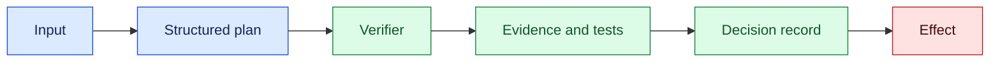
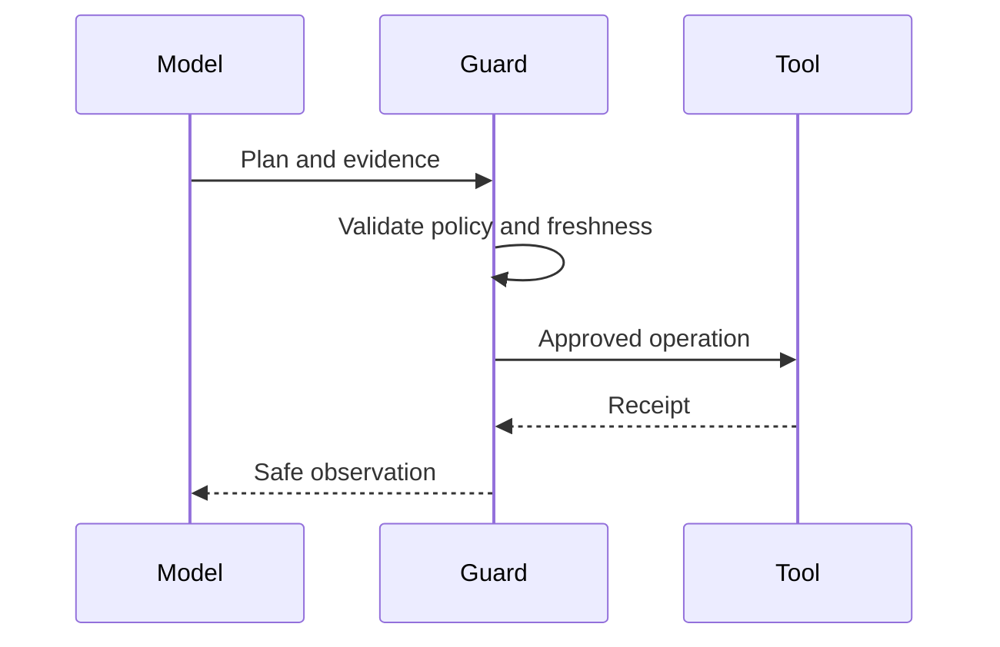

# Chain-of-thought limits

## In one sentence

Reasoning transparency should expose verifiable evidence and decision boundaries without treating hidden chain-of-thought text as a guaranteed explanation or safe audit log.

## Background

Early model interfaces returned answers with little evidence. Asking for step-by-step prose sometimes helped users inspect work, but fluent rationales can be post-hoc and unfaithful. Engineering systems need structured plans, citations, tests, policy results, and receipts instead.

## What changed and why now

Tool-using agents need inspectable decisions before external effects. The month’s source context reflects stronger reasoning systems; this lesson’s controls are engineering inferences. Capability, reliability, and privacy remain separate claims.

## Impact on current processing

Represent plans as typed actions with evidence references, policy decisions, confidence bands, and validation results. Store concise summaries with provenance and redact secrets. A verifier checks claims independently before a tool runs.



## Real-world applications

Coding agents can show diffs and test receipts. Retrieval systems can show source passages and citation checks. Support agents can show policy predicates and missing evidence. None should expose credentials or claim that a rationale proves correctness.



## Mental model

Treat a rationale as a hypothesis; evidence and tests are measurements. A fluent explanation can be wrong, while a signed artifact or independent check is stronger.

## What changed this month

Use concise provenance-linked decision records instead of unrestricted reasoning logs as the audit artifact.

## Engineering consequence

Version schemas, prompts, tools, and policies. Require independent checks for high-impact actions and bind approvals to a plan hash. Log actor, evidence IDs, result, and receipt without raw secrets.

## Limits and failure modes

### Evidence design

An explanation is useful when it helps a reader verify a decision. For a retrieval answer, that may be quoted source spans, document IDs, and a freshness timestamp. For code, it may be a diff, test command, and artifact digest. For a database action, it may be the policy predicate, affected row count, and remote receipt. These artifacts are more reliable than asking a model to narrate every hidden intermediate thought.

### Processing architecture

Place a verifier between model proposal and external effect. The model emits a typed action and references to evidence. The verifier checks schema, permissions, freshness, and task-specific invariants. A policy gateway decides whether approval is needed. Only then does a worker call the tool and return a receipt. The decision record stores these transitions so an operator can reconstruct what happened without exposing private internal reasoning.

For long-running workflows, persist observations as events and construct a bounded context for each model call. Include the last committed state, relevant evidence, unresolved questions, and allowed actions. Exclude unrelated transcript turns and raw credentials. This reduces token cost and prevents a persuasive but irrelevant explanation from dominating the next decision.

Use tables or structured fields for comparisons that humans must inspect quickly. A code-review record might list changed file, test result, policy check, and remaining risk. A support record might list claim, source, freshness, and reviewer decision. Structured presentation makes omissions visible and supports automated checks; prose remains useful for a concise summary.

### Failure handling

If the verifier cannot establish a claim, return `blocked` or `needs_review`, not a weaker explanation that sounds complete. If evidence is stale, request a fresh observation. If a tool result is ambiguous, reconcile it before retrying. If a model contradicts a source, show the conflict and preserve both references. These states should be observable in metrics so teams can improve the pipeline instead of counting every refusal as a model failure.

### Evaluation methodology

Build evaluation cases around decisions, not eloquent prose. Each case specifies the request, permitted actions, authoritative evidence, expected constraints, and acceptable outcomes. Score whether the system selected the right evidence, respected policy, identified uncertainty, and produced a correct external effect. Score explanation usefulness separately: did a reviewer find the summary sufficient to verify the result? This separation prevents a persuasive narrative from hiding a wrong action.

Include counterfactual and adversarial cases. Remove a required document and expect a block. Replace a source with a stale revision and expect revalidation. Add an irrelevant but confident passage and expect it to be ignored. Ask the model to justify a prohibited action and expect the gateway to reject it regardless of wording. These tests exercise the boundary between capability and authority.

### System-design examples

In a retrieval system, store source IDs, spans, index version, and retrieval scores. The generator may summarize those sources, but a citation checker verifies that claims map to retrieved text. If no source supports a claim, the output is marked uncertain or the system asks for clarification. Keep the full document in the protected store and expose only authorized spans to reviewers.

In a coding system, store the patch digest, test commands, test artifacts, and policy checks. A model summary can explain likely behavior, but merge authority comes from branch protection and review policy. If a test result is from a different revision, invalidate it. This creates a clear causal chain from proposal to effect.

In a support workflow, record the evidence fields used for an eligibility decision and the policy rule version. A reviewer can correct a field, which creates a new decision record and reruns validation. Do not overwrite the original model output; preserving revisions lets the team measure which errors are corrected and whether a prompt or tool change helps.

### Operational rollout

Begin with shadow verification: generate evidence checks without blocking and compare them with human review. Tune false-positive and false-negative behavior before enforcement. Add a small canary route, publish rejection reasons, and retain a target-only fallback. Monitor verifier latency, blocked actions, appeal outcomes, unsupported claims, and evidence freshness. A verifier that blocks every uncertain case can make a service unusable; one that never blocks is not a control.

### Compact decision record

| Field | Example | Purpose |
| --- | --- | --- |
| Plan hash | `sha256:...` | Binds evidence and approval to exact action |
| Evidence IDs | `doc-7`, `test-19` | Reproducible references |
| Policy version | `policy-4` | Explains authorization |
| Verifier result | `pass` or `blocked` | Independent check |
| Receipt | `ticket-1842` | External effect evidence |

This record is sufficient for most audits while avoiding unrestricted hidden reasoning. It also gives engineers a stable interface for replay tests and incident investigation.

### Security and governance

Treat explanations as potentially sensitive output. A model may quote private input, reveal a system instruction, or reproduce a credential accidentally included in context. Apply the same redaction and access policy used for tool results. Keep a customer-facing explanation separate from an internal audit record, and make clear which evidence is authoritative. Do not promise that the model can reveal its hidden computation faithfully; explain the observable checks instead.

Governance also requires change control. When a prompt, model, verifier, or policy changes, capture a version and run a fixed evaluation suite. Compare blocked actions, unsupported claims, evidence selection, and reviewer workload. If performance regresses, roll back the component that changed rather than adding more explanatory prose. Maintain a changelog linking each deployment to its evaluation result and owner.

### Implementation checklist

Before production, verify that every consequential action has a structured plan, independent verifier, evidence freshness check, policy decision, and receipt. Test missing evidence, conflicting sources, stale plans, prompt injection, duplicate approvals, and provider outages. Confirm that ordinary operators cannot retrieve restricted reasoning records or bypass the gateway. Define a safe fallback when verification is unavailable: pause, ask for review, or provide a limited read-only response.

The result is a transparent system without pretending that private model reasoning is a perfect transcript. Users receive enough information to understand and challenge an outcome; engineers receive enough structured evidence to test and operate the pipeline. That is the practical limit of explainability for tool-connected AI.

Bind evidence to the exact request and model version. A citation copied from a previous run is stale if the index changed. A test result from another revision does not prove the current patch is safe. Use content hashes and trace IDs, and reject a decision when required evidence is missing or mismatched. This creates a useful failure state instead of a confident but unsupported answer.

Faithfulness should be evaluated separately from usefulness. Reviewers can rate whether a summary helped them decide, while targeted tests compare the stated reason with the actual features, documents, or tool results used. A polished explanation that cites irrelevant evidence is a quality failure even if users find it persuasive. Keep evaluation sets with known causal structure and include adversarial prompts that try to induce fabricated justifications.

### Privacy and access

Reasoning records may contain sensitive inputs, retrieved documents, or operator instructions. Classify fields and expose only the minimum needed for the audience. A customer may see citations and a result; an internal auditor may see policy versions and receipts; a security investigator may access restricted evidence. Never use a transparency request as a reason to reveal credentials, private chain-of-thought text, or another tenant’s data.

### Release and incident practice

When changing prompts, tools, or models, compare decision records before and after the change. Track unsupported claims, missing citations, verifier rejections, and tool corrections. Roll out a new verifier in shadow mode, then require it for a small traffic slice. During an incident, preserve the structured record and independent evidence, not an unbounded transcript. Link the fix to a regression test so a future model update cannot silently reintroduce the same failure.

Rationales may be post-hoc, incomplete, or manipulated. Explanations can leak private data. Use access controls, sampling, redaction, and human review.

### Testing, retention, and operator use

Use replayable fixtures for every important decision. Store the normalized request, evidence IDs, policy version, model version, verifier output, and final receipt. A test should assert that changing an irrelevant sentence does not change the authorized action, while changing a plan parameter invalidates the prior approval. Re-run fixtures after model or prompt updates and review changes with both engineers and domain owners.

Retention should follow purpose. Keep hashes, versions, decisions, and receipts long enough to support audit and reconciliation. Expire raw prompts, screenshots, and retrieved documents according to tenant and regulatory policy. If an operator needs to investigate after expiry, provide a redacted summary and a deletion event rather than silently restoring private content.

Operator interfaces should make uncertainty actionable. Show missing evidence, conflicting sources, freshness, and the next permitted action. Let a reviewer request more evidence or escalate, but do not let a free-form explanation bypass policy. Record corrections as new versions so teams can learn which evidence and tools produce reliable decisions.

Measure explanation quality with task outcomes. Ask reviewers to locate supporting evidence, identify uncertainty, and predict whether an action is safe. Compare their accuracy and time with and without the structured record. If prose increases confidence but decreases error detection, simplify it. A good explanation helps a person challenge a result; it does not merely make the result sound reasonable.

For automated consumers, expose stable fields rather than parsing prose. A downstream service can read `evidence_ids`, `policy_status`, `verifier_status`, and `receipt` deterministically. Schema validation catches missing fields before publication. This design also supports localization and accessibility because the human summary can change language without changing the underlying decision record.

Keep a fallback for verifier outages. The system may return a read-only answer, queue the request, or require an authorized reviewer. It should not silently downgrade to an unverified action. Document the fallback in the runbook and include it in load and failure tests.

Finally, distinguish explanation from disclosure. The goal is to provide enough observable evidence for a user or operator to verify the result, while protecting private inputs and internal safeguards. Structured records, independent checks, and clear uncertainty achieve that balance better than exposing every intermediate token. Teams should revisit the balance as risks, regulations, and user needs change.

During incident response, preserve the decision record before changing prompts or rerunning the model. Capture the original evidence references, verifier result, policy version, and external receipt. Then reproduce the case in an isolated environment with synthetic replacements for private data. This preserves causal information and prevents a debugging session from overwriting the very evidence needed to understand the failure.

Record the remediation owner and follow-up test as part of closure.

Review that test during the next model deployment.

Track whether the mitigation improves both user outcomes and reviewer confidence.

Include this comparison in the release review.

### Designing observable substitutes

When a team removes hidden reasoning text from logs, it still needs enough evidence to debug behavior. Define an external decision record for each tool attempt: normalized request, selected policy rule, retrieved evidence identifiers, verifier result, tool arguments after validation, receipt, and final state. The record can say that a constraint failed without retaining private intermediate text. For a multi-step task, connect records with a run ID and step number, then make the state transition explicit: proposed, checked, dispatched, acknowledged, reconciled, or failed. This gives an investigator a causal trail that is more stable than a prose explanation produced after the fact.

Evaluate explanations as explanations. Ask whether the stated reason is consistent with the recorded inputs and whether an independent replay reaches the same policy outcome. A plausible rationale that cites evidence never used by the system is a faithfulness failure. Conversely, a terse “blocked by rule R17” can be operationally excellent if the rule, input fields, and remediation path are inspectable. Keep user-facing explanations separate from privileged diagnostic records, and apply access controls to both.

### Prompt and transcript retention

Retention should be decided by incident value and sensitivity. Store a short-lived redacted transcript only when it supports a defined debugging purpose; store durable hashes and structured events for correlation. Never treat model-generated chain-of-thought as the canonical account of why an external effect occurred. If a provider changes its internal reasoning behavior, the receipt and policy record should remain comparable. This separation also reduces the temptation to expose private prompts or hidden safeguards merely to make an audit look complete.

## Build it locally

```python
def decision(plan, evidence, passed):
    return {"plan": plan, "evidence": evidence, "status": "approved" if passed else "blocked"}

print(decision("run tests", ["ci:123"], True))
```

1. Save as reasoning.py and run python3 reasoning.py.
2. Add provenance hashes and block missing evidence.
3. Redact secrets before storing records.

## Implementation exercises

1. Build Dockerized model, verifier, and mock tool services.
2. Use Python and CLI tools to compare rationale text with receipts.
3. Capture synthetic traffic with Wireshark and verify secrets are absent.
4. Document evidence and access policy in Markdown.

## Interview Q&A

**Does a rationale prove correctness?** No; verify claims and effects independently.

**What should be logged?** Structured plans, provenance, policy results, and receipts.

## Glossary

**Faithfulness:** Whether an explanation reflects the actual cause of a result.

**Provenance:** Origin and history of evidence.

**Verifier:** Independent check before accepting a decision.

## References

- [NIST AI Risk Management Framework](https://www.nist.gov/itl/ai-risk-management-framework) — transparency context.
- [OWASP LLM guidance](https://owasp.org/www-project-top-10-for-large-language-model-applications/) — application risk context.

## Claim ledger

| Claim | Source | Fact or inference |
| --- | --- | --- |
| Transparency and accountability require governance controls. | NIST AI RMF | Source-context fact |
| Structured evidence is safer than unrestricted reasoning logs. | Lesson synthesis | Engineering inference |
Status: draft — expansion pending
Sources: [Google DeepMind — AI Control Roadmap](https://deepmind.google/blog/securing-the-future-of-ai-agents/)

## Draft lesson
Visible reasoning is a signal, not a complete audit source. Validate behavior with tool traces, policy decisions, state transitions, and final effects.
