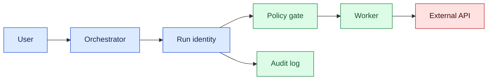
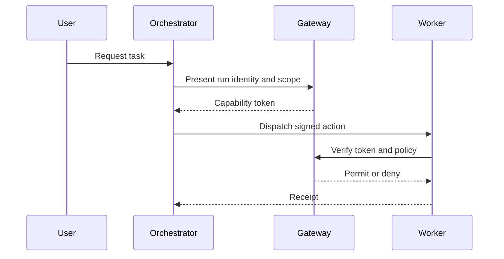

# Agent identity

## In one sentence

Agent identity gives each model-driven run a verifiable principal, scoped permissions, and audit trail separate from the end user.

## Background

Traditional services authenticate users and authorize service accounts. AI agents complicate this boundary because a model proposes actions while workers execute them. Treating a prompt as identity makes delegation ambiguous and encourages privilege escalation.

## What changed and why now

Tool-connected agents need workload identity, short-lived credentials, and explicit delegation. The month’s source context reflects more autonomous software; the protocol here is an engineering inference.

## Impact on current processing

Issue each run an identity containing tenant, agent version, owner, scope, expiry, and trace ID. Workers exchange it for capability-scoped tokens. Gateways verify identity before every external effect.



## Real-world applications

A coding agent may read a repository but receive merge authority only for one branch. A support agent may view a case but not change authentication factors. A robot fleet service may schedule work without direct motor control. Each delegation is scoped, expires, and is logged.



## Mental model

Identity is a passport plus a work order. The passport says who is traveling; the work order says which destination and action are allowed. A model’s words are neither by themselves.

## What changed this month

Use workload identity and explicit delegation instead of shared agent keys or prompt-based authority.

## Engineering consequence

Define principals, audiences, scopes, expiry, nonce, and trace IDs. Separate authentication from authorization. Rotate keys, reject replayed tokens, and bind approvals to a plan hash.

| Principal | Scope | Lifetime |
| --- | --- | --- |
| Read-only analyst | Documents | Minutes |
| Build worker | One repository branch | Job duration |
| Production operator | Named change | Approval window |

## Limits and failure modes

### Token lifecycle

Issue credentials as late as possible and for the shortest useful lifetime. A worker requests a token for one audience, resource, and operation class; the issuer records the run ID and policy version. The gateway checks signature, expiry, audience, tenant, and scope on every call. Do not place bearer tokens in prompts, model-visible tool results, screenshots, or general logs. Return an operation ID and safe status instead.

Delegation should be non-transitive by default. If an agent asks another service to act, the downstream service receives a constrained child identity whose scope cannot exceed the parent’s. Record the parent-child relationship and prohibit a child from minting new authority. This prevents a confused deputy in which a broadly trusted worker executes a model-generated request for an unrelated tenant.

Revocation is necessary for incidents and user cancellation. Keep a short-lived deny list or epoch for compromised runs, and check it before high-impact effects. Revocation does not undo an external operation; reconcile receipts and notify owners. A cancelled run should stop new work while allowing an in-flight call to settle safely.

### Identity-aware operations

Read and write actions deserve different controls. A read may require tenant and document scope; a write additionally requires resource version, plan hash, and approval. The policy decision should be deterministic and explainable from structured fields. If a model asks for a broader scope than its identity allows, deny it and expose a safe error rather than silently widening the token.

Audit events should include requester, executing principal, parent delegation, scope, audience, decision, reason, time, and external receipt. Hash large payloads and redact secrets. These events support incident reconstruction and can reveal overprivileged tools or repeated policy denials that deserve product fixes.

### Architecture and rollout

Put identity issuance behind an orchestrator or workload-identity service rather than letting every prompt handler mint credentials. The orchestrator authenticates the user, creates a run principal, and asks policy for a narrow capability. A worker presents that capability to an adapter, which maps it to a provider-specific credential and strips the credential from responses. This keeps model context and application logs free of bearer values.

Use separate identities for planning, verification, and execution. A planner may read metadata and propose a write; an executor may perform the write only after policy and approval. A verifier can inspect a proposed diff without having permission to publish it. Separation makes tests and incident containment easier because disabling one principal does not require shutting down the entire service.

Roll out identity changes with shadow decisions and synthetic traffic. Compare the new policy with current authorization, identify denied legitimate cases, and test tenant isolation. Start with read-only scopes, then reversible writes, and finally high-impact actions with explicit approval. Keep a break-glass path for operators, but require a reason, short expiry, and post-use review. A break-glass credential should not become the normal agent path.

### Applications and trade-offs

In a coding platform, the user identity requests a run; the run identity can read one repository revision; a build worker can write artifacts; and a merge worker requires a separate approval. In a support platform, a case identity can read one customer record while an update identity can change only approved fields. In a robot fleet, a scheduler identity can assign a mission while a motion controller identity can command only a named robot in a permitted zone.

Short lifetimes reduce replay risk but can interrupt long tasks. Renewals should be explicit, bound to the same run and policy, and denied after cancellation. Fine-grained scopes improve containment but increase policy complexity. Keep common templates, validate them in CI, and report effective permissions so reviewers can see what a worker really can do.

### Testing and incident response

Test confused-deputy scenarios in which a model asks a trusted worker to access another tenant, token replay after expiry, audience mismatch, scope escalation, and parent cancellation. Assert that every denied request creates a safe event and that no credential appears in logs, traces, or model output. During an incident, revoke the run or identity epoch, inspect recent receipts, and reconcile external effects. Rotate provider credentials only after identifying which active runs require a controlled restart.

Stolen tokens, confused-deputy bugs, stale permissions, and shared credentials can cause broad damage. Use least privilege, audience checks, revocation, and audit review.

### Review checklist

For each tool, document the principal it accepts, audience, resources, and maximum effect. Confirm adapters reject missing tenant or resource identifiers and that policy evaluates normalized requests. Child identities must never have broader scope than their parent. Test cancellation across queued and in-flight work.

Retain audit metadata long enough to investigate changes, but expire raw claims and personal data according to policy. Hash large bodies and store sensitive evidence separately. Operators should inspect decisions without receiving reusable bearer credentials. Track denied requests, scope-expansion attempts, expired tokens, replay detections, break-glass use, and time to revoke.

If the identity issuer is unavailable, decide whether reads can use cached short-lived capabilities and whether writes must pause. If policy or audit storage is degraded, fail closed for high-impact effects. Document these decisions in runbooks and failure tests.

### Identity-aware data flow

Identity must travel with the request through every asynchronous boundary. When work moves from an HTTP handler to a queue, include a signed run reference and trace ID rather than copying a bearer token into the message. The worker exchanges the reference for a fresh, audience-bound capability. When work is delegated to a child service, record the parent and child principals so an audit can reconstruct who requested and who executed the effect.

Normalize resource names before authorization. Path aliases, case differences, redirects, and provider-specific identifiers can otherwise let a model request one resource while the policy evaluates another. The adapter should resolve the canonical resource, check tenant ownership, and include the canonical ID in the receipt. Never authorize based solely on a natural-language description such as “the customer’s account.”

Identity checks belong immediately before side effects because state can change while a task waits. A token that was valid when a plan was created may be expired, revoked, or overbroad by execution time. Recheck scope, resource version, policy, and cancellation at dispatch. For long-running work, renew explicitly and bind renewal to the same run, owner, and policy; do not turn renewal into an opportunity to widen authority.

### Policy testing

Maintain a matrix of principals, resources, actions, environments, and expected decisions. Include positive and negative cases for tenant isolation, read versus write, staging versus production, and parent-child delegation. Add property tests such as “a child scope is never broader than its parent” and “an expired credential never authorizes an effect.” Run the matrix whenever a policy, adapter, model tool schema, or provider integration changes.

Test the model as an untrusted proposer. Feed it prompts that request secret access, cross-tenant reads, scope escalation, or reuse of an old approval. The expected behavior is a structured denial or escalation from the gateway. A persuasive explanation or high confidence must not change the decision. Log the rule ID and safe request summary so failures can be diagnosed without exposing the prompt.

### Deployment guidance

Start with one service and a read-only scope. Shadow the new identity decision beside the current authorization and compare mismatches with an owner. Add short-lived write capabilities only after replay, expiry, and cancellation tests pass. During rollout, monitor denied requests, token issuance failures, replay detections, policy latency, and break-glass use. Keep a target-only or manual fallback for issuer outages and document how to drain workers safely.

### Incident response and learning

When a credential or identity is suspected to be compromised, first stop new high-impact effects for the affected run or identity epoch. Preserve audit metadata, revoke the capability, and identify external receipts created during the exposure window. Reconciliation determines whether an operation happened; rotation alone does not undo it. Notify the resource owner and document the containment timeline without copying token values into the incident channel.

Review incidents for both technical and product causes. A broad tool scope, confusing resource name, or missing cancellation check may be a design defect even when the model behaved as prompted. Classify the cause as authentication, authorization, delegation, adapter normalization, or recovery. Link the remediation to a policy test and monitor so the same failure is less likely to recur after a model or provider update.

Identity is also a user-experience concern. Show people which agent, run, and scope are active when an action is proposed. Make approval text name the resource and expiry, and provide a way to revoke a run. Clear ownership reduces accidental approvals and helps support staff explain why a request was denied. The interface should never imply that an agent has a human’s full authority merely because it is acting on that person’s behalf.

For audits, retain the minimum durable record: requester, executing principal, parent delegation, scope, audience, policy result, timestamps, and external receipt. Link large artifacts by hash and apply retention rules to personal data. An investigator should be able to answer who asked, what was allowed, what ran, and how authority was revoked without relying on a model transcript.

Review effective permissions periodically rather than trusting configuration intent. Generate a report of each tool’s reachable resources and compare it with the product’s documented scope. Remove unused permissions, rotate signing keys, and test that revoked identities fail closed. During a provider outage, prefer a visible pause or read-only fallback over cached broad credentials. These controls turn identity from a login detail into an operational safety boundary.

Identity changes should be staged with shadow authorization decisions. Compare the new decision with the existing one on representative requests, investigate mismatches, and record the policy version. Begin with read-only routes, then reversible writes, and finally high-impact actions requiring approval. Keep a manual fallback and a runbook for draining workers when the issuer or policy service is unavailable.

Publish the effective-permission report and remediation owner with every release review.

Recheck the report after incident remediation and key rotation.

Include recovery drills in quarterly operations practice: revoke a run, rotate a signing key, replay a queued message, and reconcile an external receipt. Record elapsed time, failed assumptions, and the owner for each remediation. Repeated drills turn identity controls into practiced operations rather than documentation that is only consulted after a breach.

## Build it locally

```python
from dataclasses import dataclass
import time

@dataclass
class Identity:
    run_id: str
    scope: str
    expires: float

def allowed(identity, action):
    return time.time() < identity.expires and action == identity.scope

i = Identity('run-1', 'read', time.time() + 60)
print(allowed(i, 'read'))
print(allowed(i, 'write'))
```

1. Save as identity.py and run python3 identity.py.
2. Add an audience and reject mismatches.
3. Add a nonce store to prevent replay.
4. Log decisions without token values.

## Implementation exercises

1. Build Dockerized orchestrator, gateway, worker, and mock API.
2. Use Python and CLI tools to test expiry and replay.
3. Capture synthetic traffic with Wireshark and verify secrets are absent.
4. Document delegation and revocation in Markdown.

## Interview Q&A

**Why separate user and agent identity?** Delegation and audit require knowing both requester and executor.

**What is least privilege?** Granting only the actions and resources required for a bounded task.

## Glossary

**Audience:** Service a credential is intended to call.
**Delegation:** Granting an agent limited authority from a user or service.
**Principal:** Authenticated actor represented in policy.
**Workload identity:** Identity assigned to a running service or job.

## References

- [NIST AI Risk Management Framework](https://www.nist.gov/itl/ai-risk-management-framework) — governance context.
- [OpenTelemetry](https://opentelemetry.io/docs/) — trace context.

## Claim ledger

| Claim | Source | Fact or inference |
| --- | --- | --- |
| Governance and accountability matter for AI systems. | NIST AI RMF | Source-context fact |
| Agent runs should use scoped workload identities. | Lesson synthesis | Engineering inference |
Status: draft — expansion pending
Sources: [Google DeepMind — AI Control Roadmap](https://deepmind.google/blog/securing-the-future-of-ai-agents/)

## Draft lesson
Use workload identity, scoped short-lived capabilities, audience binding, expiry, and revocation. Prompts and shared static keys are not identity systems.
