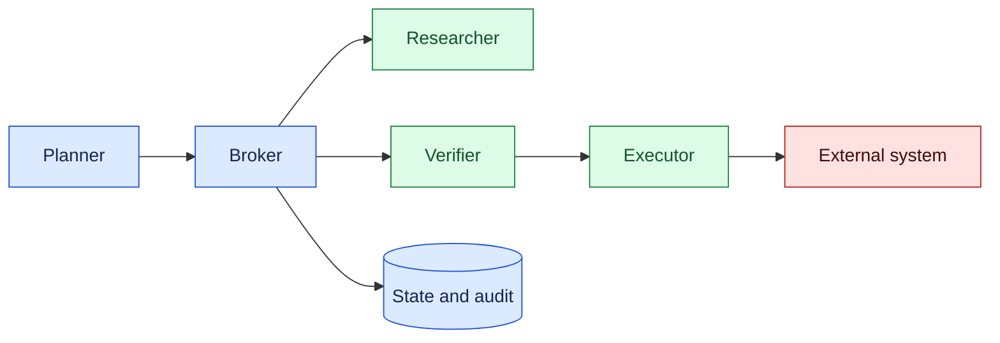
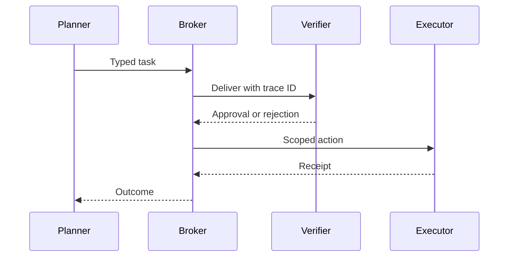

# Multi-agent protocols

## In one sentence

Multi-agent protocols define how specialized agents exchange typed messages, delegate bounded authority, and recover from disagreement or failure.

## Background

A single agent can keep context locally, but complex work benefits from planner, researcher, verifier, and executor roles. Without a protocol, agents pass free-form text, duplicate work, and assume authority they do not have. Typed messages and explicit ownership make collaboration testable.

## What changed and why now

Tool-connected systems increasingly compose multiple model workers. The protocol design here is an engineering inference from that trend. Capability, reliability, and safety remain separate claims.

## Impact on current processing

Give each agent a principal, role, protocol version, trace ID, and allowed message types. Persist state and receipts. Validate schemas before routing and require policy approval for side effects.



## Real-world applications

Coding systems can separate planning, test analysis, and merge authority. Research systems can assign retrieval and fact checking. Support systems can route a case to a specialist while keeping tenant data scoped. Broker queues need retries, deadlines, ordering, and duplicate detection.



## Mental model

Treat agents as distributed services. Messages are APIs, roles are permissions, and receipts are evidence. A confident message is not proof that another agent completed work.

## What changed this month

Use typed, versioned messages and explicit delegation instead of informal agent-to-agent chat.

## Engineering consequence

Define schemas, correlation IDs, idempotency keys, timeouts, and dead-letter handling. Keep effects in a narrow executor and verify parent scope.

## Limits and failure modes

Agents can loop, collude, send malformed messages, or leak data across tenants. Enforce budgets, validation, quotas, and human escalation.

### Message and delegation design

A message should carry a stable ID, trace ID, sender and recipient principals, protocol version, deadline, required scope, payload schema, and parent task. The broker may deliver it more than once, so consumers persist the message ID and make handlers idempotent. A reply references the original ID and states whether it is a result, refusal, request for clarification, or retryable failure.

Delegation is a policy decision, not a convenience field. A planner can delegate research to a reader, but the child agent cannot gain write or cross-tenant scope from the parent’s prose. Derive child capabilities from a policy intersection and record the parent-child relationship. If a child requests broader access, route it to an approval state or deny it with a safe reason.

Ordering should be explicit. Some tasks require a verifier result before execution; others allow independent research in parallel. Use causal IDs or sequence numbers for dependent messages and tolerate reordering for independent work. Deadlines prevent a late result from changing a task that has already been cancelled or superseded. A dead-letter queue preserves malformed or repeatedly failing messages for operator review.

### Reliability and evaluation

Measure useful completion rather than message count. Track duplicate deliveries, rejected schemas, retries, dead letters, time waiting for dependencies, and tasks completed with a valid receipt. Evaluate whether the verifier catches unsupported claims and whether the executor obeys the approved plan. A collection of agents can produce fluent agreement while sharing the same incorrect assumption, so include independent evidence checks and adversarial cases.

Test partial failure: stop a worker after receiving a message, delay a dependency, revoke a child capability, and partition the broker. The expected result is bounded retry, visible waiting, or escalation. No agent should infer success from a missing reply. Persist state before acknowledging a side effect and include an idempotency key for every non-read operation.

### Security and privacy

Keep tenant, resource, and data-classification fields in the protocol envelope. Gateways can reject a message before exposing its payload to an agent. Encrypt transport, redact secrets from traces, and limit which agents can request raw evidence. A research agent may return a source ID and masked excerpt while a privileged reviewer retrieves the full document.

### Orchestration patterns

Use a coordinator when a task has clear stages and a shared deadline. The coordinator assigns work, validates replies, and decides whether to continue, retry, or escalate. Use a peer pattern only when agents can operate independently and a deterministic reducer can combine their results. Avoid unconstrained agent-to-agent conversation; it is difficult to bound cost, authority, and termination.

For parallel work, define a join contract. Each child returns status, evidence references, confidence, and resource usage. The joiner waits for a minimum quorum or deadline, records missing children, and applies a deterministic aggregation rule. A model may summarize the results, but it should not silently discard a failed or late child. Partial completion must be visible to the user.

For iterative critique, limit rounds and require a changed artifact or explicit disagreement. A critic that merely repeats the same text consumes tokens without improving quality. Store each proposal and critique with version IDs, then let a verifier compare the final artifact against requirements. If agents disagree on facts, route the conflict to evidence retrieval or human review rather than voting on unsupported claims.

### Operations and cost

Propagate run, message, parent, and child IDs through queues and tool calls. Metrics should show queue delay, model tokens, retries, dead letters, dependency waits, and completed effects by agent role. Set per-run budgets and stop conditions. A runaway delegation tree can multiply cost and leak data even when each individual agent appears well behaved.

Deploy protocol changes with compatibility windows. Consumers should accept the previous envelope version while producers migrate. Add contract tests for required fields, unknown-field handling, and authorization intersection. Shadow a new router, compare decisions, and roll back if rejection or latency changes unexpectedly. Keep a manual path for tasks that cannot be safely replayed.

### Example decision table

| Condition | Coordinator action | User-visible state |
| --- | --- | --- |
| Child succeeds with evidence | Join and verify | Progressing |
| Child times out | Retry once or continue with gap | Partially complete |
| Scope request exceeds parent | Deny and escalate | Needs authorization |
| Conflicting evidence | Request independent check | Needs review |
| Budget exhausted | Stop new work | Escalated |

This table makes failure behavior explicit and gives operators a common vocabulary. It also provides test cases for each branch before model behavior is introduced.

### Evidence and correctness

Require each research or analysis agent to return evidence IDs, source timestamps, and a short claim list. A verifier can check that claims are supported and that sources are within the task’s tenant and retention policy. Do not treat agreement among agents as independent confirmation when they share the same model or retrieval index. Independence comes from different evidence paths, not merely different names.

When an executor performs a side effect, it should receive a normalized command, policy decision, and idempotency key. The receipt returns the external resource ID, status, and resulting version. The coordinator records the receipt before acknowledging completion. If a response is lost, the workflow enters reconciliation instead of dispatching a second command. This mirrors reliable single-agent workflows while making the message boundaries explicit.

### Human escalation

Multi-agent systems need a clear escalation owner. Route unresolved conflicts, scope requests, and budget exhaustion to a person with the appropriate role. Present the competing evidence, message history, and requested decision without dumping every internal transcript. The human decision becomes a signed message bound to the current plan hash and expires if the task changes.

### Local development workflow

Start with deterministic mock agents and a local broker. Define the envelope and state machine before selecting models. Add contract tests, duplicate delivery tests, and authorization tests. Use Docker for repeatable services, Python for protocol clients, command-line tools for inspecting hashes and queues, and Wireshark only on synthetic local traffic. Document flows in Markdown and Mermaid so reviewers can reason about ownership and failure paths.

Run a small load experiment with independent and dependent tasks. Measure queue delay, model tokens, retries, message size, and completion quality. Increase concurrency until a budget or deadline is reached, then inspect whether the coordinator or a downstream tool is the bottleneck. This makes scaling decisions evidence-based and exposes the cost of verbose inter-agent messages.

### Change management

A protocol is a public interface within the system. Version envelopes and keep consumers backward compatible during migration. Reject unknown high-risk fields, but tolerate additive metadata. Record protocol version in traces and receipts. When changing a role’s scope, review existing queued messages and cancel those that no longer satisfy policy. Never assume that an old message is harmless merely because it was created before the policy change.

### Reliability checklist

A broker message is acknowledged only after the consumer durably records its decision or receipt. If a process crashes earlier, redelivery is expected and an idempotency key prevents duplicate effects. Bound delegation depth, child count, deadline, and token budget. Propagate cancellation from parents and stop new child work after expiry. Expose the delegation tree and budget to operators so a runaway run can be stopped.

Security review should consider tampering, confused deputies, replay, and data exfiltration. Authenticate envelopes, check audience and tenant on every hop, and encrypt transport. Never let an agent request raw credentials or unrestricted scope from another agent. Keep sensitive payloads protected and pass references with access checks.

### Evaluation scenarios

Test stale evidence, verifier disagreement, executor timeout after a remote write, duplicate broker delivery, and dependency outage. Score ownership preservation, duplicate-effect avoidance, partial-completion visibility, safe terminal state, useful latency, and cost. Review traces with domain experts: they should identify each proposal, evidence source, policy decision, and external receipt without reading an unbounded transcript.

## Build it locally

```python
def accept(msg):
    return {'trace_id', 'kind', 'payload'} <= msg.keys() and msg['kind'] in {'task', 'receipt'}

print(accept({'trace_id': 't1', 'kind': 'task', 'payload': {}}))
```

1. Save as protocol.py and run python3 protocol.py.
2. Add schema versions and reject unknown versions.
3. Add an idempotency key and duplicate store.
4. Route malformed messages to a dead-letter queue.

## Implementation exercises

1. Build Dockerized agents and a broker.
2. Use Python and CLI tools to inject duplicates and delays.
3. Capture synthetic local traffic with Wireshark and verify scoped metadata.
4. Document schemas and diagrams in Markdown.

## Interview Q&A

**Why typed messages?** They make routing, validation, and replay deterministic.

**Who owns side effects?** A scoped executor behind policy, not every planner.

### Operational review

Review protocol performance by task class and agent role. A researcher may be slow but produce valuable evidence; a verifier may be fast but reject too many valid results. Track queue age, message size, model tokens, retry count, dead letters, policy denials, and successful receipts. Use these measures to tune timeouts and budgets rather than adding agents whenever latency rises.

Cost attribution should follow the run tree. Charge parent and child model calls, storage, and tool usage to the originating task, while retaining each agent’s share for optimization. Set a maximum fan-out and require an explicit reason for spawning another specialist. If a child returns a result that is never consumed, record it as wasted work and investigate the coordinator policy.

Use deterministic reducers for safety-critical aggregation. A model can summarize independent findings, but the reducer should enforce required evidence, quorum, and conflict rules in code. Store both the individual reports and the aggregate decision. This allows a reviewer to trace a conclusion back to its sources and prevents a persuasive summary from hiding a missing or contradictory child result.

Governance should specify which roles may create agents, change protocol versions, inspect raw evidence, and approve external effects. Review these permissions periodically and remove unused paths. Keep a documented shutdown procedure that cancels children, preserves receipts, and leaves the parent in a visible terminal state. A multi-agent system is trustworthy only when its collaboration can be paused, inspected, and resumed without losing ownership.

Include a quarterly exercise that replays a failed run, rotates a signing key, and verifies that queued messages from the old identity are rejected. Record the remediation owner and add regression tests for every discovered gap.

Publish the exercise result with the protocol version and next review date.

Assign an owner for unresolved findings and track closure in the next release review.

Re-run the protocol suite after each model or policy change.

Keep protocol documentation beside the schemas and examples. A reviewer should see the allowed states, ownership rules, timeout behavior, and error semantics without searching scattered services. Treat documentation changes as interface changes: update contract tests, migration notes, and operator runbooks together. This prevents a new agent from joining the system with an incorrect assumption about authority or message meaning.

Preserve partial progress. If one child fails, store completed evidence and identify the missing branch. The user should see whether the result is complete, provisional, or blocked. A coordinator may continue with a documented quorum, but it must not imply that absent evidence was checked. This honesty is especially important when several agents share a model and can repeat the same mistake.

For migrations, drain old protocol versions gradually. Stop new work on the old route, let in-flight messages finish, and replay representative histories through the new consumers. If a scope or schema change makes a queued message invalid, quarantine it and notify the owner. Keep a rollback route until receipts and audit events are confirmed under the new version.

## Glossary

**Broker:** Service that routes and buffers messages.

**Delegation:** Granting bounded authority to another agent.

**Idempotency key:** Identifier preventing duplicate effects.

## References

- [NIST AI RMF](https://www.nist.gov/itl/ai-risk-management-framework) — governance context.
- [OpenTelemetry](https://opentelemetry.io/docs/) — trace context.

## Claim ledger

| Claim | Source | Fact or inference |
| --- | --- | --- |
| Governance and accountability apply to AI systems. | NIST AI RMF | Source-context fact |
| Multi-agent collaboration needs typed protocols and scoped authority. | Lesson synthesis | Engineering inference |
Status: draft — expansion pending
Sources: [Google DeepMind — multi-agent safety](https://deepmind.google/blog/investing-in-multi-agent-ai-safety-research/)

## Draft lesson
Messages need authenticated senders, replay protection, commitments, deadlines, quotas, and dispute states. A message is evidence of transport, not proof of truth or intent.
