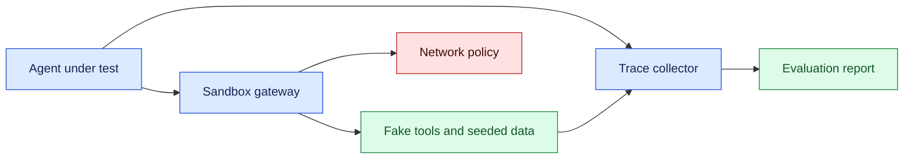
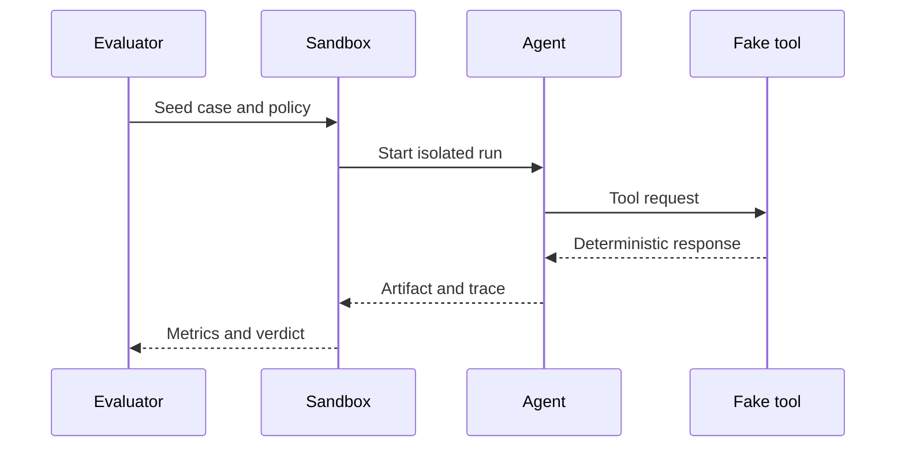

# Sandbox and testbed design

## In one sentence

A sandbox testbed is an isolated, reproducible environment where AI agents can be evaluated against realistic tools and failures without risking production data or resources.

## Background

Unit tests exercise functions, while production tests are expensive and risky. Agent systems need a middle environment with fake APIs, seeded data, network controls, and observable state. A sandbox should make mistakes recoverable and experiments repeatable.

## What changed and why now

Tool-connected agents increasingly write files, call services, and manage workflows. The source context for this month reflects that operational shift; testbed design here is an engineering inference. Capability demos are not evidence of reliability without controlled evaluation.

## Impact on current processing

Build a testbed from isolated containers, synthetic identities, deterministic fixtures, a network policy, and an event collector. Reset state between cases and record model, tool, prompt, and policy versions.



## Real-world applications

Coding agents can run against disposable repositories and fake CI. Support agents can use synthetic customers and delayed ticket APIs. Robotics planners can use a simulated world before hardware. Sandboxes need quotas, reset scripts, secret-free fixtures, and clear limits on outbound network access.



## Mental model

Think of a sandbox as a flight simulator. It must resemble the controls and turbulence that matter, but a crash should reset the simulation rather than damage an aircraft.

## What changed this month

Use repeatable testbeds and fault injection instead of relying on live demonstrations as evidence of agent quality.

## Engineering consequence

Version fixtures, container images, network rules, and evaluation cases. Capture traces, artifacts, costs, and verdicts. Reset after every run and prohibit production credentials.

## Limits and failure modes

### Reproducibility contract

A testbed result is meaningful only when another engineer can recreate it. Pin container images, Python dependencies, model or mock versions, fixture hashes, network rules, and random seeds where deterministic behavior is expected. Record the testbed manifest with every run. If a hosted model is used, capture its identifier and generation settings; “latest” is not a reproducible version.

Reset state between cases. Disposable databases, object stores, repositories, and queues prevent one agent’s writes from contaminating the next case. Reset scripts should verify that no unexpected resources remain and fail loudly if cleanup is incomplete. For long-running workflows, snapshot initial state and compare final resources against an allowlist. A green test with hidden leftovers is a sandbox failure.

### Threat model

Assume the agent may be confused, prompt-injected, or simply buggy. The sandbox gateway enforces outbound domains, request methods, rate limits, file paths, and credential scope. Fake tools should return realistic errors without reaching real accounts. Use synthetic identifiers that cannot be mistaken for production IDs. If a test needs a real provider, isolate it in a separately approved staging account with automatic quotas and cleanup.

### Evaluation operations

Store traces, tool calls, policy decisions, artifacts, cost, and verdicts in a run bundle. Define expected invariants such as “no network outside the allowlist,” “no file outside workspace,” and “all writes have a receipt.” Compare the bundle with the case specification automatically, then route ambiguous failures to human review. Keep failures reproducible by retaining the exact manifest and fixture version.

### Testbed architecture choices

Use a gateway as the only path from the agent to fake tools. The gateway validates schemas, adds trace metadata, enforces quotas, and records request and response hashes. A private container network prevents accidental egress; an explicit proxy can simulate approved services, latency, and rate limits. Keep the model runner separate from the fake-tool network when possible so a compromised tool response cannot alter host controls.

Fixtures should represent state transitions, not only static files. A ticket may begin open, receive a duplicate update, and then close; a repository may contain a failing test that becomes green after a patch. Seed these transitions deterministically and expose a reset endpoint used by CI. Expected outcomes include both artifacts and prohibited actions. For example, a test can require a draft comment while forbidding publication.

Compare fast unit-like scenarios with realistic end-to-end cases. Mocked tools are cheap and catch protocol errors; staged services reveal authentication, latency, and schema drift. Keep the two result types separate in reports. A passing mock test is evidence of code-path behavior, not evidence that a provider integration or model policy is safe.

### CI and team workflow

Run a small smoke suite on every change and a broader fault matrix nightly. Cache immutable images and fixtures by digest, but reset mutable state for each case. Upload redacted run bundles as CI artifacts with retention limits. Assign an owner to every failing case and require a regression test before closing it. Developers should be able to run the same case locally with one command.

Cost and time need budgets. Stop a case after a maximum number of model calls, tool steps, or wall-clock seconds. Report queue, model, and tool time separately. A testbed that hides a slow or looping agent behind a generous CI timeout can make a production outage more likely.

### Security boundaries

Treat the sandbox host as a protected system even when the agent is the subject under test. Run containers as non-root where possible, drop unnecessary capabilities, mount only a temporary workspace, and prohibit host sockets. Use read-only base images and scan them for known vulnerabilities. A testbed should test agent behavior without becoming an easy route to the developer laptop or CI credentials.

Network policy should be deny-by-default. Allow only named fake services and explicitly approved staging endpoints. Test DNS, redirects, proxy bypass, and IPv6 paths, not just ordinary HTTP. Record the gateway decision for each attempted connection. A failed connection is useful evidence; silently routing it through a shared proxy can hide an egress bug.

### Observability and diagnosis

Every run receives a trace ID and case ID. Record start and end time, model and tool versions, queue delay, tool requests, policy decisions, artifacts, and final verdict. Keep raw prompts and customer-like fixtures out of broad logs. Use hashes and redacted previews to correlate repeated content. A failure bundle should let an engineer reproduce the case and understand which invariant failed without searching multiple systems.

Classify failures consistently: environment, protocol, model behavior, policy, tool, or evaluator. Environment failures include missing images or quota; protocol failures include malformed envelopes; model failures include wrong actions; policy failures include an unsafe allow; tool failures include incorrect fake responses; evaluator failures include a broken expected result. Classification keeps teams from tuning a prompt to hide an infrastructure defect.

### Recovery and cleanup

If a test runner crashes, a reaper finds containers, queues, and temporary volumes by case ID and removes only those resources. Verify cleanup with an allowlist of expected survivors. If a fake tool has an uncertain write, reconcile its operation ID before rerunning. Preserve the original run bundle before cleanup so a flaky failure remains diagnosable.

### Measuring realism

A sandbox is useful when its abstractions preserve the decisions that matter. Compare request schemas, error codes, latency distributions, permission checks, and state transitions with a reviewed staging service. Keep differences documented. Add contract tests that fail when the fake drifts from the provider’s documented behavior. Do not claim production reliability from a toy simulator; use it to make risky behaviors cheap to explore.

### Team handoff

Document how to start, reset, inspect, and tear down the testbed. Provide one command for a smoke case and a small catalog of fault scenarios. Explain which outputs are authoritative, which are simulated, and how to report a new failure. A testbed that only its creator can operate becomes a bottleneck and encourages unreviewed production experiments.

### Scenario design

Start each case with an explicit objective and stopping condition. State which tools are available, which resources may change, and what evidence proves success. Include a negative assertion, such as no outbound request or no write to a protected path. This turns a demo into a test that can fail for a meaningful reason. Keep cases small enough to diagnose, then compose them into longer workflows once individual contracts are stable.

Use metamorphic checks when exact output is not deterministic. Changing an irrelevant comment should not alter authorization. Reordering independent search results should not change a safety decision. Repeating a request with the same idempotency key should not create a second effect. These properties test the protocol around the model and remain useful across model upgrades.

Record performance as well as correctness. Measure startup, queue, model, tool, and cleanup time, plus CPU, memory, and network use. A sandbox can reveal a prompt or tool defect while hiding a production-scale bottleneck. Add a small concurrency run and a long-context case, but keep expensive suites gated behind nightly or pre-release jobs.

### Exit criteria

Before declaring a testbed ready, verify isolation with an attempted forbidden network call, confirm reset leaves no unexpected resources, reproduce a seeded failure from its manifest, and inspect a redacted run bundle. Have a second engineer operate the environment from the documentation. Their success is evidence that the testbed is maintainable rather than a private experiment.

Keep the testbed’s threat model current. Revisit it when a new tool, model provider, container base image, or data source is added. Update network allowlists, credential rules, fixtures, and cleanup checks together. A new browser tool may introduce downloads; a new shell adapter may introduce filesystem escape; a new retrieval index may introduce cross-tenant data. Each change deserves a focused case and a review owner.

Use findings to improve the production design, but do not copy sandbox shortcuts into live systems. Fake credentials, permissive reset access, and deterministic error injection are appropriate for a test environment and dangerous in production. Keep environment identifiers visible in every trace and fail closed when a staging request is routed to a production endpoint.

Finally, publish limitations with results. State which providers were simulated, which concurrency levels were tested, which failure classes were omitted, and which claims remain unverified. Honest scope makes the testbed a decision aid rather than a certificate of safety.

### Result interpretation

Treat a testbed verdict as evidence about a case under a manifest, not a universal model score. A pass means the agent met the stated invariants in the isolated scenario. It does not prove robustness to unseen prompts, provider outages, or production-scale load. Aggregate results by case family and failure class, and keep failed bundles available for regression. When a case becomes obsolete, archive its definition and explain the reason so historical trends remain interpretable.

Review the environment itself after incidents. Check whether the fake tool modeled the provider’s error, whether the network policy reflected the real boundary, and whether cleanup removed all artifacts. If the testbed missed a production failure, add a scenario and update the threat model before changing the agent. This closes the loop between safe experimentation and operational learning.

Keep ownership explicit: platform maintains images and isolation, application teams maintain fixtures and contracts, and security reviews egress and credentials. Record these owners in the README and runbook so a failing case has a clear destination. Schedule periodic image updates and dependency scans, but pin versions during a test run to preserve reproducibility. A maintained sandbox is a shared engineering service, not a disposable demo folder.

### Fault matrix

| Injected condition | Expected behavior | Evidence |
| --- | --- | --- |
| Tool timeout | Bounded retry or escalation | Attempt count and state |
| Malformed JSON | Safe validation error | Rejected payload hash |
| Network denial | No external effect | Gateway decision |
| Stale fixture | Reset and fail case | Manifest mismatch |
| Agent loop | Budget stop | Token and step counters |

Simulators can be unrealistic, flaky, or accidentally connected to production. Validate isolation, inject latency and malformed responses, and compare sandbox results with carefully reviewed staging cases.

Review ownership after team changes and test access with a non-admin account. Keep the check in the quarterly sandbox exercise.

Track testbed health separately from agent health: image freshness, reset success, fixture integrity, gateway denials, and artifact retention. A broken environment can produce false confidence or false failures. Alert the platform owner when a prerequisite is unhealthy, and block safety-sensitive evaluations until the environment returns to a known-good manifest.

Include a release note for every manifest change, with the reason, approver, and expected effect on results. This makes comparisons across runs defensible and prevents an unnoticed environment update from being mistaken for an agent improvement.

## Build it locally

```python
cases = {'normal': 200, 'timeout': 504, 'malformed': 500}

def run_case(name):
    status = cases[name]
    return {'case': name, 'status': status, 'isolated': True}

for case in cases:
    print(run_case(case))
```

1. Save as testbed.py and run python3 testbed.py.
2. Add a seeded fixture and reset function.
3. Record a trace ID and policy version per case.
4. Add a failure budget and stop on unsafe outbound requests.

## Implementation exercises

1. Build Dockerized agent and fake-tool services on a private network.
2. Use Python and CLI tools to reset fixtures between runs.
3. Capture synthetic traffic with Wireshark and verify no production endpoint is contacted.
4. Document topology, threat model, and evaluation cases in Markdown.

## Interview Q&A

**Why isolate testbeds?** To make failures safe and results reproducible.

**What must be versioned?** Images, fixtures, tools, policies, prompts, and cases.

## Glossary

**Fixture:** Seeded data and expected conditions for a test case.

**Fault injection:** Deliberately introducing delay, errors, or loss.

**Sandbox:** Isolated environment for bounded experimentation.

## References

- [Docker documentation](https://docs.docker.com/) — container isolation context.
- [OpenTelemetry](https://opentelemetry.io/docs/) — trace context.

## Claim ledger

| Claim | Source | Fact or inference |
| --- | --- | --- |
| Containers can package reproducible environments. | Docker documentation | Source-context fact |
| AI agents need isolated testbeds before production effects. | Lesson synthesis | Engineering inference |
Status: draft — expansion pending
Sources: [Google DeepMind — AI Control Roadmap](https://deepmind.google/blog/securing-the-future-of-ai-agents/)

## Draft lesson
Use reproducible fake APIs, seeded data, constrained credentials, and fault injection to evaluate agents without exposing production effects.
