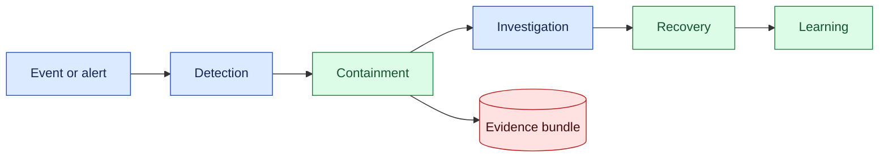
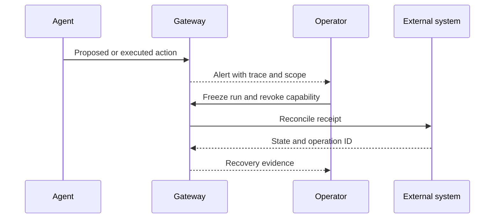

# Incident response for agents

## In one sentence

Incident response for agents is the disciplined process of detecting, containing, investigating, and learning from model-driven failures without destroying evidence or allowing further unauthorized effects.

## Background

Traditional incident response used service logs, alerts, owners, and runbooks. AI agents add probabilistic plans, tool calls, retrieval context, and human handoffs. A successful HTTP response can still produce a harmful business outcome, so response must connect model, policy, tool, and external receipts.

## What changed and why now

Agents can act across systems and run for long periods. The month’s source context reflects this operational shift; the response design is an engineering inference. Capability, reliability, and safety require separate evidence.

## Impact on current processing

Give every run and tool call a trace ID, owner, model and policy version, action scope, and receipt. Detection routes to a gateway that can pause new effects, revoke credentials, preserve a redacted bundle, and notify an accountable responder.



## Real-world applications

A coding agent may expose a secret in a patch. A support agent may update the wrong account. A robot planner may issue an unsafe command. In each case stop further effects, identify the affected run, preserve receipts, and route the incident to the right owner. Do not rerun blindly.



## Mental model

Treat response as a fire drill: first make the area safe, then preserve clues, then repair, and finally change the procedure. A fluent model explanation is not an incident timeline.

## What changed this month

Use run-aware containment and receipt reconciliation instead of treating an agent failure as an ordinary application exception.

## Engineering consequence

Define severity, triggers, owners, containment actions, evidence fields, and recovery states. Keep credentials scoped and revocable. Test duplicate effects, stale commands, prompt injection, and provider outages.

| Phase | Action | Evidence |
| --- | --- | --- |
| Detect | Confirm signal and scope | Trace and alert |
| Contain | Pause run, revoke access | State event |
| Investigate | Reconstruct actions | Receipts and versions |
| Recover | Reconcile or rollback | External status |
| Learn | Add test and control | Follow-up owner |

## Limits and failure modes

### Detection and triage

Signals can come from policy denials, user reports, anomaly monitors, tool receipts, or security scanners. Correlate them by run ID and operation ID before assigning severity. A single failed model call is usually a service event; a confirmed write to the wrong tenant is a security incident. Define severity using impact, exposure, reversibility, and confidence, and document who can change the classification.

Triage should preserve a snapshot before remediation changes state. Capture model and prompt versions, policy result, tool request hash, response status, actor identities, timestamps, and external resource IDs. Redact credentials and customer content from the general bundle; place restricted evidence behind a separate role. If telemetry is missing, record the gap as part of the incident rather than filling it with assumptions.

### Containment mechanics

Containment may pause one run, an agent role, a tool route, or an entire tenant depending on blast radius. Prefer the narrowest control that stops further harm. Revoke short-lived capabilities, stop queued work, and reject stale worker messages. For in-flight external effects, wait for a safe receipt or reconcile by correlation key. A kill switch should have an owner and a recovery procedure so it is not left active indefinitely.

### Investigation and recovery

Reconstruct the sequence from durable events, not only model text. Identify the first incorrect assumption, the policy decision that allowed the action, and the point at which a human or monitor noticed. Recovery may be rollback, compensating action, data correction, credential rotation, or a documented acceptance of residual risk. Record which operations are irreversible and notify affected owners when required.

### Learning loop

Close an incident with a regression case, monitor change, runbook update, or scope reduction. Test the exact failure in an isolated sandbox and confirm that containment still works after model and policy updates. Track recurrence, time to detect, time to contain, time to reconcile, and customer impact. Faster recovery is useful, but preventing a repeat is the stronger outcome.

### Runbook design

Write response steps as executable decisions. “Pause the run” should name the gateway endpoint, required role, expected state event, and verification query. “Rotate credentials” should identify the provider owner, active run inventory, and reconciliation step. “Notify users” should specify the affected population and privacy review. Runbooks should include a safe no-op when evidence is incomplete; responders should not improvise a broad shutdown from a vague alarm.

### Special agent failure modes

Prompt injection can cause an agent to treat untrusted tool content as an instruction. Preserve the original source, isolate the affected run, and inspect which policy gate accepted the action. Tool hallucination can produce a fabricated success message; rely on external receipts and read-back checks. Planning loops can exhaust budgets without a harmful effect; contain cost and queue growth, then retain the trace for tuning. Cross-tenant retrieval is both a quality and security incident and requires data-owner notification.

### Communications

Incident updates should state known facts, uncertainty, current containment, next decision, and owner. Do not paste raw prompts, tokens, or customer records into a broad channel. Maintain an internal timeline with event IDs and a sanitized external summary when users are affected. Separate technical recovery from root-cause confidence; early updates can say what is contained without claiming why it happened.

### Verification after recovery

Do not close an incident when the alert clears. Confirm that queued work is safe, revoked capabilities cannot be reused, external resources match expected state, and monitoring sees the repaired path. Replay a synthetic case in the sandbox and run a canary before restoring broad autonomy. Record residual risk and an owner if a full fix is deferred.

### Implementation checklist

At minimum, implement trace correlation, durable run state, scoped revocation, redacted evidence bundles, receipt reconciliation, severity ownership, and a post-incident regression test. These controls make response repeatable across coding, support, retrieval, and robotics workflows even when the model or provider changes.

### Evidence integrity

Incident evidence can be changed by the same systems under investigation. Write an append-only event record or immutable object with content hashes, timestamps from a trusted source, and the run and operation IDs. Store a copy outside the affected service boundary. Redaction should be deterministic and documented so investigators know which fields were removed. If an event is missing or arrives out of order, preserve that fact rather than reconstructing a convenient story.

For model actions, capture the exact structured request sent to the gateway, the policy inputs, verifier result, tool adapter version, and external response metadata. Do not require hidden chain-of-thought text to explain the incident. A concise decision summary plus evidence references is safer and more reproducible. Keep access to raw prompts and customer data restricted, and record who viewed them.

### Tabletop exercise

Run a quarterly exercise with a synthetic tenant and fake provider. Start with a prompt injection that causes an agent to request a cross-tenant read. Inject a delayed tool response and a lost receipt. Ask responders to classify severity, pause the run, revoke its capability, reconcile the remote state, and communicate a sanitized update. Time each step and note which dashboard, query, or role was missing. Convert gaps into tests and runbook changes.

### Metrics and service objectives

Define targets for time to detect, time to contain, time to reconcile, time to notify, and recurrence rate. Report them by incident class and severity. Measure evidence completeness, stale-command rejection, revoked-token reuse attempts, and percentage of incidents with a regression test. Avoid optimizing only for fast closure; a quick “resolved” status without reconciliation can hide a duplicate or unauthorized effect.

### Recovery patterns

For reversible writes, use a compensating operation with its own idempotency key and receipt. For irreversible effects, identify affected resources, notify owners, and document residual risk. For credential exposure, revoke, rotate, and inspect recent use. For model-quality regressions, freeze the route or narrow scope while evaluating a replacement. A recovery plan should state what happens to queued runs and how users can resubmit safely.

### Post-incident review

Hold a blameless review that asks which assumptions, controls, and incentives failed. Separate contributing factors from root cause and distinguish model behavior from policy, tool, data, and operator issues. Assign owners and dates for actions. Publish a sanitized summary and retain the detailed record under the incident policy. Revisit the threat model after changes to prompts, tools, providers, or autonomy scope.

Logs may be incomplete, labels delayed, and rollback impossible. Preserve uncertainty, escalate high-impact cases, and avoid exposing sensitive data in alerts.

### Ownership matrix

| Incident signal | First owner | Escalate when |
| --- | --- | --- |
| Cross-tenant retrieval | Security and data owner | Exposure is confirmed |
| Duplicate external write | Service owner | Compensation is uncertain |
| Credential in output | Security owner | Key is active or public |
| Runaway planning loop | Product and platform | Budget or queue is exhausted |
| Unsafe robot command | Robotics safety owner | Physical state is uncertain |

An ownership matrix prevents a response from waiting for a generic AI team. The first owner coordinates containment while domain owners assess impact. Keep contacts current and test them during tabletop exercises. If no owner is available, default to a safe pause and documented escalation, not continued autonomy.

### Readiness review

Before launching an agent, verify that alerts have owners, runbooks name concrete commands, credentials can be revoked, external effects have receipts, and a sandbox can reproduce representative failures. Confirm an operator can pause a run without deleting evidence. Review readiness after major tool, model, provider, or autonomy changes.

### Containment verification

After freezing a run, verify that queued workers reject new commands and that active leases expire or are revoked. Check the external provider directly for recent operation IDs, then compare its state with the local receipt ledger. If the provider cannot confirm an effect, keep the run in reconciliation and prevent automatic retry. This protects against the most dangerous incident ambiguity: a system that believes it failed while the external world changed.

Document the restoration sequence. First re-establish trusted identity and policy services, then replay safe read-only checks, then reconcile writes, and finally reopen limited autonomy. Use a canary tenant or synthetic case before restoring broad traffic. Keep monitoring and an operator present during the canary. A clear sequence reduces the chance that urgency turns a contained incident into a second effect.

Review access to incident tooling after closure. Remove temporary investigator permissions, expire break-glass credentials, and verify that sanitized summaries contain no secrets. Link the incident to a regression test, sandbox scenario, and owner. This makes the response program improve over time instead of repeating the same emergency steps.

### Incident communications checklist

An update should name the affected service or run, current containment, known impact, uncertainty, next checkpoint, and accountable owner. Avoid blame and avoid speculative model explanations. For customers, state what data or action may be affected, what protection is active, and where questions should go. For internal responders, link trace IDs, receipts, and the runbook. Keep a timestamped timeline so later reviewers can distinguish facts observed during response from hypotheses formed afterward.

Practice communications in tabletop exercises. Ask a responder to produce a two-sentence executive update and a technical event note from the same synthetic bundle. Review whether both omit secrets and make the next decision clear. Good communication is part of containment because it prevents duplicate manual actions and keeps owners aligned while evidence is incomplete.

Maintain a contact roster, escalation calendar, and backup owner. Review them during each exercise and after organizational changes. A correct runbook still fails if its only responder is unavailable or lacks permission to pause the affected system.

Record the exercise date, participants, gaps, and follow-up deadline in the incident register.

Review open actions weekly until closure, and publish a sanitized status to affected stakeholders. Escalate overdue remediation rather than allowing an incident to disappear from operational attention.

### Idempotency and replay safety

Containment is harder when a worker cannot tell whether a request reached the provider. Give every effect an idempotency key derived from the run, intended operation, and stable resource identity. Persist the key before sending the request, and treat a timeout as “unknown” until a read-back or provider lookup resolves it. Do not let a retry create a second charge, ticket, message, or deployment merely because the first response was lost. If the provider has no idempotency support, put the action behind an adapter that records a durable intent and requires reconciliation before retry.

Replay the event history in a sandbox to test the runbook. A replay should preserve ordering, duplicate deliveries, delayed receipts, and revocation events while replacing real credentials and customer identifiers with fixtures. The purpose is not to reproduce the model’s private reasoning; it is to verify that the control plane reaches safe states when observable events arrive in an inconvenient order. Keep replay tooling versioned with the incident procedure and record which events were intentionally omitted.

### Human decision quality

Human approval does not automatically make a response safe. The responder needs a compact view of scope, affected resources, last trusted state, pending effects, and available recovery actions. Show uncertainty explicitly: “provider receipt missing” is more useful than a green or red badge that hides the ambiguity. Require a reason and expiry for break-glass actions, and make the normal path easier to execute than an improvised script. After the incident, review whether the interface encouraged a premature retry or broad shutdown.

## Build it locally

```python
def respond(state, signal):
    if signal == 'suspected_write':
        state['mode'] = 'contained'
        state['next'] = 'reconcile'
    return state

print(respond({'mode': 'running'}, 'suspected_write'))
```

1. Save as incident.py and run python3 incident.py.
2. Add a trace ID and owner.
3. Add a revoke action and receipt lookup.
4. Test duplicate and delayed signals.

## Implementation exercises

1. Build Dockerized agent, gateway, and mock provider.
2. Use Python and CLI tools to inject tool failures and stale commands.
3. Capture synthetic local traffic with Wireshark and verify secrets are absent.
4. Document severity and runbook steps in Markdown.

## Interview Q&A

**Why preserve receipts?** They prove what external effects occurred and prevent unsafe retries.

**What is first?** Contain new effects while preserving a redacted evidence bundle.

## Glossary

**Containment:** Preventing additional effects during an incident.

**Receipt:** Evidence returned by an external operation.

**Severity:** Impact and urgency classification for response.

## References

- [NIST AI Risk Management Framework](https://www.nist.gov/itl/ai-risk-management-framework) — risk response context.
- [OpenTelemetry](https://opentelemetry.io/docs/) — trace context.

## Claim ledger

| Claim | Source | Fact or inference |
| --- | --- | --- |
| AI risk management includes response and accountability. | NIST AI RMF | Source-context fact |
| Agent incidents require run-aware containment and reconciliation. | Lesson synthesis | Engineering inference |
Status: draft — expansion pending
Sources: [Google DeepMind — AI Control Roadmap](https://deepmind.google/blog/securing-the-future-of-ai-agents/)

## Draft lesson
Stop active runs, revoke capabilities, preserve traces, assess affected state, patch the boundary, and re-enable only after verification. A kill switch needs ownership and drills.
