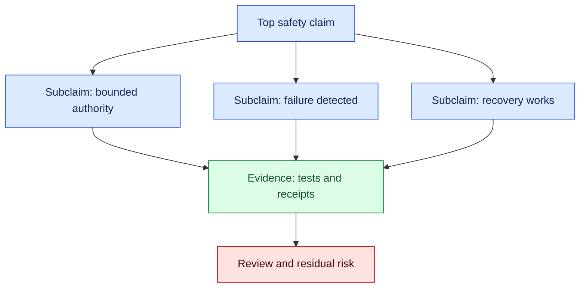
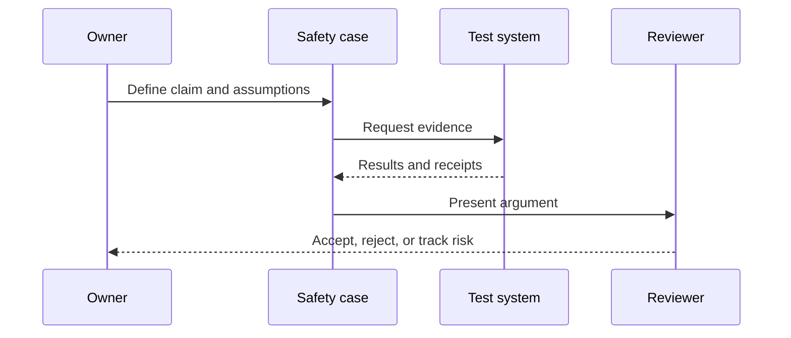

# Safety cases

## In one sentence

Safety cases are structured arguments linking an AI system’s claims, evidence, assumptions, and controls to a bounded operational risk.

## Background

Traditional safety engineering used hazard analyses, requirements, tests, and sign-off records. AI systems add uncertain perception, learned behavior, changing data, and human interaction. A safety case makes the reasoning explicit instead of treating a passing demo as proof.

## What changed and why now

Agentic systems can affect tools and real resources. This month’s source context reflects broader deployment; the safety-case method here is an engineering inference. Capability, reliability, and safety arguments must remain separate.

## Impact on current processing

Start with a top-level claim, decompose it into subclaims, attach evidence, list assumptions, and state residual risk. Update the case when models, tools, policies, or environments change.



## Real-world applications

A coding agent’s case can argue that it cannot merge without review and that rollback is tested. A support agent can argue that identity checks prevent cross-account changes. A robot can argue that perception uncertainty leads to safe pause. Each argument names evidence and residual uncertainty.



## Mental model

Think of a safety case as a legal brief for system behavior: claims need admissible evidence, assumptions are visible, and unresolved risk is not hidden.

## What changed this month

Use living, versioned arguments that travel with the model and tool configuration rather than one-time approval documents.

## Engineering consequence

Store claim, evidence ID, test version, assumption, owner, decision, and expiry. Require review after material changes and link arguments to runbooks.

| Case element | Example | Owner |
| --- | --- | --- |
| Claim | No unapproved write | Product |
| Evidence | Gateway test suite | Platform |
| Assumption | Provider receipt reliable | Integration |
| Residual risk | Unknown remote effect | Operations |

## Limits and failure modes

### Building a credible argument

Begin with hazards and operating context, not with a preferred model. Identify what can go wrong, who can be affected, how quickly harm could occur, and which effects are reversible. Translate each hazard into a claim about a control: authority is bounded, unsafe input is rejected, failures are detected, and recovery is practiced. Evidence should be specific enough to reproduce, such as a test fixture, policy decision, trace, or provider receipt.

State assumptions plainly. A case may rely on a provider returning reliable operation IDs, an operator responding within a deadline, or a sensor covering a defined field of view. Each assumption needs an owner and a monitoring signal. If an assumption changes, the case moves to review rather than remaining silently accepted. This turns a safety case into a living operational artifact.

### Evidence quality

Evidence has scope and limits. A unit test can support a transition invariant but cannot prove a model’s semantic accuracy. A simulation can explore rare faults but may omit real-world noise. A staging receipt can show integration behavior but not production scale. Label each item with environment, version, date, and what it does not establish. Independent review should challenge optimistic interpretations and look for missing negative cases.

### Change control

Version the case with model, prompt, tool, policy, data, and environment identifiers. A model update can alter failure modes even when the API is unchanged. A new tool permission can invalidate a bounded-authority claim. Re-run required evidence after material changes and keep a rollback or restricted mode available. Link every exception to an owner and expiration date so temporary risk does not become permanent.

### Operational use

Expose the current case status to operators: accepted, conditional, expired, blocked, or under review. When an incident occurs, link the run to the relevant claim and evidence, then record whether the control worked. Update the case with the regression test or scope change. This feedback loop prevents safety documentation from becoming disconnected from actual system behavior.

### Review cadence and metrics

Set review triggers rather than relying on an annual calendar alone. A model, prompt, tool, policy, data source, deployment environment, or operating procedure change can invalidate a claim immediately. A serious incident, repeated near miss, or new user population should also reopen the case. Record the trigger, reviewer, decision, and next review date in the same durable record as the claims.

Measure whether the case is useful in operation. Track evidence freshness, open assumptions, expired claims, unresolved residual risks, incident links, and time from change to review. During exercises, measure whether responders can find the relevant claim and runbook quickly. If a case is too large to use during an incident, maintain a short operational summary linked to the detailed argument.

### Practical review questions

Ask whether the stated hazard still matches the product, whether controls run at the correct boundary, whether evidence covers negative and degraded paths, and whether operators have authority to execute the recovery. Challenge claims with counterexamples: a stale source, malformed tool response, revoked credential, delayed human, or partial network outage. A case that survives only normal-path tests is incomplete.

### Worked argument

Suppose the top claim is “the coding agent cannot publish an unreviewed production change.” Decompose it into claims: the repository branch is protected; the gateway identifies the target environment; the merge tool requires an approval bound to the patch digest; and a stale worker cannot reuse an old approval. Evidence includes branch-policy tests, gateway contract tests, approval records, stale-message fault injection, and a staging receipt. Assumptions include correct provider configuration and an available reviewer. Residual risk includes a provider outage or a compromised administrator account, which require separate controls.

For each claim, record the evidence owner and expiration. Branch-policy evidence may need rerunning when repository settings change. Gateway tests rerun after adapter or schema changes. Approval-boundary tests rerun after workflow changes. A safety case is stronger when its maintenance cost is explicit; otherwise teams postpone updates until after an incident.

### Independent challenge

Assign a reviewer who did not design the control to challenge the argument. Ask them to find a path around the stated boundary and to identify evidence that is only a capability demonstration. Require the author to answer with a test, a policy change, or an explicit residual risk. This practice reduces confirmation bias and makes review decisions auditable.

### Implementation safeguards

Store cases in version control with machine-readable metadata for owner, status, scope, and review date. Link claims to test names and runbook URLs. A CI check can flag expired evidence or a changed tool schema. Keep the human-readable argument close to the code so a change reviewer sees whether the safety claim still holds. Do not mark a case accepted solely because every test is green; review assumptions and real-world applicability as well.

Evidence can be stale, incomplete, or overly favorable. A safety case can become paperwork. Sample real failures, challenge assumptions, and record what the evidence does not prove.

### Rollout and monitoring

Introduce a safety case before enabling a new capability, then use it to define rollout gates. Start with a read-only or shadow route, compare observed behavior with assumptions, and collect near misses. Expand authority only when evidence remains fresh and operators can execute recovery. Monitor blocked actions, stale evidence, policy denials, overrides, incident links, and review time.

Evidence needs a freshness policy. A test result may apply to one model and adapter but not another. An approval may expire after the resource changes. Store timestamps and dependencies, and mark the case conditional when a dependency is unknown. Conditional acceptance is more honest than treating a missing check as a pass.

### Closing the loop

When an incident or near miss occurs, link it to the claim it challenged. Record whether the control prevented harm, detected it late, or failed. Add a regression test, modify the assumption, reduce scope, or accept residual risk with an owner. Review updates with product, engineering, and operations so safety cases shape roadmap decisions.

### Evidence scoring and review

Rank evidence by how directly it tests the claim. A unit test may verify a permission predicate; a fault-injection run may verify recovery after a timeout; a production sample may reveal distribution limits. Record environment, sample size, version, reviewer, and blind spots. Include negative cases where the model proposes a forbidden action, a tool returns malformed data, a credential is revoked, an operator misses a deadline, or a dependency is unavailable.

The reviewer reads the claim and operating context, checks hazards and assumptions, samples evidence, and compares controls with the actual architecture. They inspect gateways, identity scope, queues, logs, and recovery runbooks rather than accepting a polished summary. Record questions and dispositions so unresolved concerns remain visible.

Keep cases detailed enough to audit but concise enough to maintain. Link reusable controls to tests while keeping each lesson’s claim specific. Preserve retired decisions and reasons. Update ownership, evidence expiry, and runbook links together; a forgotten owner or expired evidence is itself a safety finding.

### Counterexample-driven maintenance

Maintain a small library of counterexamples beside the case. Each counterexample should state the proposed action, the untrusted or degraded condition, the control that ought to intervene, and the expected evidence. Useful cases include a prompt that asks for a forbidden write, a tool response that claims success without a receipt, a queue message signed for another tenant, an approval whose patch digest no longer matches, and a model that repeatedly chooses an allowed action until a budget is exhausted. These examples turn abstract claims into executable tests and make review discussions concrete.

When a counterexample passes through the boundary, do not simply add a sentence to the argument. Identify whether the claim was too broad, the control was placed too late, the evidence did not cover the deployed adapter, or an assumption was false. Narrow the claim or change the architecture, then rerun the negative test. Keep the original failing result and decision history so the case records improvement rather than presenting a perfect retrospective narrative.

### Separation of duties

A credible case separates the person who proposes a capability from the person who accepts its risk. The author can assemble evidence, but an independent reviewer should inspect the deployed permissions, test scope, assumptions, and residual-risk owner. For high-impact actions, require a second approval or a domain owner who understands the affected process. Automation can block missing metadata and expired evidence; it cannot decide whether an unmeasured harm is acceptable. Record reviewer identity and the exact configuration reviewed.

### Operational examples and release readiness

For a retrieval assistant, a safety claim might require current citations and abstention when evidence is missing. Evidence includes citation checks, stale-index tests, adversarial prompts, and reviewed samples. For a coding agent, the claim may be that no production branch receives an unapproved change; evidence includes branch protection, approval records bound to patch hashes, and stale-worker tests. For customer operations, identity and approval evidence should be tied to the exact fields changed.

Before release, confirm every top claim maps to an automated test and an operational observation. Verify that evidence versions match deployed model, tool, policy, and data configuration. Check that assumptions have owners and expiry dates, and that residual risks have explicit acceptance. Run representative and adversarial canaries with an independent approver. Do not expand authority while a critical claim is conditional or stale.

### Auditability and response

Keep an append-only history of case decisions, evidence changes, reviewers, and exceptions. An audit entry should identify the claim, version, environment, decision, and next review date without copying sensitive payloads. When an incident challenges a claim, freeze the relevant version before changing the system, link the run and external receipts, and record whether the argument predicted the observed failure. This prevents an after-the-fact rewrite from making the case appear stronger than it was.

Residual risk should be actionable. State the affected population, plausible harm, detection signal, mitigation, acceptance owner, and expiry. If a risk cannot be accepted, reduce authority, add a human gate, or keep the capability in shadow mode. Revisit accepted risks when traffic, regulation, data, or model behavior changes. A risk register with no owner is only a list of concerns.

Use safety cases to guide incident drills. Select a claim, construct a counterexample, and ask responders to find the control, execute the runbook, and collect evidence. Time discovery and containment, then update the case with the result. Repeated exercises reveal whether the argument is understandable to people who did not write it and whether the system’s controls work under pressure.

### Evidence retention and responsibilities

Retain hashes, test identifiers, receipts, and decision metadata longer than raw prompts or screenshots. Apply tenant-specific retention and access controls. If an artifact expires, mark the claim conditional and require a fresh test or explicit risk acceptance. Product owns intended behavior and acceptable risk; engineering owns controls; operations owns monitoring; security and privacy owners review authority and data handling.

At review time, compare the case with the deployed topology, not an idealized diagram. Verify queues, gateways, identity services, tool adapters, and human procedures match the evidence. Record deviations as assumptions or residual risks and assign an owner. This catches arguments that remain correct in documentation while implementation quietly changes.

## Build it locally

```python
case = {'claim': 'writes require approval', 'evidence': ['test-17'], 'status': 'review'}
case['status'] = 'accepted' if case['evidence'] else 'blocked'
print(case)
```

1. Save as safety_case.py and run python3 safety_case.py.
2. Add assumptions and an expiry date.
3. Add a failed evidence item and block acceptance.
4. Link the case to a runbook and owner.

## Implementation exercises

1. Build a Dockerized agent with a mock tool and evidence collector.
2. Use Python and CLI tools to generate claim and test records.
3. Capture synthetic traffic with Wireshark and verify evidence excludes secrets.
4. Document the argument and diagrams in Markdown.

## Interview Q&A

**What is a safety case?** A structured claim-and-evidence argument about bounded risk.

**Why version it?** Model, tool, policy, and environment changes can invalidate evidence.

## Glossary

**Assumption:** Condition the argument depends on.

**Claim:** Proposition about safe system behavior.

**Residual risk:** Risk remaining after controls.

## References

- [NIST AI Risk Management Framework](https://www.nist.gov/itl/ai-risk-management-framework) — governance context.
- [OpenTelemetry](https://opentelemetry.io/docs/) — evidence and trace context.

## Claim ledger

| Claim | Source | Fact or inference |
| --- | --- | --- |
| AI governance requires documented risk considerations. | NIST AI RMF | Source-context fact |
| Living claim-and-evidence cases improve agent safety review. | Lesson synthesis | Engineering inference |
Status: draft — expansion pending
Sources: [Google DeepMind — AI Control Roadmap](https://deepmind.google/blog/securing-the-future-of-ai-agents/)

## Draft lesson
A safety case connects claims to evidence, assumptions, controls, and residual risk. “We tested it” is not an argument without scope and failure conditions.
