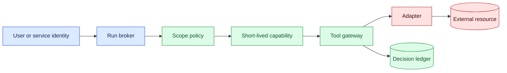
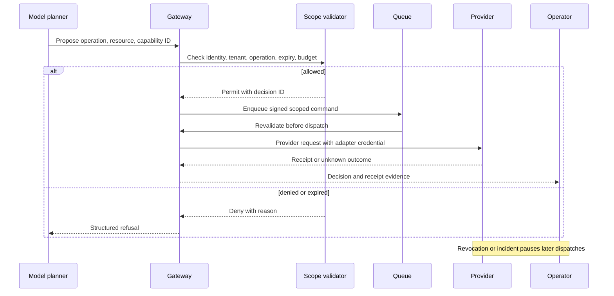

# Capability scoping
Status: emerging
Sources: [Google DeepMind — AI Control Roadmap](https://deepmind.google/blog/securing-the-future-of-ai-agents/)

## In one sentence

Capability scoping is the practice of granting an agent only the operations, resources, identities, time, and budget required for one task, with every boundary enforced outside the model.

## Background

An ordinary application usually has a fixed call graph: a service account calls a known database, a user submits a form, and a server executes a validated operation. Early language-model integrations often added a prompt such as “only use these tools” and assumed the model would respect it. That is an instruction, not an authorization boundary. A model can misunderstand, follow hostile text retrieved from a document, select the wrong tool, or produce a plausible argument for a request that should have been rejected.

Capability means an authority to perform an effect. In this lesson, an effect is any operation that changes state, discloses data, spends money, sends a message, or consumes scarce compute. Scope describes the allowed subset: one tenant rather than all tenants, one repository rather than an organization, read-only rather than write, a bounded time window, and a maximum number or value of operations. The scope must be represented in a machine-checkable token or policy decision and checked at the enforcement point immediately before the effect.

The prerequisite concepts are identity, authentication, authorization, least privilege, and resource ownership. Authentication answers “who is presenting this request?” Authorization answers “may this identity perform this operation on this resource?” Least privilege says the answer should allow no more authority than necessary. A queue, cache, or tool adapter must preserve the identity and scope rather than silently replacing them with its own broad service credential.

## What changed and why now

The historical baseline was a human-operated application with short, visible transactions. Agents make a plan, call multiple tools, retain state, and sometimes continue after the initiating user has stopped watching. The source context for this month emphasizes control of agent behavior; the detailed boundary design in this lesson is an engineering inference from that problem. The important change is not that models suddenly become trustworthy or untrustworthy. It is that a probabilistic planner is now connected to durable effects, so authority must be constrained as a system property.

Agent frameworks make tool registration easy. A tool may expose a database query, an email sender, a shell command, a deployment operation, or a payment endpoint. Convenience can produce a single powerful credential shared across runs. That design turns a prompt mistake into a large blast radius. Scoping introduces a narrower capability for each run and makes the gateway validate operation, resource, tenant, purpose, expiry, and budget before forwarding the request.

## Impact on current processing and architecture

Put the scope decision in the control plane. At run creation, resolve the authenticated principal, task intent, tenant, approved tools, resource selectors, expiry, and budget. Mint a short-lived capability or store an equivalent policy record. Every tool call carries the run ID, capability ID, operation, resource, and idempotency key. The gateway checks the call against the recorded scope, logs the decision, and sends only an adapter-specific credential to the provider.



The model proposes an action, but it does not choose its own authority. The gateway should reject a request even when the model is highly confident and the natural-language explanation sounds reasonable. The adapter should also enforce provider-specific restrictions because a gateway bug or confused-deputy path must not turn a read capability into a write. Use separate credentials for read and write, separate endpoints where practical, and bind approvals to the exact resource and operation.

Scoping changes data processing as well. Retrieval should filter by tenant and authorization before context reaches the model, not after generation. A capability should identify which data sources may be queried and whether returned fields may leave the system. Caches need tenant-aware keys. Background workers need to revalidate expiry and revocation instead of trusting a scope copied into an old message. Metrics should distinguish denied actions from model failures so a healthy control can look like a successful safety outcome.

## Real-world applications and constraints

A coding agent might need to read one repository, open a pull request, and run tests, but not merge to production. Its scope can name repository ID, branch pattern, allowed files, commands, maximum runtime, and an approval requirement for publication. A support agent may read a customer’s tickets and draft a response, while an account-change operation requires a fresh identity check and a human approval tied to the exact fields. A research assistant may search approved sources but must not access private customer records merely because a connector technically exposes them.

In finance, a reconciliation agent may create proposed journal entries but not post them. The budget boundary includes both count and monetary value because ten small actions and one large action have different risk. In infrastructure, a deployment agent can restart a staging service but not alter production network policy. In robotics, scope includes physical region, speed, energy, and a safe-stop behavior; a software token alone cannot establish physical safety.

Operational constraints matter. Narrow scopes create more policy decisions, token issuance, and audit records. Providers differ in resource identifiers and revocation behavior. Some APIs issue broad credentials or cannot report whether a timed-out request succeeded. Multi-step workflows may need delegated scopes, but delegation creates a chain that must be inspected. A hard limit can interrupt a legitimate task, while a generous limit increases blast radius. Treat denial, expiry, and reconciliation as normal states and design the user experience around them.

## Mental model

Think of a capability as a temporary key to one room, not a promise from the person carrying it. The key has a door, permitted action, expiry, and perhaps a quota. The agent may suggest walking through another door, but the lock decides. The hallway, key cabinet, and door log are separate controls: issuance defines authority, enforcement checks it, and evidence records what happened.

Four questions expose weak scoping:

1. What exact effect can this run cause?
2. Which identity, tenant, and resource does the effect belong to?
3. Where is the last enforcement point before the external state changes?
4. What happens when the request is delayed, duplicated, expired, or revoked?

If any answer is “the model is expected to behave,” the boundary is incomplete. If a worker can reuse an old token, or a cache can return another tenant’s data, the architecture has a confused-deputy risk even when the policy document is correct.

## What changed this month

The month’s control-oriented source context makes capability boundaries a first-class concern for agent deployment. The release-specific claim is that agent-control work is addressing how powerful systems can be operated safely; the concrete token shape, gateway pattern, and tests below are engineering guidance rather than a claim that the source specifies one implementation.

The practical shift is from “the agent has access to a tool” to “this run has a narrowly defined, expiring authority.” That authority is observable and reviewable. A launch checklist can ask for scope coverage, but runtime enforcement must remain active after approval because prompts, retrieved documents, tool responses, and model versions can change.

## Engineering consequence

Define a capability schema with immutable fields: capability ID, subject, tenant, operation, resource selector, purpose, issued-at time, expiry, budget, parent approval, and revocation version. Sign or protect the record against tampering, but do not put secrets in model-visible context. Use a gateway that fails closed when required identity or policy data is unavailable. For long jobs, renew through a policy decision rather than extending a token silently.



State transitions should be explicit: `issued`, `active`, `partially_used`, `expired`, `revoked`, and `reconciliating`. A command in `reconciliating` must not be retried automatically. Bind budgets to committed effects, not only successful responses, because a provider may apply an effect and lose the response. Use monotonic counters or reservation records to prevent parallel workers from spending the same quota.

## Limits and failure modes

### Prompt-only restrictions

“Do not send email” in a system prompt can reduce ordinary mistakes but cannot protect against prompt injection or a compromised adapter. Keep it as a behavioral hint, then enforce the restriction at the gateway and provider account. Test the denied path with adversarial tool output and malformed model arguments.

### Confused deputy

A broad backend credential may act on behalf of many tenants. If the gateway accepts a tenant ID supplied by the model or trusts a caller-controlled header, an agent can cause cross-tenant access. Derive tenant identity from authenticated state, compare it with the capability, and pass the provider a credential whose authority is already narrowed. Log both the requested and authenticated resource so mismatches are visible.

### Stale and replayed commands

Queues retry. Workers crash. A command issued before revocation may arrive afterward. Include capability ID, scope version, expiry, nonce or sequence, and idempotency key in the command. Revalidate immediately before dispatch and reject stale messages. Do not rely on queue ordering as a security guarantee.

### Over-broad resource selectors

Selectors such as `customer:*`, `repo:*`, or “all files under this directory” may be convenient but hide a large blast radius. Prefer explicit resource IDs and bounded collections. If a wildcard is unavoidable, require a separate approval and show the resolved set to the reviewer. Recompute membership when the operation executes because resources can be added after approval.

### Revocation gaps

Short expiry limits exposure but does not solve an active incident. Store a revocation version or deny-list lookup that the gateway and workers can check. For high-impact actions, use provider-side revocation or disable the integration credential. Verify revocation with a synthetic request; a dashboard flag is not proof that every worker has stopped.

### Availability trade-offs

Fail-closed policy checks protect authority but can stop legitimate work during an outage. Fail-open behavior may preserve availability while permitting unauthorized effects. Choose by action class: read-only, reversible actions may have a narrowly defined degraded mode; irreversible or cross-tenant writes should wait for an authoritative decision. Document the choice in the safety case and measure denied and delayed work.

### Model-visible scope leakage

The model needs enough context to plan, but exposing credentials, internal policy syntax, or unrelated tenant data increases attack surface. Present a capability summary such as “read ticket T-123; draft only; expires in 10 minutes,” while keeping enforcement metadata server-side. Treat retrieved instructions and tool output as untrusted data, not as a new grant of authority.

### Human approval fatigue

Approving every low-risk read can train operators to click through high-risk writes. Group only genuinely equivalent requests, show the concrete resource and effect, and bind approval to a digest that changes when the plan changes. Expire unused approvals. A human gate is useful when the reviewer can understand the decision and has enough time; it is not a substitute for least privilege.

## Build it locally

```python
from dataclasses import dataclass

@dataclass(frozen=True)
class Capability:
    tenant: str
    operation: str
    resource: str
    remaining: int
    active: bool = True

def authorize(capability, tenant, operation, resource):
    allowed = (
        capability.active and capability.remaining > 0
        and capability.tenant == tenant
        and capability.operation == operation
        and capability.resource == resource
    )
    return {"allowed": allowed, "reason": "ok" if allowed else "scope_mismatch"}

cap = Capability("acme", "read", "ticket:T-7", 2)
print(authorize(cap, "acme", "read", "ticket:T-7"))
print(authorize(cap, "other", "read", "ticket:T-7"))
```

1. Save the example as `scope_check.py` and run `python3 scope_check.py`.
2. Add an expiry timestamp and reject the capability after expiry.
3. Add a `revoked` state and test a command arriving after revocation.
4. Add a budget reservation so two simulated workers cannot consume one remaining operation twice.
5. Replace the exact resource with a deliberately broad selector, write a failing test, and narrow the selector until the test passes.
6. Record each allow or deny result as a decision event containing no secret or customer payload.

## Implementation exercises

1. Build a small gateway and mock provider. Give one run read access to one tenant and verify that a second tenant is denied even when the request body names the first tenant.
2. Add a queue between the gateway and provider. Revoke the capability after enqueueing and prove that the worker rejects the stale command.
3. Simulate a provider timeout. Mark the effect unknown, query a mock receipt endpoint, and ensure the retry path requires reconciliation.
4. Add property-based or table-driven tests for operation, resource, tenant, expiry, budget, and revocation combinations.
5. Measure decision latency and audit-log volume for 100 read requests and 10 write requests. Decide which data can be sampled without losing evidence of high-impact effects.

## Interview Q&A

**Why is a prompt instruction not authorization?** A prompt influences model output, but it does not prevent a malformed or adversarial proposal from reaching a tool. Authorization must be enforced by trusted code at the effect boundary.

**Where should a capability be checked?** At issuance, at the gateway, and again immediately before a queued or delayed effect is dispatched. The last check catches expiry, revocation, and scope changes.

**Why bind approval to a digest?** Without a digest, an agent can obtain approval for one action and then alter the resource or operation before execution. A digest makes the reviewed request the one that can be executed.

**How should a timeout be handled?** Treat it as an unknown external state, look up a receipt or read back the resource, and use an idempotency key before any retry.

**Does least privilege mean one token for every API call?** Not necessarily. It means the authority is no broader than the task requires. A short-lived capability can cover an intentionally bounded sequence, provided each operation and resource remains enforceable.

## Glossary

**Capability:** A delegable, enforceable authority to perform a defined operation on defined resources.

**Scope:** The set of operations, identities, resources, time, and budgets permitted by a capability.

**Least privilege:** Granting only the authority necessary for the intended task.

**Confused deputy:** A trusted component misuses its broader authority on behalf of an untrusted caller.

**Revocation:** Making an otherwise valid capability unusable before its natural expiry.

**Receipt:** Provider evidence describing whether an external operation occurred.

**Idempotency key:** A stable operation identifier that lets a provider or adapter safely recognize retries.

## References

- [Google DeepMind — AI Control Roadmap](https://deepmind.google/blog/securing-the-future-of-ai-agents/) — source context for controlling agent behavior.
- [NIST — Zero Trust Architecture](https://www.nist.gov/publications/zero-trust-architecture) — identity-aware, continuously evaluated access context.
- [OWASP — Least Privilege](https://owasp.org/www-community/controls/Least_Privilege) — application security guidance.

## Claim ledger

| Claim | Source | Fact or inference |
| --- | --- | --- |
| Agent-control research treats control of capable systems as an operational problem. | Google DeepMind AI Control Roadmap | Source-context fact |
| A model instruction cannot substitute for an authorization boundary. | Security architecture principles | Engineering inference |
| Rechecking scope before delayed dispatch reduces stale-command risk. | Lesson synthesis | Engineering inference |
| Tenant, resource, operation, expiry, and budget are useful scope dimensions. | Lesson synthesis | Engineering recommendation |
| Provider receipts and idempotency keys help distinguish failed requests from unknown external effects. | Lesson synthesis | Engineering recommendation |
