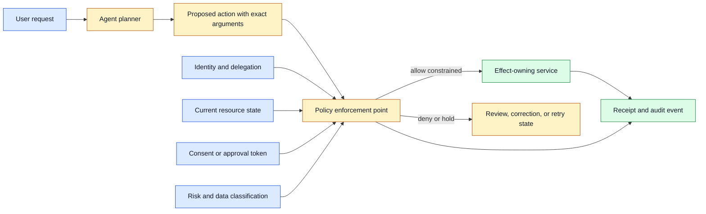
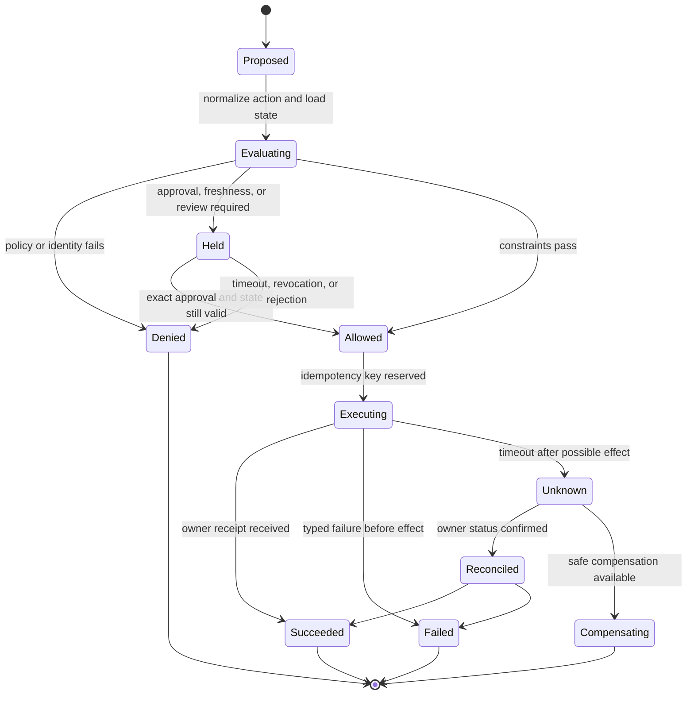

# Policy enforcement points
Status: draft — expansion pending
Sources: [Google DeepMind — AI Control Roadmap](https://deepmind.google/blog/securing-the-future-of-ai-agents/)

## In one sentence

A policy enforcement point is the component that turns a policy decision into an actual allow, deny, hold, or constrained execution at the boundary where an agent request can consume resources, disclose data, or change state.

## Background: what existed before

Traditional software placed authorization around APIs: a caller presented an identity, the service checked a role or permission, and the service either executed the request or returned an error. This model works well when the caller’s intent, parameters, and authority are explicit. An AI agent complicates the picture because a model generates a proposed action from user text, retrieved data, tool results, and prior steps. A syntactically valid proposal is not proof that the user requested it or that the agent is allowed to perform it.

Early agent prototypes often enforced policy in the prompt. The system message said “do not delete files” or “ask before sending email,” and the application trusted the model to comply. Prompt instructions can guide behavior, but they are not an enforcement boundary. Retrieved documents may contain conflicting instructions, the model may misunderstand a request, a retry may change arguments, and a tool may have side effects before a reviewer sees the response.

The historical baseline also treated authorization as a single check at request entry. That is insufficient for a long-running workflow. A user can lose access while an agent is working. A resource can change between planning and execution. A model can produce a new tool call after observing a result. A stale approval can authorize the wrong version of a command. Policy must be enforced where the controlled operation is about to happen and at every transition that changes its risk.

## What changed and why now

Google DeepMind’s June 18, 2026 AI Control Roadmap describes treating capable agents as potential insider threats, combining traditional safeguards with monitoring, prevention, and response. It describes trusted supervisors that review reasoning, actions, and plans, and emphasizes coverage, recall, and time-to-response. The source also distinguishes asynchronous response for lower-risk reversible actions from synchronous prevention for high-risk actions. These are source-reported framework claims; this lesson applies the enforcement-point pattern as an engineering design inference.

The change is a shift from “the agent is trusted because its model is aligned” to “the system limits what the agent can do even when alignment is imperfect.” That shift resembles zero-trust service design. A worker receives narrow capabilities, the effect-owning service evaluates the exact request, and monitoring supplies evidence rather than authority. The model can plan, but an enforcement point owns the state transition.

## Mental model

Think of the enforcement point as a railway signal immediately before a bridge. A planner may propose a route and a monitor may observe the train, but the signal controls whether this particular train may enter this particular segment now. The signal checks identity, track state, schedule, and safety conditions; it does not decide whether the train’s written explanation sounds persuasive. In an agent system, the “track” is a resource or effect, the “train” is a typed command, and the receipt is evidence that the owner committed the transition.

This mental model explains why placement matters. A signal after the bridge can record a crash but cannot prevent entry. A prompt that says “do not cross” is like a note inside the train: helpful to the operator, but not a physical control. A policy service that makes a decision but whose result is not checked by the effect owner is like a signal disconnected from the rail switch. Enforcement is complete only when the protected boundary obeys the decision.

## Impact on current processing and architecture

An enforcement point should sit immediately before the resource or effect it protects. Examples include an API gateway before an external call, a data-access layer before a row is returned, a queue admission service before work consumes capacity, a secret broker before credentials are issued, a browser controller before navigation or submission, and a deployment controller before a release changes production.

The point must receive enough context to decide. That typically includes authenticated principal, agent identity, parent delegation, tenant, requested operation, exact arguments, target resource, data classification, current resource state, policy version, deadline, and approval token if required. It should not rely on a model-generated explanation as the authorization fact. Explanations are useful evidence for review, but the decision should be based on structured fields and authoritative state.



The enforcement point should be fail closed for high-impact operations. If the policy service is unavailable, a payment, credential release, production deployment, or destructive deletion should normally wait. A low-risk read may use a short-lived cached decision if the policy explicitly permits it. Availability is a policy choice, not a reason to bypass the gate.

Enforcement is different from observation. A monitor can inspect an event and alert after the fact. A prevention point can block before execution. Both are valuable. The AI Control Roadmap’s distinction between asynchronous response and synchronous prevention maps to consequence: reversible work may tolerate delayed detection, while an irreversible or high-blast-radius operation needs a gate in the critical path.

There should also be a boundary before sensitive data enters model context. Data release is an effect. A retrieval service must filter by tenant, purpose, and identity before returning documents. A redaction service may remove secrets before a model call. If the model already saw a credential, a later output filter cannot restore confidentiality. Place enforcement before data release, not only before tool execution.



The state machine prevents a common retry bug. If a tool call times out, the agent must not assume it failed and issue the same command again. The effect owner must reconcile the idempotency key or operation ID. An enforcement point should reserve that key before execution, and the owner should return a durable receipt. If the outcome is unknown, the system enters reconciliation rather than silently returning to `Proposed`.

## Enforcement point design

First normalize the model proposal. A free-form sentence such as “send the report to finance” must become a typed command with recipient identity, document ID, purpose, and requested operation. Unknown fields and ambiguous targets should be rejected or held. Do not let the model choose the policy version, increase its own limits, or mint a stronger identity for a downstream service.

Next evaluate identity and delegation. The user identity, agent workload identity, and any parent-child delegation should be explicit. Delegation should be non-transitive by default: a child service may act only within a subset of the parent’s authority. Bind the request to tenant and resource. Prevent confused-deputy behavior in which a broadly trusted worker performs a model-generated action for another tenant.

Then check current state and freshness. A price, document revision, deployment commit, or account permission can change after planning. An approval token should contain or reference a digest of exact arguments, target, actor, and expiry. If any material field changes, the token becomes invalid. Read the authoritative state again immediately before the effect when race conditions matter.

Apply constraints rather than only yes-or-no decisions. A policy may allow a read but limit fields, allow a write only in staging, allow a transfer only under a threshold, or allow a browser navigation only to an approved origin. Constrained execution reduces blast radius. The effect-owning service must enforce the constraint itself because a model or gateway can be bypassed by another caller.

Use idempotency and leases. An idempotency key makes a retried command refer to one logical operation. A lease gives temporary ownership to an execution worker and expires if it stops heartbeating. A lease is not authorization; it prevents concurrent workers from acting on the same task. Store policy decision, key, target, and receipt so an auditor can reconstruct the transition.

## Supervisors, monitors, and enforcement

The June source describes trusted AI supervisors monitoring reasoning, actions, and plans. A supervisor can be useful for high-volume behavioral detection, but its output should normally feed a policy point rather than directly grant permission. A second model can miss the same behavior, be fooled by adversarial context, or produce an uncertain judgment. Use deterministic checks for identity, schema, resource scope, and irreversible operations wherever possible.

Coverage and recall are separate. **Coverage** is the fraction of relevant traffic seen by a monitor or gate. **Recall** is the fraction of harmful or misaligned events it catches. A system can monitor every tool call but miss harmful behavior because the classifier is weak; it can have a strong detector but observe only a small sample. Measure both by route, task, modality, tenant, and consequence.

Time-to-response matters because a detector that flags an action after completion cannot prevent it. Record event time, detection time, decision time, effect time, and containment time. For a high-risk action, the enforcement point must wait for a synchronous decision. For low-risk work, asynchronous review can quarantine or reverse an outcome. The chosen mode should be tied to reversibility and blast radius, not model capability alone.

Do not expose hidden reasoning as the only evidence. The source roadmap notes that visible chain-of-thought may become insufficient if models hide or use opaque reasoning. Tool traces, file diffs, network requests, resource changes, and policy events are more actionable enforcement evidence. A model’s explanation can help a reviewer but should not be treated as a complete or faithful log of its internal process.

## Real-world applications and constraints

In a coding agent, enforcement points protect file scope, shell execution, network access, secrets, and repository publication. A model can propose a patch, but the file service checks workspace boundaries. A command runner checks the allowlist, sandbox, resource limits, and approval. A pull-request service checks branch and reviewer policy. If the agent tries to read an environment file, the secret boundary denies access before the bytes enter context.

In customer support, a model may draft an account change. The account service checks authenticated customer, support role, exact fields, recent verification, and a confirmation token. The model cannot promote a customer-provided sentence to proof of identity. A delayed supervisor can flag suspicious behavior, but the account change gate must synchronously prevent unauthorized mutation.

In data analysis, retrieval is an enforcement point. A query service filters rows by tenant and purpose before returning them to the model. A second output filter is useful for accidental disclosure, but it is not a substitute for pre-retrieval access control. Cache keys must include authorization scope and source version; otherwise an approved response can leak to a different user.

In deployment automation, a model can recommend a release or rollback. The deployment controller checks artifact digest, environment, change window, tests, approval, and current revision. A timeout after the deployment API call requires status reconciliation. A chat transcript saying “approved” is not an approval token unless the workflow explicitly authenticates and binds it to the exact revision.

In cyber defense, a capable agent may inspect logs, identify a vulnerability, and propose containment. High-risk commands need synchronous gating, network and credential scope, sandboxing, and operator takeover. The June source frames major cyber actions as requiring real-time prevention. Defensive purpose does not eliminate the need to constrain target, action, and blast radius.

In robotics, the point sits between a perception/planning model and the controller. It checks current sensor state, permitted workspace, speed, collision constraints, and human presence. A model may propose a trajectory, but an independent controller and physical interlock own actuation. Network failure should move the robot to a safe state rather than grant broader local authority.

## Engineering consequence

Treat policy enforcement as a first-class service boundary. Put it where the operation is owned, make it receive structured context, and make its decision observable. The model can propose; the enforcement point decides; the effect owner commits state and returns a receipt.

Numbered local implementation steps:

1. Inventory every agent output that can consume resources, release data, or change external state.
2. Classify each operation by reversibility, blast radius, data sensitivity, and required response time.
3. Define typed commands with exact targets, arguments, tenant, actor, and purpose.
4. Place enforcement before data release, queue admission, tool execution, and effect ownership.
5. Separate user identity, agent identity, delegation, approval, and model-generated explanation.
6. Implement allow, deny, hold, and constrained-allow decisions with versioned policies.
7. Recheck freshness and authorization after retries, leases, long waits, and material state changes.
8. Add idempotency keys, durable operation IDs, receipts, and reconciliation for uncertain outcomes.
9. Measure monitor coverage, harmful-event recall, decision latency, and time-to-response by consequence class.
10. Test policy-service outage, stale approval, prompt injection, cross-tenant access, duplicate delivery, and effect-owner timeout.

## Build it locally

Save this example as `enforcement_point.py` and run `python3 enforcement_point.py`. It models a policy gate for a file operation. The model is represented only by a proposed command; authorization uses identity, workspace, operation, and a confirmation digest. It does not access the filesystem and therefore remains safe to run locally.

```python
from dataclasses import dataclass
import hashlib

@dataclass(frozen=True)
class Proposal:
    actor: str
    workspace: str
    operation: str
    path: str
    confirmation: str | None = None

def digest(proposal):
    raw = "|".join((proposal.actor, proposal.workspace,
                     proposal.operation, proposal.path))
    return hashlib.sha256(raw.encode()).hexdigest()

def enforce(proposal, approved_actor, approved_workspace, approved_digest):
    if proposal.actor != approved_actor:
        return "deny: actor"
    if proposal.workspace != approved_workspace:
        return "deny: workspace"
    if not proposal.path.startswith("src/"):
        return "deny: path scope"
    if proposal.operation == "delete":
        if proposal.confirmation != approved_digest:
            return "hold: exact confirmation required"
    elif proposal.operation not in {"read", "write"}:
        return "deny: operation"
    return "allow"

proposal = Proposal("agent-1", "repo-a", "delete", "src/old.py")
approved = digest(proposal)
print(enforce(proposal, "agent-1", "repo-a", approved_digest=approved))
tampered = Proposal("agent-1", "repo-a", "delete", "secrets.txt", approved)
print(enforce(tampered, "agent-1", "repo-a", approved_digest=approved))
```

The first proposal remains held because it has no confirmation token. Add `confirmation=approved` and observe an allow. The second proposal is denied because the target changed, even though it reuses the old token. Extend the example with an expiry time and a current repository revision. In a production system, the file service must enforce the same path boundary and the approval must be authenticated, short-lived, and stored with an operation receipt.

## Limits and failure modes

**Gate placement too late:** A model sees restricted data before the output filter runs. Enforce retrieval and context release before model invocation.

**Prompt-only policy:** A system instruction is treated as authorization. Keep policy and credentials outside the model and enforce at the effect-owning service.

**Stale approval:** The target, actor, revision, or risk changes after approval. Bind confirmation to exact arguments and recheck current state.

**Fail-open outage:** An unavailable policy service causes the operation to proceed. Choose fail-closed behavior for high-impact actions and explicit bounded cache rules for low-risk reads.

**Retry duplication:** A timeout causes a second side effect. Use idempotency keys and reconcile operation status before retry.

**Confused deputy:** A powerful worker accepts a model-generated request for another tenant. Carry tenant and delegation context and enforce it at the owner.

**Supervisor overtrust:** A second model is treated as an independent authorization authority. Use deterministic checks and measure correlated failure; supervisor output should inform policy.

**Low coverage:** A monitor sees only selected routes or event types. Inventory traffic, test sampling, and report coverage by consequence and modality.

**Slow response:** A detector reports harm after the effect. Put synchronous enforcement in front of irreversible operations and measure time-to-response.

**Scope creep:** A constrained permission silently expands through retries or child agents. Make delegation non-transitive, cap scope, and prevent children from minting authority.

## Mini exercise (15–30 min)

Extend the local gate with `resource_version`, `expires_at`, and an operation ID. Require the confirmation digest to include the version. Test a stale version, changed path, wrong actor, expired approval, and duplicate operation ID. Then classify each result as deny, hold, or reconcile. Write which checks belong in the gateway and which must also be enforced by the effect-owning service.

## Interview Q&A

**Q: What is a policy enforcement point?**
It is the component at a protected boundary that evaluates a structured request and actually allows, denies, holds, or constrains the operation. A prompt or monitor alone is not an enforcement point.

**Q: Where should enforcement happen?**
Before sensitive data enters model context, before queue admission and tool execution, and inside the service that owns the external state change. Defense in depth is important because gateways can be bypassed.

**Q: When is asynchronous monitoring enough?**
For low-risk, reversible work where delayed detection and remediation are acceptable. Irreversible or high-blast-radius operations need synchronous prevention.

**Q: Why are coverage and recall different?**
Coverage measures how much traffic is observed; recall measures how much harmful behavior is caught. Observing everything with a weak detector or detecting well on a small sample can both fail.

**Q: What should happen after a tool timeout?**
Enter an unknown state, reconcile the effect owner by operation ID or idempotency key, and retry only after confirming that a duplicate effect cannot occur.

## Glossary

- **Blast radius:** Scope of resources or people affected by an operation.
- **Constrained allow:** Permission limited by target, fields, amount, environment, or duration.
- **Coverage:** Fraction of relevant traffic observed by a control.
- **Effect owner:** Service responsible for committing an external state change.
- **Enforcement point:** Boundary component that applies a policy decision to an operation.
- **Idempotency key:** Identifier that makes repeated requests refer to one logical operation.
- **Recall:** Fraction of harmful or target events caught by a control.
- **Synchronous prevention:** Blocking a risky operation before it executes.
- **Time-to-response:** Delay from relevant behavior to detection, decision, or containment.
- **Typed command:** Structured operation with validated fields and semantics.

## References

- [Google DeepMind: Securing the future of AI agents](https://deepmind.google/blog/securing-the-future-of-ai-agents/) — June 18, 2026 AI Control Roadmap, threat modeling, monitoring, prevention, response, coverage, recall, and time-to-response.
- [Google DeepMind AI Control Roadmap](https://storage.googleapis.com/deepmind-media/DeepMind.com/Blog/securing-the-future-of-ai-agents/ai-control-roadmap.pdf) — source-linked framework referenced by the announcement.
- [MITRE ATT&CK](https://attack.mitre.org/) — threat taxonomy context referenced by Google DeepMind.
- [OWASP Generative AI Security Project](https://owasp.org/www-project-generative-ai-security/) — prompt-injection and application-security context.

## Claim ledger

| Claim | Source | Fact or inference |
|---|---|---|
| Google DeepMind’s June 18, 2026 post describes an AI Control Roadmap for increasingly capable and imperfectly aligned agents. | Google DeepMind | Fact about source |
| The post describes monitoring, prevention, response, coverage, recall, and time-to-response. | Google DeepMind | Fact about source |
| The post distinguishes asynchronous response for lower-risk reversible work from synchronous prevention for high-risk actions. | Google DeepMind | Fact about source |
| Policy should be enforced before data release and at the effect-owning service. | Systems security | Engineering inference |
| Approval should bind to exact arguments, identity, target, and freshness. | Authorization design | Engineering inference |
| Model or supervisor output should inform policy but not replace independent authorization. | Safety architecture | Engineering inference |
