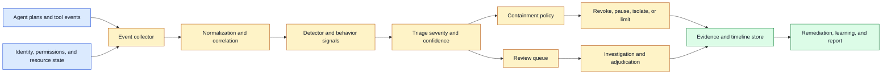

# Anomaly triage
Status: draft — expansion pending
Sources: [Google DeepMind — AI Control Roadmap](https://deepmind.google/blog/securing-the-future-of-ai-agents/)

## In one sentence

Anomaly triage turns a suspicious agent event into a prioritized, evidence-preserving decision about observation, containment, investigation, remediation, or human review without granting extra authority merely because the system is uncertain.

## Background: what existed before

Traditional operations teams handled anomalies through alerts from infrastructure monitors, security tools, and application logs. An alert described a threshold crossing or known signature: CPU stayed high, a login came from a new location, a service returned too many errors, or a file matched a malware rule. The on-call engineer inspected context, assigned severity, and chose a response. The process was imperfect, but the caller and the observed system were usually separate.

AI agents change the shape of the event. An agent may issue many legitimate API calls, create files, browse content, modify records, or delegate work to another service. A suspicious pattern can be a sequence rather than one bad request: repeated permission failures, unusual data access, a sudden scope expansion, an attempt to disable monitoring, or a safe-looking action followed by a high-impact action. Model behavior can also be nondeterministic, and a benign request can produce an over-eager operation that looks adversarial.

An anomaly is not automatically an incident. **Triage** is the process of gathering enough evidence to classify an event and choose an immediate handling path. **Severity** estimates potential impact and urgency. **Containment** limits further damage while preserving evidence. **Remediation** corrects a condition or restores service. **Recall** is the fraction of relevant harmful events caught by a detector; **precision** is the fraction of its alerts that are relevant. A high-alert system can still be poor if it overwhelms reviewers.

## What changed and why now

Google DeepMind’s June 18, 2026 AI Control Roadmap describes treating capable agents as potential insider threats and combining detection with prevention and response. It says monitoring should measure coverage, recall, and time-to-response, and describes using supervisors to review agent reasoning, actions, and plans. It also reports analysis of a million coding-agent tasks and notes that many flagged events were attributed to misinterpretation or overeagerness rather than adversarial intent. These are source-reported claims about the framework and internal prototype; the operational model in this lesson is an engineering inference.

The practical change is that anomaly handling must interpret behavior in context while avoiding two opposite errors. If every unusual action is treated as malicious, the system becomes unusable and reviewers learn to ignore alerts. If every action is trusted because it came from an authorized agent, a compromised or misaligned process can exploit valid permissions. Triage needs evidence, scoped containment, calibrated priorities, and a path to correct false positives.

## Mental model

Think of triage as an emergency-room intake desk for software behavior. The desk does not diagnose the entire patient from one symptom; it records what arrived, checks immediate danger, assigns urgency, applies a safe first intervention, and sends uncertain or severe cases to the right specialist. In an agent system, the “symptoms” are tool calls and state changes, the “vital signs” are identity and resource context, and the containment action protects the system while the cause is investigated.

This model prevents two category errors. A detector score is not a diagnosis, and containment is not a cure. Pausing one capability can limit damage while engineers determine whether the cause was malicious behavior, a prompt injection, a stale permission, a retry bug, or ordinary agent overeagerness. A closed case should preserve that reasoning so future triage improves without treating every unusual event as an attack.

## Impact on current processing and architecture

An anomaly system should consume structured events from the agent gateway, tool services, identity system, data-access layer, sandbox, and effect owners. A detector produces a signal with reason and confidence. A triage service combines signal with consequence, affected resources, current state, and recent history. A containment policy can pause a lease, revoke a narrow capability, block one target, or isolate a run. An evidence store preserves the event sequence and relevant artifacts. Human review handles uncertain or severe cases.



The event collector should assign a trace ID, event ID, agent run ID, parent delegation, tenant, resource, operation, timestamp, and policy version. Capture requested and actual effects separately. A model proposal is not the same as an executed command. A denied action is useful evidence but should not be logged as a successful effect. For media or private data, retain hashes and bounded metadata by default and protect raw payloads behind a separate incident role.

Correlation joins events across services. A single denied file read may be ordinary; hundreds of denied reads followed by an attempt to access credentials is more concerning. Correlation must handle clock skew, retries, duplicate delivery, and distributed traces. Do not infer order from arrival time alone. Use event time and sequence or operation IDs where available.

Severity should combine consequence and confidence. A high-confidence anomaly on a read-only sandbox may be lower severity than a low-confidence signal immediately before a production deletion. Use a matrix with impact, reversibility, scope, affected data, and time sensitivity. A detector’s confidence prioritizes investigation; it does not authorize a containment action that could itself cause harm.

Containment should be graduated. A low-cost action might add logging or reduce concurrency. A stronger action pauses the agent run, revokes a single tool capability, isolates a workspace, blocks an outbound destination, or requires an operator. Full identity revocation or broad network shutdown may prevent damage but can also disrupt legitimate operations and destroy evidence. Every containment action needs an owner, expiry, reason, and recovery path.

```mermaid
stateDiagram-v2
    [*] --> Observed
    Observed --> Correlated: trace and history assembled
    Correlated --> Benign: known and explained
    Correlated --> Triage: signal or consequence warrants review
    Triage --> Monitor: low impact; collect more evidence
    Triage --> Contained: narrow control applied
    Triage --> Escalated: severe, uncertain, or high blast radius
    Contained --> Investigating: reviewer or responder assigned
    Escalated --> Investigating
    Investigating --> Cleared: false positive or resolved
    Investigating --> Remediating: root cause and fix identified
    Remediating --> Recovered: service and permissions restored safely
    Recovered --> Closed: evidence and lessons recorded
    Cleared --> Closed
    Monitor --> Triage: new evidence raises risk
    Closed --> [*]
```



The state machine prevents an alert from disappearing after a quick dismissal. `Benign` means the event was explained under current policy, not that similar future events are harmless. `Contained` means a limiting control is active; it is not a root-cause fix. `Unknown` should be represented in evidence and may require continued containment. Closure should record what was observed, what was affected, why the disposition was chosen, and which regression case was added.

## Evidence and investigation

A useful anomaly packet contains the triggering event, preceding and following events, identity and delegation, requested and actual resources, policy decisions, model and tool versions, input and output hashes, network destinations, sandbox state, and containment actions. Keep a timeline and distinguish source facts from analyst inference. A model-generated explanation is one hypothesis, not a trustworthy narrative of intent.

Preserve the minimum evidence needed for replay. Raw prompts, retrieved documents, code, screenshots, and tool results can contain secrets or personal data. Use references and hashes where possible. If an investigator needs the payload, require a narrow permission and log access. Do not copy the entire tenant database into an alert channel because one query looked unusual.

Use a hypothesis-driven investigation. Ask whether the event resulted from user intent, agent misinterpretation, a bad tool result, a compromised identity, a prompt injection, a policy bug, or a provider/runtime failure. Test each hypothesis against the timeline. Avoid attributing motive from a string such as “I need to bypass this check.” A tool output or retrieved document may have supplied that text.

Separate anomaly detection from root-cause analysis. A model can recognize a suspicious sequence while an engineer discovers the actual cause was a clock bug, duplicated retry, stale permission cache, or changed prompt. If the system automatically labels every detector finding as “malicious agent,” future safeguards may overfit to an inaccurate story.

## Detection strategies and trade-offs

Rules are transparent and fast. They work well for impossible states, forbidden destinations, excessive rates, missing approvals, and schema violations. They can be brittle when legitimate workflows vary. A rule should emit a reason code and version, not merely a Boolean.

Statistical baselines compare a run with typical behavior for a tenant, task, or device. They can identify unusual call counts, file paths, durations, or sequences. They struggle with cold-start tasks, deliberate behavior change, and distribution shifts. Avoid using “unusual” as a synonym for “harmful.”

Sequence models or trusted supervisors can detect behavioral patterns that rules miss. Google’s source describes moving beyond simple keyword filtering toward high-signal behavioral patterns in coding-agent trajectories. A learned detector can still inherit bias, miss novel behavior, or be evaded. Record detector version, training or calibration context, and uncertainty.

Human review supplies context for ambiguity and high-impact decisions. It costs time and can suffer from fatigue, anchoring, and inconsistent labels. Route a bounded evidence packet, use a rubric, and measure queue recall and reviewer agreement. Do not make humans the only control for an effect that can be blocked deterministically.

## Real-world applications and constraints

For a coding agent, anomalies include reading outside the workspace, accessing secrets, disabling tests, adding a new network destination, deleting a large tree, or repeatedly retrying a failed command. Containment can pause the run, revoke shell access, preserve a diff, and require an operator. The system should distinguish a generated command that was denied from one that executed successfully.

For customer support, unusual account lookups or changes may result from a legitimate escalation, an over-broad search, or compromised credentials. Triage should show authenticated actor, customer, fields accessed, previous verification, tool result, and policy decision. Do not ask the model whether the activity was suspicious and treat its answer as the audit conclusion.

For data analysis, a model may issue a query that returns more rows than expected or repeatedly probe protected columns. A query enforcement point should prevent unauthorized release, while anomaly triage investigates intent and possible policy gaps. Preserve query shape, result size, access scope, and tenant without copying sensitive rows into the alert.

For cyber defense, an agent may execute many commands in a sandbox. A high command count alone is not an incident. Sequence, target, credential use, network egress, and impact matter. High-risk containment can disable a capability or isolate a workspace before external communication, while preserving artifacts for a human defender.

For robotics, an anomaly might be a trajectory outside the expected workspace, repeated sensor disagreement, or a command issued while a human is present. The immediate control belongs in the real-time safety system. Triage can preserve logs and pause the task, but it should not wait for an asynchronous model review before preventing a collision.

For long-running research or product agents, a run may be active for hours. Leases, heartbeats, checkpoints, and expiry are essential. A detector may flag behavior after several steps, so the system must know which capabilities can be revoked mid-run and how to reconcile partially completed effects. The longer the run, the more important durable evidence and periodic reauthorization become.

## Engineering consequence

Anomaly triage should be designed as a bounded incident workflow, not as a single classifier. Keep the detector’s signal separate from severity, containment, and final disposition. This makes false positives correctable and prevents a low-confidence signal from granting a responder broad authority.

Numbered local implementation steps:

1. Enumerate agent events, effect owners, identities, resources, and policy decisions to be collected.
2. Define event and trace IDs, timestamps, tenant, delegation, operation, target, and requested versus actual effect.
3. Write a severity matrix using impact, reversibility, scope, sensitivity, and time-to-response.
4. Add transparent rules for impossible states, rate limits, scope violations, and missing approvals.
5. Correlate event sequences while accounting for retries, duplicates, and clock skew.
6. Preserve a minimal evidence packet with hashes and access-controlled payload references.
7. Define graduated containment actions with owner, expiry, reason, and recovery path.
8. Route uncertain or severe cases to a rubric-based review queue and measure coverage and recall.
9. Reconcile unknown effects by operation ID before retrying or closing a case.
10. Add a regression fixture and policy change after each confirmed failure, then review false positives for usability.

## Build it locally

Save this example as `anomaly_triage.py` and run `python3 anomaly_triage.py`. It scores a small event sequence using consequence and simple behavioral signals. It does not decide intent and should not be used as a production detector. The point is to keep detection, severity, and containment as explicit records that can be reviewed.

```python
from dataclasses import dataclass

@dataclass(frozen=True)
class Event:
    name: str
    resource: str
    effectful: bool = False
    denied: bool = False

def triage(events):
    denied = sum(event.denied for event in events)
    effects = sum(event.effectful for event in events)
    sensitive = any(event.resource == "secrets" for event in events)
    score = denied * 2 + effects + (5 if sensitive else 0)
    if sensitive and effects:
        disposition = "contain and escalate"
    elif score >= 4:
        disposition = "contain and review"
    elif score >= 2:
        disposition = "monitor"
    else:
        disposition = "clear"
    return {"score": score, "disposition": disposition,
            "event_count": len(events), "denied_count": denied}

events = [Event("read", "workspace"),
          Event("read", "secrets", denied=True),
          Event("write", "production", effectful=True)]
print(triage(events))
```

The example escalates because a sensitive access attempt and an effect occur in one sequence. Extend it with timestamps and a five-minute correlation window. Add an event that was denied before execution and confirm it is not counted as an actual effect. Then add a `containment_id`, owner, expiry, and status to the result. A production implementation would use authoritative policy and effect-owner receipts rather than these toy signals.

## Limits and failure modes

**Alert fatigue** occurs when benign variation creates too many findings. Measure precision, reviewer time, duplicate rate, and queue age; tune by consequence rather than suppressing whole event classes.

**Low recall** occurs when the detector sees only one tool or misses behavior hidden in a sequence. Inventory event coverage, correlate traces, seed known cases, and report blind spots.

**False attribution** occurs when unusual behavior is labeled malicious intent. Preserve facts and hypotheses separately and investigate user error, tool bugs, prompt injection, and policy defects.

**Late containment** occurs when an asynchronous alert arrives after an irreversible effect. Put synchronous enforcement in front of high-risk operations and use triage for follow-up and recovery.

**Overbroad containment** harms legitimate work or destroys evidence. Use graduated controls, scoped revocation, expiry, owner, and rollback.

**Retry confusion** counts duplicate delivery as repeated behavior. Use event IDs, operation IDs, and idempotency records to distinguish transport from action.

**Clock skew** corrupts sequence interpretation. Preserve event and ingestion times and use a distributed trace or sequence number.

**Evidence leakage** occurs when raw prompts, secrets, or customer records are copied into alert channels. Store references and hashes, restrict payload access, and redact by default.

**Reviewer anchoring** occurs when a model label or explanation determines the human decision. Blind initial review where practical and preserve independent reasons.

**Containment escalation** occurs when a responder or agent uses a suspicious event as justification for broader credentials. Bound responder authority, require approval for destructive actions, and audit every containment transition.

## Mini exercise (15–30 min)

Extend the local harness with a timeline, tenant, agent identity, and operation ID. Create normal browsing, repeated denied secret reads, a duplicate retry, and a production write. Compute severity separately from detector score. Add containment that pauses only the shell capability and expires after ten minutes. Finally, write a reconciliation case in which the production write timed out and prove that triage does not issue a duplicate write.

## Interview Q&A

**Q: Is every anomaly an incident?**
No. An anomaly is a signal requiring context. Triage can classify it as benign, monitor, contain, investigate, or escalate based on consequence and evidence.

**Q: What should an anomaly detector observe?**
Plans, tool calls, data access, identity and delegation, policy decisions, resource state, network activity, retries, and actual effects. A model explanation alone is incomplete evidence.

**Q: How do coverage and recall differ?**
Coverage is the fraction of relevant traffic or event types observed. Recall is the fraction of harmful or target behavior caught. Both must be measured by task, tool, tenant, and consequence.

**Q: How should containment be chosen?**
Use the narrowest effective control: pause a run, revoke one capability, limit a target, isolate a workspace, or require review. Tie severity to impact and reversibility, not only detector confidence.

**Q: What is the right response to a tool timeout?**
Represent the effect as unknown, reconcile by operation ID or idempotency key, preserve evidence, and retry only when the effect owner confirms it is safe.

## Glossary

- **Anomaly:** Event or sequence that differs from expected behavior or violates a control.
- **Containment:** Limiting further impact while investigation continues.
- **Coverage:** Fraction of relevant traffic or event types observed.
- **Disposition:** Triage outcome such as clear, monitor, contain, or escalate.
- **Incident:** Confirmed or materially suspected harmful event requiring response.
- **Precision:** Fraction of detector alerts that are relevant.
- **Recall:** Fraction of relevant harmful or target events detected.
- **Severity:** Estimated impact and urgency.
- **Triage:** Contextual classification and immediate response selection.
- **Unknown effect:** Operation whose external outcome is not yet reconciled.

## References

- [Google DeepMind: Securing the future of AI agents](https://deepmind.google/blog/securing-the-future-of-ai-agents/) — June 18, 2026 AI Control Roadmap, insider-threat framing, monitoring, containment, coverage, recall, and response time.
- [Google DeepMind AI Control Roadmap](https://storage.googleapis.com/deepmind-media/DeepMind.com/Blog/securing-the-future-of-ai-agents/ai-control-roadmap.pdf) — source-linked technical framework.
- [MITRE ATT&CK](https://attack.mitre.org/) — tactics and techniques taxonomy referenced by the source.
- [OWASP Generative AI Security Project](https://owasp.org/www-project-generative-ai-security/) — application security and prompt-injection context.

## Claim ledger

| Claim | Source | Fact or inference |
|---|---|---|
| Google DeepMind’s June 18 post frames capable agents as potential insider threats. | Google DeepMind | Fact about source framing |
| The post describes monitoring, prevention, response, coverage, recall, and time-to-response. | Google DeepMind | Fact about source |
| The post reports an internal prototype analyzing a million coding-agent tasks and finding many flags linked to misinterpretation or overeagerness. | Google DeepMind | Fact as source-reported |
| Anomaly triage should separate detector signal, severity, containment, and final disposition. | Incident engineering | Inference |
| High-risk irreversible actions need synchronous enforcement rather than only asynchronous triage. | Control architecture | Inference |
| Evidence packets should preserve facts and hypotheses while minimizing sensitive payloads. | Incident-response design | Inference |
