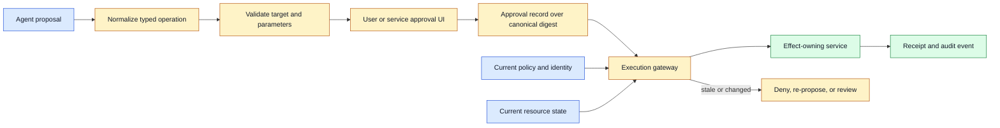
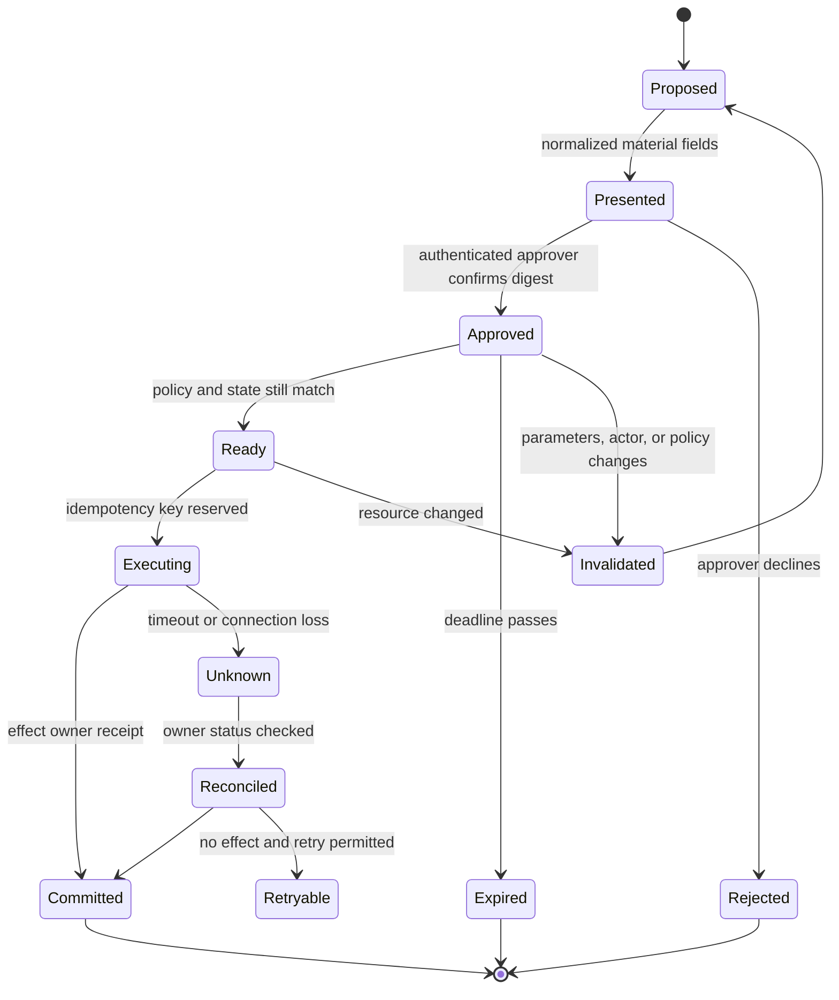

# Approval boundaries
Status: draft — expansion pending
Sources: [Google DeepMind — AI Control Roadmap](https://deepmind.google/blog/securing-the-future-of-ai-agents/)

## In one sentence

An approval boundary is the point where a human or authorized service confirms one precisely identified operation, with scope, parameters, freshness, and expiry bound tightly enough that a model cannot reuse the confirmation for a different effect.

## Background: what existed before

In ordinary applications, a person clicks a button and the server performs the operation associated with that screen. The button may represent a known action such as submitting a purchase, merging a change, or deleting a record. Authorization checks the caller’s identity and role, while the server validates parameters and current state.

Conversational systems weaken that visual coupling. A user may say “go ahead,” “that looks good,” or “send it.” The assistant must decide which earlier proposal the confirmation refers to. Meanwhile, a tool call may change the recipient, amount, branch, file, or environment after the user saw the proposal. A bare confirmation is ambiguous if the system has not bound it to an exact operation.

Early agent prototypes often treated approval as a message in conversation history. The model saw “approved” and emitted a tool call. This made the model both interpreter and executor of authority. It could confuse a previous approval with a new request, accept a confirmation intended for a draft, or continue after a material parameter changed.

An approval is not the same as authentication or authorization. **Authentication** establishes who is acting. **Authorization** determines what that identity may do. **Approval** is a deliberate acceptance of a particular proposed action, usually after its material consequences are shown. A person can be authorized to approve a deployment but still have approved only staging, one revision, and one expiry window.

## What changed and why now

Google DeepMind’s June 18, 2026 AI Control Roadmap describes capability-scoped access, monitoring, prevention, and response for increasingly capable agents. Its framing treats an agent as potentially misaligned or overeager at runtime, so trust is built through controlled, incremental access rather than broad standing authority. The source is a framework and source-reported roadmap; the exact approval-token design here is an engineering inference.

The change is that approval must become a system object instead of conversational flavor. An approval record binds the approving identity to an operation, resource, parameters, policy version, and expiry. The effect-owning service verifies that record immediately before committing state. If a model changes the request, the approval is invalidated and a new decision is required.

This is especially important for multimodal and long-running agents. A voice “yes” can refer to an earlier number that was transcribed incorrectly. An image can contain a suggested recipient that is not trusted. A coding agent can modify a patch after a reviewer approved a previous diff. A research agent can continue for hours after a policy changed. The boundary must survive modality changes, retries, handoffs, and time.

## Mental model

Think of an approval as a narrowly cut key, not a general vote of confidence. The key opens one lock—one actor, target, operation, and set of material parameters—for a short time. If the lock changes, the key must stop working. A model may suggest which lock to use, but it must not manufacture the key or decide that a similar lock is close enough.

This model explains why a friendly conversation is not enough. “Go ahead” may be clear to a person who remembers the last sentence, but a distributed system needs an immutable object that can be checked after delays, retries, handoffs, and state changes. Binding approval to a canonical digest turns intent into a verifiable reference while leaving execution authority with the service that owns the resource.

## Impact on current processing and architecture

An agent first creates a typed proposal. A presentation layer shows material fields, target, consequence, and evidence. An approval service authenticates the approver and creates a signed or access-controlled approval bound to a canonical digest. The execution gateway checks the approval, current policy, resource state, and idempotency key. The effect owner validates again and returns a receipt.



The canonical operation should include the action, target identity, material parameters, actor, tenant, environment, parent run, policy version, and perhaps a source or artifact digest. Canonicalization makes equivalent representations hash to the same value and prevents an attacker from changing field order or whitespace after approval. Do not include mutable status or display-only text in the digest unless the contract requires it.

Material parameters depend on the domain. For a payment they include recipient, amount, currency, account, and scheduled time. For a deployment they include artifact digest, environment, region, rollout percentage, and change window. For a file operation they include workspace, path set, operation, and revision. For an email they include recipient IDs, subject, attachments, and body digest. The user should approve what matters, not an opaque operation ID alone.

A confirmation must be bound to an actor. A shared Slack emoji, a voice “yes,” or a model-generated string is not sufficient if another person or process could have produced it. Use an authenticated channel and show who is approving. For high-impact actions, require step-up authentication or a second approver. Approval authority should be scoped by resource, environment, operation, and duration.

Freshness matters. A token that was valid yesterday may not cover today’s price, access, artifact, or recipient. Include an expiry and recheck policy and resource state before execution. If a deployment revision changes, the previous approval is stale. If a customer’s account permissions change, a cached approval should not continue. Expiry is a safety control, not only a cleanup field.



Approval and execution should be separate state transitions. A user can approve while the system is still preparing, but the executor must check that the approved digest matches the operation it is about to perform. A timeout after execution may leave the state unknown; the system must reconcile before asking for or using another approval. Requiring a second approval for the same already-committed operation is confusing, while blindly retrying can duplicate the effect.

Approval boundaries also apply to data release. A user may approve a summary of a document without approving publication of the raw document. A reviewer may approve a cropped image but not an uncropped export. A model may request a transcript while the purpose permits only local captioning. Bind approval to output scope and destination, not merely to “use this file.”

## Approval UX and evidence

The approval interface should show the decision in terms a person can verify. Include operation, target, actor, material values, environment, impact, expiry, and what will happen next. Show a concise evidence reference rather than overwhelming the user with hidden chain-of-thought. For a generated patch, show the diff and tests. For a payment, show recipient and amount from an authoritative source. For a media export, show exact asset digest, destination, and disclosure state.

Do not use a generic “approve all future actions” button unless the scope is truly bounded and the risk is low. A capability grant can be useful for a batch, but it needs maximum resource set, operations, duration, rate, and revocation. A user may approve “read these five files for this task,” not “read any file in the repository forever.” Narrow grants are easier to audit and revoke.

The model should not be able to rewrite the approval presentation. It may populate a proposal, but trusted code formats material fields and authoritative values. A malicious document can say “the user already approved this.” The UI must consult the approval service, not the model’s narrative.

Record the approval decision with approver identity, digest, policy version, evidence version, timestamp, expiry, channel, and outcome. Keep the minimum sensitive content needed for audit. A log saying “approved transfer” is weak if it omits recipient and amount. A log containing full customer data may become a privacy liability. Use references, hashes, and access-controlled details.

## Real-world applications and constraints

In software development, a model can propose a patch and ask for merge approval. Bind approval to repository, base revision, exact diff digest, tests, branch, and target environment. If the agent changes the diff after approval, require a new review. A human approving a staging merge should not authorize production deployment.

In customer support, an agent can prepare a refund or account update. The customer or support specialist must see exact amount, account, and fields. Approval should be invalidated when authoritative account data changes. A model summary is not enough because it may omit a critical field or misattribute the customer.

In finance, a voice assistant may prepare a payment. Show recipient, currency, amount, schedule, and fees in a trusted interface and require strong authentication. Do not treat speech recognition confidence or a familiar voice as payment authorization. A “yes” after a correction must bind to the final displayed values.

In deployment operations, approval may be scoped to one artifact, environment, and rollout. The controller rechecks test status, change window, health, and current revision. If a canary fails, the original approval should not automatically authorize a new remediation plan unless the policy explicitly grants that narrow recovery.

In data systems, a reviewer may approve a query result or export. Bind approval to query digest, filters, tenant, columns, row limit, destination, and expiry. If the model broadens the query or changes the destination, approval is stale. The data service, not the assistant, must enforce the approved scope.

In media workflows, a creator may approve a draft but later request upscaling, scene extension, or a public export. Each transformation can change content and privacy exposure. Bind approval to the exact artifact and operation; show when a new child requires review.

In robotics, an operator may approve a task in a bounded zone. The controller must recheck current location, obstacle state, speed, and human presence before action. A delayed approval cannot authorize a trajectory after the physical scene changes. Emergency stop remains independent of conversational approval.

## Engineering consequence

Make approval a capability with narrow scope and explicit invalidation. The model can request approval; trusted application code presents the proposal; an authenticated approver creates a bounded record; the effect owner verifies it. This design preserves human intent without pretending that a chat message is a durable permission.

Numbered local implementation steps:

1. List every operation that needs explicit approval and define its material parameters.
2. Separate authentication, standing authorization, one-time approval, and model-generated explanation.
3. Define a canonical operation schema and digest that excludes mutable display fields.
4. Build a trusted presentation that shows target, parameters, actor, consequence, evidence, and expiry.
5. Bind approval to identity, tenant, resource, operation, policy version, and exact digest.
6. Make grants narrow by resource, environment, operation, rate, duration, and data scope.
7. Recheck current policy and authoritative resource state immediately before execution.
8. Use idempotency keys and reconciliation for timeouts or unknown effects.
9. Invalidate approvals on material parameter, actor, revision, policy, or destination changes.
10. Audit approvals, denials, invalidations, executions, receipts, and reviewer access with privacy-aware retention.

## Build it locally

Save this example as `approval_boundary.py` and run `python3 approval_boundary.py`. It creates a canonical digest over material fields and checks that a confirmation is valid only for the same operation, actor, and revision. It does not implement real signatures or authentication; it demonstrates the binding rule.

```python
from dataclasses import dataclass
import hashlib

@dataclass(frozen=True)
class Operation:
    actor: str
    resource: str
    revision: str
    action: str
    target: str

def operation_digest(operation):
    fields = (operation.actor, operation.resource, operation.revision,
              operation.action, operation.target)
    return hashlib.sha256("|".join(fields).encode()).hexdigest()

def approve(operation):
    return {"actor": operation.actor, "digest": operation_digest(operation),
            "revision": operation.revision, "expires": 60}

def can_execute(operation, approval, current_revision):
    return (approval["actor"] == operation.actor and
            approval["revision"] == current_revision and
            approval["digest"] == operation_digest(operation))

first = Operation("reviewer-1", "repo", "r7", "merge", "patch-4")
approval = approve(first)
print("original", can_execute(first, approval, "r7"))
changed = Operation("reviewer-1", "repo", "r8", "merge", "patch-4")
print("changed revision", can_execute(changed, approval, "r8"))
```

The first operation is executable under the example record. The changed revision is rejected even though the action and target are the same. Add a changed target and actor, an expiry check, and an operation status. Then simulate a timeout after execution and require a receipt lookup before creating another approval. A real system would use authenticated signatures, a durable store, and an effect owner that repeats the checks.

## Limits and failure modes

**Vague confirmation** occurs when “yes” is detached from material values. Show and bind exact parameters in a trusted interface.

**Approval reuse** occurs when one token is accepted for a different target, revision, tenant, or environment. Include those fields in the canonical digest and enforce them at the owner.

**Stale approval** occurs after policy, resource state, price, or artifact changes. Recheck freshness and invalidate on material change.

**Model-controlled presentation** occurs when the model edits the fields a user sees. Format authoritative values in trusted code and obtain them from authoritative systems.

**Shared identity** makes it impossible to know who approved. Use authenticated channels, scoped identities, and step-up verification for high-impact work.

**Overbroad grant** authorizes an entire project when one file or deployment was intended. Limit resource, action, environment, rate, duration, and data scope.

**Timeout duplication** causes an effect to run twice after the first receipt is lost. Reconcile by operation ID or idempotency key before retrying.

**Approval after effect** turns prevention into an audit exercise. Place the boundary before irreversible execution and use post-effect review only for detection and recovery.

**Approval inheritance** lets a child agent reuse a parent’s authority for a new purpose. Make delegation non-transitive and require explicit child scope.

**Review fatigue** causes people to approve without reading. Use risk-based prompts, concise material fields, batching only for genuinely homogeneous low-risk work, and independent review for severe actions.

**Audit overcollection** copies sensitive documents or prompts into logs. Store digests, IDs, decisions, and restricted references, with explicit retention.

## Mini exercise (15–30 min)

Extend the local example with tenant, environment, amount, expiry, and a confirmation digest. Create approvals for a staging deployment, a production deployment, and a payment. Change one material field in each and verify invalidation. Add a two-person rule for production and a one-person rule for staging. Finally, simulate a provider timeout and write the reconciliation state before any retry.

## Interview Q&A

**Q: Is a chat message saying “approved” enough?**
Not by itself. Approval must come from an authenticated actor and bind to exact operation, target, parameters, policy, and expiry. The effect owner must verify it.

**Q: How is approval different from authorization?**
Authorization describes what an identity may do in general. Approval accepts one particular proposed operation within that authority and usually has narrower scope and shorter lifetime.

**Q: What invalidates an approval?**
A material parameter, target, actor, tenant, revision, environment, policy, destination, or authoritative state change; expiry and revocation also invalidate it.

**Q: Why does the effect owner need to check again?**
Gateways can be bypassed, state can change between checks, and retries can create duplicates. The service that commits state must enforce its own boundary.

**Q: How should a model ask for approval?**
Emit a typed proposal. Trusted code renders the material fields and consequence, the authenticated approver confirms the exact digest, and the executor verifies the record before acting.

## Glossary

- **Approval:** Authenticated acceptance of one bounded proposed operation.
- **Approval boundary:** System point where the exact approved operation is checked before execution.
- **Canonicalization:** Stable serialization of fields before hashing or signing.
- **Confirmation token:** Short-lived record bound to an approved operation.
- **Effect owner:** Service that commits the external state change.
- **Expiry:** Time after which an approval is no longer valid.
- **Material parameter:** Field whose change can alter meaning, risk, target, or consequence.
- **Reconciliation:** Checking the actual outcome after a timeout or uncertain delivery.
- **Scope:** Limits on resource, action, environment, rate, duration, and data.
- **Standing authorization:** General permission that does not itself approve one particular action.

## References

- [Google DeepMind: Securing the future of AI agents](https://deepmind.google/blog/securing-the-future-of-ai-agents/) — June 2026 AI Control Roadmap, controlled incremental access, monitoring, prevention, and response.
- [Google DeepMind AI Control Roadmap](https://storage.googleapis.com/deepmind-media/DeepMind.com/Blog/securing-the-future-of-ai-agents/ai-control-roadmap.pdf) — source-linked technical framework.
- [OWASP Generative AI Security Project](https://owasp.org/www-project-generative-ai-security/) — application security and prompt-injection context.
- [MITRE ATT&CK](https://attack.mitre.org/) — threat-modeling taxonomy referenced by the source.

## Claim ledger

| Claim | Source | Fact or inference |
|---|---|---|
| Google DeepMind’s June 18, 2026 roadmap treats capable agents as potential insider threats and recommends controlled safeguards. | Google DeepMind | Fact about source framing |
| The source describes capability-scoped access and monitoring, prevention, and response. | Google DeepMind | Fact about source |
| Approval should bind actor, resource, operation, parameters, policy version, and expiry. | Authorization engineering | Inference |
| A conversational “yes” should not authorize changed material parameters. | Human-in-the-loop system design | Inference |
| Effect-owning services must revalidate approvals and reconcile uncertain outcomes. | Distributed-systems security | Inference |
