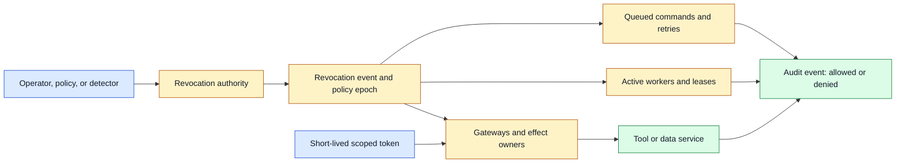
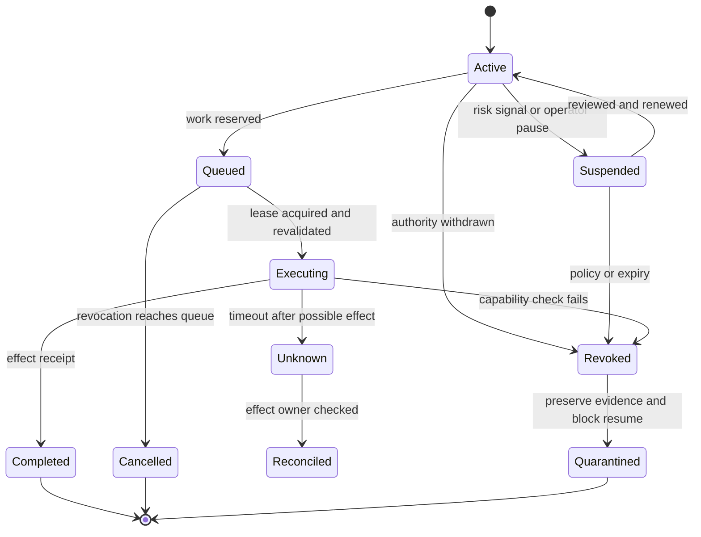

# Revocation
Status: draft — expansion pending
Sources: [Google DeepMind — AI Control Roadmap](https://deepmind.google/blog/securing-the-future-of-ai-agents/)

## In one sentence

Revocation is the distributed process of withdrawing an agent’s authority from active sessions, queued work, credentials, leases, caches, and retries quickly enough that a previously allowed operation cannot continue under stale permission.

## Background: what existed before

In a simple request-response application, access can be withdrawn by changing a user’s role in the database. The next request checks the new role and is denied. Long-lived web sessions and cached tokens already make this harder: a session may retain a claim, a service may cache a permission, and an in-flight request may have passed authorization before revocation.

Agent systems multiply the state. An agent can run for minutes or hours, hold several tool capabilities, queue future work, delegate to child workers, and retry after failures. It may have received a document, secret, browser session, or temporary credential before the operator notices a problem. Removing the top-level user role does not automatically stop a child process, invalidate a queued command, erase context, or prevent a retry.

**Revocation** withdraws authority or invalidates a capability. **Suspension** pauses execution while preserving the possibility of resume. **Termination** stops a run or process, though external effects may already exist. A **lease** is time-limited ownership of work; expiry can act as a bounded revocation mechanism. A **capability** is a token or handle granting a specific operation on a resource. A **cutoff time** is the latest time at which a token or operation remains valid.

## What changed and why now

Google DeepMind’s June 18, 2026 AI Control Roadmap frames capable agents as potential insider threats and describes controlled, incremental access with monitoring, prevention, and response. It distinguishes lower-risk asynchronous remediation from synchronous prevention for high-risk actions. The source is a source-reported framework; the revocation protocol in this lesson is an engineering design derived from the need to limit authority when behavior or policy changes.

The important change is treating authority as dynamic. An agent is not merely authorized at task start; permission must remain valid when it reads data, invokes a tool, commits a state change, or retries an uncertain operation. Revocation becomes a normal state transition with propagation guarantees, observability, and recovery semantics.

## Mental model

Think of authority as a temporary visitor badge rather than a permanent key. The badge names the building, room, purpose, and expiry; a security desk can invalidate it, and each sensitive door checks whether it is still valid. Taking the badge away does not erase anything the visitor already saw or undo a door that already opened. In an agent system, active workers, queued commands, caches, and child identities are all places where a stale badge might remain.

This model makes two responsibilities visible. First, revocation must propagate to every consumer that can still act. Second, the system must distinguish preventing a future action from repairing a completed one. A revoked agent cannot be allowed to mint a replacement badge or decide its own compensation. A new, explicitly authorized workflow must handle recovery.

## Impact on current processing and architecture

Use a central authority registry for principals, capabilities, policy epochs, and revocation events. Token issuers create short-lived, scoped credentials with an audience, resource, action, expiry, and policy version. Gateways check local cache plus a revocation signal. High-impact effect owners check the current epoch or introspect the token immediately before committing state. Workers heartbeat leases and stop when their capability is revoked.



There are two broad revocation strategies. **Reference revocation** keeps a server-side record and checks it when the capability is used. It can take effect quickly but adds an availability dependency. **Self-contained expiry** places scope and expiry in a signed token that a service can verify locally. It scales well during outages but cannot withdraw authority before expiry unless services consult a denylist, policy epoch, or short lifetime. High-risk actions commonly combine both.

Propagation is not instantaneous in a distributed system. A revocation event may be delayed by network partitions, consumer lag, cache TTL, or a worker that is not heartbeating. Define a maximum enforcement delay by operation class. A low-risk read may tolerate a bounded stale cache; a production deletion or credential release may require online introspection and fail closed. Do not claim “immediate” revocation unless the system can enforce that bound.

Queued work must be revoked as well as active work. When a user loses access, remove or tombstone queued commands that rely on the old capability. A queue consumer must revalidate before execution, not trust the producer’s earlier decision. Retries carry the original operation ID and should be denied if the capability epoch is stale. Keep denied records for audit without replaying their sensitive payload.



The state machine separates “stop using authority” from “undo effects.” Revocation can prevent a queued command or future retry, but it cannot erase an email already sent or a record already changed. Reconcile unknown operations and invoke a domain-specific compensation only when it is safe and authorized. Do not let the revoked agent decide how to restore authority or compensate itself.

## Token and lease design

A scoped token should identify issuer, subject, agent identity, parent delegation, audience, tenant, resource, action, constraints, issue time, expiry, and policy epoch. Avoid putting secrets or broad role names into model context. Give the tool worker an opaque capability and enforce it at the resource owner.

The effect owner should reject tokens with an old epoch or revoked ID. A cache may improve availability for low-risk reads, but its maximum staleness must be part of policy. Cache keys include tenant, resource, action, and policy version. A permission cache that ignores resource scope can turn one approval into cross-tenant access.

Leases prevent abandoned or duplicated workers from continuing forever. A worker renews while healthy, and the owner rejects commands after expiry. Renewal itself is an authorization event: it must check that the parent run, capability, actor, and policy remain valid. A worker should not renew a lease after revocation just because it still has a network connection.

Revocation events need ordering and durability. Use an event ID, principal or capability ID, policy epoch, effective time, reason code, issuer, and scope. Consumers should process duplicates idempotently and avoid applying an older event after a newer epoch. A device or worker that reconnects should fetch the current epoch before resuming.

Delegation complicates propagation. A parent agent may create child identities or pass a resource handle to another service. The child’s scope and expiry must be no broader or longer than the parent’s, and parent revocation should invalidate children. Do not let a child mint an independent credential that outlives the parent unless an explicit authority approves that transition.

## Real-world applications and constraints

In a coding agent, revocation can follow a detected secret access or unsafe command. Stop the run, revoke shell and network capabilities, cancel queued commands, preserve the diff and trace, and prevent a retry from obtaining a fresh credential automatically. File changes already made require review or rollback by a separate trusted process.

In customer support, an agent’s access can be withdrawn when a support session ends or a customer account is locked. Revoke account-edit capability, invalidate cached data handles, and ensure queued changes recheck identity and policy. A transcript containing old approval text must not revive the capability.

In deployment automation, revoke a release agent during an incident or after a key compromise. Stop new deployments, freeze queued jobs, invalidate artifact and environment permissions, and reconcile in-flight deployment status. Rollback may need a separate operator authorization; revocation should not make the old agent a privileged incident responder.

In data systems, revocation must reach query sessions, export jobs, vector retrieval, and cached results. A user losing access should not retain a pre-signed URL indefinitely. Expire handles, filter retrieval, invalidate caches, and record denied attempts. If an answer was already generated, apply retention and sharing policy to that output separately.

In robotics, an operator or safety system may revoke motion authority after a sensor fault or human presence detection. The controller must stop or enter a safe state independently of a language model’s cooperation. Network revocation may be delayed, so physical interlocks and short local leases provide a stronger immediate boundary.

In a long-running research agent, a task may spawn workers, reserve compute, and schedule future experiments. Revocation should cancel leases, remove pending jobs, block new tool credentials, and preserve observations. It should not delete raw evidence needed for an investigation. A human may later create a new run with a new identity and explicit scope.

## Engineering consequence

Design revocation as a measurable propagation workflow. Define which operations must stop synchronously, which may use bounded stale caches, and how long active work can continue after an event. Keep a deny decision visible and distinguish “revoked before effect” from “effect reconciled after revocation.”

Numbered local implementation steps:

1. Inventory active sessions, queued work, child agents, capabilities, credentials, leases, caches, and retry paths.
2. Classify each authority by resource, action, risk, expiry, and maximum acceptable revocation delay.
3. Issue short-lived scoped tokens with audience, tenant, resource, action, epoch, and expiry.
4. Add a durable revocation event with ID, scope, effective time, reason, and policy epoch.
5. Make gateways and effect owners reject revoked IDs or stale epochs before execution.
6. Make workers heartbeat leases and stop renewal when revocation or policy change arrives.
7. Revalidate queued work and retries; tombstone commands that depend on withdrawn authority.
8. Propagate revocation to child identities, delegated handles, caches, and provider sessions.
9. Reconcile in-flight unknown effects and separate compensation from authority restoration.
10. Measure propagation delay, stale-allow rate, denied-effect count, queue cancellation, and recovery outcome.

## Build it locally

Save this example as `revocation_registry.py` and run `python3 revocation_registry.py`. It models a policy epoch and a scoped capability. A worker can use the capability before revocation and is denied after the epoch advances. It does not implement cryptographic tokens or distributed delivery; it makes stale-authority behavior testable.

```python
from dataclasses import dataclass

@dataclass(frozen=True)
class Capability:
    agent: str
    resource: str
    action: str
    epoch: int

class Registry:
    def __init__(self):
        self.epochs = {}

    def issue(self, agent, resource, action):
        key = (agent, resource)
        epoch = self.epochs.get(key, 0)
        return Capability(agent, resource, action, epoch)

    def revoke(self, agent, resource):
        key = (agent, resource)
        self.epochs[key] = self.epochs.get(key, 0) + 1

    def check(self, capability, action):
        current = self.epochs.get((capability.agent, capability.resource), 0)
        if capability.action != action:
            return "deny: action scope"
        if capability.epoch != current:
            return "deny: revoked epoch"
        return "allow"

registry = Registry()
cap = registry.issue("agent-1", "repo-a", "read")
print(registry.check(cap, "read"))
registry.revoke("agent-1", "repo-a")
print(registry.check(cap, "read"))
```

The first check allows a read and the second denies the same capability after revocation. Add an expiry time, a child capability with a parent epoch, and a queue of commands. Test that queued commands are rechecked at execution and that a duplicate revocation event does not advance the epoch incorrectly. A production registry would need durable storage, authenticated events, concurrency control, and availability policy.

## Limits and failure modes

**Cache staleness** allows a revoked capability to work until TTL expires. Bound staleness by risk and require online checks for high-impact effects.

**Propagation delay** leaves workers active after revocation. Measure event-to-enforcement time and use leases or fail-closed communication for critical operations.

**Queued replay** executes old work after authority withdrawal. Tombstone commands and revalidate immediately before execution.

**Child escape** lets delegated workers retain authority after a parent is revoked. Bind child scope and expiry to parent epoch and reject stale descendants.

**Credential residue** leaves secrets in environment variables, browser sessions, or model context. Revoke credentials, close sessions, rotate secrets, and prevent new data release; revocation cannot unsee data already delivered.

**In-flight effect** completes after revocation because it passed the gate earlier. Record the cutoff, reconcile status, and apply domain compensation under separate authority.

**Fail-open outage** lets a service continue when it cannot learn revocation. Define offline behavior per operation and fail closed for irreversible effects.

**Epoch races** apply events out of order. Use monotonic epochs, durable ordering, idempotent processing, and reject older state.

**Overbroad kill switch** revokes an entire tenant or fleet for a narrow anomaly. Scope the event, require approval for broad revocation, and preserve a recovery path.

**False revocation** interrupts legitimate work and may lose progress. Record reason and owner, checkpoint safely, and make reauthorization a new explicit action.

**Audit confusion** records only that a token was revoked, not whether it was used before or after the cutoff. Log decision time, effect time, token epoch, and owner receipt.

## Mini exercise (15–30 min)

Extend the local registry with a queue, expiry, parent epoch, and operation ID. Enqueue one read and one delete, revoke the agent, and verify both are rechecked before execution. Simulate a delete that passed authorization but timed out; represent it as unknown and require reconciliation. Add a duplicate and out-of-order revocation event and ensure the registry never moves backward.

## Interview Q&A

**Q: Is deleting a user’s role enough to revoke an agent?**
No. Active sessions, cached decisions, credentials, leases, child workers, queued commands, and retries may retain authority. Each must be stopped, expired, or revalidated.

**Q: Why use short-lived tokens if revocation exists?**
Short lifetimes limit the maximum stale authority during propagation failure. High-risk operations may still need an online revocation or epoch check.

**Q: What should happen to queued work?**
Cancel or tombstone work dependent on the old capability and recheck identity, policy, scope, and freshness immediately before execution.

**Q: Can revocation undo an effect?**
Usually not automatically. It prevents future use; an in-flight or completed effect needs status reconciliation and a separately authorized compensation.

**Q: How do you prove revocation worked?**
Test active, queued, delegated, cached, and retry paths; measure event-to-denial delay; and retain records distinguishing denied-before-effect from reconciled-after-effect.

## Glossary

- **Capability:** Scoped authority to perform an action on a resource.
- **Cutoff time:** Latest time an authority or operation remains valid.
- **Epoch:** Monotonic policy version used to invalidate older capabilities.
- **Lease:** Time-limited ownership of work that requires renewal.
- **Propagation delay:** Time between revocation issuance and enforcement at a consumer.
- **Revocation:** Withdrawal or invalidation of authority.
- **Reconciliation:** Checking the actual outcome of an uncertain operation.
- **Suspension:** Temporary pause that may allow a controlled resume.
- **Termination:** Stopping a run or process.
- **Tombstone:** Durable record that queued work is cancelled and must not execute.

## References

- [Google DeepMind: Securing the future of AI agents](https://deepmind.google/blog/securing-the-future-of-ai-agents/) — June 2026 AI Control Roadmap, controlled access, monitoring, prevention, and response.
- [Google DeepMind AI Control Roadmap](https://storage.googleapis.com/deepmind-media/DeepMind.com/Blog/securing-the-future-of-ai-agents/ai-control-roadmap.pdf) — source-linked technical framework.
- [OWASP Generative AI Security Project](https://owasp.org/www-project-generative-ai-security/) — agent and application security context.
- [MITRE ATT&CK](https://attack.mitre.org/) — threat-modeling context referenced by the source.

## Claim ledger

| Claim | Source | Fact or inference |
|---|---|---|
| Google DeepMind’s June 18, 2026 roadmap treats capable agents as potential insider threats. | Google DeepMind | Fact about source framing |
| The roadmap describes controlled access, monitoring, prevention, response, and risk-scaled timing. | Google DeepMind | Fact about source |
| Revocation must reach active sessions, queues, credentials, leases, caches, and retries. | Distributed-systems security | Engineering inference |
| Short-lived scoped capabilities and policy epochs limit stale authority. | Authorization design | Engineering inference |
| In-flight effects require reconciliation rather than assuming revocation undid them. | Distributed-systems design | Engineering inference |
