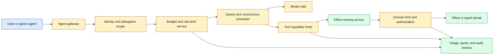
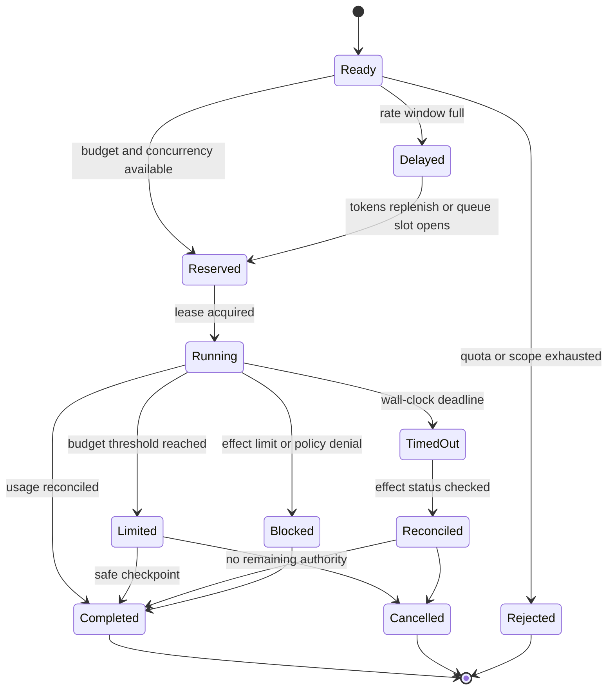

# Agent rate limits
Status: draft — expansion pending
Sources: [Google DeepMind — multi-agent safety](https://deepmind.google/blog/investing-in-multi-agent-ai-safety-research/)

## In one sentence

Agent rate limits bound how quickly and how much an agent, delegated worker, tenant, or tool capability may consume resources or create effects, turning runaway planning and multi-agent amplification into a contained operational failure.

## Background: what existed before

Web services traditionally limited requests by IP address, API key, user, or account. A token bucket or leaky bucket protected a service from bursts, while quotas controlled daily or monthly usage. These controls assumed that one caller generated a reasonably visible stream of requests.

An agent produces a different workload. One user request can become dozens of model calls, retrievals, tool calls, retries, subprocesses, and child-agent messages. A failed tool can trigger a retry loop. A multi-agent workflow can multiply traffic at every hop. A legitimate task can therefore overload a service without malicious intent, while a compromised agent can use its valid credentials at machine speed.

Rate limiting is not only billing protection. It limits blast radius, queue growth, data-access volume, external messages, physical commands, and the number of opportunities an agent has to try a risky action. A limit should be attached to the identity and capability that matter, not only to the network address.

An **agent run** is one bounded workflow with a stable identity. A **principal** is a user, service, agent, or tenant to which a policy applies. A **quota** is an allowance over a longer period, while a **rate limit** controls activity over a time window. **Concurrency** is the number of active operations. A **token bucket** allows bursts up to a capacity while replenishing tokens at a fixed rate. A **cost budget** limits estimated or actual spend. A **blast radius** is the scope of resources or people affected.

## What changed and why now

Google DeepMind’s June 11, 2026 multi-agent safety research call describes a future in which agents built by different organizations communicate, negotiate, and transact. It identifies agent infrastructure—including identity, reputation, and commitment protocols—as a research priority and calls for work on oversight and control at scale. Those are source-reported motivations, not a specific rate-limit standard.

The engineering change is to treat an agent workflow as a budgeted distributed system. Limits must cover model calls, tool calls, child-agent fan-out, queue occupancy, data volume, retries, wall-clock time, spend, and externally visible effects. Each operation should consume budget from the appropriate scopes and return a typed result when the budget is exhausted.

## Mental model

Think of an agent run as a project team with a prepaid card, a limited number of workers, and a finite number of doors it may open. The parent receives the card, delegates smaller allowances to children, and must stop when the balance or deadline is exhausted. Each door—the database, email service, deployment system, or actuator—keeps its own lock and counter. This prevents a child from spending the parent’s full allowance repeatedly and prevents a central office rule from being bypassed at the door.

The model can plan how to spend the budget, but it cannot increase the budget. A delay is not a denial, a denial is not a transient network error, and an unknown effect is not permission to retry. Those states need to be visible to the orchestrator so it can reduce scope, ask for approval, or stop safely.

## Impact on current processing and architecture

The gateway authenticates the principal and run, then the budget service evaluates limits at multiple scopes. A scheduler reserves concurrency and estimated resource cost before dispatch. Tool services enforce their own per-capability limits. An effect owner applies domain-specific limits to actions such as messages, payments, deployments, or actuator commands. Telemetry records accepted, delayed, rejected, and expired work.



Use hierarchical budgets. A tenant may have a monthly spend quota. A user may have a per-minute request limit. A run may have a maximum duration, model-call count, tool-call count, and total token estimate. A capability may allow only ten writes per hour. A child agent receives a sub-budget that cannot exceed the parent’s remaining budget. The request is eligible only when every applicable scope has capacity.

Do not decrement only after an operation completes. Reserve estimated cost and concurrency before dispatch, then reconcile with actual usage. If a model call produces more tokens than expected or a tool returns a large dataset, charge the difference or stop the run. Release reservations on typed failure and expiry. A crashed worker requires lease expiry so capacity is not held forever.

Rate limits should be enforced at the effect owner as well as the gateway. A gateway can be bypassed by another service, a misconfigured retry, or a child agent. The email service limits messages; the payment service limits transfers; the file service limits destructive operations. A global limit protects infrastructure while a domain limit protects people and business state.



The state machine separates throttling from denial. `Delayed` means the operation may run later if its deadline and authority remain valid. `Rejected` means no capacity or policy permits it. `Limited` means a run has reached a warning or checkpoint threshold and should reduce scope, ask for approval, or stop. A timeout after a possible effect goes to reconciliation, not an automatic retry.

## Choosing the right limiting dimensions

**Request count** is simple but weak for variable-cost work. One request might be a short classification and another a two-hour video render. Combine requests with estimated tokens, decoded bytes, duration, or compute units.

**Token limits** help control model spend and context work, but they do not measure tool effects or media decoding. A small prompt can trigger a large database export. Keep model budgets and effect budgets separate.

**Concurrency limits** protect memory and queues. They are important for long-running agents because a few active workflows can hold many tool sessions. Use leases and fair scheduling so one tenant cannot consume every slot.

**Fan-out limits** cap the number of child agents, parallel branches, recipients, or destinations. A parent’s budget should cover the maximum aggregate fan-out, not only each child individually.

**Retry limits** cap attempts per operation and a total retry budget. Exponential backoff reduces synchronized storms but does not address duplicate side effects; idempotency and reconciliation remain necessary.

**Data-volume limits** constrain rows, bytes, frame count, audio duration, or exported records. Put these at data-release boundaries because model token limits do not prevent a sensitive query from returning too much.

**Effect limits** constrain messages, transfers, deletions, deployments, or actuator commands. They should be domain-aware: ten read calls may be acceptable while ten password resets are not.

**Time limits** bound wall-clock duration and idle time. Long-running workflows need checkpoints and resumable state. A deadline should be checked before every new step; it should not be treated as a suggestion in the prompt.

## Fairness and backpressure

A limiter protects a shared service only if it schedules fairly. A global queue can let one tenant or run monopolize capacity. Use per-principal queues, weighted fair scheduling, and reserved capacity for high-priority operations. Priority must not bypass safety or authorization. A high-priority agent still needs a valid capability.

When a limit is reached, return a typed response with retry-after, remaining budget where safe, reason, and whether the operation was accepted. Do not make the model guess from a generic “try again.” The orchestrator can choose to wait, reduce scope, ask a user, route to a human, or stop. Include a total workflow deadline so backoff does not become an infinite loop.

Backpressure must propagate. If a tool queue is full, the agent scheduler should stop issuing new model steps rather than generating more plans. If a review queue is overloaded, publication should hold rather than silently bypass review. If a media decoder is saturated, admission should reject or lower resolution according to policy. A queue is a stateful resource, not an invisible implementation detail.

Limits themselves can leak information. A caller may infer another tenant’s activity from shared rate responses or timing. Use tenant isolation and avoid exposing global capacity. Metrics should support operations without revealing sensitive per-user patterns to unauthorized observers.

## Real-world applications and constraints

In customer support, limit account reads and mutations per run, user, and support identity. A model that repeatedly searches for a customer record may be confused, not malicious. A rate limit buys time for review and prevents broad enumeration. Account changes need stricter effect limits than knowledge-base reads.

In coding agents, cap shell calls, subprocesses, network destinations, changed files, diff size, and total runtime. A loop that keeps running tests can exhaust compute without changing state; a loop that repeatedly edits deployment files has a larger risk. Charge child workers against the parent’s budget and stop when the workspace or branch scope changes.

In data analysis, cap query count, rows, bytes, columns, and export destinations. A model can produce a small SQL string that returns millions of sensitive records. The database gateway and export service must enforce limits independently of the model context window.

In media generation, cap source duration, decoded frames, output resolution, renders, storage, and egress. A low-resolution draft tier can preserve iteration under a budget, but a final high-resolution render needs separate cost and publication policy. Retries after a provider timeout must not create unlimited paid artifacts.

In cyber defense, limits should constrain scope and speed of reconnaissance, scanning, credentials, network destinations, and remediation. Defensive intent does not justify unrestricted automation. A kill switch or capability revocation should override a remaining quota.

In robotics, rate limits are part of control safety. Bound commands per second, movement distance, speed changes, workspace, and retries. A model should not issue a stream of actuator commands faster than the controller can validate. Safety interlocks and emergency stop remain stronger controls than an application counter.

In multi-agent markets or negotiations, cap messages, counterparties, spend, commitments, and fan-out. The June source highlights that interactions between many agents may create collective behaviors that are hard to predict. Per-agent limits are necessary but may not prevent system-wide cascades; shared-resource and population-level controls are also needed.

## Engineering consequence

Write a budget contract for each agent capability. The contract names principal, tenant, run, resource, action, rate, burst, concurrency, cost, time, data, fan-out, retry, and effect limits. It also names what happens at exhaustion: delay, reduce scope, ask, review, or stop.

Numbered local implementation steps:

1. Inventory model calls, tool calls, data releases, child agents, queues, retries, and external effects.
2. Classify each operation by resource cost, reversibility, sensitivity, and blast radius.
3. Define hierarchical scopes for tenant, user, parent run, child run, capability, and effect owner.
4. Choose dimensions that match cost: count, tokens, bytes, duration, concurrency, fan-out, and spend.
5. Reserve budget before dispatch and reconcile actual usage after completion or failure.
6. Add leases, deadlines, idempotency keys, and status reconciliation for long or effectful work.
7. Enforce domain-specific limits at the resource owner, not only at the central gateway.
8. Implement fair queues, backpressure, typed denials, retry-after, and total workflow deadlines.
9. Measure accepted, delayed, rejected, exhausted, retried, and effectful operations by principal and scope.
10. Test burst, fan-out, child-agent inheritance, provider outage, queue overload, stale reservation, and duplicate retry.

## Build it locally

Save this example as `agent_budget.py` and run `python3 agent_budget.py`. It implements a small token bucket and a per-run effect quota using only the standard library. The clock is supplied to make tests deterministic. It is a teaching example, not a distributed limiter; production systems need atomic storage, clock policy, leases, and owner-side enforcement.

```python
from dataclasses import dataclass

@dataclass
class Bucket:
    capacity: float
    refill_per_second: float
    tokens: float
    last_time: float

    def take(self, amount, now):
        elapsed = max(0.0, now - self.last_time)
        self.tokens = min(self.capacity,
                          self.tokens + elapsed * self.refill_per_second)
        self.last_time = now
        if self.tokens < amount:
            return False
        self.tokens -= amount
        return True

class RunBudget:
    def __init__(self, calls, effects):
        self.calls = calls
        self.effects = effects

    def reserve(self, call_cost, effect=False):
        if self.calls < call_cost:
            return "deny: call budget"
        if effect and self.effects <= 0:
            return "deny: effect budget"
        self.calls -= call_cost
        if effect:
            self.effects -= 1
        return "allow"

bucket = Bucket(2, 1, 2, 0.0)
for now in (0.0, 0.0, 0.0, 1.0):
    print("request", now, bucket.take(1, now))
budget = RunBudget(calls=3, effects=1)
print(budget.reserve(1))
print(budget.reserve(1, effect=True))
print(budget.reserve(1, effect=True))
```

The bucket permits two immediate requests, rejects the third, and permits another after one second of refill. The run budget permits model-call cost and only one effect. Extend it with parent and child budgets, a wall-clock deadline, and a retry counter. Then add a reservation that is released on typed failure. In a real multi-worker service, updates must be atomic or coordinated by a strongly consistent budget owner.

## Limits and failure modes

**Wrong dimension** occurs when request count limits a variable-cost video or data export. Combine count with bytes, duration, tokens, or compute units.

**Per-IP weakness** lets one principal distribute requests across addresses or lets many principals exhaust one tenant. Key limits by authenticated identity, run, capability, and owner.

**Fan-out multiplication** lets every child receive the parent’s full quota. Allocate a bounded sub-budget and charge aggregate work to the parent.

**Reservation leak** leaves capacity consumed after a crashed worker. Use leases, expiry, and reconciliation.

**Retry storm** occurs when every worker retries at once after an outage. Use backoff, jitter, total deadlines, and a circuit breaker; use idempotency for effects.

**Queue starvation** lets one tenant monopolize workers. Use fair scheduling and reserved capacity without bypassing policy.

**Silent degradation** hides that a limit forced lower resolution, fewer frames, or a partial result. Return a typed status and record the degraded scope.

**Effect duplication** occurs when a limiter counts attempts but not committed operations. Reconcile owner status and use idempotency keys.

**Cross-layer bypass** occurs when the gateway limits but the tool owner does not. Enforce domain limits where state changes or data releases occur.

**Clock disagreement** makes window calculations inconsistent. Use a trusted time source or server-owned windows and test skew.

**Global leakage** reveals another tenant’s activity through shared queue timing or remaining capacity. Isolate budgets and restrict metrics.

**Limit escalation** occurs when a model or child agent requests a larger quota to finish its plan. Quota changes need an external policy and authorized owner.

## Mini exercise (15–30 min)

Extend the local example with a parent budget of ten calls, two child budgets, and a one-effect limit. Create three children that request four calls each and verify that aggregate usage cannot exceed the parent. Add a simulated timeout after an effect reservation and reconcile it before retrying. Finally, implement a fair queue for two tenants and show that one burst cannot consume every slot.

## Interview Q&A

**Q: Why are agent rate limits different from API rate limits?**
One user request can fan out into model calls, tools, retries, child agents, data releases, and effects. Limits need hierarchical identity, workflow budgets, and domain-specific dimensions rather than only request count or IP.

**Q: Where should a limit be enforced?**
At the central gateway for global protection and at the effect or data owner for bypass resistance. A payment, export, email, or actuator service must enforce its own limits.

**Q: Should a child agent inherit the parent quota?**
Only through an explicit sub-budget. Charge aggregate work to the parent and prevent a child from minting broader or longer authority.

**Q: What happens when a limit is exhausted?**
Return a typed state: delay, reduce scope, ask for approval, review, or stop. Include a deadline and do not let the model create an unbounded retry loop.

**Q: Do rate limits prevent unsafe behavior?**
They reduce speed, volume, and blast radius but do not decide whether an individual action is authorized or safe. Combine them with identity, policy enforcement, sandboxing, monitoring, and review.

## Glossary

- **Backpressure:** Slowing or rejecting upstream work when capacity is full.
- **Burst:** Short activity spike allowed above a steady refill rate.
- **Concurrency:** Number of active operations.
- **Fan-out:** Number of child branches, agents, recipients, or destinations created by a workflow.
- **Quota:** Longer-window allowance for usage or spend.
- **Rate limit:** Constraint on activity over time.
- **Token bucket:** Limiter that replenishes tokens at a fixed rate and permits bounded bursts.
- **Sub-budget:** Portion of a parent budget delegated to a child run.
- **Effect limit:** Domain-specific bound on externally visible operations.
- **Lease:** Time-limited reservation or ownership that expires without renewal.

## References

- [Google DeepMind: Investing in multi-agent AI safety research](https://deepmind.google/blog/investing-in-multi-agent-ai-safety-research/) — June 11, 2026 multi-agent interaction, infrastructure, oversight, and population-level safety context.
- [Google DeepMind: Securing the future of AI agents](https://deepmind.google/blog/securing-the-future-of-ai-agents/) — June 18, 2026 control, monitoring, prevention, and response context.
- [MITRE ATT&CK](https://attack.mitre.org/) — threat-modeling context for agent actions and techniques.
- [OWASP Generative AI Security Project](https://owasp.org/www-project-generative-ai-security/) — application security and agent-risk context.

## Claim ledger

| Claim | Source | Fact or inference |
|---|---|---|
| Google DeepMind’s June 11 call describes agents communicating, negotiating, and transacting across digital environments. | Google DeepMind | Fact about source |
| The call identifies identity, reputation, commitment, oversight, and control as multi-agent safety research areas. | Google DeepMind | Fact about source |
| Agent workflows require limits on fan-out, retries, data volume, concurrency, spend, and effects. | Distributed-systems security | Engineering inference |
| Hierarchical sub-budgets prevent child agents from multiplying parent authority. | Authorization and quota design | Engineering inference |
| Rate limits reduce blast radius but do not replace authorization or synchronous safety gates. | Control architecture | Engineering inference |
