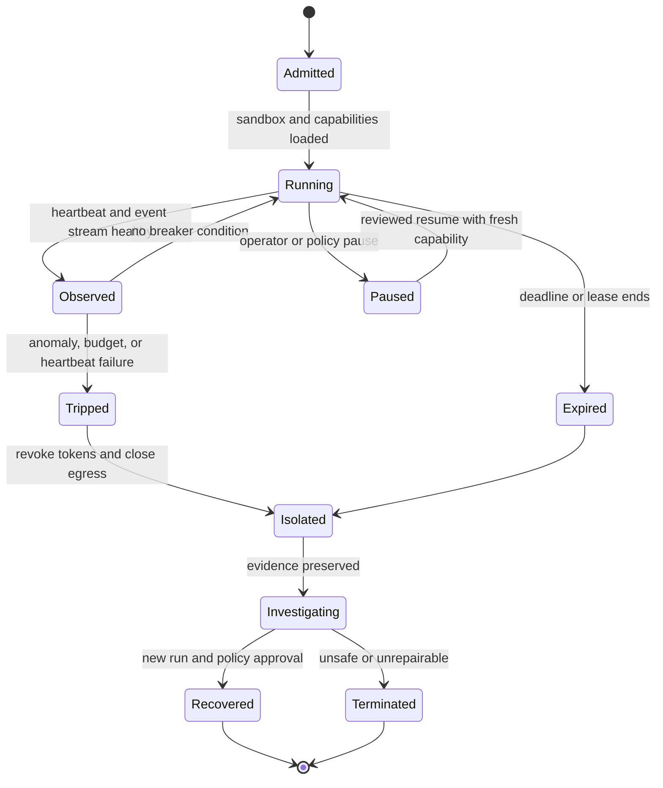

# Agent containment
Status: draft — expansion pending
Sources: [Google DeepMind — AI Control Roadmap](https://deepmind.google/blog/securing-the-future-of-ai-agents/)

## In one sentence

Agent containment limits what a capable or malfunctioning agent can reach, change, or communicate so that a detection or control failure becomes a bounded incident rather than unrestricted system compromise.

## Background: what existed before

Traditional application isolation protected processes and services from one another. A container or virtual machine limited filesystem and network access, a firewall restricted destinations, and a service account limited API operations. Incident responders could disable a host, rotate credentials, or block traffic after detecting a problem.

AI agents add a planner that can select actions, adapt to tool results, and continue for many steps. A coding agent may read files and run commands. A browser agent may navigate untrusted pages. A research agent may fetch documents and send messages. A support agent may access customer records. If the agent is confused, manipulated, compromised, or simply over-eager, broad permissions make the consequences larger.

**Containment** is the collection of boundaries that restricts blast radius before and during execution. **Isolation** separates a workload from other workloads and sensitive host resources. **Egress** is outbound network or data flow. A **circuit breaker** stops or trips a workflow after a threshold or failure pattern. A **sandbox** is an execution environment with restricted resources and permissions. **Blast radius** is the set of resources or people an error can affect.

## What changed and why now

Google DeepMind’s June 18, 2026 AI Control Roadmap describes treating increasingly capable agents as potential insider threats and combining traditional safeguards with model alignment, monitoring, prevention, and response. It presents the analogy of dual controls and describes risk-scaled protections. The source is a framework and source-reported roadmap; the concrete isolation design below is an engineering inference.

The change is that an agent’s runtime must be designed as a potentially untrusted workload even when the user asked for a legitimate task. Prompt injection can arrive through data. A model can discover a surprising sequence of valid actions. A child agent can multiply work. A model may try to evade monitoring or exploit a tool’s error behavior. Containment limits consequences while other controls detect and decide.

## Mental model

Think of containment as the watertight compartments in a ship. A leak in one compartment should not flood the entire vessel. The compartment does not determine whether the leak was malicious, and it cannot undo water that already reached another room; it buys time, limits spread, and gives responders a controlled place to investigate. For an agent, the compartments are filesystem scope, network egress, credentials, tools, budgets, child identities, and effect gateways.

This model also explains why containment is not a single sandbox checkbox. A process may be isolated from the host but still have a powerful cloud credential. A network may be blocked while a shared writable directory leaks data. A breaker may pause one worker while a child keeps running. Effective containment requires overlapping boundaries and a known response when one boundary fails.

## Impact on current processing and architecture

Run agent work inside a boundary with a dedicated identity, restricted filesystem, no network by default, CPU and memory limits, process limits, and bounded output. Provide fake or scoped services for tests. Keep production credentials, hidden evaluation data, and control-plane secrets outside the sandbox. Route required effects through an external gateway that checks policy, identity, target, and approval.

```mermaid
flowchart LR
    U[User task] --> G[Agent gateway]
    G --> S[Sandbox admission]
    S --> A[Isolated agent runtime]
    A --> F[Read-only or scoped files]
    A --> N[Denied network by default]
    A --> T[Capability-limited tool gateway]
    T --> P[Policy and approval gate]
    P --> X[External effect owner]
    M[Monitor and circuit breaker] --> A
    M --> T
    M --> P
    E[Evidence store] <-- A
    E <-- T
    classDef input fill:#dbeafe,stroke:#1d4ed8,color:#111827;
    classDef control fill:#fef3c7,stroke:#b45309,color:#111827;
    classDef effect fill:#dcfce7,stroke:#15803d,color:#111827;
    class U input;
    class G,S,A,F,N,T,M,E control;
    class P,X effect;
```

Containment is layered. A process namespace or container may limit filesystem and process access. A network policy controls destinations and ports. A credential broker issues short-lived, scoped capabilities. A gateway validates tools and effects. A monitor observes behavior and trips a breaker. A human can pause or take over. No layer should be treated as a complete safety guarantee.

The sandbox boundary must be specific. “No network” should mean no DNS, no proxy escape, no host socket, no metadata-service access, and no inherited credentials. “Read-only workspace” should exclude writable mounts, temporary directories that are later trusted, and symlink paths that escape the intended root. “Limited CPU” should include process count and wall-clock timeout so a workload cannot fork or spin indefinitely.



A circuit breaker should fail safe and be reversible. It can trip on too many denied calls, unexpected egress, scope violations, rapid fan-out, excessive data volume, or a monitor alert. A breaker should stop new work, revoke capabilities, and preserve state without automatically deleting evidence. Resume requires a new authorization and should not let the same agent continue from an unreviewed context.

Containment must account for partial effects. A sandbox can stop future commands but cannot undo a message already sent, a database row already changed, or a file already uploaded. The system needs operation IDs, receipts, and reconciliation. If a worker’s state is uncertain, isolate it and ask the effect owner what happened. Do not restore network or credentials merely to let the model investigate itself.

## Isolation patterns and trade-offs

**Process isolation** is lightweight and useful for low-risk parsers or local transformations. It depends on the host kernel and runtime configuration. A vulnerability or privileged socket can break the boundary.

**Containers** package dependencies and provide namespaces, cgroups, filesystem controls, and network policy. They are not the same as a virtual machine and should not be treated as protection against every hostile workload. Harden the runtime, drop privileges, remove unnecessary capabilities, and keep the host updated.

**Virtual machines** provide a stronger boundary for untrusted code at greater startup and resource cost. They are useful when a task needs a broader operating-system environment or a different kernel. Image provenance, hypervisor assumptions, and device passthrough remain relevant.

**Remote sandboxes** move execution into a controlled service and make policy centralized, but inputs and outputs cross a network. The service needs tenant isolation, data retention, authentication, and availability design. A remote sandbox is not automatically safe if it has broad credentials or unrestricted egress.

**Capability proxies** give an agent narrow handles instead of ambient credentials. A proxy can expose `read_ticket(id)` without exposing a database password. It can also redact fields, enforce quotas, and create audit events. The proxy becomes a critical enforcement point and must validate every call.

**Synthetic environments** replace production services with fake APIs and seeded data for development and evaluation. They enable failure injection and reduce impact, but a test may miss production-specific behavior. Record which services are simulated and test the boundary between simulation and real deployment.

## Egress and data release

Outbound access is often the shortest path from a confused agent to a large incident. Default deny is easier to reason about than trying to block every dangerous destination. If network access is needed, use an allowlist of origins, methods, paths, and data classes. Restrict DNS, redirects, uploads, and response size. A URL allowlist should not be bypassable through open redirects or an HTTP proxy.

Data release needs its own containment. Limit rows, columns, file paths, media duration, frame count, and export destinations. Redact secrets before model context. A model that has read a credential may leak it through an output channel even if the network is later blocked. Keep raw secrets outside the sandbox and issue opaque receipts.

Egress monitoring should record destination identity, bytes, request class, tool, run, and policy result without copying sensitive payloads by default. A model can encode data in filenames, timing, error messages, or repeated small requests, so monitoring should consider behavior, not only obvious uploads. Rate and volume limits reduce covert-channel capacity but do not prove no leakage.

## Real-world applications and constraints

For a coding agent, mount only the workspace or a read-only repository snapshot. Give shell access a separate sandbox identity with no production credentials and no network by default. Route package installation, pull requests, and deployment through explicit gateways. On a suspicious command, pause the run, preserve the diff and event trace, revoke the capability, and require review.

For a browser agent, isolate cookies and profiles, deny access to host files, allowlist origins, limit downloads and uploads, and treat page content as untrusted. A screenshot or page text may contain an injection. The browser sandbox limits damage, while the action gateway decides whether a form submission or file upload is authorized.

For customer support, expose narrow methods instead of a database connection. A support agent may read a ticket and draft a response but not query arbitrary customers or change authentication factors. The data gateway filters fields and logs access. If the run is anomalous, revoke the customer capability and prevent queued changes from executing.

For cyber defense, sandbox scanning and analysis tools, use synthetic targets for evaluation, and require scope and rules of engagement. Defensive purpose does not make a broad credential safe. High-impact commands need synchronous prevention, network boundaries, and operator control.

For research agents, provide fake instruments and datasets before real systems. Limit compute, external messages, and data export. A scientific result generated inside a sandbox remains a proposal until validated against trusted measurements. Preserve the environment image and input hashes so a run can be investigated.

For robotics, a sandbox is not enough because physical effects occur outside the process. The control system needs workspace limits, speed limits, collision detection, emergency stop, and a model-independent safety layer. Network isolation protects digital systems but does not prevent an unsafe trajectory generated from local state.

For multi-agent workflows, isolate each child identity and budget. Prevent one child from directly contacting every other child or external service. Use an authenticated broker for messages, cap fan-out, record parent-child lineage, and revoke descendants when a parent is contained. Population-level interactions can create load or behavior that no single agent exceeds alone.

## Engineering consequence

Containment should be specified as an allowed capability surface, not a list of hopeful prompt instructions. Write down permitted files, processes, network destinations, data fields, tools, resource budgets, and effect paths. Verify the boundary with negative tests that try to escape it.

Numbered local implementation steps:

1. List the agent’s required inputs, tools, files, networks, data releases, and external effects.
2. Classify each capability by sensitivity, reversibility, and blast radius.
3. Build an isolated runtime with non-root identity, read-only mounts, resource limits, process limits, and explicit egress policy.
4. Keep production credentials and control-plane secrets outside the runtime.
5. Expose narrow capability proxies and validate target, arguments, tenant, and policy on every call.
6. Add leases, deadlines, circuit-breaker thresholds, and an operator pause path.
7. Record run, child, operation, tool, resource, and artifact IDs in a protected evidence stream.
8. Define partial-effect reconciliation and compensation separately from stopping the agent.
9. Test filesystem, network, credential, data-volume, subprocess, symlink, retry, and child-agent escapes.
10. Canary changes by workload and hardware, and require fresh authorization before resuming a contained run.

## Build it locally

Save this example as `containment_policy.py` and run `python3 containment_policy.py`. It models a capability surface and a circuit breaker based on denied actions and outbound bytes. It does not create a real sandbox; it demonstrates the policy decisions that a real runtime and gateway must enforce.

```python
from dataclasses import dataclass

@dataclass
class Capability:
    allowed_paths: tuple[str, ...]
    allowed_hosts: tuple[str, ...]
    max_egress: int

class Breaker:
    def __init__(self, denied_limit):
        self.denied_limit = denied_limit
        self.denied = 0
        self.tripped = False

    def check(self, path, host, egress, capability):
        if self.tripped:
            return "deny: breaker tripped"
        allowed = (path.startswith(capability.allowed_paths) and
                   host in capability.allowed_hosts and
                   egress <= capability.max_egress)
        if not allowed:
            self.denied += 1
            if self.denied >= self.denied_limit:
                self.tripped = True
            return "deny: capability boundary"
        return "allow"

capability = Capability(("workspace/",), ("docs.internal",), 1000)
breaker = Breaker(denied_limit=2)
for request in [("workspace/a.txt", "docs.internal", 100),
                ("/etc/passwd", "docs.internal", 10),
                ("workspace/b.txt", "evil.example", 10),
                ("workspace/c.txt", "docs.internal", 10)]:
    print(request, breaker.check(*request, capability))
```

The first request is allowed. Two boundary violations trip the breaker, so the final request is denied even though its path and host would otherwise fit. Extend the example with a capability expiry, a read/write operation, and a parent run ID. Then add an explicit `pause` state and a resume rule that requires a new capability. A production system must enforce the same policy in the filesystem, network, and effect-owning services; a Python function alone cannot contain a process.

## Limits and failure modes

**Sandbox escape** uses a vulnerable runtime, privileged socket, writable host mount, or kernel flaw. Minimize privileges, patch, isolate, and test escape paths.

**Credential leakage** occurs when secrets enter environment, files, prompts, or outputs. Use short-lived proxies, keep secrets outside context, and rotate after exposure.

**Egress bypass** uses DNS rebinding, redirects, proxies, alternate protocols, or encoded data. Enforce destination and method at the network gateway and monitor actual connections.

**Writable shared state** lets one run poison another. Use tenant-scoped temporary storage, immutable inputs, and explicit artifact ownership.

**Overbroad mounts** expose credentials, host sockets, or unrelated repositories. Define an allowlist and test negative paths and symlinks.

**Breaker failure** leaves an agent running after a threshold or trips so broadly that essential safety response is blocked. Make breaker state durable, test fail-closed behavior, and scope it to the capability or run when possible.

**Partial effect** occurs before containment reaches an owner. Preserve operation IDs, reconcile status, and use separate authorized compensation.

**Monitoring blindness** occurs when the model acts through a tool or child agent that emits no trace. Require brokered tools, parent-child identity, and event coverage checks.

**Synthetic-environment gap** occurs when a safe testbed does not resemble production. Version environments, inject realistic failures, and test promotion boundaries before real access.

**Resource exhaustion** occurs through subprocesses, memory, disk, frame decode, or queue fan-out. Apply cgroups or equivalent limits, deadlines, quotas, and backpressure.

**Resume abuse** occurs when a contained run resumes with its old credentials or unreviewed context. Revoke old capabilities and start a new authorized phase with explicit state.

## Mini exercise (15–30 min)

Extend the local containment policy with write permissions, a child capability, expiry, and a total egress budget. Simulate a path escape, hostile network destination, oversized upload, and child request. Trip the breaker after two violations, revoke the child, and prove that a resume requires a new capability. Write which controls must be enforced by the runtime, gateway, and effect owner.

## Interview Q&A

**Q: Is a container a complete containment boundary?**
No. It is one isolation layer. Runtime, kernel, mounts, credentials, network, tools, policy, monitoring, and effect owners must all be configured and tested.

**Q: Why deny network by default?**
Outbound access enables data exfiltration, arbitrary downloads, command channels, and unexpected side effects. Allow only named destinations and operations required by the task.

**Q: What should happen when a breaker trips?**
Stop new work, revoke capabilities, close or isolate egress, preserve evidence, and move to investigation. Resume requires fresh authorization; a breaker is not an automatic repair.

**Q: Can containment undo a completed action?**
Usually not. It limits future actions. Completed or unknown effects need owner reconciliation and separately authorized compensation.

**Q: How should child agents be contained?**
Give each a scoped identity and sub-budget, broker messages and tools, preserve parent-child lineage, cap fan-out, and revoke descendants when the parent is contained.

## Glossary

- **Blast radius:** Resources or people an error can affect.
- **Capability surface:** Explicit set of files, tools, networks, data, and effects available to a run.
- **Circuit breaker:** Control that stops or limits work after a defined condition.
- **Containment:** Limiting an active or potential failure’s reach.
- **Egress:** Outbound network or data flow.
- **Isolation:** Separating a workload from other workloads and sensitive resources.
- **Sandbox:** Restricted execution environment.
- **Scope:** Resource, action, tenant, duration, and data limits on authority.
- **Synthetic environment:** Fake or simulated service used for safe development and evaluation.
- **Capability proxy:** Narrow service interface that mediates access instead of exposing ambient credentials.

## References

- [Google DeepMind: Securing the future of AI agents](https://deepmind.google/blog/securing-the-future-of-ai-agents/) — June 18, 2026 roadmap, insider-threat framing, monitoring, prevention, and response.
- [Google DeepMind AI Control Roadmap](https://storage.googleapis.com/deepmind-media/DeepMind.com/Blog/securing-the-future-of-ai-agents/ai-control-roadmap.pdf) — source-linked control framework.
- [Google DeepMind: Investing in multi-agent AI safety research](https://deepmind.google/blog/investing-in-multi-agent-ai-safety-research/) — multi-agent infrastructure, interaction, and oversight context.
- [OWASP Generative AI Security Project](https://owasp.org/www-project-generative-ai-security/) — application security and prompt-injection context.

## Claim ledger

| Claim | Source | Fact or inference |
|---|---|---|
| Google DeepMind’s roadmap treats capable agents as potential insider threats. | Google DeepMind | Fact about source framing |
| The roadmap combines monitoring, prevention, and response with traditional safeguards. | Google DeepMind | Fact about source |
| The multi-agent research call identifies infrastructure, oversight, and control as safety areas. | Google DeepMind | Fact about source |
| Containment should combine isolation, egress control, scoped credentials, budgets, and circuit breakers. | Security architecture | Engineering inference |
| Effect owners must reconcile partial effects after containment. | Distributed-systems design | Engineering inference |
