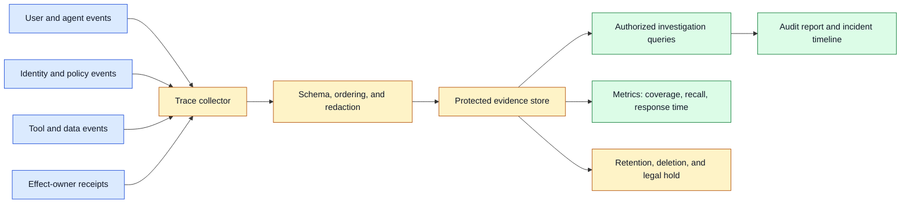
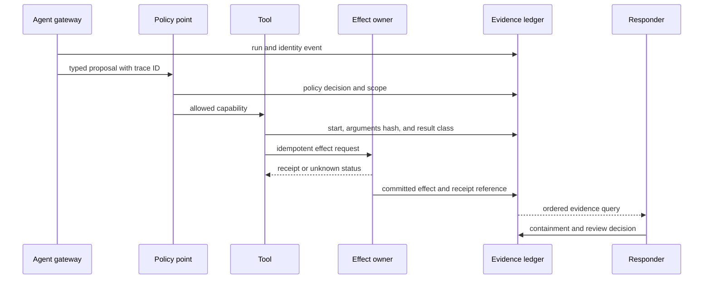

# Audit evidence
Status: draft — expansion pending
Sources: [Google DeepMind — AI Control Roadmap](https://deepmind.google/blog/securing-the-future-of-ai-agents/)

## In one sentence

Audit evidence is the durable, access-controlled record that lets an engineer reconstruct what an agent was allowed to do, what it actually did, which controls ran, and what state changed without turning logs into an uncontrolled copy of sensitive data.

## Background: what existed before

Traditional services logged requests, status codes, user IDs, and errors. A database audit table recorded who changed a row and when. Security systems collected authentication and network events. These records were often enough to answer a narrow question: which account called this endpoint, and did the request succeed?

Agent workflows need a wider record. A model proposes an action, retrieves information, calls tools, receives results, retries, delegates to children, and may cause a side effect. The final response does not reveal which documents were read, which permission decision allowed a tool, whether a command was denied, or whether a timeout left an external state unknown. A prose explanation generated by the agent is not a reliable audit trail.

**Audit evidence** is information retained to support accountability, investigation, compliance, and learning. A **trace** connects events belonging to one request or run. A **span** is one timed operation within a trace. A **receipt** is an authoritative confirmation from the service that owns an effect. **Provenance** records origin and transformation. **Redaction** removes or masks sensitive fields while preserving useful structure. **Tamper evidence** makes unauthorized alteration detectable.

## What changed and why now

Google DeepMind’s June 18, 2026 AI Control Roadmap frames capable agents as potential insider threats and describes threat modeling, monitoring, prevention, and response. It highlights the need to measure coverage, recall, and time-to-response, and describes supervisors examining reasoning, actions, and plans. These are source-reported framework claims. The evidence schema and retention design here are engineering inferences that make those controls inspectable.

The change is that agent safety claims require evidence across a sequence, not only a final output. A monitor may say an agent looked suspicious, but responders need identity, resource, policy version, tool arguments, data scope, actual effect, and timing. An evaluation may report that a harmful action was blocked, but the team needs to know whether the block occurred before data release, before execution, or after a partial effect.

Multimodal and long-running workflows expand the evidence problem. A video answer may depend on selected frames and timestamps. A voice action may depend on a provisional transcript. A generated artifact may have parent assets, a model version, and a review decision. The record must be rich enough to explain decisions while avoiding raw media, credentials, private prompts, or chain-of-thought dumps by default.

## Mental model

Think of audit evidence as the flight recorder and maintenance log for an agent, not as a diary written by the pilot. The recorder captures authoritative events, instrument readings, control decisions, and outcomes so an investigator can reconstruct the flight. The pilot’s explanation may be useful context, but it is not the primary record. In an agent system, the model’s narrative is similarly secondary to identity events, policy decisions, tool traces, and effect-owner receipts.

Good evidence is also selective. A flight recorder does not need to preserve every conversation in the cabin; it needs enough trusted signals to explain what happened. An agent system should retain IDs, hashes, timing, versions, and bounded payload references while protecting secrets and personal data. The goal is reviewability under a stated trust model, not an unlimited transcript archive.

## Impact on current processing and architecture

Emit structured events at each trust boundary: request admission, identity and delegation, data retrieval, model call, tool proposal, policy decision, effect execution, receipt, containment, and review. A trace collector validates event schema and ordering. A protected store keeps append-only or tamper-evident records. A query layer applies tenant and investigator permissions. A retention service expires payloads and preserves the minimum authorized audit summary.



An event should include event ID, trace ID, parent span, actor, agent run, tenant, resource, operation, event time, ingestion time, policy version, model or tool version, outcome, and references to protected payloads. Requested action and actual effect must be separate fields. A denied delete is not a delete. A model proposal is not an execution. A timeout is not proof that nothing happened.

Use a consistent event taxonomy. `run.started`, `context.retrieved`, `model.completed`, `tool.proposed`, `policy.denied`, `tool.started`, `effect.committed`, `effect.unknown`, `capability.revoked`, and `review.closed` communicate more than free-form log messages. Version the taxonomy and make consumers tolerant of new fields. Do not let a model choose the event type or write an authoritative receipt.

Event time and ingestion time serve different purposes. Event time describes when a component says something happened; ingestion time describes when the collector received it. Clock skew, retries, and batching can reorder arrivals. Preserve both and use trace IDs, sequence numbers, or effect-owner receipts to reconstruct order. If the system cannot establish order, state that uncertainty in the report.

Tamper evidence can use append-only storage, signed batches, hash chains, write-once retention, or an external timestamp. These mechanisms detect changes only under a trust model. A compromised collector may omit events before signing; a malicious privileged operator may have access to keys; a missing event is not proved by an intact chain. Report evidence coverage and known blind spots rather than claiming perfect auditability.



The ledger should not contain raw secrets by default. Store hashes, token fingerprints, resource IDs, argument summaries, byte counts, and access-controlled payload references. Redaction must happen before events enter broad observability systems. A later redaction pass may not find copies in error logs, model traces, crash dumps, or message queues.

Evidence has a purpose and retention class. Operational metrics may need aggregate counts for months, while raw tool output may need hours or minutes. A legal hold can preserve a narrow record, but it should have an owner and scope. Deletion should remove or cryptographically erase payloads and derivatives where required while retaining minimal audit evidence authorized by policy. Do not keep everything forever as a substitute for design.

## Replay, reconstruction, and privacy

Replay is not always re-execution. A safe replay can reconstruct the decision from event metadata and fixtures without calling real tools. A dry run can send requests to a test owner. A full replay of an external effect may be unsafe or impossible. Label whether a report is a reconstruction, simulation, or actual receipt-based history.

For model calls, retain model identifier, prompt-template version, input references, sampling settings, tool schemas, retrieval index, and output digest. Retaining every token can expose private data and may not reveal hidden provider state. A bounded trace with inputs and outputs under access control is often more useful than a transcript dump. For multimodal calls, retain selected asset IDs, frame intervals, audio spans, preprocessing, and hashes.

A report should distinguish source facts from inference. “The policy service denied operation 12” is a fact if supported by its signed event. “The agent intended to exfiltrate data” is an interpretation that may remain uncertain. Keep analyst hypotheses, confidence, and evidence references separate. This prevents a later reader from treating an early suspicion as an established event.

Audit evidence can itself become an attack surface. An agent may try to flood logs, omit a tool result, create confusing IDs, or place sensitive content in a reason field. Validate lengths and schemas, restrict who can write authoritative event types, and monitor gaps between gateway, tool, and effect-owner counts. A log pipeline that is easy for a model to manipulate is not a trustworthy ledger.

## Real-world applications and constraints

For coding agents, evidence should link user request, repository revision, model and prompt versions, files read, commands proposed, sandbox policy, command outputs, patch digest, tests, review, and publication. Do not store secret-bearing environment output in a general audit index. If a command was blocked, record the denial and no-execution status.

For customer support, capture authenticated actor, customer scope, fields accessed, policy decision, approval, exact mutation, and account-service receipt. A transcript can be evidence of what was said, but it is not authoritative identity or approval. Minimize personal data and restrict investigator access.

For data analysis, record query digest, tenant, columns, row and byte counts, filters, purpose, result class, export destination, and policy decision. Store raw rows only when explicitly required. This helps detect broad queries and prove whether an export occurred without duplicating the dataset into logs.

For deployment automation, record artifact digest, repository revision, environment, tests, approver, controller decision, rollout, health checks, and rollback. A chat message can link to approval, but the deployment controller’s receipt is evidence of what changed. Reconcile timeouts before closing the event.

For media pipelines, record source and derived asset IDs, hashes, intervals, model or editor version, prompt reference, policy and review decisions, output digest, and publication destination. Keep raw faces, voices, and prompts behind separate permissions. A reviewer should be able to inspect the exact artifact that was approved.

For cyber defense, preserve command sequence, target scope, identity, sandbox, network destinations, tool results, containment, and responder actions. Use redaction and protected payload access because logs may contain credentials or exploit details. The evidence should show whether a control prevented execution or only detected it afterward.

For robotics, record sensor snapshot IDs, planner proposal, controller validation, safety interlock, actuator command, and physical receipt where available. A model explanation does not establish that a trajectory was safe. Real-time systems may need compact local evidence with later synchronization; document gaps caused by connectivity.

## Engineering consequence

Design an evidence contract alongside each agent capability. Name the authoritative event producer, required fields, privacy class, retention, tamper model, investigator role, and reconstruction limit. Define counters that should reconcile: proposals, allowed calls, started calls, committed effects, and receipts.

Numbered local implementation steps:

1. Draw the agent workflow and mark every identity, data, policy, tool, effect, containment, and review boundary.
2. Define trace, span, run, operation, asset, and event IDs with parent relationships.
3. Create a versioned event taxonomy and required fields for each boundary.
4. Separate proposal, decision, execution, receipt, and analyst hypothesis.
5. Capture event and ingestion times, sequence or operation IDs, versions, outcome, and protected references.
6. Redact secrets and unnecessary payloads before broad logging; test logs as an exfiltration path.
7. Add tamper evidence and document collector, key, storage, and omission assumptions.
8. Define replay, simulation, and real-receipt report types so readers know what was reconstructed.
9. Apply tenant, investigator, retention, deletion, and legal-hold controls to evidence and derivatives.
10. Build reconciliation metrics and inject dropped, duplicated, delayed, reordered, and malformed events.

## Build it locally

Save this example as `audit_chain.py` and run `python3 audit_chain.py`. It creates a small hash chain over structured events and verifies that changing an earlier event is detectable. This is tamper evidence, not proof that the collector recorded every event or that the hash key is protected. A production ledger needs authenticated writers, durable storage, access control, key management, and a documented threat model.

```python
import hashlib
import json

def event_bytes(event):
    return json.dumps(event, sort_keys=True, separators=(",", ":")).encode()

def chain(events):
    previous = "0" * 64
    records = []
    for event in events:
        current = hashlib.sha256((previous.encode() + event_bytes(event))).hexdigest()
        records.append({"event": event, "previous": previous, "hash": current})
        previous = current
    return records

def verify(records):
    previous = "0" * 64
    for record in records:
        if record["previous"] != previous:
            return False
        expected = hashlib.sha256(
            previous.encode() + event_bytes(record["event"])
        ).hexdigest()
        if expected != record["hash"]:
            return False
        previous = record["hash"]
    return True

records = chain([{"id": "1", "type": "proposal", "effect": False},
                 {"id": "2", "type": "policy.denied", "effect": False}])
print("valid", verify(records))
records[0]["event"]["effect"] = True
print("after alteration", verify(records))
```

The first verification succeeds and the second fails because an earlier event changed. Extend the example with a trace ID, tenant, event time, and a redacted payload reference. Add a duplicate event ID and decide whether the collector should reject it or record it as a duplicate delivery. Then compare the chain’s `proposal` and `policy.denied` events with a hypothetical effect-owner receipt; the absence of a receipt is not automatically proof that no effect occurred.

## Limits and failure modes

**Missing events** occur when a collector, worker, or effect owner fails to emit evidence. Reconcile counters and make gaps visible; an intact hash chain does not prove completeness.

**Tampered events** are detected only if the verifier has trusted prior state and protected keys or storage. Document who can write, sign, rotate, and read evidence.

**Sensitive logs** copy prompts, secrets, media, or tool output into broad systems. Redact before collection, use references and hashes, and restrict raw payload access.

**Ambiguous time** makes a sequence appear wrong. Preserve event and ingestion timestamps, sequence numbers, clock source, and uncertainty.

**False certainty** turns an analyst hypothesis or model explanation into a fact. Label source, inference, confidence, and evidence separately.

**Replay side effects** repeat a payment, deployment, deletion, or message. Use dry-run owners, receipts, and idempotency; never replay real effects by default.

**Retention conflict** keeps data forever for audit or deletes evidence needed for an authorized investigation. Define retention classes, legal holds, minimal records, and owners.

**Tenant leakage** exposes another customer’s traces through shared IDs, dashboards, or search. Scope storage, queries, caches, and exports by tenant.

**Event flooding** lets an agent exhaust storage or hide a meaningful signal. Limit event sizes, sample safely, preserve high-severity records, and monitor volume gaps.

**Producer spoofing** lets a model or untrusted worker emit authoritative receipts. Restrict event types to trusted producers and authenticate writers.

**Version drift** makes an old event schema or model ID hard to interpret. Version schemas and tools and keep a compatibility reader.

## Mini exercise (15–30 min)

Extend the local hash chain with proposal, policy, tool-start, and effect-receipt events. Change the tool target after the chain is built and verify detection. Remove the receipt and write a report that says “effect unknown” rather than “effect absent.” Add a tenant field and test that an investigator for tenant A cannot query tenant B. Finally, define which fields may remain after raw payload deletion.

## Interview Q&A

**Q: What makes an agent audit trail different from ordinary logs?**
It must connect plans, identity, data release, policy, tools, retries, child agents, actual effects, receipts, and versions across a workflow. A final response or one HTTP log is insufficient.

**Q: Does a hash chain prove the log is complete?**
No. It can make alteration of recorded events detectable under its trust assumptions. Missing events, compromised collectors, and unprotected keys remain concerns.

**Q: Should logs contain full prompts and tool output?**
Not by default. Use IDs, hashes, summaries, and protected references; retain raw payloads only when purpose, access, and retention justify them.

**Q: How do you distinguish an action proposal from an effect?**
Use separate event types and authoritative effect-owner receipts. A model proposal or allowed policy decision does not prove that the external state changed.

**Q: What is safe replay?**
Reconstructing a decision or running against a simulator without real side effects. Full re-execution needs idempotency, dry-run owners, and explicit authorization.

## Glossary

- **Audit evidence:** Durable record used for accountability and reconstruction.
- **Effect receipt:** Authoritative confirmation from the state-owning service.
- **Event:** Structured occurrence in a workflow.
- **Provenance:** Origin and transformation history.
- **Redaction:** Removing or masking sensitive data.
- **Replay:** Reconstructing or re-running a workflow from recorded inputs and state.
- **Span:** Timed operation within a trace.
- **Tamper evidence:** Property that unauthorized alteration can be detected.
- **Trace:** Connected events for one request or agent run.
- **Retention class:** Rule describing how long and under what authority evidence remains.

## References

- [Google DeepMind: Securing the future of AI agents](https://deepmind.google/blog/securing-the-future-of-ai-agents/) — June 18, 2026 control roadmap, threat modeling, monitoring, prevention, response, coverage, recall, and response time.
- [Google DeepMind AI Control Roadmap](https://storage.googleapis.com/deepmind-media/DeepMind.com/Blog/securing-the-future-of-ai-agents/ai-control-roadmap.pdf) — source-linked technical framework.
- [Google DeepMind: Investing in multi-agent AI safety research](https://deepmind.google/blog/investing-in-multi-agent-ai-safety-research/) — multi-agent infrastructure and oversight context.
- [OWASP Generative AI Security Project](https://owasp.org/www-project-generative-ai-security/) — application security and logging-risk context.

## Claim ledger

| Claim | Source | Fact or inference |
|---|---|---|
| Google DeepMind’s roadmap treats capable agents as potential insider threats and describes monitoring, prevention, and response. | Google DeepMind | Fact about source framing |
| The roadmap identifies coverage, recall, and time-to-response as important monitoring measures. | Google DeepMind | Fact about source |
| The roadmap describes supervisors reviewing agent reasoning, actions, and plans. | Google DeepMind | Fact as source-reported |
| Agent audit evidence should link proposal, policy, tool, receipt, identity, and versions. | Audit engineering | Inference |
| Tamper evidence does not prove completeness or truth. | Security analysis | Inference |
| Raw prompts and tool payloads should be minimized and access-controlled. | Privacy-aware observability | Inference |
