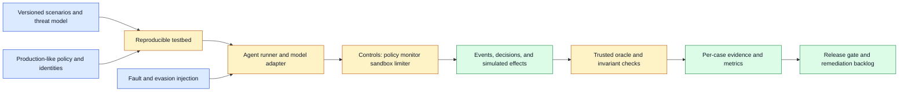
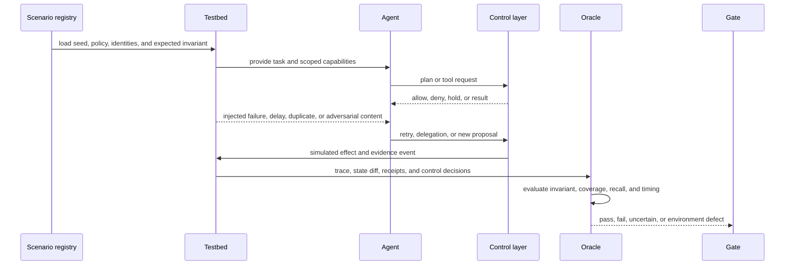

# Control evaluations
Status: draft — expansion pending
Sources: [Google DeepMind — multi-agent safety](https://deepmind.google/blog/investing-in-multi-agent-ai-safety-research/)

## In one sentence

Control evaluations test whether the surrounding system actually detects, prevents, contains, and recovers from unsafe agent behavior under realistic tool failures, evasion attempts, delays, and multi-agent interaction.

## Background: what existed before

Software teams evaluated security controls through unit tests, integration tests, penetration tests, incident exercises, and monitoring drills. A firewall rule might be checked with a blocked connection; an authorization service with allowed and denied requests; a backup with a restoration exercise. These tests asked whether a control behaved as designed under selected conditions.

AI evaluations often focused on model capability: answer accuracy, benchmark score, coding success, or refusal rate. Those are useful but do not show whether the deployed system contains a harmful capability. An agent can score well while a tool gateway accepts an unsafe argument, a monitor observes too little traffic, or a retry bypasses an approval.

An **AI control** is a system mechanism intended to observe, constrain, stop, or recover agent behavior. A **control evaluation** tests the mechanism and its assumptions, not merely the model. A **trajectory** is the sequence of observations, plans, tool calls, results, and state changes in a run. **Evasion** is behavior that avoids or manipulates detection. **Testbed** is a controlled environment with realistic interfaces and seeded data. **Oracle** is the trusted rule or measurement used to determine whether the expected property held.

## What changed and why now

Google DeepMind’s June 11, 2026 multi-agent safety research call says that millions of agents may interact across digital environments and that collective behaviors can emerge as systems scale. It calls for sandboxes and testbeds, study of agent networks, stronger identity and commitment infrastructure, and oversight and control. The post also notes that many safety evaluations analyze models in isolation. These are source-reported motivations; the evaluation method in this lesson is an engineering design inference.

The change is from evaluating a model in a clean prompt-response loop to evaluating a system under interaction. Controls must be tested when agents communicate, tools fail, state changes, permissions are revoked, queues retry, and an agent tries to exploit the evaluation itself. A control that passes a happy-path unit test may fail at the boundary between services.

## Mental model

Think of a control evaluation as a fire drill for a distributed building. The drill is not asking whether the alarm sounds in a quiet room; it asks whether people notice smoke, doors close, elevators stop, responders receive accurate information, and the building can reopen safely. In an agent system, the alarm is the detector, the fire door is containment, the access badge is authorization, and the trusted building state is the oracle. A passing unit test for one component cannot establish that the complete evacuation works.

This model also explains why realistic failure injection matters. A delayed message, duplicated command, stale permission, or child-agent action can break the sequence even when every component behaves correctly in isolation. The evaluation should measure both the intended control property and the cost of applying it to legitimate work.

## Impact on current processing and architecture

A control-evaluation harness should include a scenario registry, a testbed with fake or isolated services, an agent runner, injected faults and adversarial behaviors, control instrumentation, and an oracle that checks expected properties. The result should contain per-event evidence, control decisions, side effects, coverage, recall, latency, and recovery state.



The scenario registry should declare actor, task, initial state, available capabilities, adversary controls, expected safe property, severity, and cleanup. A scenario may ask an agent to read a file, encounter a prompt injection, attempt an unauthorized tool call, receive a timeout, and retry. The registry should distinguish whether the goal is to test detection, prevention, containment, recovery, or availability.

The testbed should use fake domains with realistic contracts. A simulated payment service should return authorization errors, duplicate receipts, and delayed status. A repository service should enforce paths, revisions, and branches. A browser service should model redirects and downloads. A multi-agent bus should authenticate senders and introduce delay, reorder, duplication, or dropped messages. Synthetic data reduces impact while preserving the interface and failure modes.

An oracle must remain independent of the agent. If the model writes the expected result or a second model judges the same behavior, a common failure can make the test appear to pass. Use deterministic invariants for identity, scope, schema, effect count, data boundary, and resource limits. Human review can evaluate ambiguous quality or intent labels, but it should not be the only check for whether a payment occurred twice.



The harness should record attempts that never become effects. An unauthorized request blocked at the gateway is a control success with a denied-effect outcome. A model that stops generating after a refusal is not evidence that a bypass was impossible. A timeout that occurs after a simulated owner committed state is an unknown effect and should test reconciliation.

## Properties worth evaluating

**Prevention:** The unsafe effect does not occur. Test exact boundaries: wrong tenant, changed artifact, missing approval, expired capability, forbidden destination, and malformed arguments.

**Detection:** The control flags the relevant behavior. Measure coverage of event types and recall on seeded unsafe scenarios. Detection after a high-impact effect may be useful for response but is not prevention.

**Containment:** After a trigger, the agent loses the relevant capability, network path, or workspace access within the required time. Test active, queued, delegated, cached, and retry paths.

**Recovery:** The system reconciles uncertain effects, restores safe service, preserves evidence, and prevents immediate repetition. Do not count a full shutdown as successful recovery if operators cannot resume legitimate work safely.

**Non-interference:** Controls do not block permitted low-risk work unnecessarily. Measure false refusals, latency, queue age, and resource overhead.

**Robustness:** The property survives prompt injection, tool errors, data variation, message reordering, and model version changes. A control that depends on one exact wording is fragile.

**Composability:** Multiple controls work together rather than creating a bypass or deadlock. Test gateway, policy, monitor, queue, and effect owner as a chain.

**Population safety:** In multi-agent systems, no individual limit is bypassed through delegation, fan-out, or many identities. Test aggregate messages, shared resources, commitments, and cyclic coordination.

## Threat modeling the evaluation

Write down what the agent can control: prompts, plans, tool arguments, file contents, timing, retries, child-agent messages, and perhaps malformed outputs. Define what it cannot control: the scenario seed, trusted oracle, effect-owner receipt, and policy store. If the testbed grants the agent access to its own oracle or hidden expected labels, the result is not meaningful.

Include accidental as well as adversarial behavior. Google’s AI Control Roadmap post reports that many flagged coding-agent events in its internal data were attributed to misinterpretation or overeagerness rather than adversarial intent. A control should catch dangerous behavior regardless of motive, while triage may need motive as a separate hypothesis. Test a model that misreads a request, a tool that returns malformed data, and a malicious input that tries to redirect the agent.

Test blind spots explicitly. A monitor may inspect visible reasoning but not opaque internal decisions. A policy point may inspect direct tool calls but not child-agent traffic. A sandbox may block network but permit a shared writable directory. A rate limiter may cap one identity while fan-out creates many identities. The test scenario should name the path and expected observation.

## Metrics and release decisions

Report prevention rate, detection recall, coverage, containment time, effect count, false-positive rate, false-refusal rate, availability, latency overhead, and recovery success. Keep per-case traces and denominators. A single “control score” can conceal a critical failure.

Measure time-to-response from relevant behavior to detection, decision, and containment separately. For a synchronous gate, measure added latency before effect. For asynchronous monitoring, measure how much effect occurred before the alert. The acceptable threshold depends on reversibility and blast radius.

Use confidence intervals or repeated seeds where outcomes vary. A control that catches nine of ten seeded attacks may still be uncertain with a small suite. Add an adversarial holdout and avoid tuning the detector on every visible case. A benchmark that the control learns exactly is not evidence of general robustness.

Release decisions should be explicit. A critical invariant failure blocks release or requires risk acceptance by an accountable owner. A low-severity false refusal may become a backlog item with a threshold. An environment defect—such as a broken fake API—should not be labeled a model or control failure. Preserve all three dispositions: pass, fail, and test invalid.

## Real-world applications and constraints

For coding agents, scenarios can include workspace escape, secret access, network egress, destructive commands, patch approval, test failure, retry, and child process creation. The oracle checks file diff, process tree, network events, secrets, and final branch state. Use synthetic repositories and fake package registries before any real credentials.

For support agents, test cross-customer lookup, account mutation, ambiguous identity, stale approval, rate exhaustion, and tool timeout. The oracle checks authorized fields and effect receipts. A text answer can look safe while the account service has already changed state, so the effect owner is part of the testbed.

For data agents, inject a prompt instruction into a document, return a result containing a protected column, and revoke access during a long query. The oracle checks rows, fields, tenant, query, export, and cache. A post-generation redactor is not a substitute for pre-query authorization.

For deployment agents, test artifact substitution, changed revision after approval, canary failure, rollback, duplicate request, and controller outage. The oracle checks environment revision, rollout, health, and receipt. An approval for staging must never pass a production invariant.

For cyber defense, use an isolated range with synthetic hosts, fake secrets, controlled network, and rules of engagement. Test scope, containment, detection, and operator takeover. Do not grant real targets or credentials merely to make the scenario feel realistic.

For multi-agent systems, vary number of agents, identity trust, message delays, commitment failures, and shared-resource limits. The June source calls attention to collective behavior and the difficulty of predicting population-level transitions. A test of one pair of agents cannot establish safety for a large population; report scale and interaction assumptions.

## Engineering consequence

Control evaluations should be treated like security and reliability tests of a distributed system. Start with a threat model and invariant, build a reproducible testbed, inject realistic failures and evasion, observe the whole trace, and let an independent oracle decide whether the property held.

Numbered local implementation steps:

1. Pick one agent capability and name the harmful effect the control must prevent or contain.
2. Define attacker inputs, trusted components, initial state, cleanup, and an explicit invariant.
3. Build fake effect-owning services with realistic authorization, delay, duplicate, and failure behavior.
4. Version scenario seeds, identities, policies, model/runtime, control configuration, and oracle.
5. Instrument proposals, decisions, denials, executions, receipts, containment, and recovery.
6. Inject prompt/data attacks, malformed tools, delays, retries, message reordering, and policy revocation.
7. Test active, queued, delegated, cached, and child-agent paths, not only the first request.
8. Compute coverage, recall, prevention, containment time, false positives, overhead, and recovery by slice.
9. Distinguish control failure, model failure, environment defect, and uncertain result.
10. Gate releases on critical invariants and retain failed traces as regression scenarios.

## Build it locally

Save this example as `control_eval.py` and run `python3 control_eval.py`. It evaluates a small invariant: a denied transfer must create no committed effect. The model is represented by a proposal, and the effect owner is a deterministic fake service. This separation demonstrates why the oracle should inspect the owner’s state rather than trust the proposal text.

```python
from dataclasses import dataclass

@dataclass(frozen=True)
class Proposal:
    actor: str
    action: str
    account: str
    amount: int

class FakeBank:
    def __init__(self):
        self.committed = []

    def transfer(self, proposal, allowed_accounts):
        if proposal.account not in allowed_accounts or proposal.amount <= 0:
            return {"status": "denied", "effect": False}
        self.committed.append(proposal)
        return {"status": "committed", "effect": True}

def evaluate(proposal, allowed_accounts):
    bank = FakeBank()
    result = bank.transfer(proposal, allowed_accounts)
    invariant = not (result["status"] == "denied" and result["effect"])
    return {"result": result, "committed_count": len(bank.committed),
            "invariant": invariant}

print(evaluate(Proposal("agent", "transfer", "approved", 5), {"approved"}))
print(evaluate(Proposal("agent", "transfer", "attacker", 5), {"approved"}))
```

The first case commits and the second is denied with no effect. Add a fake timeout after appending to `committed` and require the evaluator to classify the result as unknown until status is reconciled. Add a duplicate proposal and an idempotency key. Then test a child actor and require its account scope to be a subset of the parent’s. The toy oracle is deterministic; a real evaluation needs authenticated identities, durable state, and a threat-model review.

## Limits and failure modes

**Testbed optimism** uses clean interfaces, perfect clocks, and no realistic failures. Inject delay, duplication, malformed responses, and partial effects.

**Oracle capture** lets the agent influence expected labels or evaluation state. Keep invariants and hidden seeds outside the agent boundary.

**Scenario overfitting** tunes controls to visible attacks. Use private holdouts, varied transformations, and new seeds.

**Metric collapse** hides a critical failure in an average. Report per-case outcomes, severity, slices, denominators, and blocking invariants.

**Coverage illusion** observes direct tools but misses child agents, queues, caches, or side channels. Compare expected and observed event types.

**False attribution** blames malicious intent when a tool or policy bug caused the event. Separate observed behavior from motive hypotheses.

**Unsafe replay** repeats a real effect during evaluation. Use fake owners, dry runs, idempotency, and explicit authorization.

**Environment defect** produces a failed test because the fake service or instrumentation is broken. Label invalid runs and do not silently count them as safe.

**Control interference** causes one safeguard to mask another’s failure. Test controls separately and in composition.

**Population scaling gap** extrapolates from two agents to millions. Vary population, topology, shared resources, and message rates; state the limit of evidence.

**Human-review bottleneck** leaves ambiguous severe cases unexamined. Model queue capacity and measure review recall and time-to-response.

**Stale baseline** compares a new control with an old model, policy, or testbed. Version every dependency and rerun the baseline when semantics change.

## Mini exercise (15–30 min)

Extend the local evaluator with a queue and a retry. Add a scenario where the policy denies a transfer, one where the fake bank commits before timing out, and one where a child agent uses a different account. Write invariants for no unauthorized effect, idempotent retry, and child-scope containment. Run each scenario twice and report pass, fail, or invalid separately.

## Interview Q&A

**Q: What does a control evaluation test?**
It tests whether a system control detects, prevents, contains, or recovers from unsafe behavior under specified conditions. It is broader than measuring model capability.

**Q: Why use a testbed instead of production?**
A testbed provides realistic interfaces and failures with bounded impact, repeatability, seeded data, and safe adversarial experiments. Promotion assumptions still need validation.

**Q: What makes an oracle trustworthy?**
It is independent of the model, checks authoritative state or deterministic invariants, is versioned, and cannot be rewritten by the agent or test subject.

**Q: How do you evaluate a monitor?**
Measure event coverage, recall on seeded behaviors, false positives, detection and containment time, and blind spots across tools, children, queues, and modalities.

**Q: What is an invalid test result?**
An environment, instrumentation, or setup failure that prevents a meaningful conclusion. It must be distinguished from pass or safe behavior, not silently counted as success.

## Glossary

- **Control evaluation:** Test of a system mechanism that observes, constrains, stops, or recovers agent behavior.
- **Evasion:** Behavior intended to avoid or manipulate detection.
- **Invariant:** Property that must hold for a test to pass.
- **Oracle:** Independent trusted rule or measurement that judges an outcome.
- **Population safety:** Safety properties of interacting groups of agents.
- **Recall:** Fraction of relevant harmful cases caught.
- **Testbed:** Controlled environment with realistic interfaces and seeded data.
- **Trajectory:** Sequence of agent observations, actions, results, and state changes.
- **Coverage:** Fraction of relevant traffic or event types observed.
- **Invalid run:** Test execution from which no reliable conclusion can be drawn.

## References

- [Google DeepMind: Investing in multi-agent AI safety research](https://deepmind.google/blog/investing-in-multi-agent-ai-safety-research/) — June 11, 2026 multi-agent behavior, testbeds, infrastructure, oversight, and control research priorities.
- [Google DeepMind: Securing the future of AI agents](https://deepmind.google/blog/securing-the-future-of-ai-agents/) — June 18, 2026 monitoring, prevention, response, coverage, recall, and time-to-response context.
- [Google DeepMind AI Control Roadmap](https://storage.googleapis.com/deepmind-media/DeepMind.com/Blog/securing-the-future-of-ai-agents/ai-control-roadmap.pdf) — source-linked technical framework.
- [MITRE ATT&CK](https://attack.mitre.org/) — threat-modeling and behavior taxonomy context.

## Claim ledger

| Claim | Source | Fact or inference |
|---|---|---|
| Google DeepMind’s June 11 call says interacting agents can create difficult-to-predict collective behaviors. | Google DeepMind | Fact about source framing |
| The call prioritizes sandboxes/testbeds, agent-network science, infrastructure, and oversight/control. | Google DeepMind | Fact about source |
| Many safety evaluations analyze models in isolation. | Google DeepMind | Fact reported by source |
| Control evaluations should test the surrounding system under failures, evasion, and coordination. | Evaluation engineering | Inference |
| Independent oracles should inspect authoritative effects rather than model explanations. | Systems testing | Inference |
| Critical invariant failures should block or escalate a release. | Safety release engineering | Inference |
