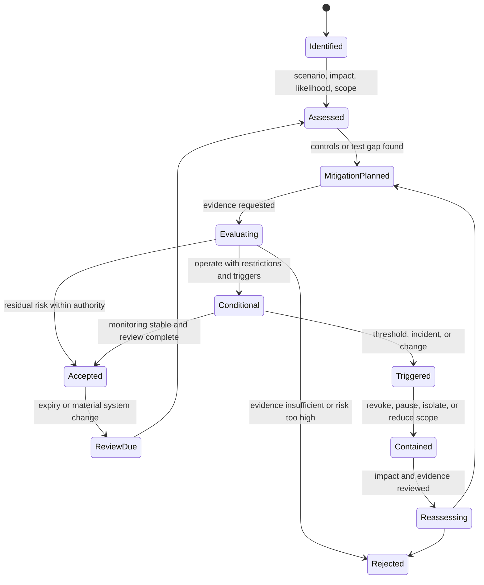

# Residual risk
Status: draft — expansion pending
Sources: [Google DeepMind — AI Control Roadmap](https://deepmind.google/blog/securing-the-future-of-ai-agents/)

## In one sentence

Residual risk is the plausible harm that remains after a system applies its safeguards, and it becomes manageable only when its assumptions, scope, uncertainty, owner, monitoring, and shutdown conditions are explicit.

## Background: what existed before

Engineering systems have never been risk-free. A database can be protected by authentication, authorization, backups, monitoring, and encryption while still facing misconfiguration, stolen credentials, software bugs, outages, and operator error. Security and reliability teams therefore distinguish inherent risk—the exposure before controls—from residual risk—the exposure after controls.

Organizations often handled residual risk informally. A team implemented a control, passed a checklist, and assumed the remaining risk was small. This fails when controls have limited coverage, monitoring has poor recall, or a failure mode was never included in the threat model. It also makes accountability unclear: if a risk is accepted without an owner, it tends to become nobody’s incident.

AI agents make this problem more visible. A sandbox can contain code but not an already-sent email. A policy gate can deny a tool call but miss a child agent. A monitor can detect a suspicious trajectory but react too late. A human approval can bind one patch but not a later mutation. Model alignment can reduce harmful behavior but cannot substitute for identity, isolation, and effect-owner authorization.

**Residual risk** is the remaining likelihood and impact of harm under stated controls and assumptions. **Inherent risk** is the exposure before controls. **Risk acceptance** is an accountable decision to operate despite known residual risk. **Risk appetite** is the level and type of risk an organization is willing to tolerate. A **control gap** is a missing or ineffective safeguard. A **trigger** is a condition that requires reevaluation, containment, or shutdown.

## What changed and why now

Google DeepMind’s June 18, 2026 AI Control Roadmap describes a defense-in-depth approach for increasingly capable and imperfectly aligned agents. It treats agents as potential insider threats, discusses monitoring and trusted supervisors, and scales prevention and response to the severity of possible harm. It also identifies limits of visible reasoning and emphasizes coverage, recall, and time-to-response. These are source-reported framework claims; the risk-register and acceptance process below are engineering inferences.

The change is from asking “is the model safe?” to asking “what can still go wrong in this deployed system, which controls catch it, and who decides whether the remainder is acceptable?” Capability, reliability, and safety claims must be separated. A model may be capable at coding, a gateway may be reliable at checking schemas, and the combined system may still have unacceptable residual risk for production deployment.

Residual risk is dynamic. A new model, tool, data source, child-agent protocol, provider, hardware class, user population, or business process changes the threat model. A control evaluated yesterday may have lower recall on a new distribution. A revocation path may be too slow after a capability increase. Risk acceptance must have expiry or review triggers rather than becoming permanent permission.

## Mental model

Think of residual risk as the water remaining behind a system of flood barriers. Each barrier reduces the volume or redirects the flow, but none proves that the valley is dry. The owner must know which barriers are installed, how often they fail, what area remains exposed, and when to evacuate. In an agent system, the barriers are authorization, isolation, monitoring, rate limits, review, and recovery; the exposed area is the remaining set of people, data, and state changes that could be harmed.

This model discourages both complacency and paralysis. A team can operate a low-risk draft workflow with known restrictions while rejecting an irreversible production action whose evidence is insufficient. The decision is explicit, scoped, time-limited, and revisited when the model, tool, population, or environment changes.

## Impact on current processing and architecture

Create a risk register connected to the agent architecture and control evidence. Each risk names scenario, cause, affected assets, likelihood, impact, controls, control evidence, remaining uncertainty, owner, acceptance authority, monitoring, mitigations, and triggers. The register should link to evaluation runs, incidents, policies, and artifacts. It is not a static spreadsheet; it is a view over changing system state.

```mermaid
flowchart LR
    C[Capabilities, tools, data, users] --> T[Threat and hazard scenarios]
    T --> R[Risk register with scope and assumptions]
    R --> K[Controls: identity policy sandbox monitor review]
    K --> E[Control evaluation and incident evidence]
    E --> U[Residual risk estimate and uncertainty]
    U --> D[Owner decision: mitigate accept defer or reject]
    D --> M[Monitoring and trigger service]
    M -->|trigger| X[Contain, revoke, pause, or shut down]
    M -->|stable| L[Periodic review and change management]
    classDef input fill:#dbeafe,stroke:#1d4ed8,color:#111827;
    classDef control fill:#fef3c7,stroke:#b45309,color:#111827;
    classDef result fill:#dcfce7,stroke:#15803d,color:#111827;
    class C,T input;
    class R,K,E,U,M,L control;
    class D,X result;
```



The register should distinguish scenario uncertainty from measurement uncertainty. We may not know how often a behavior will occur, or we may have a noisy estimate from a small test suite. State assumptions and confidence. Avoid precise-looking numerical risk scores when the inputs are subjective; qualitative bands with evidence and decision rules can be more honest.

Risk must be scoped. “Agent can delete data” is incomplete. Which agent, identity, tenant, data class, environment, tool, maximum volume, and recovery path? A staging coding agent with a disposable workspace has a different residual risk from a production operations agent with customer data. Scope also prevents a control success in one environment from being generalized to another.



Risk acceptance should be a state with an authority and expiration. A conditional acceptance might permit read-only work, a smaller tenant cohort, a lower rate, mandatory review, or no external effects. A trigger moves the system to containment and reassessment. The original agent should not accept its own residual risk or decide that a trigger is irrelevant.

## How to reason about remaining risk

Start with a scenario, not a technology. “A model may be misled by a document” is a capability concern. “A document injection causes an agent to send a confidential file to an external recipient” is a system scenario with affected data and effect. Add preconditions, attack or failure path, controls, consequence, detection, and recovery.

Map each scenario to controls and evidence. A sensitive export may have retrieval authorization, output filtering, egress policy, rate limits, monitoring, human approval, and effect-owner checks. Ask what each control assumes. Does the egress gateway see child-agent traffic? Does approval bind exact files? Does the monitor have access to audio? Does revocation reach queued retries? The remaining path after those answers is residual risk.

Use independence carefully. Two detectors built from the same model or data may fail together. A policy gateway and an effect owner may share a library bug. Defense in depth is valuable when layers fail differently, not merely when there are many layers. Record common dependencies and single points of failure.

Quantitative estimates can help for capacity and ordinary reliability. For rare, severe, or novel AI risks, evidence may be sparse and distributions may shift. Use ranges, scenarios, stress tests, red teams, and uncertainty labels. A zero observed failures in a small suite does not prove zero risk.

Risk acceptance is not risk deletion. It should name why operation is justified, what restrictions apply, who can accept it, what evidence supports it, and which events force reevaluation. High-impact or irreversible actions may be outside the organization’s acceptable appetite even when mitigations reduce probability. A risk owner cannot transfer accountability by writing “the model decided.”

## Real-world applications and constraints

For a coding agent, residual risks include secret leakage, destructive commands, dependency compromise, malicious repository content, and an unsafe patch reaching production. Controls may include sandboxing, read-only mounts, network restrictions, secret brokers, tests, review, and deployment gates. Acceptance might allow local drafts but prohibit production writes until testbed recall and patch review meet thresholds.

For customer support, residual risks include wrong identity, disclosure, unauthorized mutation, and social engineering. A system may accept automated ticket drafting but require step-up authentication and human review for account security changes. The owner should specify which false-refusal burden is acceptable and how appeals work.

For data agents, risk includes retrieval of unauthorized rows, cross-tenant cache leakage, broad export, and stale policy. A residual-risk decision should cover source ACLs, index freshness, query limits, redaction, output sharing, and deletion. A successful output filter does not compensate for a restricted record already entering context.

For deployment automation, risk includes artifact substitution, wrong environment, rollout failure, and duplicate rollback. Controls include signed artifacts, approvals, canaries, health gates, idempotency, and reconciliation. Conditional operation may permit staging only while production remains human-controlled.

For cyber defense, residual risk includes an agent taking action outside scope, leaking sensitive telemetry, or escalating an attack through valid tools. Use isolated ranges, allowlists, scoped credentials, synchronous gates, monitoring, operator takeover, and incident response. “Defensive” is not an unlimited risk acceptance category.

For robotics, a language or vision model can misinterpret the scene and propose unsafe motion. Physical interlocks, independent controllers, bounded workspaces, speed limits, emergency stop, and human presence detection reduce risk. A residual-risk decision must account for sensor failure, stale state, network loss, and a person’s exposure to the actuator.

For multi-agent systems, one agent’s low-risk behavior can combine with others into high load, coordinated transactions, or collective failure. The June source highlights unpredictable population-level behavior and the need for testbeds, infrastructure, and oversight. Acceptance must state population size, interaction protocol, shared resources, and scaling assumptions rather than extrapolate from one agent.

## Engineering consequence

Make residual risk a living release and operations artifact. Tie each accepted scenario to controls, evidence, owner, expiry, monitoring, and triggers. Use risk acceptance to constrain deployment, not to waive missing evidence silently.

Numbered local implementation steps:

1. Inventory model capabilities, data sources, tools, identities, effects, users, and environments.
2. Write concrete harm scenarios with preconditions, affected assets, consequence, and recovery.
3. Map each scenario to preventive, detective, containment, and recovery controls.
4. Record each control’s coverage, recall, latency, dependencies, and known blind spots.
5. State likelihood and impact as ranges or bands with assumptions and evidence.
6. Assign an owner and acceptance authority; never let the agent accept its own risk.
7. Define conditional restrictions, expiry, review cadence, and shutdown or containment triggers.
8. Link the register to control evaluations, incidents, model/runtime versions, and policy changes.
9. Monitor leading indicators such as denied actions, stale policy, drift, queue backlog, and control gaps.
10. Reassess after material capability, tool, data, user, provider, or environment changes.

## Build it locally

Save this example as `risk_register.py` and run `python3 risk_register.py`. It evaluates whether a small risk may operate under a conditional restriction. It uses explicit impact, evidence, owner, and trigger fields rather than pretending a single score proves safety.

```python
from dataclasses import dataclass

@dataclass(frozen=True)
class Risk:
    name: str
    impact: str
    evidence_passed: bool
    owner: str
    trigger_active: bool

def decision(risk):
    if not risk.owner:
        return "reject: no accountable owner"
    if risk.trigger_active:
        return "contain: trigger active"
    if risk.impact == "critical" and not risk.evidence_passed:
        return "reject: critical evidence gap"
    if risk.evidence_passed:
        return "accept with monitoring"
    return "conditional: restrict scope and review"

risks = [
    Risk("workspace deletion", "high", True, "team-a", False),
    Risk("production transfer", "critical", False, "team-a", False),
    Risk("stale policy", "high", True, "team-a", True),
]
for risk in risks:
    print(risk.name, decision(risk))
```

The first risk can operate only with monitoring and the controls represented by the example. The critical evidence gap is rejected, and the active trigger causes containment even though evidence previously passed. Extend the example with scope, expiry, control recall, and acceptance authority. Add a material model-version change that forces reassessment. A production register would persist decisions, approvals, evidence links, and policy versions in durable access-controlled storage.

## Limits and failure modes

**Risk-score theater** assigns precise numbers to uncertain judgments. Use ranges, assumptions, evidence, and decision thresholds; do not confuse arithmetic with knowledge.

**Unowned acceptance** lets a team operate with known risk without accountability. Require an owner, authority, rationale, expiry, and review date.

**Control stacking illusion** counts many layers that share the same dependency. Identify correlated failure and independent evidence.

**Coverage blindness** assumes a monitor or gate sees every route, child, queue, modality, and provider. Measure coverage and state blind spots.

**Zero-failure fallacy** treats a clean small test as proof of zero risk. Use confidence, stress, adversarial holdouts, and uncertainty labels.

**Stale acceptance** continues after model, tool, data, environment, or user changes. Attach triggers and re-evaluate on material change.

**Risk transfer** blames the model or vendor instead of the deploying owner. A provider claim is evidence to validate, not an assignment of accountability.

**Trigger failure** detects a condition but does not pause or revoke authority. Test the complete path from signal to containment.

**Irreversibility mismatch** accepts risk for an action that cannot be undone. Require stronger prevention and review for high-blast-radius effects.

**Population extrapolation** assumes a one-agent test covers many interacting agents. Vary scale, topology, shared resources, and protocol.

**Risk register drift** leaves controls and versions disconnected from the deployed system. Link entries to artifacts, evaluations, incidents, and policy commits.

## Mini exercise (15–30 min)

Add scope, expiry, evidence recall, and acceptance authority to the local register. Create risks for a read-only draft, a customer-data export, and a production deletion. Give the export a control trigger and the deletion an evidence gap. Verify that no agent can accept a critical risk and that a model-version change moves all affected entries to review.

## Interview Q&A

**Q: What is residual risk?**
The plausible harm remaining after stated controls operate under stated assumptions. It is not the same as observed failures or a model’s confidence.

**Q: Who accepts residual risk?**
An accountable human or governance authority with scope and decision rights. The agent, model, or vendor cannot accept risk on the organization’s behalf.

**Q: How do you know whether controls reduce risk?**
Map scenarios to controls, run realistic evaluations, measure coverage, recall, prevention, containment time, and recovery, and document blind spots and common dependencies.

**Q: When should an accepted risk be reopened?**
After a material model, tool, data, provider, user, environment, policy, incident, drift, or control-evidence change, and at the defined expiry or review date.

**Q: Can defense in depth eliminate residual risk?**
No. It reduces probability or impact under assumptions. Some risks remain unacceptable because effects are irreversible or evidence is insufficient.

## Glossary

- **Control gap:** Missing or ineffective safeguard.
- **Inherent risk:** Exposure before safeguards.
- **Risk acceptance:** Accountable decision to operate with known residual risk.
- **Risk appetite:** Level and type of risk an organization tolerates.
- **Residual risk:** Harm that remains after controls.
- **Risk register:** Structured record of scenarios, controls, owners, evidence, and decisions.
- **Scenario:** Concrete path by which harm or failure could occur.
- **Trigger:** Condition requiring reassessment, containment, or shutdown.
- **Uncertainty:** Lack of confidence in likelihood, impact, control effectiveness, or evidence.
- **Defense in depth:** Multiple controls with different failure modes.

## References

- [Google DeepMind: Securing the future of AI agents](https://deepmind.google/blog/securing-the-future-of-ai-agents/) — June 18, 2026 AI Control Roadmap, threat modeling, monitoring, prevention, response, and risk-scaled controls.
- [Google DeepMind: Investing in multi-agent AI safety research](https://deepmind.google/blog/investing-in-multi-agent-ai-safety-research/) — June 11, 2026 collective behavior, testbeds, infrastructure, oversight, and control context.
- [Google DeepMind AI Control Roadmap](https://storage.googleapis.com/deepmind-media/DeepMind.com/Blog/securing-the-future-of-ai-agents/ai-control-roadmap.pdf) — source-linked control framework.
- [NIST AI Risk Management Framework](https://www.nist.gov/itl/ai-risk-management-framework) — general risk-management context; not a substitute for domain-specific approval.

## Claim ledger

| Claim | Source | Fact or inference |
|---|---|---|
| Google DeepMind’s roadmap treats capable agents as potential insider threats and describes defense-in-depth controls. | Google DeepMind | Fact about source framing |
| The roadmap discusses monitoring, coverage, recall, time-to-response, prevention, and response. | Google DeepMind | Fact about source |
| The multi-agent call identifies collective behaviors, testbeds, infrastructure, oversight, and control as research concerns. | Google DeepMind | Fact about source |
| Residual risk should be represented as scoped scenarios linked to controls and evidence. | Risk engineering | Inference |
| Risk acceptance requires accountable ownership, expiry, and triggers. | Governance design | Inference |
| Model capability or vendor claims do not eliminate deployment residual risk. | Systems safety analysis | Inference |
