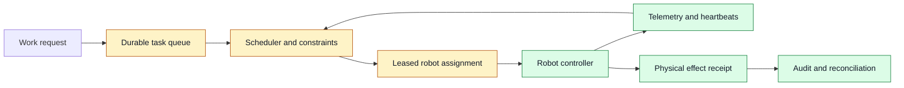
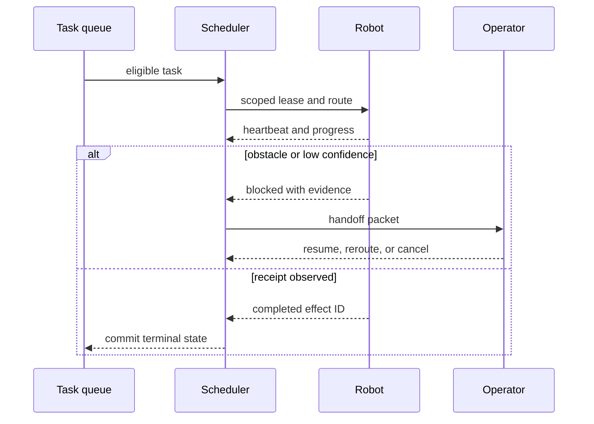

# Robot task orchestration
Status: draft — expansion pending
Sources: [Google DeepMind — news archive](https://deepmind.google/blog/)

## In one sentence

Robot task orchestration is the control plane that turns work requests into leased, observable, recoverable assignments for physical machines operating under changing constraints.

## Background: what existed before

A single robot demo can run a fixed sequence: navigate, pick, place, and report completion. A fleet is different. Machines share corridors, chargers, inventory zones, wireless capacity, and human workspaces. They can lose localization, run out of battery, encounter an obstruction, or complete an external effect just before a network disconnect. A scheduler therefore cannot treat a robot command as an ordinary stateless API call.

The historical baseline is a centralized job queue with workers that pull the next item. This is useful, but robotics adds spatial and safety constraints. A job may require a particular payload capability, a safe operating zone, a battery reserve, an operator approval, or a predecessor task. The queue also needs to know whether a robot is truly available rather than merely connected.

## What changed and why now

The July source map identifies embodied-agent and robotics developments as a focus area, using the Google DeepMind news archive as the primary discovery source. This is source context, not evidence for a particular fleet claim. The engineering inference is that more capable perception and planning make orchestration more important: a planner can propose a task, but deterministic fleet services still assign authority, reserve resources, detect missed heartbeats, and force safe recovery.

## Impact on current processing and architecture

Model each task as durable state with a task ID, required capability, pickup and drop-off region, priority, deadline, idempotency key, and a list of external effects. A scheduler selects an eligible robot; a dispatcher grants a time-limited lease; the robot reports heartbeats and transitions; and a reconciliation service resolves uncertain outcomes. Store this state outside the robot process so a restarted device or controller can resume safely.



Use explicit state transitions such as `QUEUED`, `RESERVED`, `DISPATCHED`, `RUNNING`, `BLOCKED`, `NEEDS_REVIEW`, `COMPLETED`, `CANCELLED`, and `UNKNOWN_EFFECT`. A heartbeat renews a lease only while the robot remains healthy and inside its authorized operating conditions. If it misses the lease deadline, do not blindly reassign the job: first determine whether the robot already picked an item, unlocked a door, or entered a shared zone. Physical work has exactly-once ambitions but usually needs practical idempotency and reconciliation.



## Real-world applications and constraints

Warehouse picking, hospital delivery, inspection, agriculture, and facilities work all need task orchestration. The control plane must respect geofences, right-of-way rules, battery and charging schedules, sensor confidence, maintenance status, and local regulations. Latency matters differently from a text application: a slow assignment is inconvenient, but a stale command near a human can be unsafe. Design for a safe stop or bounded fallback whenever connectivity or confidence is lost.

## Mental model

Think of the scheduler as air-traffic control and the robot as a worker with a physical blast radius. The planner may suggest efficient work, but it cannot mint a route, ignore a restricted zone, or convert an uncertain sensor reading into permission to continue. The fleet’s source of truth is the task ledger plus observed telemetry, not a conversational transcript.

## Engineering consequence

Start with deterministic constraints and a small task vocabulary. Track assignment latency, lease expiries, stale heartbeat rate, blocked-task rate, reassignment count, manual handoff time, battery reserve violations, and unknown-effect recovery time. Test network partitions, duplicate dispatch, sensor disagreement, operator cancellation, charger contention, and a robot reboot during an effect. Every test should show which state owns recovery and what evidence is required before a task is reassigned.

### Scheduling and resource reservation

Eligibility is not the same as the best assignment. A robot may technically carry a package but be far away, low on charge, committed to a higher-priority task, or positioned behind a restricted crossing. Start with an explainable scoring function: capability match is mandatory, then estimate travel time, battery reserve after completion, congestion, priority, and deadline slack. Keep these inputs visible in the assignment record. A learned planner can propose a route or a score, but a policy service should reject assignments that violate hard safety or authorization constraints.

Some resources need reservations independent of a robot. A loading bay, elevator, narrow corridor, charger, or shared tool can be modeled as a leaseable resource with capacity and an expiry. Reserve it just before it is needed rather than holding it through an entire long task. Release it on completion, cancellation, or lease expiry. Deadlock is possible when two robots each hold one resource while waiting for another, so impose acquisition order, bounded wait time, and a resolver that can reroute or ask an operator.

Priority needs aging. Emergency work may preempt routine movement, but a low-priority task that waits forever is also a reliability failure. Define service classes, a maximum queue age, and a preemption rule that preserves a safe state. A robot carrying a fragile or hazardous payload may be non-preemptible until it reaches a staging area. Record why a task was delayed so an operator can distinguish congestion from a failed scheduler.

### Failure detection and recovery

Heartbeat loss means only that the control plane has lost recent contact; it does not prove the robot stopped. Mark the assignment as suspect, prevent conflicting new dispatch where possible, and attempt a safe status query through an independent channel. If the physical effect is uncertain, enter `UNKNOWN_EFFECT` and reconcile with a barcode scan, inventory record, camera observation, or operator confirmation. Reissuing a pick task without this check can create a duplicate shipment or two robots converging on the same location.

Recovery plans should be task-specific. A navigation failure may retry from a known waypoint after a bounded delay. A failed grasp may attempt a limited safe retry, then place the item in a review state. A safety sensor failure should stop motion and require inspection rather than retrying. Encode these policies in the task type, not in a generic model instruction. The planner can summarize evidence and propose options, but it must not override a hardware stop condition.

Use idempotency keys at effect boundaries. If the robot requests a door unlock, inventory decrement, or parcel handoff, the receiving service records the key and returns the original receipt for a retry. The task ledger links that receipt to the current attempt. This does not make the physical world exactly-once, but it makes digital side effects auditable and limits repeated actions after a network failure.

## Limits and failure modes

Fleet dashboards can create false confidence if they show only nominal status. A robot reported as online may have stale maps, degraded sensors, a nearly full queue, or an operator override. Surface data age, confidence, blocked reason, lease expiry, and the last verified physical checkpoint. Use conservative behavior when telemetry is stale: slow down, stop at a safe boundary, or request help rather than continuing on an assumption.

Simulation is essential but incomplete. It can test path conflicts, queue load, and failure injection cheaply, yet it may not represent wheel slip, lighting, human behavior, sensor occlusion, or a changed floor layout. Validate new policies in staged environments, then a limited physical canary, with a human-ready takeover path. Maintain an easy rollback to a known safe controller and map version.

### Security, safety, and operator experience

Fleet commands are an authorization surface. Authenticate dispatchers and robots separately, issue short-lived capabilities for a particular task and zone, and reject commands whose task ID, map version, or safety policy does not match the active assignment. A robot should not accept an arbitrary natural-language command relayed through a planning model. Sign software and map artifacts, record their versions in telemetry, and scan update pipelines for compromised dependencies. A stolen controller credential can be more damaging than an inaccurate route estimate.

Safety decisions need local enforcement. A cloud scheduler may know the global queue, but a robot must be able to stop when a proximity sensor, emergency button, or local controller detects a hazardous condition. Design the interface so local safety actions override remote goals. On reconnect, the scheduler should receive a reasoned status and request a new lease or operator decision, not assume that a queued route may resume unchanged.

Operators need a useful handoff console. Show the task and attempt IDs, current location and data age, camera or sensor evidence where authorized, active lease, remaining battery, blocked reason, nearby resource reservations, last effect receipt, and safe actions such as reroute, pause, return to staging, or cancel. Keep the requested human action clear. “Robot needs help” is not sufficient; “confirm whether package P was placed at station B before reassignment” gives a reviewer evidence and a bounded decision.

### Testing the control plane

Unit tests should cover assignment eligibility, state-version checks, lease expiry, reservation conflicts, cancellation, and idempotent receipt handling. Integration tests should simulate delayed or duplicated telemetry, a controller restart, lost acknowledgements, a task that completes physically but fails to report, and an operator handoff during reassignment. Use deterministic clocks and recorded sensor traces so failures can be replayed. In a staging fleet, exercise the kill switch and confirm that it stops new dispatch without erasing the evidence needed to recover existing tasks.

Evaluate scheduling policy by service class and safety outcome, not only average travel time. Measure deadline success, queue-age distribution, energy consumption, deadlock recovery, manual intervention rate, near-miss or safety-stop events, and fairness across work zones. A policy that shortens mean travel but repeatedly starves remote tasks or consumes battery reserve is not an improvement. Store baseline comparisons with the map, robot software, and workload versions that produced them.

### Release discipline

Release fleet changes progressively. First replay recorded task traces in simulation, then test a staging zone with representative devices, then canary the policy on a small production slice with a strict rollback threshold. Pin scheduler, controller, map, and task-schema versions together in the assignment record. If behavior changes after a rollout, this makes it possible to identify whether the source was routing policy, perception software, map data, or a compatibility mismatch between services.

Use post-incident reviews to improve the task model. A blocked task caused by an ambiguous pickup location may require a new location-confidence field, not a longer retry. A recurring lease expiry may need a better heartbeat policy or a smaller task unit. Feed these concrete failures into test fixtures and operator runbooks. This turns fleet operation into an observable engineering loop rather than a collection of ad hoc robot exceptions.

This feedback cycle should also update training and simulation scenarios. Record environmental conditions, device health, and the operator’s chosen recovery so recurring patterns become testable before the next software release.

## Build it locally

This small example shows a lease gate and a safe response to a stale heartbeat. It models only task state; real fleets also need authenticated telemetry, location validation, and hardware safety controls.

```python
from dataclasses import dataclass


@dataclass
class Task:
    state: str = "QUEUED"
    robot_id: str | None = None
    lease_until: int = 0


def assign(task: Task, robot_id: str, now: int, lease_seconds: int = 30) -> str:
    if task.state != "QUEUED":
        return "REJECT: task is not available"
    task.state, task.robot_id, task.lease_until = "DISPATCHED", robot_id, now + lease_seconds
    return f"ASSIGNED:{robot_id}"


def check_lease(task: Task, now: int) -> str:
    if task.state == "DISPATCHED" and now > task.lease_until:
        task.state = "UNKNOWN_EFFECT"
        return "RECONCILE: do not reassign before checking the physical effect"
    return f"OK:{task.state}"


task = Task()
print(assign(task, "robot-3", now=100))
print(check_lease(task, now=131))
assert task.state == "UNKNOWN_EFFECT"
```

1. Save this as `fleet_lease.py` and run `python3 fleet_lease.py`.
2. Add a battery field and reject assignment when completing the task would violate a reserve threshold.
3. Add a resource reservation for a shared charger with an expiry.
4. Add an idempotency key and store one simulated handoff receipt per task attempt.
5. Write a test where a late heartbeat arrives after the task enters `UNKNOWN_EFFECT`; ensure it cannot silently mark the task complete.

## Mini exercise (15–30 min)

Draw a task graph for one physical workflow: retrieve an item, cross a shared corridor, verify the item, and hand it off. For each transition, identify the authority owner, required telemetry, safe timeout behavior, and recovery evidence. Then inject a lost connection just after the handoff. The design is complete only if an operator can decide whether to retry without guessing.

## Interview Q&A

**Why use leases instead of a permanent assignment?** A lease bounds ownership when a robot crashes or loses connectivity. Expiry triggers reconciliation rather than an indefinite lock.

**What does exactly-once mean for robots?** Physical work cannot always be made exactly once. Use idempotent digital effects, unique receipts, checkpoints, and reconciliation to make retries safe enough.

**Where should a model be allowed to help?** It can prioritize, summarize telemetry, or propose a route within a registered task type. Deterministic services retain safety boundaries, resource rules, and authority checks.

## Glossary

- **Lease:** time-limited ownership of a task or shared resource.
- **Heartbeat:** periodic evidence that a worker is alive and still reporting state.
- **Idempotency key:** a stable identifier that prevents a retry from repeating a digital effect.
- **Reconciliation:** determining the actual state of a possibly completed effect before retrying.
- **Safe state:** a condition in which the robot can stop without creating unacceptable risk.

## References

- [Google DeepMind news archive](https://deepmind.google/blog/) — primary discovery source for the July robotics topic.
- [ROS 2 documentation](https://docs.ros.org/en/rolling/) — robotics middleware context.
- [NIST AI Risk Management Framework](https://www.nist.gov/itl/ai-risk-management-framework) — risk-management context.

## Claim ledger
| Claim | Source | Fact or inference |
|---|---|---|
| July’s source map covers embodied-agent and robotics developments. | Google DeepMind news archive | Source-context fact |
| Fleet orchestration needs leases, durable state, telemetry, and reconciliation. | This lesson’s systems design | Engineering inference |
