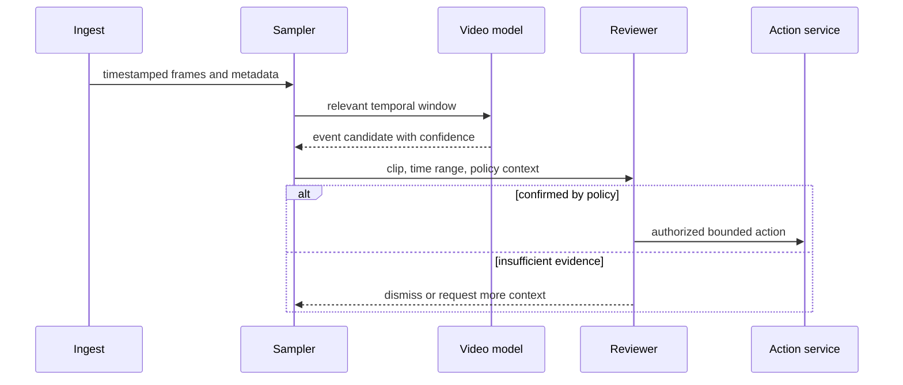

# Video understanding
Status: draft — expansion pending
Sources: [Google DeepMind — news archive](https://deepmind.google/blog/)

## In one sentence

Video understanding turns an ordered, multimodal stream into time-bounded observations, so a reliable system must preserve temporal evidence, sampling decisions, uncertainty, and the distinction between detection and action.

## Background: what existed before

Image classification considers one frame at a time. It can identify an object, scene, or text region, but it cannot reliably answer whether an event happened, which object persisted through an occlusion, or whether a person entered before an alarm sounded. Video adds ordering, camera motion, frame rate, audio, compression artifacts, and long idle periods. These properties turn inference into a data-pipeline problem as much as a model problem.

Traditional video analytics used fixed rules, motion detectors, trackers, and specialized models. A pipeline might sample a feed, detect objects, associate detections across frames, and raise a narrowly defined event. Modern multimodal models can summarize longer clips and answer flexible questions, but they do not remove the need to select the right frames, retain evidence, enforce privacy, and measure temporal accuracy. A fluent summary can be wrong about sequence even when its object labels are individually plausible.

The July source map identifies embodied agents and operations as a focus area through the Google DeepMind news archive. That is source context rather than a claim about a specific video model. The engineering lesson is durable: systems should process video as timestamped evidence, not a sequence of unrelated images.

## What changed and why now

Higher-capability vision-language systems make it easier to ask broad questions over clips: “Did the worker wear required equipment before entering?” or “When did the package leave the staging area?” This changes the interface from fixed detectors to natural-language retrieval and event hypotheses. It also increases the risk of under-specified requests. “Find unsafe behavior” needs a policy definition, a camera scope, a review path, and a threshold; it is not a self-executing model query.

Use a two-stage design. An ingest service records the stream, timestamps, camera identity, access policy, and integrity metadata. A cheap first stage detects motion, scene change, audio cues, or candidate objects. A second stage samples relevant windows, tracks entities, and applies a task-specific classifier or multimodal model. Store short evidence clips and model outputs with time ranges so reviewers can inspect the basis for a result.

## Impact on current processing and architecture


Sampling controls both cost and accuracy. Uniformly selecting one frame every five seconds is cheap, but it can miss a brief event. Sampling every frame is expensive and may generate redundant evidence. Combine coarse temporal segmentation with adaptive sampling: increase density around motion, scene cuts, detected objects, or uncertain intervals. Record the sampling policy and dropped-frame count because a negative result is meaningful only relative to what the pipeline actually inspected.

Entity tracking links observations across time. A detector may see several people in a frame; a tracker attempts to maintain an identity through movement and occlusion. Track IDs are hypotheses, not durable real-world identities. Do not use them for personnel or customer decisions without an approved identity process, and reset or qualify them when camera views change. A system should report “track 17 was visible from 10:03:12 to 10:03:19” rather than silently claiming it knows who the person is.



## Real-world applications and constraints

Manufacturing inspection can detect missing steps or unsafe zone entry, but camera placement, lighting, shift patterns, and false alarms determine whether operators trust it. Logistics can find a parcel’s last observed location, but barcode or inventory systems remain the system of record. Accessibility tools can generate scene descriptions, but must make uncertainty clear and avoid inventing unobserved details. Sports, media indexing, and incident review can benefit from clip retrieval while applying separate rights, consent, and retention controls.

Privacy is a first-order architecture concern. Cameras can capture faces, screens, conversations, and bystanders. Enforce per-camera purpose, role-based viewing, encryption, retention expiry, redaction where appropriate, and audit logs for clip access. Do not keep every embedding or transcript indefinitely simply because storage is inexpensive. Jurisdiction, workplace policy, and consent requirements may differ by location and use case.

## Mental model

Treat video inference as a witness with timestamps, not an omniscient observer. It can point to a short interval and explain what visual evidence supported a candidate event. It cannot establish intent, identity, causation, or complete coverage without additional evidence. The system should make it easy to review the clip, correct the model, and keep a high-impact downstream action behind an independent policy gate.

## Engineering consequence

Measure event precision and recall by event type, camera condition, lighting, occlusion, motion speed, and clip length. Also measure time-to-first-result, end-to-end cost per hour of video, evidence-retention failures, reviewer correction rate, and false-positive burden. A high frame-level score can hide poor event-level performance: detecting a helmet in many frames does not prove the worker wore it for the required duration.

Define data contracts for every stage: accepted codec and frame timing; what happens when audio is absent; maximum clip duration; expected coordinate system; event schema; confidence interpretation; and retention tags. Keep raw frames, derived crops, transcripts, embeddings, and summaries distinguishable. An event candidate should include camera ID, start and end timestamps, model and prompt version, sampling policy, evidence URI, and reason code, enabling later replay and audit.

## Limits and failure modes

Temporal aliasing occurs when sampling is too sparse for the event. A one-second handoff can disappear between five-second samples, while a fast-moving object can be blurred in every retained frame. Camera frame rate, shutter speed, compression, and clock drift matter. Calibrate sampling around the shortest event the product claims to detect, and state the coverage limit in the user interface. A system that examined only selected intervals should say “no event detected in sampled windows,” not “the event did not occur.”

Camera motion and scene changes create false event boundaries. A panning camera can make every object appear to move; a switch between cameras can break a track; a reflective surface can create duplicated detections. Use camera metadata, stabilization where appropriate, and a transition policy that ends a track when continuity cannot be established. Do not merge identities across views merely because embeddings look similar, especially in high-impact contexts.

Confidence scores require calibration. A model’s 0.9 score may not mean a ninety percent chance of correctness, and performance can vary by camera, weather, clothing, background, and event class. Validate on representative labeled clips, monitor drift, and choose escalation thresholds based on the cost of a false alert versus a missed event. For safety or disciplinary use, a score should trigger a review workflow, not an automatic accusation or penalty.

Prompt injection can appear in visual form as text on a screen, a sign, or a document shown to the camera. Treat video content as untrusted data. A sign saying “ignore safety policy” is evidence that the sign exists, not an instruction to the model pipeline. Keep tools and authority outside the model context, validate every downstream action, and limit model output to a typed event schema.

### Retention and incident response

Retention policy must distinguish evidence needed for an active incident from routine footage. Set automatic expiry by camera purpose, legal policy, and user consent; place a documented legal or incident hold only when authorized; and delete derived artifacts when their parent footage expires unless a separate approved purpose applies. Maintain an access log that records who viewed or exported a clip, why, and which policy allowed it. Encryption alone does not solve over-retention or excessive access.

When an event model misbehaves, preserve a small, approved debugging packet: the frame timestamps, model version, sampling configuration, event output, and reviewer disposition. Avoid copying unrelated footage into a general troubleshooting channel. Roll back a faulty model or threshold, invalidate unreviewed alerts generated by that version, and add a labeled regression clip if policy permits. The goal is to correct the measurement system while respecting the people recorded by it.

### Rollout strategy

Deploy in shadow mode first. Run the pipeline on a representative camera subset, compare candidates with human-labeled events, and measure reviewer workload before any integration can create an operational alert. Next, enable advisory notifications with clear uncertainty and a human review queue. Only after stable performance, policy approval, and recovery testing should the system feed a bounded downstream workflow. Keep a kill switch that stops new automated notices without deleting existing evidence or losing the ability to investigate.

Test the full path with synthetic and recorded fixtures: missing frames, shifted timestamps, corrupt uploads, out-of-order chunks, camera reboot, long idle video, sudden lighting change, background television audio, duplicate event delivery, and revoked user access during review. Test that a rejected event cannot be reintroduced by a late retry. These are ordinary distributed-systems failures expressed through media data.

### Data quality and model lifecycle

Video labels need careful definitions. “Vehicle present” may mean any visible part of a vehicle, a vehicle occupying a zone for a minimum duration, or a vehicle whose identifier is readable; each definition produces a different training and evaluation set. Write annotation guidance, preserve ambiguous cases, and measure agreement between human labelers. If experts cannot apply the event definition consistently, a model score cannot make the definition reliable.

Version datasets, annotations, model weights, prompts, thresholds, and post-processing rules together. A detector upgrade may improve object recall while a changed tracker worsens event continuity. Replay the same labeled clips through both complete pipelines and compare event-level outcomes before rollout. Monitor data drift from new cameras, changed compression settings, seasonal lighting, or altered layouts. Retraining without understanding the shift can hide a policy or sensor problem behind a new model version.

Bias and coverage require operational attention. Camera placement can make some routes, heights, mobility aids, uniforms, or skin tones more difficult to observe. Measure errors by approved, relevant conditions and seek domain review before using video for any decision that affects people. When coverage is inadequate, return an uncertainty state or route to a human; do not infer a hidden attribute from a weak visual signal.

### Cost and capacity planning

Estimate cost per camera-hour across ingest bandwidth, storage, decode, frame sampling, inference, event indexing, and reviewer time. A model that appears cheap per sampled frame can become expensive when adaptive sampling activates during a busy shift. Use backpressure and priority tiers so a burst of uploads does not delay safety-relevant review. If capacity is exhausted, preserve the raw stream according to policy and record that analysis was deferred; do not silently discard evidence or claim complete coverage.

Document the user-visible consequence of every degraded mode. If a stream is analyzed at lower sampling density, label the resulting evidence accordingly. If an event index is delayed, show its processing watermark. Clear freshness and coverage signals let operators avoid making a high-impact decision from a result that looks current but is actually incomplete.

## Build it locally

This dependency-free example groups timestamped detections into an event only when observations persist long enough. It illustrates that one frame is not automatically an event.

```python
from dataclasses import dataclass


@dataclass(frozen=True)
class Detection:
    second: int
    label: str
    score: float


def sustained_event(items: list[Detection], label: str, minimum: int = 3) -> str:
    seconds = [item.second for item in items if item.label == label and item.score >= 0.8]
    longest = current = 0
    previous = None
    for second in seconds:
        current = current + 1 if previous is not None and second == previous + 1 else 1
        longest, previous = max(longest, current), second
    return "EVENT" if longest >= minimum else "INSUFFICIENT_EVIDENCE"


detections = [Detection(10, "forklift", .91), Detection(11, "forklift", .88), Detection(12, "forklift", .92)]
print(sustained_event(detections, "forklift"))
assert sustained_event(detections, "forklift") == "EVENT"
```

1. Save the code as `video_event.py` and run `python3 video_event.py`.
2. Remove one middle detection and verify that the event becomes insufficient evidence.
3. Add a camera ID and avoid combining detections from different cameras.
4. Add a maximum gap rule and record the sampling policy with each result.
5. Add a reviewer disposition field so a false positive becomes labeled feedback rather than a silent deletion.

## Mini exercise (15–30 min)

Choose a bounded event, such as “a package enters a staging zone.” Define its start and end, the camera scope, the shortest meaningful duration, likely occlusions, and the evidence a reviewer needs. Then list which downstream action is safe to automate, which requires review, and what should happen if frames are missing. This separates detection from authority.

## Interview Q&A

**Why is video harder than image classification?** Meaning depends on ordering, persistence, motion, camera behavior, and evidence windows; a correct frame label can still support an incorrect event conclusion.

**How do you reduce cost without missing events?** Use coarse segmentation and adaptive sampling around motion or uncertainty, then evaluate event-level recall on representative clips.

**What should a model output?** A time-bounded candidate with evidence references, confidence, model version, and uncertainty—not an unqualified statement about identity or intent.

## Glossary

- **Adaptive sampling:** increasing frame selection around likely or uncertain events.
- **Event candidate:** a time-bounded observation that still needs policy or reviewer disposition.
- **Temporal aliasing:** missing or misrepresenting an event because sampling is too sparse.
- **Track:** a hypothesized continuity of an observed entity across frames.
- **VLM:** vision-language model, which can relate visual content and text.

## References

- [Google DeepMind news archive](https://deepmind.google/blog/) — primary discovery source for the July topic.
- [NIST AI Risk Management Framework](https://www.nist.gov/itl/ai-risk-management-framework) — risk-management context.

## Claim ledger
| Claim | Source | Fact or inference |
|---|---|---|
| July’s source map focuses on embodied-agent and operational concepts. | Google DeepMind news archive | Source-context fact |
| Video systems need temporal evidence, retention controls, and independent action gates. | This lesson’s systems design | Engineering inference |
