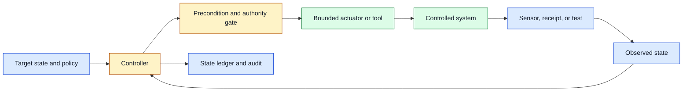
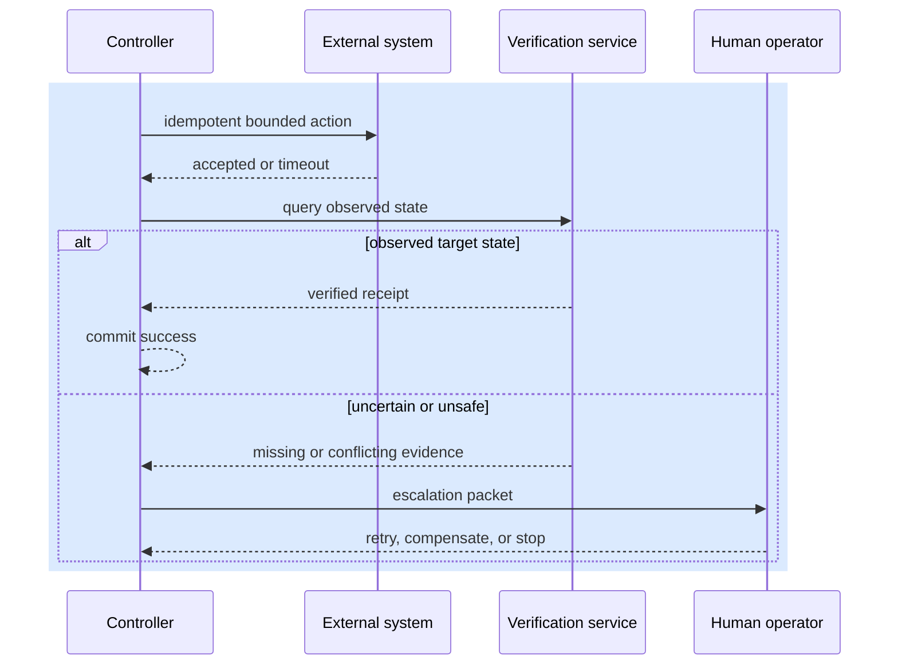

# Closed-loop control
Status: durable
Sources: [Google DeepMind — 2026-07-30, primary product post](https://blog.google/innovation-and-ai/models-and-research/google-deepmind/gemini-robotics-er-2/); [Google DeepMind — 2026-07-30, model card](https://deepmind.google/models/model-cards/gemini-robotics-er-2/)

## In one sentence

Closed-loop control repeatedly observes a system, chooses a bounded action, measures the resulting state, and corrects course, making feedback and recovery part of the product rather than an afterthought.

## Prerequisites

Know state transitions, preconditions, retries, timeouts, receipts, and idempotency. The key distinction is between a rejected action, a confirmed effect, and an unknown effect after a timeout; those states require different recovery paths.

## Background: what existed before

An open-loop workflow issues a plan and assumes the world behaves as expected: send a command, wait a fixed interval, then proceed. This works when a system is stable, inputs are known, and failures are cheap. It fails under drift. A robot can encounter an obstruction, a browser page can render a different state, an API can partially apply an update, and an inference system can receive inputs outside its evaluation distribution. Planning alone cannot verify that the intended effect occurred.

Classical control systems use a sensor, controller, actuator, and feedback path. A thermostat measures temperature, compares it with a target, turns heating on or off, then measures again. Software systems use the same pattern even when the “sensor” is an API receipt, test result, event stream, or human review. The key distinction is state ownership: the controller responds to an observed state from the controlled system, not only its own prior intent.

The July 30 ER 2 release is the monthly anchor because it describes robots tracking progress from continuous video, adapting when something goes wrong, and checking task completion before moving on. Those are provider-reported capabilities, not a safety guarantee for a controller. The engineering inference is that the action loop needs an independent observation and a declared postcondition: a model may choose the next action, but a sensor, receipt, or policy service must decide whether the prior action succeeded.

## What changed and why now

Agent systems can produce long action plans, tool calls, and UI interactions, which creates a temptation to execute many steps before checking results. Closed-loop design instead turns each consequential step into a small transaction: read current state, validate that action preconditions hold, apply a limited action, observe a receipt or measurement, and decide whether to continue, retry, compensate, or escalate. This reduces the blast radius of stale assumptions.

The feedback signal must be defined before automation begins. “Task completed” can mean a command was accepted, a job was scheduled, a physical effect was observed, a database record changed, or a user confirmed the result. These are different states with different evidence. A queue acknowledgment proves less than an external receipt; a model’s summary proves less than a system-of-record query. The controller should record which evidence level it has reached.

## What changed this month

The July 30 ER 2 description makes the observe–act–verify loop concrete: a high-level reasoner hands work to an action model and uses ongoing video to decide whether to continue. In a real controller, that signal must carry freshness, task identity, and an expected state version. If an observation or receipt is stale, pause or reconcile instead of letting a plausible model narrative advance the workflow.

## Impact on current processing and architecture



Use a durable state machine such as `OBSERVE`, `PLAN`, `AWAITING_APPROVAL`, `ACTING`, `VERIFYING`, `SUCCEEDED`, `RETRYABLE_FAILURE`, `UNKNOWN_EFFECT`, and `ESCALATED`. Store the expected state version and an idempotency key with every action. If an observation arrives late, compare it with the current attempt before changing state. A result from a cancelled action is useful audit evidence but must not silently advance a newer run.

Controllers should use thresholds and hysteresis. Hysteresis means using different boundaries to enter and leave a state, preventing rapid oscillation around one noisy value. For example, a resource controller might scale out above 80% utilization but only scale in below 50% for a sustained period. In an agent workflow, a confidence or evidence score can trigger review at one threshold and resume only after stronger evidence appears. Do not retry a failing action forever because each repeat can create cost or a duplicate effect.



## Real-world applications and constraints

Robotics uses sensor feedback to correct navigation or grasping. Deployment controllers use health checks and error budgets to decide whether to continue a rollout. Browser agents use page state and confirmation receipts rather than assuming a click succeeded. Customer workflows use system-of-record queries to verify a cancellation or refund. In every case, sensing has latency, noise, cost, and permission boundaries. A slow or ambiguous sensor may require a safe wait or human handoff rather than more aggressive action.

## Mental model

Think of a controller as a careful operator with a checklist: observe what is true, make one authorized move, inspect the result, and only then choose the next move. The planner can suggest a route, but feedback decides whether the route is still valid. This is how a system remains useful when its model of the world is incomplete.

## Engineering consequence

Make observed state explicit and queryable. Record source, timestamp, freshness, confidence, and version with each measurement. Define maximum observation age and what happens when it is exceeded. Isolate the actuator behind a typed API with scoped credentials and idempotency. Add a compensating action or safe-state procedure for each effect that can fail after partial execution. Track control-loop latency, retry count, convergence time, oscillation rate, unknown-effect rate, human escalations, and policy denials.

### Designing the feedback signal

Choose sensors by the decision they must support. A command-accepted response is sufficient to know an API received a request, but not sufficient to tell a customer that a shipment was cancelled. A database row can confirm a local write, but not that a downstream notification was delivered. A camera may show an object in a zone but not confirm its identity. Map each control transition to the least ambiguous available evidence, then label residual uncertainty instead of inventing certainty.

Freshness matters as much as accuracy. A perfectly accurate observation from ten minutes ago is unsafe for a rapidly changing physical or operational state. Include event time and ingestion time; reject or qualify signals outside an age budget; and detect clock skew between producers. When observations conflict, preserve both records and use a defined resolver, such as the system of record, a priority order, or human review. Do not allow the latest-arriving event to automatically win.

Feedback can itself create overload. Polling a service every second for thousands of jobs can become the outage that prevents completion. Prefer event subscriptions where reliable, back off with bounded jitter when polling, coalesce redundant checks, and reserve capacity for verification traffic. The controller should have a timeout budget: if verification cannot complete within the user-facing deadline, return a pending or unknown status with a correlation ID rather than quietly extending the loop.

### Recovery and compensation

Classify failure before retrying. A validation failure is not retryable until inputs change. A transient network error may be retryable with the same idempotency key. A policy denial requires a different authorization path. A timeout after an external action is an unknown effect and requires reconciliation. This taxonomy prevents a generic retry helper from repeatedly executing a harmful or futile action.

Compensation is not always reversal. A failed payment may need a void; a partially created account may need a disable-and-review state; a robot that cannot complete a pickup may need to stop at a staging area. Define the compensating procedure alongside the original action and test it independently. Record compensation receipts with the same lineage as the original effect so a later operator knows what remains to be repaired.

Circuit breakers prevent a control loop from amplifying a systemic failure. When a downstream service returns repeated errors, stop sending new actions for a cooling period, preserve queued work, and expose the degraded dependency to operators. A fallback should be narrower, such as read-only status or a human queue, not a bypass that grants broader authority. Recovery is successful only when the system returns to a known safe state with bounded cost.

## Limits and failure modes

Overly aggressive controllers oscillate. A deployment system that alternates between scaling up and down can waste capacity; a browser agent that repeatedly reloads can lose a form; a robot that alternates direction near an obstacle can become unsafe. Use hysteresis, dwell time, maximum retry counts, and a terminal escalation state. Measure not only whether the target was eventually reached but how much unnecessary action occurred along the way.

Models may produce persuasive but weak observations. A language model can summarize logs as “the issue is resolved” even when a health check is still failing. Treat model output as a candidate signal requiring a trusted verification source for consequential transitions. The same rule guards against prompt injection in tool output: retrieved text can influence planning, but it cannot authorize an action or change the controller’s state machine.

## Operational rollout

Start closed-loop automation in shadow mode. Let the controller observe, calculate its proposed actions, and record what it would have done while the current process remains authoritative. Compare proposed decisions with operator actions and investigate disagreement by evidence quality, policy, and timing. Then enable low-impact actions with strong idempotency and a clear rollback. Expand authority only after exercising cancellation, lost-signal recovery, circuit breaking, and human takeover under representative load.

Version policy, thresholds, sensor configuration, and actuator contracts together. A change to one can alter loop behavior even when the model is unchanged. Replay recorded event streams against a candidate controller and confirm that terminal states, retries, and action count stay within expectations. Keep an emergency kill switch that stops new actions while retaining telemetry and state needed for safe recovery.

### Capacity and fairness

Control loops compete for shared dependencies. A high-priority recovery flow should not be delayed behind thousands of low-value checks, yet emergency priority cannot allow one tenant to monopolize the actuator. Use admission control, per-tenant quotas, priority classes, and a maximum queue age. Record the reason for each delayed or rejected action so operators can identify capacity pressure separately from a failed controller decision.

Bound the work per loop iteration. Limit tool calls, bytes retrieved, time spent waiting for a sensor, and the size of an evidence packet. A controller that keeps requesting more context while a user waits can exceed both cost and latency budgets without improving confidence. At the budget boundary, return an explicit pending or escalation state containing the next evidence required. This makes partial progress honest and gives a human a usable handoff.

### Evaluating controller quality

Build a scenario suite that includes normal success, transient error, stale observation, conflicting sensors, partial external effect, policy denial, dependency outage, cancellation, and adversarial tool output. Score convergence to the correct terminal state, unnecessary action count, time in unsafe or unknown states, cost, and operator intervention. A controller that reaches success eventually but repeats a payment three times is not correct. Run the suite whenever policy, model, actuator schema, or sensor integration changes.

Use production incidents as fixtures. For every recovered or escalated run, capture a redacted event trace and the correct disposition. Replay it during future changes. This turns rare edge cases into durable evidence and prevents a new planner or threshold from reintroducing a previously fixed failure pattern.

### Policy observability

Log the policy version and rule that allowed, delayed, denied, or escalated every action. A controller trace should make it possible to distinguish “the sensor was stale,” “the action exceeded the budget,” and “the user lacked authority.” Aggregate these reasons by workflow and release version. A sudden increase in one reason can reveal a configuration drift or an upstream schema change before it becomes a broad outage. Keep policy logs structured and minimize sensitive content so observability improves accountability without duplicating full user data.

This evidence also gives reviewers a concrete basis for adjusting thresholds without relying on anecdotal reports.

## Engineering analysis

The July robotics release is a useful example of why a high-level reasoner and an action model need a feedback contract. The reasoner can propose a sequence, while continuous video and task-progress signals indicate whether the physical world followed that proposal. In software, the same separation appears when a planner submits a tool request and an independent service verifies the resulting record. The important unit is not “model call succeeded”; it is “the expected state transition was observed with fresh evidence.”

Define preconditions and postconditions in the action schema. A precondition may say that the robot is in a named zone, the gripper is empty, and the scene version is current. A postcondition may require an object to be detected at a destination, a database version to increment, or a receipt to contain a specific resource ID. If the action returns only `200 OK`, the controller has not learned whether the business effect occurred. The verifier should query the authoritative system or use a sensor whose failure modes are understood. A model-generated description can help explain a result, but it should not be the sole postcondition.

Feedback cadence is a trade-off. Checking after every motor micro-step is too expensive and may introduce instability; checking only at the end of a long plan creates a large blast radius. Choose checkpoints at boundaries where the cost of a wrong assumption changes: before entering a shared space, after grasping an object, before a write operation, after a page navigation, and before releasing a resource. Each checkpoint needs a timeout and an explicit outcome for stale or missing evidence. A timeout should move the state to `UNKNOWN` or `NEEDS_REVIEW`, not to success by default.

Retries need a controller-specific policy. A transient sensor read can be retried safely, while a physical grasp or payment request may already have taken effect. Use an idempotency key when the external system supports one, and use reconciliation when it does not. Compensation is not the same as undo: moving an item back may be impossible, and issuing a refund may have legal or accounting implications. The controller should record the original effect, the attempted recovery, and who authorized it.

Control quality also depends on observability. Log the observed state version, action ID, policy decision, actuator command class, receipt ID, and reason for each transition. Do not log raw credentials or unbounded sensor streams by default. During rollout, shadow the controller against recorded traces, inject stale observations and delayed receipts, and compare its decisions with a reference policy. A loop that is stable in a clean simulation can oscillate when measurements arrive late, so latency and freshness belong in the test fixture. The source-backed capability is adaptation; the engineering work is making adaptation bounded, measurable, and reversible.

## Build it locally

This small state machine shows why a timeout after an action becomes an unknown effect instead of an immediate retry.

```python
from dataclasses import dataclass


@dataclass
class Run:
    state: str = "OBSERVE"
    attempt: int = 0
    effect_key: str = ""
    observed: str | None = None


def act(run: Run, response: str) -> str:
    if run.state != "OBSERVE":
        return "REJECT: unexpected state"
    run.attempt += 1
    if response == "verified":
        run.state = "SUCCEEDED"
    elif response == "timeout":
        run.state = "UNKNOWN_EFFECT"
    else:
        run.state = "RETRYABLE_FAILURE"
    return run.state


def reconcile(run: Run, observation: str) -> str:
    if run.state != "UNKNOWN_EFFECT":
        return "REJECT: no unknown effect"
    run.observed = observation
    if observation == "present":
        run.state = "SUCCEEDED"
    elif observation == "absent" and run.attempt < 2:
        run.state = "OBSERVE"
    else:
        run.state = "ESCALATED"
    return run.state


run = Run()
run.effect_key = "door:open:attempt-1"
print(act(run, "timeout"))
assert run.state == "UNKNOWN_EFFECT"
assert reconcile(run, "present") == "SUCCEEDED"
assert reconcile(run, "absent").startswith("REJECT")

retry = Run(effect_key="door:open:attempt-2")
assert act(retry, "rejected") == "RETRYABLE_FAILURE"
assert retry.effect_key != run.effect_key
```

1. Save as `control_loop.py` and run `python3 control_loop.py`.
2. Add a `reconcile` function that transitions from `UNKNOWN_EFFECT` only after an external receipt is found.
3. Add a maximum attempt count and an `ESCALATED` terminal state.
4. Record a timestamp and reject observations that exceed a freshness limit.
5. Simulate duplicate action responses and verify that the idempotency key prevents a second effect.

## Mini exercise (15–30 min)

Pick a workflow such as a deployment or subscription cancellation. Draw the target state, trusted observation source, allowed actuator, retryable failures, unknown-effect path, compensating action, and human takeover point. Then remove the trusted observation and explain why the controller should stop rather than assume success.

## Interview Q&A

**What distinguishes closed loop from open loop?** Closed loop uses observed results to choose the next action; open loop follows a plan without verifying the controlled system’s current state.

**Why is an API timeout not a retry signal by itself?** The downstream system may have applied the effect before the response was lost. Reconcile first to avoid duplicates.

**How do you avoid oscillation?** Use hysteresis, dwell times, bounded retries, rate limits, and terminal escalation states.

## Glossary

- **Actuator:** the tool or service that changes the controlled system.
- **Circuit breaker:** a control that temporarily stops requests to a failing dependency.
- **Compensation:** a procedure that returns a partially completed workflow to a safe state.
- **Hysteresis:** separate thresholds that avoid rapid switching around a noisy boundary.
- **Observation:** evidence about actual state from a sensor, receipt, or system of record.

## References

- [Google DeepMind — Gemini Robotics ER 2, 2026-07-30](https://blog.google/innovation-and-ai/models-and-research/google-deepmind/gemini-robotics-er-2/) — primary product release and monthly source.
- [Google DeepMind — Gemini Robotics ER 2 model card](https://deepmind.google/models/model-cards/gemini-robotics-er-2/) — primary model documentation.
- [NIST AI Risk Management Framework](https://www.nist.gov/itl/ai-risk-management-framework) — risk-management context.

## Claim ledger
| Claim | Source | Fact or inference |
|---|---|---|
| ER 2 is described as tracking progress and adapting when a physical step goes wrong. | [Google DeepMind — 2026-07-30](https://blog.google/innovation-and-ai/models-and-research/google-deepmind/gemini-robotics-er-2/) | Fact; provider release claim |
| The post describes a high-level reasoner handing motor execution to a VLA model. | [Google DeepMind — 2026-07-30](https://blog.google/innovation-and-ai/models-and-research/google-deepmind/gemini-robotics-er-2/) | Fact; provider release claim |
| Every consequential action should have an observation or receipt that can advance state. | This lesson’s architecture | Engineering inference |
| A timeout with an unknown external effect must not be treated as a clean failure. | Distributed-systems design | Engineering inference |
