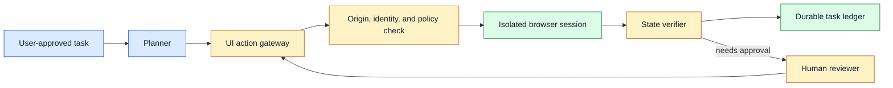
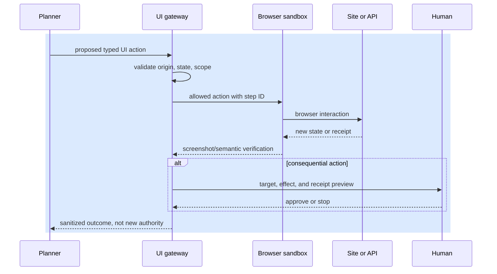

# Computer use
Status: emerging
Sources: [Google — 2026-07-21, official model release](https://blog.google/innovation-and-ai/models-and-research/gemini-models/gemini-3-6-flash-3-5-flash-lite-3-5-flash-cyber/); [W3C — 2026-07-02, WebDriver Working Draft](https://www.w3.org/TR/2026/WD-webdriver2-20260702/)

## In one sentence

Computer-use agents operate visual interfaces through screenshots, keyboard input, and pointer actions, so they need explicit state verification, narrow authority, and recovery paths because pixels are a weaker contract than an API.

## Prerequisites

Know HTTP origins, browser navigation, DOM or accessibility trees, authorization, and optimistic concurrency. A page-state hash is a version marker; after a mismatch the system must re-observe and explain what changed.

## Background: what existed before

People use graphical interfaces by combining perception and context. They read labels, notice a disabled button, remember which account is active, infer whether a form submission succeeded, and adapt when a dialog blocks the page. Traditional automation approximates this with selectors, browser APIs, macros, or robotic process automation. Selectors can be robust when a site exposes stable semantic identifiers; coordinate-based clicking is fragile because layout, zoom, localization, responsive design, banners, and A/B tests can move the same visual element.

Application APIs remain the preferred integration surface when they exist. An API can expose typed arguments, authentication, authorization, idempotency, receipts, rate limits, and versioning. A GUI agent is often necessary only for legacy systems, cross-application work, or human-facing tasks with no supported API. That necessity does not make the GUI safe as a general tool: a page can contain untrusted text, a visually similar button, or an unexpected modal that changes the meaning of the next click.

The July 21 Google release is the monthly anchor: it describes computer use as a client-side tool in the Gemini API and reports an OSWorld-Verified result. Those are release-specific capability and provider-evaluation claims, not evidence that an arbitrary GUI workflow is reliable. The engineering boundary for this lesson is the action-policy gateway: it decides whether a proposed interaction is allowed. Semantic target identity belongs to the grounding lesson, and process, profile, and network isolation belong to the sandboxing lesson.

## What changed and why now

Multimodal models can interpret screenshots and take actions based on natural-language goals, allowing an application to automate work that previously required hand-authored selectors. This expands coverage but also changes the failure mode: the agent may recognize the right intent yet ground it on the wrong visual target, follow an instruction embedded in a page, or act on stale UI state. “Click submit” is not a durable effect specification unless the system also knows which form, account, target, confirmation, and receipt are expected.

Design computer use as a sequence of observe–decide–act–verify steps. Before each action, capture the relevant page state, active origin, window or tab, user identity context, and permitted task scope. Translate the planner’s intent into a typed action such as `navigate_allowed_origin`, `click_element_with_label`, `fill_known_field`, or `request_human_confirmation`. After each action, inspect the DOM, URL, accessibility tree, or server receipt when available. Prefer semantic signals over visual coordinates, even when a model selected the target.

## What changed this month

The verified July 21 update says computer use is a built-in client-side tool in the Gemini API and reports an OSWorld-Verified comparison. That is a provider capability claim, not proof that arbitrary GUI actions are reliable. The engineering change is a clearer boundary: the model proposes an action, the client owns the browser session, and a policy gateway checks origin, page version, target, and effect.

## Impact on current processing and architecture



Use one isolated browser profile per task or tenant. Block arbitrary downloads, clipboard access, local-file access, extensions, and unapproved origins. Give the session short-lived credentials scoped to the intended site and action where possible; never place a broad administrator password in a model prompt or screenshot annotation. Clear session state after completion according to policy and retain only minimal audit evidence such as task ID, origin, action type, receipt, and error category.

The action gateway should reject unsafe plans before the browser receives them. Allowlist origins and navigation targets; cap redirects; require a known field schema for form input; rate-limit clicks and submissions; and bind high-impact effects to a fresh user confirmation. A model may propose an action, but it should not change the allowlist, disable a browser sandbox, or approve its own payment, deletion, message, or credential disclosure.



## Real-world applications and constraints

Computer use can help with legacy back-office workflows, enterprise dashboards, cross-site research, accessibility assistance, testing, and data entry where a supported API is unavailable. It is a poor default for operations with stable APIs or broad irreversible authority. For example, a browser agent can prepare a support-ticket draft, but account deletion should use a dedicated domain service with a typed confirmation flow. UI automation should not become an accidental bypass around normal authorization controls.

Latency is often dominated by page loads, rendering, multi-factor authentication, and human confirmation rather than model reasoning. Build explicit timeouts, progress states, and resumable checkpoints. A long-running task must survive a browser crash without replaying a form submission. Store an idempotency key or the site’s receipt ID before attempting a retry. If the site does not provide a reliable receipt, treat the outcome as unknown and request human verification.

## Mental model

Treat a computer-use model as an intern operating a remote desktop through a constrained toolbelt. It can point out what it sees and request a limited interaction. The browser sandbox, policy gateway, and system-of-record verification determine whether the interaction is allowed and whether it succeeded. A screenshot is evidence about display state, not an authority token or a complete audit trail.

## Engineering consequence

Define a small action vocabulary and a per-action verification rule. Navigation verifies final origin and title. Form fill verifies field identity and permitted value class. Submission verifies a receipt or server state. Download verifies file type, size, and malware policy before access. Track step success, stale-screenshot rate, origin-policy denials, redirect count, visual-grounding corrections, unknown-effect rate, time to handoff, and actions per completed task. Use these metrics to decide whether a workflow should remain GUI-based or be replaced with a proper API integration.

## Limits and failure modes

Visual ambiguity is fundamental. A button may be disabled, obscured by a modal, duplicated in a background tab, or visually similar to a destructive alternative. Responsive layouts and localization can change labels and positions. Require the gateway to bind an action to a current page state and semantic target where available, then expire that binding quickly. If a screenshot or DOM changes between planning and clicking, re-observe instead of applying the stale plan.

Pages are untrusted content. A support ticket, web page, document preview, or advertisement can instruct the model to reveal secrets, alter its task, or navigate to a malicious site. Do not attempt to solve this only through model prompting. Keep the allowed task, origin list, credentials, and action policy in trusted application state. Strip or label page text when presenting it to a model, and require independent verification before any effect. An instruction shown on a page cannot grant the browser more authority.

Authentication flows are a special boundary. Password entry, MFA, passkeys, CAPTCHA, and account recovery should not be treated as generic form fields. Let the authenticated user handle high-assurance authentication in a clearly isolated interaction, then delegate a short-lived session to the permitted task. Never ask a model to read one-time codes from unrelated channels or to solve a security challenge by bypassing its intended purpose.

Downloads and uploads can cross the host boundary. Block automatic downloads by default, scan approved files, limit MIME type and size, and avoid exposing local directories to the browser. For uploads, use a task-scoped file picker that exposes only approved artifacts. A page can use a benign-looking file input to seek sensitive local data; the agent must not receive arbitrary filesystem authority merely because it can see a browser control.

### Recovery, checkpoints, and human handoff

Checkpoint after verified milestones, not every click. A durable record can include the task ID, authorized origin, last verified state, created draft ID, receipt ID, and pending confirmation. On restart, reopen the session only if policy allows, query the system of record, and continue from the last verified milestone. Do not replay a submit sequence just because the browser’s final screen was lost.

Use a bounded recovery policy. A retryable rendering failure may reload once; an expired session may request the user to reauthenticate; a changed page structure may escalate to an operator or fall back to a supported API. Repeated click attempts, reload loops, or attempts to circumvent an error page should be terminal failures. Preserve screenshots and semantic evidence needed for diagnosis within the product’s privacy policy, but do not keep full browsing history by default.

Human handoff should show the intended effect, not just an image. Include the active site, target record, proposed fields or action, reason for uncertainty, last verified receipt, and available safe choices. Make it possible to stop without completing the task. A human who approves an external message, payment, deletion, or account change needs enough context to understand the consequence, and the confirmation should be bound to the exact request and expire quickly.

### Evaluation and rollout

Evaluate complete workflows rather than counting clicks. Create fixtures for correct completion, wrong but visually similar target, stale state, modal interference, login expiry, redirect to an unapproved origin, prompt injection in page text, duplicate submit, lost receipt, and user cancellation. Measure task success, unauthorized-action rate, recovery accuracy, handoff rate, time, cost, and user correction. A high click-success rate can hide a dangerous rate of incorrect effects.

Begin in observation mode, where the model identifies candidate actions but cannot operate the browser. Compare its proposed targets with labeled or human actions. Then enable read-only navigation and drafting in a restricted site set. Add effectful actions only when each has a clear receipt, idempotency policy, rollback or compensation, and an owner. Maintain a kill switch that stops new browser actions while preserving task state and audit evidence for recovery.

### Accessibility and product ownership

Accessibility trees are valuable both for users and automation. Roles, names, states, and keyboard focus provide more stable signals than pixels, and they help a system explain what it intends to select. Treat inaccessible UI as an integration risk: if a person using a keyboard or screen reader cannot reliably identify a control, an agent will likely have weak grounding too. Do not assume that visual OCR can replace semantic labeling; improve the product’s own accessible names and state exposure where possible.

Give each automated workflow a product owner who defines its allowed origins, action registry, confirmation policy, audit retention, and fallback. The owner should review error and correction samples, approve material UI contract changes, and decide when an API replacement is justified. Teams often inherit fragile browser automation because no one owns the integration after the initial demo. Explicit ownership turns layout changes, authentication shifts, and policy updates into planned compatibility work.

For vendor websites, respect terms, rate limits, and user expectations. A technically feasible browser action can still violate a contract or create surprising traffic. Prefer documented integrations, identify the acting user to the site when appropriate, and make any automation visible and controllable. Transparent scope and easy cancellation are part of a trustworthy computer-use product.

Review these contracts during regular release planning, not only after a browser workflow fails in production.

That discipline keeps UI automation bounded, debuggable, and replaceable as supported service interfaces become available.

It also ensures failures produce actionable evidence instead of hidden retries or unexplained user-facing changes.

## Engineering analysis

The July computer-use release is best read as an interface change, not a replacement for application architecture. A client-side tool can expose a model to screenshots and interaction primitives, and the reported OSWorld-Verified result indicates a benchmark capability claim. It does not answer whether a particular purchase, account change, or file upload is authorized. That decision remains with the application that owns the browser session. The clean boundary is planner proposal, client validation, browser execution, and independent postcondition verification.

Typed actions reduce ambiguity. Instead of passing an unconstrained instruction such as “finish checkout,” the planner can request `click` with a semantic target, an expected origin, a page revision, and a risk class. The gateway checks that the target still exists, the user and tenant are unchanged, and the action is within the run’s budget. For a write, it can require a preview and one-time confirmation. The browser controller should return a structured result containing the resulting URL, visible state class, server receipt if available, and an `unknown_outcome` flag for disconnects.

The distinction between observation and authority is easy to lose. A screenshot may display an “administrator” label, but that label is page content, not an authenticated role. A web page may tell the model to upload a file or reveal a secret, but that instruction is untrusted input. The gateway must derive authority from the authenticated session and policy store, not from text returned by the page. Keep the browser profile disposable and broker credentials only for the exact origin and operation that needs them.

Coordinate automation with application semantics. If an API exists, use it for the effect and use the browser only to gather context or display a review. When the GUI is unavoidable, prefer accessibility roles, stable labels, and relationships to coordinates. Re-query just before execution because a modal, redirect, or asynchronous update can change the target. After execution, verify a business-level postcondition—an order ID, changed version, or saved record—not just that the click event was delivered.

Test the gateway as a security component. Include duplicate labels, stale snapshots, cross-origin redirects, disabled controls, expired approvals, and a lost connection immediately after a write. Measure false refusals separately from unsafe approvals; making the agent refuse every action is not useful automation. Record the evidence used for each decision in a redacted trace so an operator can explain why a safe task stopped. The July source demonstrates that computer use is becoming a product capability; the engineering consequence is that the client, not the model, must own session state, permissions, and recovery.

## Build it locally

This example models the trusted action gateway. It permits only a known origin and requires confirmation for a consequential submit action; it does not attempt to automate a real browser.

```python
from dataclasses import dataclass


@dataclass(frozen=True)
class UiAction:
    origin: str
    kind: str
    target: str
    confirmed: bool = False


def authorize(action: UiAction) -> str:
    if action.origin != "https://support.example":
        return "DENY: origin is not approved"
    if action.kind not in {"read", "fill_draft", "submit"}:
        return "DENY: action is not registered"
    if action.kind == "submit" and not action.confirmed:
        return "ESCALATE: fresh confirmation required"
    return f"ALLOW: {action.kind} {action.target}"


def authorize_against_state(action: UiAction, observed_origin: str, observed_hash: str, expected_hash: str) -> str:
    if action.origin != observed_origin:
        return "DENY: observed origin changed"
    if observed_hash != expected_hash:
        return "RETRY: page state is stale"
    return authorize(action)


print(authorize(UiAction("https://support.example", "fill_draft", "reply")))
print(authorize(UiAction("https://support.example", "submit", "reply")))
assert authorize(UiAction("https://evil.example", "read", "page")).startswith("DENY")
assert authorize_against_state(UiAction("https://support.example", "fill_draft", "reply"), "https://support.example", "new", "old").startswith("RETRY")
assert authorize_against_state(UiAction("https://support.example", "fill_draft", "reply"), "https://evil.example", "old", "old").startswith("DENY")
```

1. Save it as `ui_gateway.py` and run `python3 ui_gateway.py`.
2. Add a task ID and reject actions that do not match the current task scope.
3. Add a page-state hash and require it to match the observed state before a click.
4. Add an idempotency key for `submit` and persist a simulated receipt.
5. Add a test for an unapproved redirect and verify that it cannot inherit the original origin’s permission.

## Mini exercise (15–30 min)

Choose a legacy workflow such as creating a ticket. List each visible action, its trusted verification source, its required identity, whether it is reversible, and the user confirmation it needs. Then identify which step could be replaced by a typed API. The exercise should make clear where GUI automation is necessary and where it is merely a costly substitute for an integration.

## Interview Q&A

**Why prefer an API to computer use?** APIs provide stable typed contracts, authorization, receipts, and idempotency. GUI interaction is coupled to display state and is harder to verify.

**How do you prevent a page from changing an agent’s task?** Keep task scope and policy outside page content, allowlist origins and actions, and independently validate each effect.

**What should happen after a submit timeout?** Query for a receipt or system state; mark the effect unknown until reconciliation proves whether a retry is safe.

## Glossary

- **Grounding:** associating an intended action with a specific current UI target.
- **Origin:** the scheme, host, and port that identify a web security boundary.
- **Receipt:** durable evidence that a service accepted or completed an effect.
- **Semantic selector:** a stable element identity such as an accessibility role or test ID rather than screen coordinates.
- **Stale state:** a page or screenshot observed before a relevant change occurred.

## References

- [Google — 3.6 Flash, 3.5 Flash-Lite, and 3.5 Flash Cyber, 2026-07-21](https://blog.google/innovation-and-ai/models-and-research/gemini-models/gemini-3-6-flash-3-5-flash-lite-3-5-flash-cyber/) — primary release and monthly source.
- [W3C — WebDriver Working Draft, 2026-07-02](https://www.w3.org/TR/2026/WD-webdriver2-20260702/) — primary browser automation protocol context.
- [OWASP Top 10 for LLM Applications](https://genai.owasp.org/llm-top-10/) — practitioner security context.

## Claim ledger
| Claim | Source | Fact or inference |
|---|---|---|
| The July release describes computer use as a built-in client-side tool via the Gemini API. | [Google — 2026-07-21](https://blog.google/innovation-and-ai/models-and-research/gemini-models/gemini-3-6-flash-3-5-flash-lite-3-5-flash-cyber/) | Fact; provider release claim |
| The release reports an OSWorld-Verified result for computer use. | [Google — 2026-07-21](https://blog.google/innovation-and-ai/models-and-research/gemini-models/gemini-3-6-flash-3-5-flash-lite-3-5-flash-cyber/) | Fact; provider evaluation claim |
| A client-side action gateway should validate origin, page state, and effect scope. | This lesson’s architecture | Engineering inference |
| Browser action policy is distinct from semantic target grounding and process isolation. | Lesson boundary analysis | Engineering inference |
