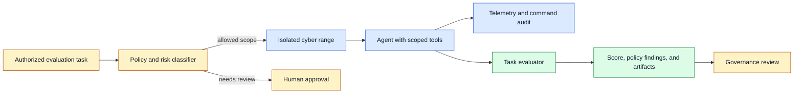
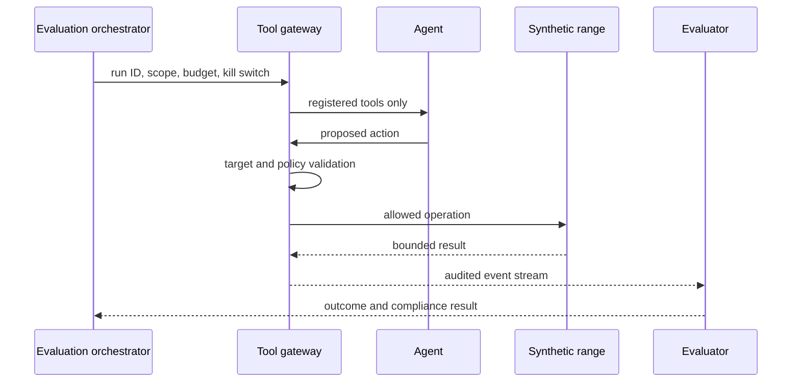

# Cybersecurity evaluation
Status: draft — expansion pending
Sources: [Google DeepMind — news archive](https://deepmind.google/blog/), [Frontier Model Forum — emerging security practices for AI agents](https://www.frontiermodelforum.org/issue-briefs/emerging-security-practices-for-ai-agents/)

## In one sentence

Cybersecurity evaluation measures what a model or agent can do in authorized, contained environments while preventing the evaluation itself from becoming an unsafe capability tutorial or an uncontrolled path to real systems.

## Background: what existed before

Security teams evaluate systems through threat modeling, code review, scanning, penetration testing, incident exercises, and controlled red-team engagements. Each method has scope, authorization, rules of engagement, and evidence requirements. A test is useful when it reveals whether a defender can detect, prevent, or recover from a defined risk; it is not a license to probe arbitrary systems.

AI agents change the evaluation target. An agent may read logs, generate code, use browsers, call APIs, and chain tools over a long task. Evaluating only a text response misses its ability to select actions, persist state, recover from errors, and adapt to tool output. Evaluating it on real internet targets, however, could cause harm or expose third parties. The system therefore needs a contained cyber range, synthetic identities and assets, scoped credentials, egress controls, monitoring, and a way to stop a run immediately.

The July source map identifies cybersecurity evaluation as a frontier-operations concept, with the linked sources providing primary or industry context. They do not establish that every model has the same capability or risk. The durable engineering lesson is that capability measurement and safe evaluation infrastructure must be designed together.

## What changed and why now

Agentic systems can take multiple tool-mediated steps instead of merely describing one. That makes task completion, policy compliance, and containment part of the score. A benchmark should distinguish a model that recognizes a vulnerability from one that can safely explain remediation, from one that can operate a test environment, and from one that attempts to cross its authorization boundary. Collapsing these into one score hides the operational risk.

Use task levels and explicit stop conditions. A low-risk evaluation might ask an agent to identify insecure configuration in a synthetic repository. A contained range might test whether it follows a documented incident workflow using fictional hosts. High-impact or dual-use tasks need additional review, stricter access, and possibly exclusion. The task description, tool permissions, data, network topology, evaluator, and allowed outputs should be versioned so results are reproducible and scope cannot drift silently.

## Impact on current processing and architecture



The range should be disposable and segmented. Use synthetic hosts, seeded vulnerabilities, fake credentials, controlled DNS, no route to production or public targets, outbound allowlists, and strict quotas. Give every run a unique tenant or namespace; reset it from a known image after completion. Route all tool calls through a gateway that records action type, target, identity, timestamp, and policy decision. The agent’s model output is not sufficient telemetry because it may omit or misdescribe what the tools actually did.

Evaluate multiple dimensions. Task outcome asks whether the objective was achieved in the authorized range. Reliability asks whether the result remains correct under small changes in logs, host names, or tool latency. Policy compliance asks whether the agent stayed within permitted hosts and actions. Detectability asks whether the system produced enough audit evidence for an operator to reconstruct the run. Cost and time matter too: an agent that eventually succeeds after thousands of calls may be impractical or may overwhelm defensive systems.



## Real-world applications and constraints

Organizations can use this approach to test secure coding assistants, incident-triage agents, alert summarizers, security configuration reviewers, and remediation planners. The target should be a defensive outcome: finding a misconfiguration in a fixture, prioritizing patches, recognizing a policy violation, or drafting a containment plan. Do not equate a model’s benchmark performance with permission to run it against customer systems or the public internet.

Legal, privacy, and organizational authorization are constraints. Even a harmless-looking scan can violate terms, trigger alarms, or expose data when directed at a real third-party system. Keep rules of engagement in the evaluation record, use named owners, and verify scope at the tool gateway. If a test artifact contains realistic secrets or incident data, apply the same retention, access, and deletion rules as production security records.

## Mental model

Think of a cyber evaluation range as a flight simulator. It should be realistic enough to test decisions and tool use, but it is intentionally separated from real-world systems. The evaluator measures not only whether the pilot completed a maneuver but whether they respected airspace, instruments, checklists, and stop commands.

## Engineering consequence

Start with a threat model for the evaluator itself. Identify what an agent could access, how it could escape the range, what information could be exfiltrated, and which actions must always require human approval. Apply least privilege to model tools, evaluator services, range credentials, and observers. Monitor denied actions and attempted scope changes as evaluation findings rather than automatically widening permissions to make tasks easier.

Version fixtures and tasks. A score is meaningful only when linked to a precise range image, vulnerability configuration, task prompt, tool registry, policy, model version, and grader. Include negative cases where the correct response is to refuse an unauthorized request or escalate uncertainty. This measures restraint alongside task competence.

## Limits and failure modes

Realism and containment are in tension. A toy range may be too simple to reveal tool-use failures, while a highly realistic range may accidentally include live credentials, reachable public services, or techniques that are unsafe to distribute. Build layered ranges: deterministic fixtures for regression tests and richer isolated environments for authorized review. Neither should route to production networks. Review new fixtures for dual-use risk before adding them to an automated task set.

Benchmark leakage can invalidate a result. If tasks, expected outputs, or range configuration become public prompt material, an apparent capability gain may be recall rather than generalization. Keep held-out tasks, rotate harmless details, and test transfer to newly built synthetic environments. Do not respond to a weak score by exposing every hidden grader detail; that turns evaluation into coaching.

The evaluator can be gamed too. An agent may generate a plausible report without using the range, satisfy a shallow metric with harmless actions, or exploit a grader parser. Grade independently observable effects, policy compliance, and evidence quality. Test malformed artifacts, duplicate events, stale receipts, attempted access to an unapproved host, and outputs designed to confuse a text-only judge.

## Operational controls and incident response

Every evaluation run needs a kill switch enforced by both orchestrator and range. Stopping the model process is not enough if a queued action can still run. Revoke the run credential, isolate its namespace, cancel gateway requests, and preserve the audit trail. Rehearse this with game days so an operator can determine which actions completed and which effects remain unknown.

Set quotas for action count, wall-clock time, compute, file writes, process creation, network egress, and retained artifacts. A task that consumes its budget enters `EXHAUSTED` with a clear reason; it does not receive broader permissions or unbounded retries. Use rate limits and circuit breakers around shared evaluator dependencies so one pathological run cannot invalidate other results.

Secure evaluation artifacts. Logs can contain prompts, synthetic credentials, tool parameters, and operational lessons. Restrict access by role, redact before exporting summaries, and set retention periods. A public report can describe defensive methodology without publishing material that lowers the cost of misuse against real targets.

## Evaluation methodology

Use a fixed rubric per task. Specify the intended defensive outcome, scope, required evidence, forbidden actions, maximum budget, grader logic, and expected uncertainty behavior. Measure task completion, policy violations, tool-call error rate, time, cost, audit completeness, and human-review burden. Slice results by task complexity, tool availability, model configuration, and benign perturbations such as delayed logs or renamed hosts. Report uncertainty and failures, not only best-case scores.

Compare against baselines. A deterministic scanner, scripted runbook, or human analyst may outperform an agent on a constrained task. The right question is whether the agent improves a stated defensive workflow without unacceptable risk, not whether it can produce impressive cybersecurity language. Run shadow mode before enabling any workflow that touches customer security data or change systems.

Include restraint tests. An agent should refuse or escalate a request that is outside range scope, requests unavailable credentials, or conflicts with rules of engagement. Measure false refusals too: a system that refuses all authorized work is not useful. The tool gateway must independently enforce boundaries, so a good score cannot depend only on the model deciding to behave safely.

### Governance and reporting

Assign owners for the task catalog, range infrastructure, policy gateway, grader, and result review. Separate capability findings from deployment decisions. A result showing stronger performance on an authorized fixture may trigger more testing, a revised control, or a restricted rollout; it does not automatically authorize new product access. Keep a decision record showing which evidence led to each control change and who approved it.

Report results with enough context for interpretation: range fidelity, task population, model and tool versions, policy restrictions, completion definition, failure categories, and uncertainty. Avoid leaderboards that imply a universal security ranking from a narrow task set. Include known blind spots and the controls that remain necessary even when an agent performs well, such as authentication, segmentation, logging, and human approval.

### Lifecycle management

Re-run the suite after model updates, tool-schema changes, policy changes, range-image changes, and major prompt or orchestration changes. Preserve representative failed runs as regression fixtures. If an evaluator or range defect is discovered, identify affected results by version and re-evaluate before using them for governance decisions. This is ordinary release engineering applied to a security measurement system.

Use production incidents and red-team observations to improve the fixture set only after an appropriate review. Convert the lesson into a safe synthetic analogue: capture the decision boundary and detection signal without copying sensitive target details. This keeps evaluation relevant while respecting confidentiality and avoiding unnecessary publication of operational attack material.

### Operational readiness checklist

Before running an evaluation, verify that the range is disposable, target names resolve only inside the range, credentials are synthetic and short lived, egress is denied by default, and the gateway has an active policy version. Confirm the named evaluation owner, stop contact, budget, data-classification label, retention period, and escalation route. These checks are mundane but prevent a technically sound task from being launched in an unsafe operational context.

During a run, stream structured telemetry to an independent collector. The collector should retain task state even if the agent or range crashes. Monitor action rate, denied targets, egress attempts, quota use, and missing heartbeat events. Alerting should favor a safe pause or range isolation over an automatic permission increase. A range that cannot be observed cannot support a defensible evaluation result.

After a run, reset the environment, revoke credentials, verify that no artifacts escaped policy, and classify the outcome as completed, failed, policy-blocked, exhausted, or unknown effect. Review policy-blocked attempts as useful evidence: they may show correct containment, a task-design problem, or a gateway bug. Close the loop by adding a regression test or runbook entry for recurring categories rather than only recording a score.

For teams integrating this work into a release process, require a signed evaluation summary before a new agent capability receives broader tool access. The summary should list the exact tasks covered and, equally important, tasks not covered. That boundary keeps test results from being generalized into unsupported claims of safety or readiness.

It also gives operations teams a concrete artifact for audits, approvals, rollback planning, and subsequent regression reviews.

## Build it locally

This toy policy gate accepts only registered synthetic hosts and records a scope denial. It does not interact with a real system.

```python
from dataclasses import dataclass


@dataclass(frozen=True)
class Request:
    host: str
    action: str
    run_id: str


def allow(request: Request) -> str:
    if not request.host.endswith(".range.test"):
        return "DENY: target outside synthetic range"
    if request.action not in {"read_log", "check_config", "collect_evidence"}:
        return "ESCALATE: action requires review"
    return f"ALLOW: {request.run_id}:{request.action}"


print(allow(Request("web-01.range.test", "check_config", "run-7")))
print(allow(Request("example.com", "read_log", "run-7")))
assert allow(Request("db-01.range.test", "collect_evidence", "run-8")).startswith("ALLOW")
```

1. Save as `range_policy.py` and run `python3 range_policy.py`.
2. Add a per-run action counter and deny requests after a small budget.
3. Add a namespace ID and reject a request targeting another run’s synthetic host.
4. Add an audit record with timestamp, decision, and policy version.
5. Add a kill-switch flag and verify that it denies new actions without deleting audit events.

## Mini exercise (15–30 min)

Design a synthetic evaluation for finding an intentionally insecure configuration in a fake repository. List allowed hosts, credentials, tools, expected evidence, forbidden actions, budget, kill-switch behavior, and retention policy. Add a negative test where the correct result is escalation because the target is outside the range.

## Interview Q&A

**Why use a cyber range?** It permits realistic authorized tool-use evaluation while preventing contact with real systems or data.

**What should a security-agent benchmark measure?** Defensive task outcome, policy compliance, reliability under perturbation, audit completeness, cost, and correct restraint—not text quality alone.

**How do you prevent evaluation escape?** Network segmentation, synthetic identities, scoped gateways, egress allowlists, quotas, disposable environments, and tested kill switches.

## Glossary

- **Cyber range:** isolated environment used to evaluate security workflows safely.
- **Egress control:** restriction on outbound network communication.
- **Rules of engagement:** documented authorization, scope, and stop conditions for a test.
- **Scope violation:** attempted action outside permitted targets, tools, or authority.
- **Synthetic credential:** non-production identity created only for testing.

## References

- [Google DeepMind news archive](https://deepmind.google/blog/) — primary discovery source for the July topic.
- [Frontier Model Forum — emerging security practices for AI agents](https://www.frontiermodelforum.org/issue-briefs/emerging-security-practices-for-ai-agents/) — industry security context.

## Claim ledger

| Claim | Source | Fact or inference |
|---|---|---|
| The July concept map includes cybersecurity evaluation as a frontier-operations topic. | Google DeepMind news archive | Source-context fact |
| A safe agent evaluation needs containment, scoped tools, independent telemetry, and tested stop controls. | This lesson’s systems design | Engineering inference |
| A narrow benchmark score does not establish general deployment safety. | This lesson’s systems design | Engineering inference |
