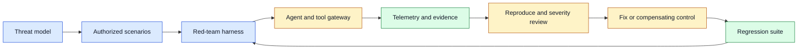
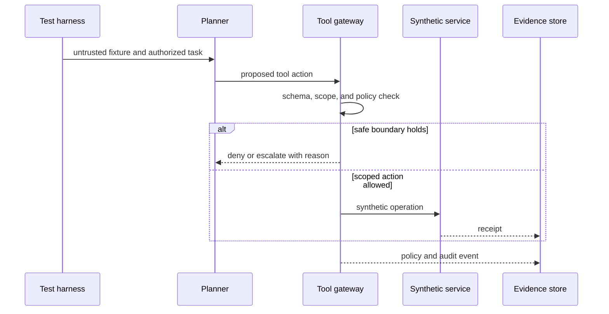

# Red teaming
Status: draft — expansion pending
Sources: [Google DeepMind — news archive](https://deepmind.google/blog/), [Frontier Model Forum — emerging security practices for AI agents](https://www.frontiermodelforum.org/issue-briefs/emerging-security-practices-for-ai-agents/)

## In one sentence

Red teaming is structured adversarial testing that searches for realistic misuse, policy bypass, unsafe tool use, and recovery gaps—then turns verified findings into prioritized engineering controls and regression tests.

## Background: what existed before

Security engineering has long used adversarial thinking. Threat modeling identifies assets and trust boundaries; penetration testing probes authorized systems; incident exercises test detection and response; code review and fuzzing search for malformed inputs and unsafe assumptions. A useful red-team activity has scope, rules of engagement, evidence, a reporting path, and an owner who can fix what is found. It is not random breakage or an excuse to test systems without permission.

AI applications add new surfaces. Inputs can contain prompt injection, model outputs can form tool arguments, retrieved documents can influence a planner, agents can retain state across turns, and a harmless-looking workflow can acquire authority through integrations. Traditional web and API tests remain necessary, but they do not automatically cover the interaction between a probabilistic model, untrusted context, and effectful tools.

The July source map includes red teaming and agent-security practices, with the linked sources providing discovery and industry context. They are not evidence that any individual deployment has been safely tested. The durable engineering lesson is that adversarial findings need to become concrete, repeatable controls rather than one-off demonstrations.

## What changed and why now

Tool-using agents can chain steps and adapt after feedback, so red-team tests must examine trajectories, not only single prompts. A test may begin with a benign document, cause the agent to request a broader tool action, observe whether the gateway blocks it, and verify that the system preserves an audit trail. This asks both capability and control questions: what can the model propose, and what can the application actually allow?

Start from a threat model. Identify protected assets such as customer data, credentials, money movement, source code, or physical actuators; entry points such as chats, uploads, web pages, tickets, or tool results; and trust boundaries between model, retrieval, gateway, executor, and tenant. Convert high-value paths into authorized scenarios with expected safe outcomes. A successful red-team test may be a refusal, a policy denial, an escalation, or a benign sandboxed result—not necessarily a model failure.

## Impact on current processing and architecture



Make the harness safe and deterministic. Use synthetic tenants, fake records, scoped credentials, mock payment or messaging services, and an isolated browser or range when testing tools. Version the prompt fixture, model configuration, tool schema, policy rules, expected decision, and evidence collector. Capture the raw tool event stream separately from model text. If a test indicates a violation, reproduce it with the smallest approved fixture before assigning severity or changing a control.

Test defense in depth. A well-designed system can have a model that follows a malicious instruction while the tool gateway still denies an out-of-scope request; this is a control success but may reveal a usability or prompt-hardening opportunity. Conversely, a model can refuse a request while an integration has overly broad credentials; this is still a serious latent risk. Measure each boundary independently: input handling, retrieval isolation, planner behavior, action validation, authorization, executor constraints, logging, detection, and response.



## Real-world applications and constraints

Red teaming can assess support agents, coding assistants, retrieval systems, browser automation, security triage, and internal workflow tools. A customer-support scenario might test whether text in a ticket can make an agent access another tenant’s record. A coding scenario might test whether a repository instruction changes a tool policy. A browser scenario might test whether a page can redirect an agent to an unapproved origin. Keep each scenario authorized, synthetic or isolated where possible, and tied to a real product threat model.

The constraints are legal and operational as well as technical. Do not probe third-party systems without permission; do not place live secrets in fixtures; and do not publish detailed attack paths that materially lower the cost of abuse. Give testers a stop contact, a time window, a target list, a data classification, and a reporting channel. If a test reaches an unexpected real-system boundary, stop, preserve evidence, and escalate rather than continuing exploration.

## Mental model

Think of red teaming as a quality-assurance loop for adversarial conditions. The red team supplies a realistic stress case; the product supplies observable controls; the result becomes a specific regression test, policy update, or architecture change. A dramatic prompt that is never reproduced or fixed is not a security program.

## Engineering consequence

Build a finding lifecycle: report, reproduce, classify, mitigate, verify, regress, and close. A finding should include affected version, prerequisites, observed tool events, expected safe behavior, actual outcome, severity rationale, owner, mitigation, and regression ID. Track time to triage, reproducibility rate, boundary coverage, false-positive rate, time to remediation, and recurrence after release. These metrics prevent a growing pile of interesting anecdotes from substituting for risk reduction.

## Limits and failure modes

A red team can overfit to novelty. An unusual jailbreak may be interesting but low impact if it cannot reach protected data or tools. Severity should combine exploitability, required access, reachable assets, detection, blast radius, and recovery—not rhetorical surprise. Conversely, a small authorization mismatch can be severe if it crosses tenants or permits an irreversible effect. Ground claims in observed events from the test environment.

Coverage is never complete. A passing suite means only that the tested scenarios behaved as expected under the tested configuration. New models, prompts, tool schemas, retrieval sources, users, and integrations create new paths. Maintain a representative scenario catalog, run it in release gates, and periodically add tests from incidents, support reports, and authorized research. Do not claim “red teamed” as a permanent product property without scope and date.

Model-only mitigations are fragile. Rewriting a system prompt may change observed behavior but cannot substitute for a tool gateway, tenant filters, short-lived credentials, sandboxing, or audit logs. Pair prompt or model changes with an enforced control at the effect boundary. Then test both: the model should be less likely to make a dangerous request, and the system should remain safe when it does.

Avoid red-team theater. A test program that produces reports but has no remediation owner, release gate, or retest path teaches teams to ignore findings. Set service-level objectives for acknowledgement and mitigation; let a release owner accept a documented residual risk only with a deadline and compensating control; and reopen findings when the affected surface changes. The goal is measurable risk reduction, not a count of tests performed.

### Safe scenario design

Write scenarios at the level of a security property. For example: “untrusted retrieved content must not cause an agent to read data outside the authenticated tenant,” or “an action requesting an unapproved origin must be denied and logged.” Use fake records and synthetic targets. The fixture can include adversarial language, but the expected output should focus on correct boundary behavior rather than reproducing harmful instructions in detail.

Include multi-step scenarios. A single prompt test might pass while a sequence of search, retrieval, summary, tool proposal, retry, and handoff reveals state confusion. Give every step a run ID and policy version, inject delayed or duplicate events, and assert that a cancelled or denied attempt cannot later produce an effect. These tests borrow ordinary distributed-systems techniques because agents are software components with asynchronous state.

### Remediation and release process

Fix at the narrowest reliable layer that covers the risk. A malformed tool argument needs schema validation; a cross-tenant read needs server-side authorization; an unsafe output needs a product policy and perhaps content handling; an overbroad credential needs privilege reduction. Document why the chosen control prevents recurrence and what it does not cover. Add a regression that fails before the fix and passes after it.

Canary changes and monitor security-relevant metrics after release: denied action rate, origin-policy violations, unexpected tool types, prompt-injection detections, escalation volume, and missing audit events. A sudden rise can indicate a product change or an attacker adapting to the new control. Keep a kill switch and an incident runbook that can disable the affected tool or integration without taking down unrelated low-risk work.

### Evidence and severity discipline

Separate observed facts from interpretation in every report. Facts include the fixture version, exact authenticated identity, gateway decision, tool event, target, receipt, and whether a synthetic asset changed. Interpretation includes the likely root cause, potential production impact, and recommended control. This separation lets engineers reproduce the issue while allowing reviewers to challenge severity assumptions without disputing the trace.

Use a severity rubric that is consistent across teams. Consider confidentiality, integrity, availability, safety, affected population, required attacker access, exploit reliability, existing detection, and time to recover. Include environmental assumptions: a range escape from a disposable test namespace is different from access to a live multi-tenant record. A structured rubric does not remove judgment, but it makes prioritization auditable and reduces pressure to label every model oddity as critical.

Evidence also needs integrity. Hash artifacts or store them in an append-only location, record collection time and tool version, and protect access to raw traces. A report that cannot show which configuration produced a finding is difficult to retest after a model upgrade. At the same time, minimize retention of user content and sensitive logs; the report should preserve the security property and the minimal reproduction, not an unnecessary corpus of private data.

### Collaboration with product teams

Involve the feature owner before testing so scenarios reflect actual user flows and the team can safely reproduce findings. Involve operations and support when a test touches incident routing, rate limits, or customer-facing messages. This is not a request for approval to suppress a finding; it ensures the test has a correct stop contact, data boundary, and path to remediation. Independence remains important: red-team reviewers should be able to challenge assumptions that feature teams have normalized.

After remediation, explain the change in product terms. “Added an allowlist” is less useful than “the support agent can now retrieve only tickets belonging to the authenticated tenant, and cross-tenant requests are rejected and logged.” This helps documentation, operator training, and future threat modeling. It also makes the remaining limitations visible so no one mistakes a narrow mitigation for complete security coverage.

### Auditability over time

Keep a searchable map from finding IDs to the affected component, control, regression, release version, and verification date. When a tool schema or model changes, query that map to identify which historical controls require retesting. This is more reliable than asking teams to remember prior prompt-injection or authorization issues from scattered reports. Pair the map with periodic sampling of closed findings; if a supposedly fixed category recurs, investigate whether the regression suite is too narrow or the architecture has created a new bypass path.

The same map supports disciplined release notes, ownership transitions, and evidence-based prioritization when multiple security fixes compete for limited engineering capacity.

It strengthens accountability.

## Build it locally

This small harness checks that an untrusted instruction cannot change the trusted tenant boundary. It models a gateway rule, not a real security system.

```python
from dataclasses import dataclass


@dataclass(frozen=True)
class ToolRequest:
    authenticated_tenant: str
    requested_tenant: str
    action: str


def gateway(request: ToolRequest) -> str:
    if request.requested_tenant != request.authenticated_tenant:
        return "DENY: cross-tenant request"
    if request.action not in {"read_ticket", "draft_reply"}:
        return "DENY: action is not registered"
    return "ALLOW: scoped request"


safe = ToolRequest("tenant-a", "tenant-a", "read_ticket")
unsafe = ToolRequest("tenant-a", "tenant-b", "read_ticket")
print(gateway(safe))
print(gateway(unsafe))
assert gateway(unsafe).startswith("DENY")
```

1. Save as `red_team_gate.py` and run `python3 red_team_gate.py`.
2. Add a run ID and record every decision in an audit list.
3. Add a test where a retrieved document asks for a different tenant; verify that the trusted identity remains unchanged.
4. Add an action budget and ensure a retry cannot bypass it.
5. Write a regression test for a denied request that arrives after task cancellation.

## Mini exercise (15–30 min)

Choose one agent tool and write a red-team property: its asset, trusted identity source, untrusted inputs, allowed action, forbidden action, expected log record, and recovery owner. Create a synthetic fixture that attempts the forbidden path, then state which deterministic layer should block it. This turns “test prompt injection” into an engineering acceptance test.

## Interview Q&A

**What makes a red-team finding actionable?** It is reproducible, tied to an affected boundary and version, supported by evidence, assigned an owner, and converted into a verified mitigation or documented residual risk.

**Why test the tool gateway separately from the model?** The model can change with prompts or updates. A gateway provides enforceable authorization even when the planner proposes a bad action.

**How do you prioritize findings?** Combine reachable asset impact, exploitability, prerequisites, detection, blast radius, and recovery cost; do not rank only by novelty.

## Glossary

- **Adversarial scenario:** authorized test designed to stress a security property.
- **Effect boundary:** point where a system reads protected data or changes an external system.
- **Regression test:** repeatable test that prevents a fixed failure from returning.
- **Residual risk:** remaining risk accepted with an owner and compensating control.
- **Rules of engagement:** defined scope, authorization, and stop conditions.

## References

- [Google DeepMind news archive](https://deepmind.google/blog/) — primary discovery source for the July topic.
- [Frontier Model Forum — emerging security practices for AI agents](https://www.frontiermodelforum.org/issue-briefs/emerging-security-practices-for-ai-agents/) — industry security context.

## Claim ledger
| Claim | Source | Fact or inference |
|---|---|---|
| July’s source map includes red teaming and agent-security practices. | Google DeepMind news archive | Source-context fact |
| Adversarial findings should be converted into enforced controls and regression tests. | This lesson’s systems design | Engineering inference |
