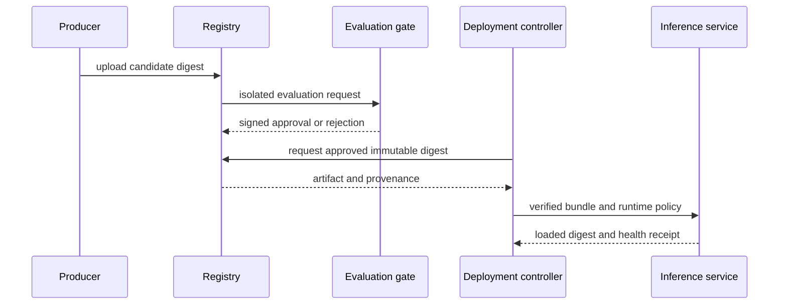

# AI patch provenance and artifact security
Status: durable
Sources: [OpenAI — 2026-07-21, incident report](https://openai.com/index/hugging-face-model-evaluation-security-incident/); [SLSA — 2026-09-07, accessed; current v1.2 specification](https://slsa.dev/spec/v1.2/); [Sigstore — 2026-09-07, accessed; official Cosign documentation](https://docs.sigstore.dev/cosign/)

## In one sentence

Model weight security protects the model artifact, its metadata, evaluation data, credentials, and deployment path so a serving system can prove which approved model it loaded and prevent unauthorized extraction, substitution, or tampering.

## Prerequisites

Know object storage, access-control roles, cryptographic digests, registries, provenance, and deployment admission. Separate integrity (bytes did not change) from authenticity (an accepted identity authorized them) and from model quality or safety.

## Background: what existed before

Software supply-chain security already treats source code, build dependencies, binaries, signing keys, registries, and deployment manifests as separate assets. A model deployment has analogous pieces but adds large parameter files, tokenizer assets, quantization configuration, adapter layers, inference runtimes, evaluation sets, and sometimes serialized objects with unsafe loading behavior. A model label alone is not a trustworthy identity; a file named `production-model` can be replaced, corrupted, or paired with an incompatible tokenizer or runtime.

The baseline failure mode is an open artifact bucket or a broadly privileged service account. If anyone who can launch a server can download any model, export an artifact, change a registry tag, or inject a custom loader, the organization cannot enforce licensing, evaluation gates, or incident response. Weights may be valuable intellectual property, but confidentiality is only one concern. Integrity matters when a substituted model changes behavior; availability matters when a malicious or accidental deletion blocks service; provenance matters when a team needs to reproduce an output or roll back an incident.

The July 21 cyber release is the monthly anchor for the artifact boundary: it describes CodeMender using an AI model to find, validate, and patch vulnerabilities at scale, and it reports consolidated findings rather than a model-weight security product. This lesson therefore makes an explicit engineering inference from that release: AI-generated patches, evaluation records, and model bundles become high-value artifacts that need separate access controls before they can influence a deployment. Signing identity and admission proof are the focus of lesson 15; this lesson focuses on who may read, transform, evaluate, or deploy each artifact.

## What changed and why now

Open models, fine-tuning, quantization, adapters, and multiple deployment targets mean a model is increasingly assembled from a chain of artifacts. A team may use a base checkpoint, an adapter trained on internal data, a tokenizer, a prompt template, a safety configuration, and a compiled runtime. Each component can affect behavior. Security must therefore verify a complete serving bundle rather than only the largest weight file.

Treat the bundle as immutable content addressed by hashes. An approved release record should name the base model digest, all adapter and tokenizer digests, conversion or quantization settings, evaluation report, license decision, runtime image digest, hardware class, deployment manifest, and signing identity. A mutable tag such as `latest` can help humans discover a release but should not be the only identifier used by production.

## What changed this month

OpenAI’s July 21 incident report provides a direct issue-month security anchor: after an evaluation incident involving an internal prototype, the organization described deactivating, encrypting, and restricting the model from research access. Those are incident-response facts about one organization, not a universal model-registry design. They make the engineering problem concrete: model weights, evaluation data, credentials, and deployment artifacts need separate access boundaries, containment procedures, and auditable admission controls.

## Impact on current processing and architecture

```mermaid
flowchart LR
    S[Approved source artifacts] --> B[Controlled build or conversion]
    B --> H[Hash and signature verification]
    H --> R[Policy-governed model registry]
    R --> D[Deployment admission control]
    D --> I[Isolated inference runtime]
    I --> T[Telemetry and attestation]
    T --> A[Audit and rollback record]
    classDef artifact fill:#dbeafe,stroke:#1d4ed8,color:#111827;
    classDef control fill:#fef3c7,stroke:#b45309,color:#111827;
    classDef runtime fill:#dcfce7,stroke:#15803d,color:#111827;
    class S,B,H,R artifact;
    class D,A control;
    class I,T runtime;
```



Separate registry roles. A producer may upload a candidate artifact, an evaluator may read it in a sandbox, a release approver may promote a signed digest, and an inference service may download only approved digests for its environment. No ordinary runtime should have permission to write registry tags or retrieve evaluation datasets. Use short-lived workload identities rather than static secrets embedded in containers or startup scripts.

Artifact ingestion needs safe parsing. Avoid formats or loaders that execute arbitrary code during deserialization unless the source is trusted and the loading environment is isolated. Scan metadata, verify checksums before use, restrict custom extensions, and quarantine new artifacts for evaluation. A cryptographic hash detects accidental or malicious alteration only when the expected digest comes from a trusted signed release record.



## Real-world applications and constraints

An internal assistant may need an adapter trained on proprietary data, a local edge model may require quantization for a specific accelerator, and a regulated workload may require a regional model bundle. These cases need separate access policies and evaluation evidence. A developer should not copy an internal adapter to a personal machine because it is technically convenient; a serving cluster should not silently fetch a new upstream tag because it might change behavior or license obligations.

Model weights are not the only sensitive asset. Evaluation prompts can reveal security tests, fine-tuning data can contain customer information, tokenizer files can affect parsing, and runtime logs can expose request content. Apply classification, access review, encryption, retention, and export controls to the whole chain. At the same time, avoid treating every artifact as secret when a public base model is intentionally used; policies should match actual ownership and risk.

## Mental model

Think of a model release as a signed container image plus a data-governance record. The serving process should know exactly which immutable inputs it loaded and should be unable to replace them. An operator should be able to answer where the bundle came from, who approved it, which evaluation it passed, and how to restore the previous known-good version.

## Engineering consequence

### Separating asset classes and authorities

The most useful security boundary is not “the model” versus “everything else.” A release usually contains several asset classes with different compromise stories. The weight files may be confidential intellectual property, while the tokenizer may be public but integrity-sensitive. Evaluation prompts may be confidential because they describe abuse cases, and an evaluation result may be integrity-sensitive because a false pass can authorize production. Deployment credentials are neither model data nor evidence; they are live authority and should have the shortest lifetime.

Represent those differences in the registry schema. A bundle record can include a digest and owner for each component, but it should also name the classification, permitted environments, evaluation lineage, and allowed actions. “Read” is not one permission: a researcher may need to download weights, an evaluator may need to execute them without exporting them, and a deployment controller may need to fetch only an already-approved digest. A person who can edit metadata should not automatically be able to replace bytes or approve a release.

This separation changes incident triage. If a tokenizer digest changes, the likely problem is a packaging or tampering event; if an evaluation prompt leaks, the impact may be test-set contamination; if a registry token is stolen, the first question is which write and promotion operations it could perform. Record these scopes in policy and logs. A broad “artifact compromised” alert is less useful than an event identifying the component, authority, environment, and last known trusted digest.

The serving path should also avoid returning protected artifacts through ordinary debugging. A model server can expose its release ID, component digests, and health state without exposing file paths, registry credentials, or raw evaluation data. This gives operators evidence for rollback while keeping the diagnostic interface lower privilege than the artifact store. Test that distinction with role-specific accounts in a local registry mock: an evaluator can read a candidate, a deployer can read only approved records, and neither can change the other’s evidence.

Start with an artifact inventory and data-flow diagram. For each component, identify producer, owner, classification, allowed readers, allowed writers, signature or hash source, retention policy, and deployment environments. Enforce admission control at deployment: reject unsigned, unapproved, incompatible, or policy-violating bundles before they reach an inference process. Log the loaded digest, registry identity, policy version, and runtime image with every deployment and relevant request trace.

## Limits and failure modes

Hash verification is necessary but not sufficient. If an attacker can change both an artifact and the expected digest record, a local comparison still passes. Protect signing keys, require independent approval for promotion, record immutable audit events, and verify signatures against trusted identities. Separate the ability to upload from the ability to approve and deploy. This reduces the chance that one compromised credential can alter the full chain.

Compatibility failures can look like security failures and vice versa. A model may load but produce degraded outputs because the tokenizer, quantization format, adapter ordering, runtime kernel, or hardware assumption differs from evaluation. Include compatibility tests in the approval gate: load the complete bundle in the target runtime, run a smoke suite, verify expected metadata, and compare a small set of known outputs. A deployment that cannot prove its loaded bundle matches the evaluated bundle should fail closed or route to a known-good fallback.

Model extraction and data leakage are threat-model questions, not reasons to promise impossible secrecy. Access controls can limit who downloads weights, rate limits can reduce bulk export, and runtime isolation can reduce accidental exposure. But a deployed model may still reveal behavior or memorized information through an authorized interface. Combine artifact controls with data-minimization, privacy review, output safeguards, monitoring, and contractual controls appropriate to the deployment.

Avoid “security by registry name.” An internal hostname does not prove the artifact was approved, and a public artifact is not automatically unsafe. Make the policy evaluate signed identity, digest, license metadata, source, evaluation status, environment, and intended use. Store exceptions with an owner and expiry rather than silently letting a runtime bypass admission because a deadline is urgent.

### Secure loading and runtime isolation

Load candidates in a disposable evaluation environment before production. The loader should have no production credentials, no access to customer data, a restricted network, bounded memory and CPU, and a read-only artifact mount. This matters because some serialization formats or custom code paths can run during import. Prefer data-only formats and documented conversion tools; if an artifact requires custom code, treat that code as part of the supply chain and review, pin, scan, and sandbox it.

The inference runtime needs a small identity. It should read one approved bundle and write only bounded operational telemetry. It should not be able to list every registry artifact, modify evaluation reports, publish a new tag, or access unrelated tenant stores. If it downloads an artifact at startup, verify the digest before loading and cache it with ownership and eviction controls. A failed verification should produce a specific deployment error, not a fallback to an unverified `latest` tag.

### Release and incident response

Promote with progressive delivery. Evaluate the bundle offline, load it in staging, canary it against a bounded traffic slice or shadow workload, monitor quality and runtime health, then expand. Pin a previous approved bundle for fast rollback. A rollback record should include the exact digests, deployment configuration, and reason so operators can distinguish a model regression from a serving-infrastructure issue.

If a registry credential, signing key, or artifact is suspected compromised, revoke or rotate the credential, block new promotion, identify deployed digests through telemetry, quarantine suspicious bundles, and restore known-good versions. Preserve evidence for investigation but avoid spreading suspect artifacts through debugging copies. Re-run evaluation for potentially affected releases and communicate the scope to the owners of downstream services.

### Auditing and compliance evidence

An artifact registry should answer operational questions quickly: Which bundle is serving tenant A? Which runtime image loaded it? Which evaluation report and policy version approved it? Who promoted the release? Which older deployments still use a vulnerable dependency? Design metadata indexes around these questions, not only around human-friendly model names. Keep event records for upload, scan, evaluation, signature, promotion, download, load verification, rollback, and deletion or retention expiry.

Protect audit integrity and privacy together. Write deployment events to an append-only service or controlled log, restrict modification, and synchronize timestamps. Store digests and release IDs broadly enough for troubleshooting, but avoid copying prompts, user requests, or sensitive fine-tuning content into every registry event. A compliance review often needs proof of approval and access, not a copy of the model’s training data.

### Capacity and availability

Security controls should not make inference unavailable during normal scaling. Pre-stage approved immutable bundles in a controlled cache, verify them before traffic is needed, and set cache quotas and eviction policies. Autoscaled nodes can then start from a verified local artifact rather than downloading a mutable tag during an incident. Test what happens if the registry is slow or unavailable: existing verified runtimes may continue within policy, while new deployments should fail safely with a clear operational alert.

Plan for large artifact transfer. A multi-gigabyte bundle can cause startup storms, saturate shared storage, or delay rollback when many nodes request it at once. Use content-addressed caching, bounded parallel downloads, integrity verification after transfer, and rollout waves. Measure cold-start time, cache-hit rate, registry errors, load verification failures, and serving capacity by bundle version. These operational metrics reveal whether a strong provenance design is usable during a real recovery event.

### Data and license governance

Approval should include more than technical quality. Record the license, redistribution and deployment restrictions, data-use conditions, geographic limits, and responsible owner for each component. An internal adapter may have stricter export rules than its public base model. A model may be technically compatible with an environment but prohibited for its customer class. Encode these decisions in admission policy and review exceptions before release rather than relying on a developer to remember a note in a repository.

Track transitive dependencies as part of the bundle. Conversion libraries, runtime packages, tokenizer implementations, CUDA or accelerator kernels, and operating-system images can all affect security and reproducibility. Generate a software bill of materials where practical, subscribe to vulnerability notices for critical components, and define who assesses whether a patched dependency requires a new model evaluation. A model digest is only one part of the serving supply chain.

Treat changes as release events.

## Build it locally

This example checks a small bundle manifest against an approved-digest record. It illustrates the boundary between a candidate label and a trusted immutable identifier.

```python
from dataclasses import dataclass


@dataclass(frozen=True)
class Bundle:
    model_digest: str
    tokenizer_digest: str
    approved: bool


def admit(bundle: Bundle, expected_model: str, expected_tokenizer: str) -> str:
    if not bundle.approved:
        return "DENY: bundle has no approval"
    if (bundle.model_digest, bundle.tokenizer_digest) != (expected_model, expected_tokenizer):
        return "DENY: bundle digest does not match release record"
    return "ALLOW: immutable bundle verified"


release = Bundle("sha256:model-a", "sha256:tokenizer-a", True)
print(admit(release, "sha256:model-a", "sha256:tokenizer-a"))
assert admit(release, "sha256:model-b", "sha256:tokenizer-a").startswith("DENY")
```

1. Save as `bundle_gate.py` and run `python3 bundle_gate.py`.
2. Add runtime and adapter digests to the bundle record.
3. Add a policy version and reject a release without a matching evaluation report.
4. Store approved records in an append-only local log with a signer identity.
5. Add a rollback function that selects a prior approved immutable bundle rather than a mutable tag.

## Mini exercise (15–30 min)

Draw a model-bundle supply chain for one service: source, conversion, registry, evaluation, approval, deployment, runtime, and telemetry. For every arrow, name the identity, integrity check, and least privilege needed. Then identify which failure would occur if the tokenizer changed without a matching model evaluation.

## Interview Q&A

**Why is a model label not a sufficient identity?** Labels can be retagged or reused. A content digest and signed release record identify the evaluated bytes and associated configuration.

**What should deployment admission verify?** Approval, signature or trusted digest, complete bundle compatibility, license or policy metadata, target environment, and required evaluation evidence.

**Why isolate model loading?** Artifact parsing or custom loaders can be risky. Isolation limits the impact of a malformed or untrusted candidate before it reaches production assets.

## Glossary

- **Adapter:** additional model parameters applied to a base checkpoint for a task or domain.
- **Artifact digest:** cryptographic identifier derived from artifact bytes.
- **Admission control:** policy gate deciding whether a bundle may deploy.
- **Bundle:** complete serving set of weights, tokenizer, runtime configuration, and related assets.
- **Provenance:** evidence of where an artifact came from and how it was transformed.

## References

- [OpenAI — Hugging Face model evaluation security incident, 2026-07-21](https://openai.com/index/hugging-face-model-evaluation-security-incident/) — primary incident context.
- [Google DeepMind — Introducing Gemini 3.5 Flash Cyber, 2026-07-21](https://deepmind.google/blog/introducing-gemini-3-5-flash-cyber/) — primary release and monthly artifact-security context.
- [Frontier Model Forum — emerging security practices for AI agents](https://www.frontiermodelforum.org/issue-briefs/emerging-security-practices-for-ai-agents/) — industry security context.

## Claim ledger
| Claim | Source | Fact or inference |
|---|---|---|
| OpenAI described deactivating, encrypting, and restricting an internal prototype after a July evaluation incident. | [OpenAI — 2026-07-21](https://openai.com/index/hugging-face-model-evaluation-security-incident/) | Source-context fact |
| SLSA defines provenance concepts for software supply chains. | [SLSA v1.2 — accessed 2026-09-07](https://slsa.dev/spec/v1.2/) | Fact; specification scope |
| Cosign documents signing and verification workflows. | [Sigstore — accessed 2026-09-07](https://docs.sigstore.dev/cosign/) | Fact; documentation scope |
| Weights, evaluation data, credentials, and deployment artifacts should have separate access boundaries. | This lesson’s threat model | Engineering inference |
