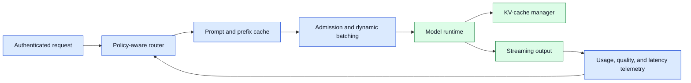
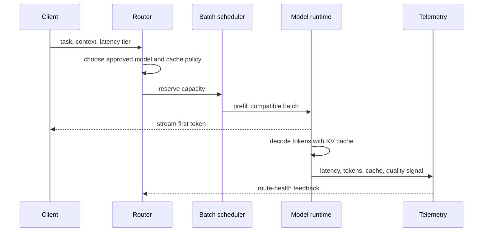

# Inference efficiency
Status: durable
Sources: [Google — 2026-07-21, official model release](https://blog.google/innovation-and-ai/models-and-research/gemini-models/gemini-3-6-flash-3-5-flash-lite-3-5-flash-cyber/); [NVIDIA — 2026-09-07, official Triton documentation accessed](https://docs.nvidia.com/deeplearning/triton-inference-server/user-guide/docs/user_guide/batcher.html)

## In one sentence

Inference efficiency improves the cost, latency, and capacity of model serving through batching, caching, routing, quantization, and decoding strategies—but every optimization must be measured against workload-specific quality and reliability.

## Prerequisites

Know p50/p95 latency, throughput, tokens, queueing, cache memory, batching, quantization, and A/B testing. An optimization is useful only when a representative workload improves the service objective without unacceptable quality or safety regressions.

## Background: what existed before

Serving a model means more than one matrix multiplication. A request is authenticated, tokenized, queued, scheduled onto hardware, prefills its input context, generates output tokens, possibly calls tools, streams results, logs usage, and releases memory. Cost and latency depend on model size, token count, hardware, memory bandwidth, key-value cache, concurrency, network hops, and queue behavior. A model that is fast for a short prompt can be slow or expensive for long-context or highly concurrent workloads.

The baseline response to capacity pressure is often to add larger accelerators or more replicas. That can work, but it may leave obvious inefficiencies untouched: repeated system prompts, unbounded output length, low batch utilization, poorly routed simple tasks, cold model loads, and retries that regenerate the same response. Efficiency techniques change these bottlenecks, but they also introduce new constraints. Batching can increase throughput while delaying first-token latency; quantization can reduce memory while changing quality; caching can save work while serving stale or unauthorized results if keys are weak.

The July 21 Google release is the monthly anchor: it presents model variants as a trade-off among token efficiency, latency, cost, and quality, and reports provider measurements such as lower output-token use for 3.6 Flash. That is a release-specific claim, not a universal benchmark result. The engineering lesson is end-to-end experimentation: measure the completed task across model choice, prompt, tool calls, queueing, and retries. Speculative decoding is an algorithmic verification technique in lesson 17; continuous batching is a scheduler design in lesson 18.

## What changed and why now

As models become part of interactive products and internal workflows, cost and latency are product requirements rather than infrastructure details. Teams can choose from smaller models, quantized bundles, dynamic batching, prefix caching, speculative decoding, request routing, output constraints, and asynchronous queues. The correct combination depends on the request mix and service-level objective, not a generic benchmark.

Start by decomposing latency. Queue time is waiting before a request receives compute. Prefill time processes input tokens. Decode time produces each output token. Tool and network time may dominate an agent workflow. First-token latency affects interactivity; total completion time affects background tasks; p95 and p99 expose contention that averages hide. Record each component with model, runtime, hardware, prompt class, context length, output length, cache state, and routing decision.

## What changed this month

The July 21 model update makes token efficiency, low latency, and cost explicit product objectives for agentic workflows and reports provider measurements for its new models. Those numbers are not portable guarantees. The engineering change is experimental discipline: compare representative prompts, quality slices, queue behavior, safety checks, and cost before and after batching, quantization, caching, routing, or decoding changes.

## Impact on current processing and architecture



Admission control protects a runtime from memory exhaustion and tail-latency collapse. Estimate a request’s input and output token budget, reserve KV-cache capacity, cap maximum generation, and route or reject work that cannot fit. A request should not be admitted merely because the model weights fit on the device; long contexts and many concurrent streams can consume remaining memory. Give users an explicit fallback or queue status instead of letting an out-of-memory crash affect unrelated requests.

Dynamic batching combines compatible requests to improve accelerator utilization. A scheduler may admit new requests between generation steps so one long stream does not block all new work. But batch size, waiting window, and fairness are policy choices. A real-time chat request may tolerate only a short queue; a nightly summary can wait longer for efficient processing. Use priority classes and per-tenant limits so a large background job cannot starve interactive traffic.



## Real-world applications and constraints

Customer-facing chat values first-token latency and predictable streaming. Document summarization may value total throughput and long-context capacity. Classification or extraction may benefit from small, constrained models and strict structured output. Agent workflows may spend more time in tools than in inference, so optimizing tokens without measuring tool latency can miss the real bottleneck. Apply a service-specific latency and quality budget rather than assuming every task should use the cheapest or largest model.

Privacy and authorization constrain caching. A response or prefix cache key must include tenant, user scope where needed, model version, prompt version, policy context, and data classification. Never share a cache entry across users merely because their text looks similar. Limit retention, encrypt where appropriate, and invalidate on permission or source changes. Cache hits should be observable and explainable, not an invisible alternate source of truth.

## Mental model

Think of inference efficiency as traffic engineering for expensive compute. The router chooses an appropriate lane, admission control prevents gridlock, batching fills vehicles efficiently, caches avoid repeating a safe trip, and telemetry detects congestion. Speed is useful only if the right request reaches the right destination with its privacy and quality guarantees intact.

## Engineering consequence

Benchmark representative slices before and after each change: short chat, long context, structured output, multilingual input, tool-using tasks, cold start, and high concurrency. Measure p50, p95, and p99 first-token and completion latency; tokens per second; queue time; cache hit rate; GPU or CPU memory; error rate; cost; and task-specific quality. Tie the comparison to exact model, runtime, prompt, cache, hardware, and decoding versions so a regression can be traced and rolled back.

## Limits and failure modes

Optimizing one metric can harm another. Increasing batch size can raise tokens per second while making interactive first-token latency unacceptable. Aggressive caching can reduce cost while returning stale content or creating a privacy boundary mistake. A smaller or quantized model can improve capacity while regressing on code, multilingual text, safety classification, or structured output. Treat these as product trade-offs, not as universal wins.

Speculative decoding uses a smaller draft model to propose tokens that a larger model verifies. It can improve generation speed when proposals are accepted, but it adds runtime complexity and its benefit depends on task, model pair, and hardware. Measure acceptance rate, first-token latency, total latency, memory, and quality under the real decoding policy. Do not assume a benchmark gain transfers to tool-use or long-context tasks.

Cache invalidation deserves explicit design. A prefix cache may be safe only for a versioned system prompt and public knowledge; a response cache may require tenant, authorization, model, and source-version keys. Invalidate when permissions, policies, or retrieved data change. A stale answer is a quality problem; an answer leaked across tenants is a security incident. Prefer a cache miss when scope is uncertain.

### Model routing and fallbacks

Routing should use trusted request features: task type, input length, required region, data classification, latency tier, available capacity, and an approved quality tier. Avoid routing based only on a model’s self-reported confidence. Keep a registry of eligible model bundles and their constraints. A request that exceeds local context or memory should route to an approved fallback or receive a bounded error, not silently truncate important input.

Fallbacks need observability. Record why a request chose a larger model, bypassed a cache, waited in queue, or was rejected: `context_too_long`, `capacity_reserved`, `high_quality_tier`, `region_restricted`, or `runtime_unhealthy`. This lets teams distinguish normal product policy from a capacity regression. A hidden fallback can make a local deployment appear efficient while costs move elsewhere.

### Capacity planning and rollout

Plan capacity from peak concurrent token demand, not request count alone. Estimate input tokens, output budget, cache reservation, model residency, warm-up time, and expected queueing per tier. Test overload behavior with long requests, bursts, cancellations, cache misses, and a failed replica. The runtime should shed or defer low-priority work predictably rather than accepting everything until it crashes.

Release optimizations with a baseline and rollback. Shadow a new router, runtime, quantization setting, or cache policy; compare it on matched traffic; then canary a small slice with thresholds for latency, quality, error rate, and cost. Keep the previous model and configuration available. When a regression appears, use trace metadata to identify whether the cause is routing, batching, cache behavior, hardware, or the artifact itself.

### Prompt and output discipline

Token budgets are product controls. A long system prompt, repeated retrieved context, or unconstrained output can dominate cost and latency before a serving optimization has any effect. Version prompts, remove redundant instructions, retrieve only authorized and relevant context, and set task-appropriate output limits. An output cap should return a clear continuation or truncation state rather than silently cutting off a required result. For structured tasks, use a schema and validate it so retries do not multiply token use on malformed output.

Prefix sharing can help when many requests use the same approved instructions or public context. The cache key must include the exact prefix bytes or digest, model and tokenizer version, and policy scope. Reusing a cached attention state across incompatible models or user contexts can produce incorrect output or isolation failures. Track prefix-cache hits separately from response-cache hits because they have different correctness and privacy properties.

### Hardware and runtime selection

Hardware utilization is shaped by memory bandwidth, accelerator memory, interconnect, kernel support, batch shape, and host overhead. A model may be compute-bound during prefill and memory-bound during decode. Profile the intended workload on the intended device before making a sizing decision. A cheap accelerator with insufficient memory can force smaller batches or shorter contexts; a powerful accelerator can sit idle if requests arrive one at a time through a slow gateway.

Pin the runtime and kernel configuration in benchmarks. Different library versions may change attention implementation, quantization support, scheduling, or memory allocation. Warm-up behavior and model compilation can affect cold-start latency. Include node provisioning, artifact download, model load, and health-check time in an autoscaling test; users experience the whole path, not only steady-state token generation.

### Reliability and operator experience

When a runtime is saturated, make degradation predictable. Queue background work, offer an asynchronous job with a status URL, route eligible interactive requests to a fallback, or reject with a retry-after signal. Do not let a client retry aggressively against a busy system; provide idempotency keys and backoff guidance. Preserve fairness so one tenant’s large context or streaming session cannot monopolize all cache and batch slots.

Operators need a dashboard that connects utilization to user impact. Show queue depth by tier, estimated and actual KV-cache use, batch occupancy, cache hit and invalidation rate, per-model error and fallback rate, cold-start events, and latency distributions by request class. Alerts should identify the affected serving bundle and route policy. This shortens incident response and makes it possible to roll back a specific optimization rather than scaling infrastructure blindly.

### Cost accounting

Allocate cost using the same dimensions used for routing: model bundle, hardware class, input and output tokens, cache state, tool use, tenant, and request tier. A blended monthly number can hide an expensive workflow or a fallback path that bypasses local capacity. Chargeback is optional, but visibility is essential for deciding whether an optimization changed the real cost of a completed task.

Include fixed costs such as reserved capacity, artifact storage, monitoring, and engineering overhead when comparing serving options. A smaller model that requires complicated routing, frequent quality review, and many retries may not be cheaper end to end. Conversely, a modest prompt cleanup can reduce cost across every request without changing hardware. Use controlled experiments and report confidence intervals when traffic varies by day, tenant, or task mix.

Set budget alerts before hard limits. When a workflow approaches its allowance, the system can shorten a nonessential explanation, defer background work, or request user confirmation for a more expensive tier. It should not silently replace an approved model with an unsuitable one. Explicit budget states preserve product intent and make cost behavior predictable.

## Build it locally

This small scheduler admits requests only when their estimated token reservation fits a capacity budget. It demonstrates that a long request can affect concurrency even when model weights are already loaded.

```python
from dataclasses import dataclass


@dataclass(frozen=True)
class Request:
    name: str
    input_tokens: int
    output_tokens: int


def admit(request: Request, available_tokens: int) -> str:
    reservation = request.input_tokens + request.output_tokens
    if reservation > available_tokens:
        return f"QUEUE: needs {reservation}, has {available_tokens}"
    return f"ADMIT: reserve {reservation}"


def estimate(request: Request, input_ms_per_token: float, output_ms_per_token: float, quality: float) -> dict:
    reservation = request.input_tokens + request.output_tokens
    return {
        "name": request.name,
        "reservation": reservation,
        "latency_ms": request.input_tokens * input_ms_per_token + request.output_tokens * output_ms_per_token,
        "quality": quality,
        "cost_units": reservation / 1000,
    }


short = Request("chat", 200, 100)
long = Request("document", 1800, 800)
print(admit(short, 1000))
print(admit(long, 1000))
assert admit(long, 1000).startswith("QUEUE")
fast = estimate(short, 0.2, 0.4, 0.92)
slow = estimate(long, 0.2, 0.4, 0.92)
assert slow["latency_ms"] > fast["latency_ms"]
assert fast["quality"] == slow["quality"]
```

1. Save as `capacity_gate.py` and run `python3 capacity_gate.py`.
2. Add request priority and reserve a small capacity pool for interactive work.
3. Add a cancellation method that releases an unused output-token reservation.
4. Add a model identifier and route a long request to a larger approved capacity tier.
5. Record admission reason and queue wait so capacity decisions can be audited.

## Mini exercise (15–30 min)

Choose a real request type and define its first-token objective, total completion objective, maximum context, output cap, quality measure, and data boundary. Compare two changes—larger batching and a smaller model—and predict which metric could regress. Then write the telemetry fields needed to prove the result after a canary.

## Interview Q&A

**Why is p95 more useful than an average for interactive inference?** Averages can hide contention. p95 shows the delay many users experience during bursts or long requests.

**What does admission control protect?** It reserves finite runtime memory and compute so one oversized workload cannot trigger failures for unrelated requests.

**How do you evaluate a cache safely?** Measure hit rate, latency, and quality while testing authorization, tenant separation, source freshness, invalidation, and fallback behavior.

## Glossary

- **Admission control:** deciding whether a request may reserve runtime capacity now.
- **Dynamic batching:** combining compatible requests to improve hardware utilization.
- **First-token latency:** delay from request acceptance until the first generated token arrives.
- **KV cache:** stored attention state used while generating successive tokens.
- **Speculative decoding:** using a draft model to propose tokens for verification by another model.

## References

- [Google — 3.6 Flash, 3.5 Flash-Lite, and 3.5 Flash Cyber, 2026-07-21](https://blog.google/innovation-and-ai/models-and-research/gemini-models/gemini-3-6-flash-3-5-flash-lite-3-5-flash-cyber/) — primary release and monthly source.
- [MLPerf Inference](https://mlcommons.org/benchmarks/inference-datacenter/) — inference benchmark context.

## Claim ledger
| Claim | Source | Fact or inference |
|---|---|---|
| The July model release frames token efficiency, latency, and cost as goals for agentic workflows. | [Google — 2026-07-21](https://blog.google/innovation-and-ai/models-and-research/gemini-models/gemini-3-6-flash-3-5-flash-lite-3-5-flash-cyber/) | Fact; provider release claim |
| The release reports 17% fewer output tokens for 3.6 Flash than 3.5 Flash on the cited index. | [Google — 2026-07-21](https://blog.google/innovation-and-ai/models-and-research/gemini-models/gemini-3-6-flash-3-5-flash-lite-3-5-flash-cyber/) | Fact; provider-reported measurement |
| Batching, quantization, caching, and routing change different resource and quality variables. | This lesson’s systems analysis | Engineering inference |
| Optimization decisions require representative latency, cost, quality, and safety slices. | This lesson’s systems analysis | Engineering inference |
