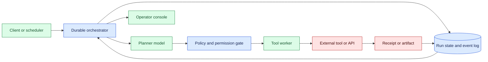
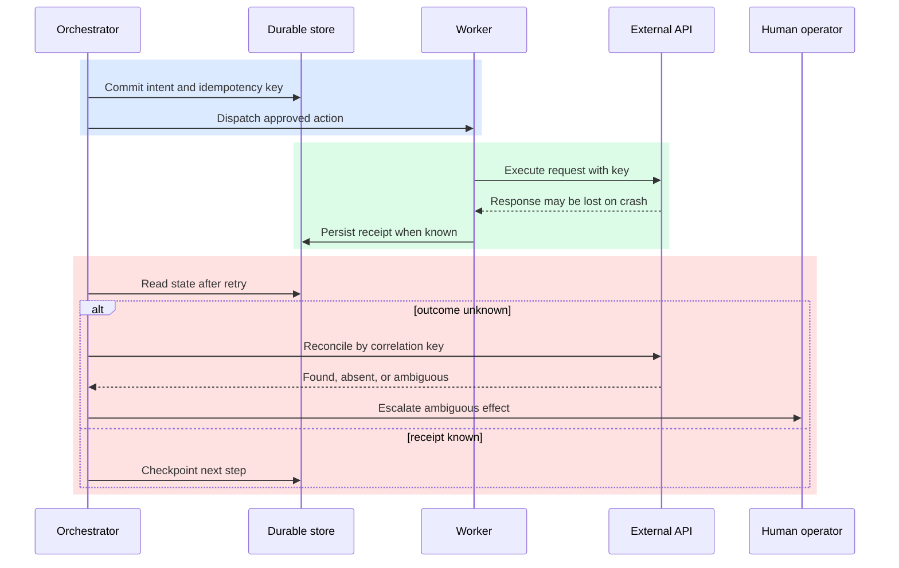

# Long-running tasks

Status: emerging

Sources: [Google DeepMind — 2026-07-30, primary product post](https://blog.google/innovation-and-ai/models-and-research/google-deepmind/gemini-robotics-er-2/)

## In one sentence

A long-running AI task is trustworthy only when progress, tool effects, permissions, and recovery choices live in durable system state rather than solely in a model conversation.

## Prerequisites

Know durable state, queues, timers, leases, idempotent effects, receipts, and cancellation. A long-running task is a workflow whose worker may disappear between any two events; the state record, not a live process, carries recovery context.

## Background: what existed before

Most web services follow a short request/response shape: a client sends an HTTP request, a server does bounded work, and a response arrives before a timeout. That model fits classification, retrieval, and one model completion. It fails gracefully only when the work is short. An assistant that investigates a repository, waits for a build, asks an operator for approval, calls several APIs, and resumes tomorrow has crossed into workflow orchestration.

Early agent prototypes commonly ran a prompt loop in one worker. The planner chose a tool; the application appended the result to chat history; the next completion chose another action. If a worker restarted, a browser stalled, or a person needed to intervene, the program either restarted from scratch or guessed what had occurred. Guessing is particularly unsafe when an action can create a ticket, change cloud configuration, send an email, or charge an account.

Job queues, databases, schedulers, and state machines already solve adjacent reliability problems. Queues deliver work and limit concurrency. Databases make records survive restarts. Schedulers wake work after a delay. State machines define legal progress. The AI-specific requirement is to wrap probabilistic planning and tool use in these controls. A language model may propose a next action, but it cannot be the sole evidence that an action was authorized or completed.

Durable execution means a run can resume after process loss, deployment, rate limiting, and long waits. It does not promise that the plan was wise. It promises that operators can see the last committed step, known external effects, unknown effects, and the authority needed to resolve ambiguity. That is a stronger operational contract than a larger context window.

## What changed and why now

Current computer-use, coding, and tool-connected systems make task duration a product requirement. Useful work crosses asynchronous boundaries: CI finishes later, a human approves a risky change, a browser download is delayed, or a batch evaluation takes hours. A feature that says “continue this tomorrow” needs a durable run record; keeping a model process alive is not a recovery strategy.

The source context for this issue is engineering work around capable tool use and autonomous task completion. The release-specific fact is limited: labs and platform teams are publishing and operating increasingly agentic systems. The workflow architecture in this lesson is an engineering inference from that direction, and applies whether the planner is a frontier model, a smaller model, or deterministic code.

This shift raises the observability bar. A traditional trace can say an HTTP request returned 200. A long-running task needs a timeline of plans, checkpoints, tool intents, receipts, retries, policy decisions, and human handoffs. That history lets support distinguish a bad model decision from a correct decision whose tool receipt was lost.

## What changed this month

The verified July 30 release describes multi-step planning, progress tracking from continuous video, self-correction when a step fails, and communication between different robots. It does not establish a universal task duration or a specific durable-workflow product. The engineering consequence is narrower and testable: when an agent must preserve progress across those steps, evaluate it as a resumable run rather than an unusually long chat session. A run must be able to pause for an external event without reserving a worker, survive a deploy without losing its place, and resume with the same authority boundaries that applied when it started. These requirements pull workflow primitives—state, queues, timers, receipts, and approval gates—into the core of agent application design.

This also changes the definition of progress. A fluent intermediate message is not progress unless it corresponds to a committed state transition or useful artifact. For example, “I will run tests” is a plan; a stored test invocation identifier and its output hash are progress. The distinction prevents dashboards from reporting apparent activity while hidden retries or blocked permissions leave the business task unchanged.

Teams should identify the smallest set of events worth making durable before adding autonomy. Common candidates are task acceptance, policy approval, tool intent, tool receipt, artifact creation, human decision, cancellation request, and final delivery. Those events support recovery and audit without requiring every private chain-of-thought-like intermediate to be logged. The result is a system that is both more inspectable and more respectful of data minimization.

## Impact on current processing and architecture

Give each task a durable run identifier. Its compact state document holds its current phase, expected next step, permitted tools, input version, budget, cancellation flag, and artifact references. Large transcripts, screenshots, and tool payloads belong in an object or event store; state retains handles and hashes. This makes recovery data queryable without copying unbounded material into every prompt.

The orchestrator owns transitions. A model may return a structured proposal such as `request_browser_action` or `ask_for_approval`, but a policy layer validates it against tool allowlists, spend limits, tenant boundaries, and the current state. A worker performs the approved action using an idempotency key. The system advances only after a receipt is persisted. This ordering closes the failure window where an API succeeds but a crashed worker never records it.



Normalize tool results into typed observations: status code, resource identifier, content hash, timestamp, and redaction class. The planner receives a compact relevant projection instead of an uncontrolled raw log. This lowers token cost, reduces secret exposure, and makes replay tests possible. A test can feed committed observations into a planner and check whether its proposed transition is allowed.

Queues still matter. They isolate slow tools, cap per-tenant concurrency, and expose overload. A queue message is not the source of truth; it is a delivery mechanism for work already represented in durable state. When a message arrives twice, the worker checks the run and effect IDs. When it arrives late, it checks deadlines and cancellation before doing anything. Retry safety is implemented this way, not assumed.

## Real-world applications and constraints

A coding assistant may create a branch, run tests, wait for CI, summarize failures, and request review before proposing a pull request. Each stage needs different credentials and risk controls. The task record should include the revision, artifact links, approved scope, and publication permission. It must not infer authority from a sentence found in an old transcript.

A support assistant can gather incident evidence across metrics, runbooks, and tickets while an operator remains accountable for a production change. Freshness matters: a five-hour-old metric query should be marked stale before it drives a recommendation. The run can schedule a new observation instead of silently using historic data.

Back-office automation has sharper duplicate-effect risks. An agent reconciling invoices or provisioning accounts must distinguish duplicate message delivery from a duplicate business operation. Use the business system’s idempotency key where available; a local “already called” flag is insufficient if the database and remote API disagree. For irreversible actions, prepare a change, obtain authority, execute once, and retain the remote receipt.

Operational constraints include deadlines, budgets, quotas, retention rules, and operator capacity. Expose why a run waits: `waiting_for_ci`, `waiting_for_approval`, `rate_limited_until`, and `unknown_external_effect` are actionable; `thinking` is not. Cancellation should prevent new actions and record the request while allowing an in-flight action to finish or be reconciled.

## Mental model

Treat the model as a fallible navigator inside a flight-control system. It can suggest a route and react to observations, but the control system owns the checklist, instruments, and emergency procedures. The durable state machine is that control system: it defines legal transitions and evidence needed for each one.

Separate **intent** from **effect**. “Create a ticket” is intent. A ticket ID returned by the tracker is an effect receipt. Persist intent before the request and persist its receipt after the response. If a crash occurs between them, the honest state is `unknown_effect`, not success or failure. A reconciler searches by idempotency or correlation key and resolves the record from evidence.



Checkpoint boundaries are product choices. Saving every token is noisy and expensive; saving only the final answer loses too much. Useful boundaries are before and after external effects, after validation, before waiting, after a material artifact, and before a privilege change. Store the prompt and tool-schema versions needed to interpret the checkpoint after deployment.

## Engineering consequence

Require model calls to produce structured actions with a type, parameters, and expected state transition. Validate the schema and policy independently of the model. Narrow tools such as `read_issue`, `run_test`, and `draft_comment` are easier to audit than unrestricted shell or browser access. Credentials should be short-lived, scoped to the run, and never copied into model context.

Use explicit states such as `QUEUED`, `RUNNING`, `WAITING`, `RECONCILING`, `ESCALATED`, `CANCELLED`, and `COMPLETED`, each with a reason and timestamps. Terminal does not mean successful: cancellation and escalation are honest outcomes. Version schemas so in-flight tasks survive deploys; migrations must upgrade records or route old versions to compatible workers.

Testing changes too. Unit-test transition guards and idempotency behavior. Integration-test a crash after an API receives a request but before the receipt is saved. Load-test long waiting tails, not just throughput. Chaos exercises should revoke credentials, delay approval, return malformed tool results, and restart orchestration. These tests measure recovery—the main property of durable execution.

Attach cost to the run: model tokens, tool charges, retries, storage, and elapsed time. An agent should not endlessly replan around a flaky service. A budget gate can move it to `ESCALATED` with evidence collected so far. That is safer for users and easier to operate than silently spending until an account limit is reached.

## Product-run state versus workflow-runtime replay

The boundary between this lesson and durable workflow runtimes matters. Product-run state answers questions a user or operator asks: what is this task trying to accomplish, what deadline applies, which permissions are currently granted, what artifact is ready, and what decision is waiting? It is allowed to contain an evolving plan and a compact interpretation of observations. The product record is therefore a controlled projection of a run, not necessarily a complete replay log. It should be easy to query, redact, and explain.

A deterministic workflow runtime has a different job. It records the events and activity outcomes needed to replay orchestration code after a worker restart, and it cares about compatible workflow code, event ordering, timers, and activity identities. A runtime can replay the same sequence while the product still needs to decide whether a deadline has expired, whether a user revoked access, or whether a new external fact makes the next action inappropriate. Do not use a product summary as a substitute for runtime history, and do not expose raw runtime history as the only user-facing state.

Deadlines need more than a timestamp. Store the deadline source, time zone or clock policy, grace period, and behavior at expiry. A task waiting for a human should stop creating new effects when its approval window closes. A task waiting for a build should distinguish “build still running” from “build result arrived after the task deadline.” These distinctions let an operator choose cancel, renew, or deliver a partial result without guessing from a stale chat message.

Cancellation is similarly two-phase. First record the request durably and prevent new dispatches. Then observe in-flight work: a read-only query may finish, while a remote write may need reconciliation. Mark the run `CANCELLING` or `UNKNOWN_EFFECT` until the external outcome is known. This is more honest than changing a UI badge to “cancelled” while a worker can still create a ticket. A deadline, cancellation request, and permission revocation should all be visible events with an actor and timestamp.

Recovery tests should vary the point of failure. Restart before intent persistence, after intent but before dispatch, after the external service accepts a request, and after receipt persistence. Each point has a different safe action. The first can be retried; the third requires idempotency lookup; the fourth should simply advance. Test delayed approvals and late queue messages too. These scenarios exercise product-run semantics directly and keep the lesson distinct from lesson 19’s focus on deterministic replay compatibility.

## Limits and failure modes

Durability does not make an uncertain plan correct. A model can still misunderstand a goal, choose an irrelevant tool, or summarize evidence inaccurately. Policy gates and evaluation sets reduce blast radius but do not prove semantic correctness. Keep high-impact changes reviewable and require explicit authority for production, financial, legal, and security-sensitive effects.

Exactly-once execution is generally an aspiration across independent services, not a guarantee. A remote API can execute an operation and lose its response. The practical objective is at-least-once delivery plus idempotent business effects, reconciliation, and visible ambiguity. If the remote system lacks idempotency and lookup, retries are risky and need human review.

Persisting everything creates another risk. Logs may contain customer content, source code, or credentials returned by a tool. Classify, redact, encrypt, restrict access, and expire records at ingestion. An audit view for operators should be separate from exact model context. Recovery needs do not justify retaining unlimited data.

## Build it locally

This local example models a checkpointed run and shows why the same idempotency key cannot record a duplicate effect. Production code would use a transactional database and a remote-system lookup.

```python
from dataclasses import dataclass, field
from enum import Enum

class State(str, Enum):
    RUNNING = "running"
    WAITING = "waiting"
    UNKNOWN_EFFECT = "unknown_effect"

@dataclass
class Run:
    run_id: str
    state: State = State.RUNNING
    next_step: str = "create_ticket"
    receipts: dict[str, str] = field(default_factory=dict)

def commit_effect(run: Run, effect_key: str, receipt: str | None) -> str:
    if effect_key in run.receipts:
        return f"replay ignored; receipt={run.receipts[effect_key]}"
    if receipt is None:
        run.state = State.UNKNOWN_EFFECT
        return "outcome unknown; reconcile before retry"
    run.receipts[effect_key] = receipt
    run.next_step = "wait_for_review"
    run.state = State.WAITING
    return f"checkpointed receipt={receipt}"

run = Run("run-42")
print(commit_effect(run, "ticket:run-42:1", "SUP-1842"))
print(commit_effect(run, "ticket:run-42:1", "SUP-1842"))
print(run.state.value, run.next_step, run.receipts)
```

1. Save the code as `long_running.py` and run `python3 long_running.py`.
2. Change the first receipt to `None`; confirm the run becomes `unknown_effect` instead of retrying blindly.
3. Add a `reconcile` function that accepts a lookup result and either saves the receipt or escalates the run.
4. Add an attempt limit and deadline; stop scheduling work once either limit is reached.
5. Test that calling `commit_effect` twice with the same key never creates two receipts.

## Mini exercise (15–30 min)

Choose one multi-step assistant feature. Draw its states and list every external effect: sending a message, writing a file, opening a pull request, or changing a record. For each, name the authorizer, idempotency key, receipt, and crash-recovery lookup. If an answer is “the transcript says it happened,” add durable state or reconciliation.

## Interview Q&A

**Why is a queue insufficient?** It redelivers work but does not prove current business state or whether an effect happened. A durable run record and idempotency protocol supply that evidence.

**Where should model memory live?** Persist verified observations, artifact references, and task state in services. Build a bounded prompt from those records for each decision.

**What follows a tool timeout?** Record an unknown effect, reconcile using a correlation key, and escalate if ambiguity remains. Blind retry can duplicate an action.

**How is reliability evaluated?** Measure completion, cancellation, restart recovery, duplicate-effect rate, waiting time, escalation, budget exhaustion, and correctness on workflow scenarios.

## Glossary

**Checkpoint:** Persisted state sufficient to resume at a known boundary.

**Durable execution:** Workflow execution that recovers progress after process loss.

**Effect receipt:** External evidence, such as a created resource ID, that an intended action occurred.

**Idempotency key:** Stable identifier making repeated requests one business operation.

**Reconciliation:** External lookup used to resolve whether an uncertain action occurred.

**State machine:** Defined states and legal transitions that make progress explicit.

## References

- [Google DeepMind — 2026-07-30, Gemini Robotics-ER 2](https://blog.google/innovation-and-ai/models-and-research/google-deepmind/gemini-robotics-er-2/) — July source for multi-step planning, progress tracking, self-correction, and robot collaboration.
- [Temporal documentation: What is Temporal?](https://docs.temporal.io/what-is-temporal) — durable-execution source context.
- [RFC 9457: Problem Details for HTTP APIs](https://www.rfc-editor.org/rfc/rfc9457) — structured failure-response context.

## Claim ledger
| Claim | Source | Fact or inference |
|---|---|---|
| The July 30 post describes multi-step planning, progress tracking, self-correction, and communication between different robots. | [Google DeepMind — 2026-07-30](https://blog.google/innovation-and-ai/models-and-research/google-deepmind/gemini-robotics-er-2/) | Fact; provider release claim |
| The post describes progress tracking, self-correction, and multi-step orchestration. | [Google DeepMind — 2026-07-30](https://blog.google/innovation-and-ai/models-and-research/google-deepmind/gemini-robotics-er-2/) | Fact; provider release claim |
| Temporal documents durable execution as recovery from persisted workflow progress. | [Temporal — accessed 2026-09-07](https://docs.temporal.io/what-is-temporal) | Fact; documentation scope |
| Product task state should retain deadlines, receipts, permissions, and reconciliation status. | This lesson’s architecture | Engineering inference |
