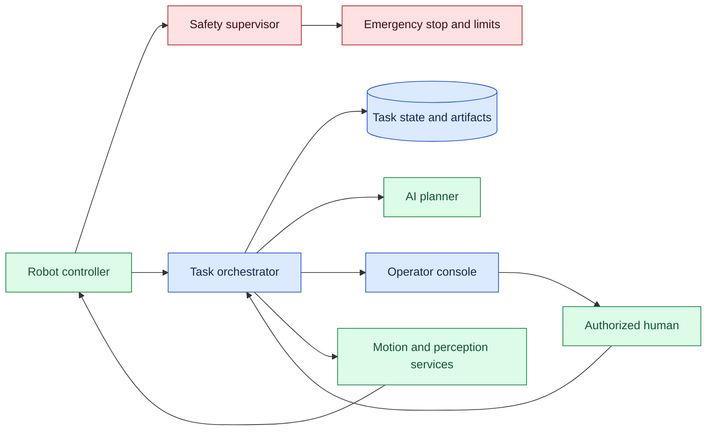
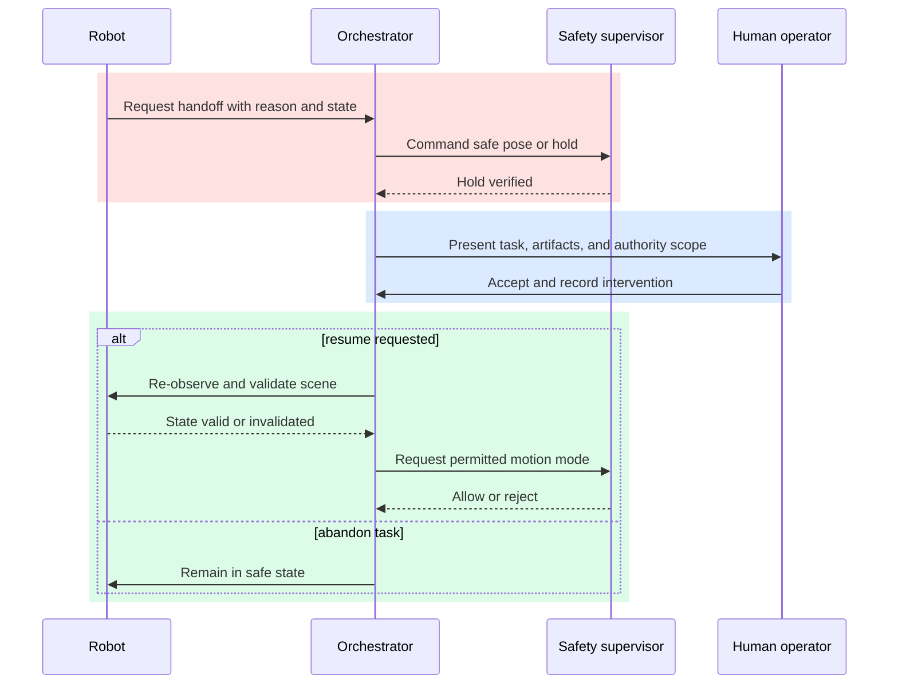

# Human–robot handoff

Status: emerging

Sources: [Google DeepMind — 2026-07-30, primary product post](https://blog.google/innovation-and-ai/models-and-research/google-deepmind/gemini-robotics-er-2/)

## In one sentence

A safe human–robot handoff is a deliberate transfer of authority, situational state, and recovery responsibility—not simply a robot stopping when a person appears nearby.

## Prerequisites

Know safety-rated stops, finite-state machines, sensor freshness, permissions, leases, and human factors. A handoff transfers authority and situational context; stopping motion alone does not make resumption safe.

## Background: what existed before

Industrial automation traditionally divided work by physical boundary. A fixed robot worked behind a guard, and a person loaded material or handled exceptions outside the cell. The operating contract was simple because both parties rarely occupied the same task space at the same time. Collaborative robots, mobile manipulators, warehouse systems, and AI-guided inspection change that contract: the same job can move between autonomous action and human judgment many times.

The first version of a handoff is often a button labeled “take over.” It is better than nothing, but it leaves hard questions unanswered. What is the robot holding? Which plan step is active? Does the human inherit the robot’s reservation of a workspace? Can the robot resume after the person moves an object? Which sensor reading or map revision was used? If neither side has an authoritative answer, resuming automation can be more hazardous than the original interruption.

Robotics already has useful building blocks: finite state machines, safety-rated stops, motion planning, perception confidence, telemetry, and operator interfaces. AI planning adds variability. A model can interpret an instruction, choose a recovery action, or summarize an observation, but it cannot establish physical safety through language alone. The physical controller, safety system, and operating procedure remain responsible for enforcing motion limits and stop conditions.

The baseline lesson is therefore organizational as much as technical. Robots need a clear owner for each phase of work. The owner may be an autonomous controller, a named operator, a supervisor, or a maintenance workflow. A handoff changes that owner and captures enough state for the next owner to act safely.

## What changed and why now

AI-connected robots are moving beyond repeated, preprogrammed cycles toward environments with more variation: natural-language task requests, visual understanding, mixed inventories, and remote assistance. That makes human intervention a normal operating mode rather than a rare failure path. A person may correct perception, approve an unusual item, move an obstacle, or complete a delicate final step. Good systems design this collaboration rather than treating it as an exception.

The release-specific source fact for this issue is limited to the ongoing public work around robotics and AI capabilities represented by the issue’s source context. The detailed handoff architecture below is an engineering inference, not a claim that any one source released this exact protocol. Its goal is to make capability claims separate from reliability claims: a robot may recognize or plan a task, while a safe handoff additionally requires verified state, permissions, and physical controls.

The practical shift is from a binary autonomous/manual switch to a small protocol. The robot requests a handoff with a reason and safe pose; the system freezes or checkpoints the task; an authorized human accepts it; changes are recorded; and resumption requires validation. This protocol makes interruption observable and reduces the temptation to resume from stale assumptions.

## What changed this month

The July 30 robotics post reports human-proximity behavior that halts a robot when a person is nearby and resumes only once the area is clear. This is a provider-reported capability and benchmark claim, not a substitute for a safety-rated controller. A physical handoff still needs a local safe pose, operator identity, scene invalidation, and a resumption checklist.

## Impact on current processing and architecture

Model the work as a task record with a physical and digital state. The record should reference task ID, object IDs, map or scene version, pose estimate, active tool, motion-plan version, safety mode, assigned operator, and last successful action. Store large camera frames, point clouds, and recordings as artifacts with timestamps and hashes. Store compact references in the task state. A planner can then receive a bounded, current context rather than relying on a narrative of what it believes happened.

The safety controller must remain below the AI layer. It enforces emergency stop behavior, speed limits, geofences, collision constraints, and hardware faults even when the planner is unavailable. The task orchestrator coordinates ownership and policy; the planner proposes the next task action; the motion stack produces feasible motion; and the safety system may reject or halt it. This hierarchy is vital: the ability to generate a plausible plan is not authority to move hardware.



Data freshness is an architectural concern. A handoff that lasts ten minutes can invalidate a scene estimate. The handoff record needs an expiry or “re-observe before resume” requirement. Similarly, an object moved by a human should invalidate dependent grasp, path, and inventory assumptions. Design this as a normal invalidation event, not an operator free-text note that the model might miss.

Use capability-scoped permissions. An operator who may clear a jam need not be allowed to alter motion safety parameters. A remote assistant may view camera output and provide instructions but lack authority to resume physical motion. Every acceptance, override, and resume action should be attributable to an identity and policy decision. This makes post-incident review possible and prevents a model-generated message from becoming accidental authorization.

## Real-world applications and constraints

In a warehouse, a mobile robot may bring a bin to a picking station and request a person’s help when an item is occluded. The handoff includes the bin ID, detected item candidates, confidence, current location, and whether the robot’s path reservation remains active. The worker confirms the item or flags a discrepancy. Before the robot moves again, the system checks that the worker has left the protected zone and that its map is still current.

In a laboratory, a robot may prepare samples until it encounters an unfamiliar container or a low-confidence grasp. A scientist can take local control, identify the container, and return the task to autonomy. Here, traceability may matter as much as speed: the system should log the sample identity, intervention reason, instrument state, and calibration version. The human’s correction becomes a structured observation, not merely an anecdote in a chat transcript.

In field inspection, connectivity may be intermittent. A remote operator can receive a compressed state summary and selected imagery, but the robot cannot assume a network round trip will be available during an unsafe condition. Local safe-stop and fallback behavior are necessary. The interface should say whether the operator is observing, guiding, or assuming control; ambiguous shared control is difficult to test and difficult to explain after an incident.

Constraints include latency, line-of-sight, operator workload, physical access, training, local regulation, and sensor quality. A system that requires instant human response may look safe in a demonstration and fail in a real facility with one supervisor responsible for many machines. Queue handoff requests, display urgency, and define a timeout route to a known safe state. Do not use a low model-confidence score alone as a safety signal; combine it with physical risk, task criticality, and sensor health.

## Mental model

Think of handoff as a baton pass in a relay, with a written scoreboard. Both participants must agree on the baton’s identity, current position, and next permitted move. The robot cannot silently place the baton down and later pick up a similar one; the human cannot resume a run without knowing whether the robot already performed the prior action.

The central distinction is **control authority** versus **advice**. A planning model may advise that an object should be moved. Control authority means a system is permitted to command motion, and it carries a corresponding duty to satisfy safety conditions. A human watching a dashboard has advice access. A person who accepts a task and presses resume has control authority. Interfaces should make the distinction explicit.



This mental model also clarifies why a handoff needs a closed loop. It starts with a request and ends only when the receiver accepts ownership, the physical state is verified, and the sender is released from responsibility. A notification alone is not a handoff. A camera stream alone is not a handoff. A state record, authorization, and acknowledgement make it one.

## Engineering consequence

Define states such as `AUTONOMOUS`, `REQUESTING_HANDOFF`, `SAFE_HOLD`, `HUMAN_CONTROL`, `REVALIDATING`, `RESUMING`, `ESCALATED`, and `COMPLETE`. Keep transitions small and guarded. For example, `SAFE_HOLD` may transition to `HUMAN_CONTROL` only after an authenticated operator accepts the task; `REVALIDATING` may transition to `RESUMING` only after current perception and safety checks succeed. A task may always move to `ESCALATED` when required evidence is missing.

Treat the handoff payload as an API contract. It should be structured and versioned: task ID, reason code, risk level, relevant objects, last action, current controller, artifact links, safety status, and required acknowledgement. Free text can add context, but it should not replace these fields. Versioning matters because a robot, operator console, and orchestration service may deploy at different times.

Build operator interfaces for decision quality, not just observation. Show the current safety mode, active reservation, a simple before/after visual, and the exact permission the operator will exercise. Require confirmation for high-impact steps and show what will happen after confirmation. Avoid burying emergency actions next to routine controls. Record a reason code for overrides; this improves later evaluation and highlights repeated product gaps.

Test at the boundaries. Simulate a network loss after a human accepts but before the robot receives the message. Simulate a person moving an object while the robot is held. Simulate stale camera data, a revoked operator session, and an emergency stop during revalidation. The success criterion is not merely that the UI displays a message; it is that the robot cannot resume with incorrect ownership or stale physical assumptions.

## Designing the physical transfer boundary

The handoff boundary should be defined in terms of physical consequences, not interface labels. “Manual mode” can mean several things: a person may jog one joint, select an approved recovery motion, carry an object, or merely acknowledge a warning. Those modes have different hazards and permissions. Model them separately so an operator cannot accidentally receive more authority than the intervention requires. A useful payload names the controlled mechanism, protected zone, held object, allowed speed, and whether the robot is expected to remain stationary while the person works.

The sender and receiver also need a common reference frame. A robot should report the last confirmed pose, the scene timestamp, the object or tool identity, and the next unfinished action. A human should be able to correct each field explicitly. If the person moved a bin, removed a gripper, or changed a fixture, the system should create a new scene version rather than silently overwriting the old one. On resume, perception compares the new observation with the expected task state and either proves the assumptions still hold or routes the task to a new plan.

Authority should be exclusive at the moment motion is enabled. A physical pendant, remote console, and autonomous planner may all be healthy while still issuing incompatible commands. Use an explicit controller token or lease, show its owner, and require the previous owner to yield it. Lease expiry should enter a safe hold, not transfer control to whichever client sends the next message. If the network partitions, the robot should rely on local safety behavior and the operator console should show that remote authority is unavailable. Reconnection must perform a fresh ownership handshake instead of replaying buffered motion commands.

The acceptance screen should be a compact safety case for this particular intervention. It should answer: what happened, what the robot has already done, what the person is being asked to do, what motion will be enabled afterward, and what evidence will be collected. Do not overload the operator with every camera frame. Show the few artifacts needed to identify the object and workcell, plus a clear uncertainty or sensor-health warning. A confirmation button is meaningful only when the person can understand its scope.

Operational metrics should separate delay from quality. A long safe hold may indicate a staffing problem; a fast handoff followed by repeated invalidation may indicate poor perception or an unclear interface. Track the reason for the request, time to reach safe hold, time to assign an owner, number of scene changes, rejected resumes, emergency stops, and tasks abandoned. Review near misses with the same seriousness as completed tasks. These measurements help teams improve the physical workflow without treating a low handoff rate as proof that autonomy is safe.

This is deliberately narrower than software-agent arbitration. Lesson 20 concerns which operator may authorize a software action and how an evidence console resumes an agent run. This lesson concerns a physical workspace in which a person and machine share objects, force, and space. The safety supervisor must therefore remain effective even if the task record, model, or network is unavailable. That separation is an architectural requirement, not merely a naming preference.

## Limits and failure modes

Human involvement is not automatically safe. Operators can be overloaded, distracted, poorly trained, or given misleading summaries. Automation bias can cause a person to approve a recommendation because it sounds confident. Interfaces should surface uncertainty, constraints, and evidence rather than presenting a model’s recommendation as a command.

Perception can be wrong even after revalidation. A camera may be occluded, lighting may change, an object label may be mistaken, or an object may have shifted between observation and motion. Safety controls must constrain motion independently of semantic recognition, and operating procedures should specify when a task must be escalated instead of resumed.

Shared control is another trap. If a person and robot can both issue conflicting motion commands, command arbitration must be deterministic and visible. “Last command wins” is usually unacceptable. Prefer explicit authority leases with a single active controller, a timeout, and a safe transition back to neutral state.

Logs deserve care. Video, audio, and task history can include sensitive workplace or customer information. Apply access controls, retention rules, redaction where practical, and clear purpose limits. Auditability should not become indiscriminate surveillance.

## Build it locally

The following small state machine demonstrates that a task cannot resume until a human has accepted it and a fresh validation has occurred. It models software ownership only; it does not replace a hardware safety controller.

```python
from dataclasses import dataclass
from enum import Enum

class Mode(str, Enum):
    AUTONOMOUS = "autonomous"
    SAFE_HOLD = "safe_hold"
    HUMAN_CONTROL = "human_control"
    REVALIDATING = "revalidating"
    RESUMING = "resuming"

@dataclass
class Task:
    task_id: str
    mode: Mode = Mode.AUTONOMOUS
    operator: str | None = None
    scene_version: int = 1

def accept_handoff(task: Task, operator: str) -> None:
    if task.mode is not Mode.SAFE_HOLD:
        raise ValueError("handoff requires verified safe hold")
    task.operator = operator
    task.mode = Mode.HUMAN_CONTROL

def resume(task: Task, observed_scene: int) -> str:
    if task.mode is not Mode.HUMAN_CONTROL:
        return "resume denied: no human owner"
    task.mode = Mode.REVALIDATING
    if observed_scene != task.scene_version:
        return "resume denied: scene changed; plan again"
    task.mode = Mode.RESUMING
    return "resume permitted after validation"

task = Task("pick-17", mode=Mode.SAFE_HOLD)
accept_handoff(task, "operator-3")
assert resume(task, observed_scene=1) == "resume permitted after validation"
assert task.mode is Mode.RESUMING

unauthorized = Task("pick-18", mode=Mode.AUTONOMOUS)
try:
    accept_handoff(unauthorized, "operator-4")
except ValueError as error:
    assert "safe hold" in str(error)
else:
    raise AssertionError("autonomous task accepted an unsafe handoff")

stale = Task("pick-19", mode=Mode.SAFE_HOLD, scene_version=7)
accept_handoff(stale, "operator-5")
assert resume(stale, observed_scene=8) == "resume denied: scene changed; plan again"
assert stale.mode is Mode.REVALIDATING
print("positive and failure handoff assertions passed")
```

1. Save the example as `handoff.py` and run it with `python3 handoff.py`.
2. Try calling `accept_handoff` while the task is autonomous; confirm that it raises an error.
3. Change `observed_scene` to `2`; see that resume is denied and requires replanning.
4. Add an authority-lease expiry and deny resume when the acceptance is too old.
5. Add a reason-code list and log each denied transition for a later operator review.

## Mini exercise (15–30 min)

Choose a robot-assisted workflow and list three moments when a person may need to intervene. For each moment, define the safe physical condition, state payload, authorized role, required acknowledgement, freshness check, and timeout behavior. Then identify one assertion a test can make—for example, “no motion command is emitted while the task is in `SAFE_HOLD`.”

## Interview Q&A

**Why is an emergency stop not a full handoff design?** It halts motion, but it does not transfer ownership, capture task state, or establish conditions for safe resumption.

**Why keep a safety layer below the planner?** Models can make uncertain decisions. Hardware and safety controllers must enforce physical limits even when planning or networking fails.

**What should invalidate a handoff?** Scene changes, expired authority, changed tool state, failed sensor health checks, lost reservations, and missing acknowledgements are common invalidators.

**How do you measure handoff quality?** Track request rate, acceptance time, safe-hold duration, resume success, escalations, stale-state blocks, overrides, and incidents or near misses with privacy-aware review.

## Glossary

**Authority lease:** Time-bounded permission for one actor to control a task or resource.

**Handoff:** Transfer of responsibility, relevant state, and permitted control between actors.

**Revalidation:** Fresh checks that confirm assumptions still hold before resuming work.

**Safe hold:** Verified state in which the robot is prevented from continuing task motion.

**Safety supervisor:** Independent layer that enforces physical constraints and stop behavior.

**State invalidation:** Marking prior observations or plans unusable after a relevant change.

## References

- [Google DeepMind — 2026-07-30, Gemini Robotics-ER 2](https://blog.google/innovation-and-ai/models-and-research/google-deepmind/gemini-robotics-er-2/) — July source for human-proximity stopping, resumption after clearance, and safety orchestration claims.
- [NIST AI Risk Management Framework](https://www.nist.gov/itl/ai-risk-management-framework) — governance and risk-management context.
- [ROS 2 documentation](https://docs.ros.org/en/rolling/) — primary documentation for robot-software concepts.

## Claim ledger
| Claim | Source | Fact or inference |
|---|---|---|
| The July 30 robotics post describes stopping when a person is nearby and resuming after the area is clear. | [Google DeepMind — 2026-07-30](https://blog.google/innovation-and-ai/models-and-research/google-deepmind/gemini-robotics-er-2/) | Fact; provider release claim |
| The post introduces a benchmark for safety orchestration, uncertainty resolution, and human intervention. | [Google DeepMind — 2026-07-30](https://blog.google/innovation-and-ai/models-and-research/google-deepmind/gemini-robotics-er-2/) | Fact; provider release claim |
| ROS 2 provides software interfaces used to compose robot applications. | [ROS 2 — accessed 2026-09-07](https://docs.ros.org/en/rolling/) | Fact; documentation scope |
| A physical handoff still requires hardware safety, local stop behavior, and fresh scene validation. | This lesson’s architecture | Engineering inference |
