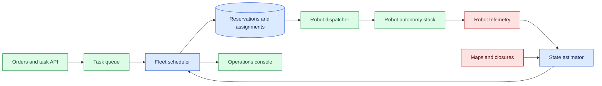
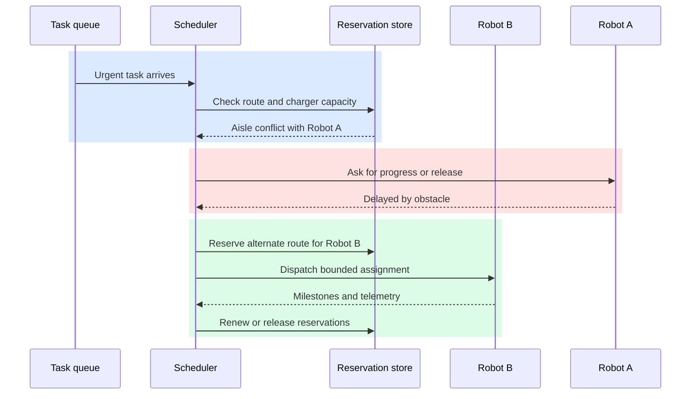

# Robot fleet scheduling

Status: emerging

Sources: [Google DeepMind — 2026-07-30, primary product post](https://blog.google/innovation-and-ai/models-and-research/google-deepmind/gemini-robotics-er-2/)

Monthly source status: planned — rebuild needed. The verified July source describes different robot types communicating and collaborating, but does not directly support fleet scheduling, time-window optimization, congestion management, or capacity planning.

## In one sentence

Robot fleet scheduling is the operational system that assigns tasks, reserves shared space, and recovers from delays so a group of individually capable robots produces reliable work together.

## Prerequisites

Know assignment problems, route constraints, capacity calendars, deadlines, reservations, congestion, and local collision avoidance. Scheduling chooses among globally feasible plans; a robot’s safety controller still decides whether immediate motion is safe.

## Background: what existed before

A single robot can often choose a route or task with local information. A fleet cannot: each choice consumes shared resources such as charging stations, narrow aisles, elevators, loading bays, wireless bandwidth, and human attention. If every robot greedily takes the apparently shortest route, the group can create congestion, deadlock, or a pileup at the same workstation. Fleet scheduling turns those local choices into a coordinated plan.

Early deployments frequently used simple dispatch rules: send the nearest idle vehicle, use first-in-first-out task order, and let robots avoid each other locally. These rules are attractive because they are easy to explain. They work until the environment becomes variable. A robot might be nearest but low on charge, blocked by a cleaning operation, assigned to a higher-priority delivery, or unable to carry the required payload. Local collision avoidance protects people and equipment, but it does not guarantee throughput or prevent two robots from waiting forever at opposing ends of a narrow corridor.

Classical operations research offers useful concepts: assignment, routing, deadlines, capacity, constraints, and objective functions. Warehouse-control systems add inventory truth and order priorities. Robot software adds localization uncertainty, battery state, actuator health, and physical safety rules. A fleet manager needs all of these inputs, but it should avoid pretending that every estimate is exact. Travel time is a distribution, not a promise; a map can be stale; a worker can temporarily occupy a route.

The baseline is therefore a central or logically coordinated scheduler that has an authoritative view of tasks and resources. Individual robots retain local safety control. The scheduler asks “which feasible plan best serves the current objective?” while the robot asks “is this next motion safe right now?” Those roles complement rather than replace each other.

## What changed and why now

More AI-enabled robots can handle variation in perception, natural-language task intake, and exception triage. That capability increases the value of fleets, but also makes coordination harder. A planner may identify more jobs that a robot could perform; it does not automatically decide which job is most valuable for the whole operation. Scheduling remains the bridge between high-level intent and finite physical capacity.

The release-specific fact in this issue is limited to the July 30 report that different robot types can communicate and work together on a workflow. The scheduling design here is an engineering inference. It does not claim that the release supplies a fleet scheduler, global optimal routing, or a safe model-generated plan.

The practical change is to treat fleet scheduling as a continuously revised, observable decision service. It accepts work requests, estimates feasibility, reserves scarce resources, dispatches a bounded action, and replans when observed state diverges. The service must expose why a task is delayed, not merely show a robot icon standing still.

## What changed this month

The verified July 30 release specifically reports multi-robot collaboration: different robot types can communicate and work together on a workflow. It does not claim a particular fleet scheduler, global optimizer, or deadline policy. This lesson therefore treats collaboration coordination as the source-backed change and scheduling as the deterministic infrastructure needed to make that capability observable. A request can arrive as text, image-derived inventory information, or a system event, but it must become a typed task before dispatch. The coordinator is where that translation meets real constraints: a model may suggest “restock the urgent shelf,” while deterministic services decide the shelf identifier, deadline, payload, permitted robots, and capacity reservation.

This framing makes evaluation more useful. Instead of asking only whether a robot completed an isolated benchmark, teams can measure whether the fleet honored priority, avoided stale assignments, released resources, and recovered after interruption. Those are the behaviors that determine whether additional robot capability improves an operation rather than simply producing more exceptions for a supervisor.

## Impact on current processing and architecture

Start with typed state. Each task needs origin, destination, payload capability, priority, deadline, service-time estimate, and cancellation policy. Each robot needs location confidence, battery, available capacity, current assignment, health, speed profile, and permissions. Shared resources need capacity calendars: an elevator might carry one robot; a charging area might have four ports; a one-way aisle may be temporarily closed. Keep source timestamps so the scheduler can discount stale telemetry rather than optimizing against fiction.

The dispatch decision has three layers. First, filter infeasible robot-task pairs: a robot lacking payload capacity, access permission, charge reserve, or a valid map should not be considered. Second, score feasible pairs using cost such as expected completion time, lateness risk, energy use, and disruption to existing commitments. Third, reserve the required route segments and resources before telling the robot to start. Reservations should have expiry and renewal, otherwise a disconnected robot can block the facility indefinitely.



An AI model can assist at the edges: converting a natural-language request into a proposed structured task, explaining a delay, or classifying an exception. It should not write directly to reservations or motion commands. Validate proposed task fields against the facility model, apply policy, and preserve a trace that identifies the source of each value. This separates useful language understanding from the deterministic checks that protect capacity and safety.

Processing architecture benefits from events. Robots publish position, health, and task milestones. The scheduler emits assignment, reservation, and revocation events. A materialized view powers a dashboard, while an append-only event trail supports replay after a scheduling bug. The command path should use idempotency keys: a repeated `assign task-83 to robot-7` message must not create duplicate work.

## Real-world applications and constraints

In a fulfillment center, a scheduler balances urgent orders against battery charging and aisle congestion. Sending every nearby robot to the same popular pick zone can increase total delay, because it creates a queue where travel was expected to be cheap. A better plan may send a slightly farther robot to preserve a nearer one for a time-critical replenishment job. The objective must reflect business priority, not only distance.

In a hospital, mobile robots may deliver linen, medications, or supplies through shared corridors and elevators. The system must respect access zones, quiet hours, human traffic, and infection-control procedures. It should provide a safe fallback when an elevator is unavailable and escalate tasks whose deadline has real operational consequences. Scheduling policy is part of service design, not an invisible optimization.

In a mixed-vendor site, different robots can expose different maps, APIs, charging requirements, and confidence estimates. An interoperability layer normalizes a minimal common model while preserving vendor-specific safety behavior. Avoid assuming a normalized field has identical semantics: one “battery percent” may describe usable energy while another includes protected reserve. Document conversions and use conservative feasibility rules when information is uncertain.

Constraints include changing layouts, temporary barriers, failed localization, intermittent Wi-Fi, battery degradation, and people whose routes cannot be reserved. A fleet schedule must be cheap enough to recompute frequently but stable enough that robots do not thrash between assignments. Use hysteresis: switching tasks should require a material expected improvement, and an assignment should carry a minimum commitment interval unless safety or urgency requires preemption.

## Mental model

Think of the fleet manager as air-traffic coordination for ground work. It does not fly each vehicle’s motors. It sequences access to shared space, separates conflicting plans, and changes plans when conditions change. The local controller remains responsible for immediate safe behavior, just as a scheduler remains responsible for durable allocation decisions.

Reservations are promises with an expiry, not physical force fields. A reservation says the scheduler expects a robot to occupy a resource during a period. The robot still uses sensors and safety rules before entering it. If the robot cannot honor the reservation, it reports that fact and releases or renews it. This is essential to avoid a plan that looks perfect in a database while reality has already changed.



The right objective is rarely “minimize average travel time.” A site might minimize late critical deliveries, maximize completed picks, preserve battery reserve, reduce worker interruption, or keep an emergency path clear. Make the objective explicit, with weights that operators can understand. Optimization that hides its priorities is difficult to govern.

## Engineering consequence

Represent each assignment as a versioned contract: task ID, robot ID, expected route or zones, required resources, start deadline, cancellation token, and maximum retry policy. The robot acknowledges an accepted version. If a newer assignment arrives, it supersedes the old version only after the robot confirms a safe boundary. This prevents an old network message from silently resurrecting cancelled work.

Use a two-speed planner. A fast local dispatcher handles normal events with simple heuristics and bounded computation. A slower global optimizer can run periodically or after a major disruption to improve the plan. Both must honor the same reservation and safety constraints. This pattern avoids blocking routine work on expensive optimization while still giving the operation a way to escape poor local choices.

Measure predicted versus actual travel and service times by route, robot, payload, and time of day. Calibration matters: a scheduler with systematically optimistic estimates will overbook shared resources and create delay cascades. Keep uncertainty in the score, reserve slack for fragile routes, and identify areas with recurring variance for facility improvement.

Build degradation modes. If the global scheduler is unavailable, robots should move to a conservative policy such as finishing their current safe step, holding, or returning to a designated location. If telemetry is stale, stop assigning new work to that robot. If the reservation service loses consistency, prefer safety and visibility over maximizing utilization. Operators need a clear console state explaining which control plane is degraded.

## Capacity planning under changing routes

Fleet scheduling is not merely a ranking function over idle robots. It is a capacity-planning problem whose inputs change while a plan is executing. A route can be feasible at 10:00 and infeasible at 10:03 because a door is closed, a charger is occupied, or a person is using a shared aisle. The scheduler should therefore calculate an earliest feasible start and an expected completion interval, then reserve every scarce resource across that interval. If a task needs an elevator at minute 12 and a charging port at minute 20, choosing a robot that can reach the elevator quickly but cannot reach the charger creates a delayed plan that looked locally optimal.

Use a reservation graph to make conflicts explicit. Nodes can represent zones, stations, or service windows; edges represent precedence or movement between them. A reservation record should include resource, owner, start, expiry, plan version, and release reason. When a robot reports a delay, the scheduler can identify which downstream reservations are now at risk and either shift them or release them. This is more precise than re-running the whole optimizer on every telemetry packet, and it produces an explanation an operator can act on.

Time windows need slack and a policy for lateness. If a delivery has a hard clinical deadline, the scheduler may preempt a low-priority task. If the deadline is a customer preference, it may preserve a nearly complete assignment to avoid wasted motion. Encode that distinction in the task type rather than hiding it in a numeric priority. Penalize lateness, interruption, and route changes separately so an operator can see why a plan chose a farther robot. A single blended score can be useful, but its components must remain observable for debugging and governance.

Capacity is also multidimensional. Payload weight, volume, battery reserve, tool compatibility, access permissions, and operator availability can each eliminate a candidate. Treat unknown data as uncertainty, not as permission. A missing map version should make a route ineligible or require a conservative mode. A battery estimate should include reserve for safe return and not merely enough energy for the nominal path. These checks belong before assignment; local collision avoidance cannot repair a task that was infeasible from the beginning.

The control-plane boundary distinguishes this lesson from robot task orchestration in lesson 01. Lesson 01 asks whether one task has an authorized owner, a durable effect, and a reconciled result. This lesson asks how a whole fleet shares finite routes and services while honoring deadlines. The scheduler may emit an assignment, but it must not pretend that assignment is proof of execution. The robot acknowledges, reports progress, and can reject a route when local sensing makes it unsafe. Keeping those boundaries clear prevents a “successful dispatch” metric from being mistaken for completed work.

For evaluation, replay the same task and telemetry stream under several policies: nearest feasible robot, earliest deadline first, and a policy with reservation-aware switching costs. Compare completion, lateness, utilization, reservation conflicts, starvation, and number of replans. Include a route closure immediately after dispatch and a robot that stops reporting. A policy that wins average travel time but strands urgent tasks or thrashes assignments is not operationally superior. The experiment should expose those trade-offs before an optimizer is introduced.

## Limits and failure modes

Global optimization cannot predict every human action or mechanical fault. A mathematically good schedule can fail when a pallet blocks an aisle or a robot’s localization drifts. Do not confuse a scheduling estimate with a safety guarantee. The robot must stop or reroute when local sensing says the path is unsafe.

Priority policy can create starvation. If urgent tasks arrive continuously, low-priority tasks may never run. Add ageing, explicit service-level targets, and dashboards for deferred work. Conversely, aggressive fairness can delay genuinely critical work. These are business choices requiring visible policy, not parameters to hide in an optimizer.

Central coordination can become a bottleneck or single point of failure. Partition by facility zone where appropriate, replicate durable state, and define how zone boundaries exchange reservations. Avoid an architecture in which a transient dashboard outage causes moving robots to lose all safety control. Coordination failures should lead to conservative local behavior and operator visibility.

Telemetry and task history can reveal operations, locations, and worker patterns. Restrict access, retain only what operations and incident review require, and avoid using surveillance data beyond its stated purpose. Explain what is collected to the people affected by the system.

## Build it locally

This small example scores feasible robot-task pairs. It deliberately uses simple deterministic rules, making it a useful starting point for testing policy before adding an optimizer.

```python
from dataclasses import dataclass

@dataclass
class Robot:
    name: str
    distance: int
    battery: int
    capacity: int
    busy: bool = False

@dataclass
class Task:
    name: str
    weight: int
    priority: int

def choose(robots: list[Robot], task: Task) -> str:
    candidates = [r for r in robots if not r.busy and r.capacity >= task.weight and r.battery >= 25]
    if not candidates:
        return "no feasible robot"
    best = min(candidates, key=lambda r: r.distance - task.priority * 2 + (100 - r.battery) // 10)
    return best.name

robots = [Robot("a", 4, 80, 8), Robot("b", 2, 20, 12), Robot("c", 7, 95, 20)]
urgent = Task("urgent-bin", weight=7, priority=5)
assert choose(robots, urgent) == "a"  # b lacks the battery reserve
assert choose([Robot("a", 4, 80, 6)], urgent) == "no feasible robot"
assert choose([Robot("a", 4, 80, 8, busy=True)], urgent) == "no feasible robot"
print("positive and failure scheduling assertions passed")
```

1. Save the example as `fleet.py` and run `python3 fleet.py`.
2. Add a `zone` field and reject candidates without access to the task zone.
3. Add a reservation set; reject a route if its narrow aisle is already reserved.
4. Simulate a delayed robot by increasing its distance and compare whether a new dispatch changes.
5. Write tests for low battery, excess payload, and all-robots-busy cases.

## Mini exercise (15–30 min)

Choose a facility with three scarce resources—such as an aisle, charger, and elevator. List the fields a reservation needs, its expiry policy, and what event releases it. Then write a plain-language priority rule that resolves two competing tasks. Ask whether the rule can starve a low-priority task; if so, add an ageing condition.

## Interview Q&A

**Why not just choose the nearest robot?** Nearness ignores capacity, battery, access, congestion, existing commitments, and business priority; it can reduce total throughput.

**What is the difference between a reservation and collision avoidance?** A reservation coordinates future shared-resource use. Collision avoidance reacts locally to immediate physical conditions. Both are needed.

**How should a fleet react to stale telemetry?** Stop assigning new work to the affected robot, expire its reservations carefully, and surface a degraded state for operator action.

**How do you prevent assignment thrashing?** Add switching costs, commitment windows, hysteresis, and a clear preemption policy for urgent work.

## Glossary

**Assignment:** Versioned decision binding a task to a robot under stated conditions.

**Deadlock:** Waiting cycle in which participants cannot proceed because each needs another’s resource.

**Hysteresis:** A threshold that prevents small changes from causing repeated plan switches.

**Reservation:** Time-bounded planned use of a scarce route, space, or service.

**Starvation:** Indefinite delay of work because higher-priority work continually wins.

**Telemetry:** Measurements emitted by a robot, such as location, battery, and health.

## References

- [Google DeepMind — 2026-07-30, Gemini Robotics-ER 2](https://blog.google/innovation-and-ai/models-and-research/google-deepmind/gemini-robotics-er-2/) — July source for different robot types communicating and collaborating on workflows.
- [Open-RMF documentation](https://openrmf.readthedocs.io/en/latest/) — primary interoperability and fleet-management context.
- [ROS 2 documentation](https://docs.ros.org/en/rolling/) — primary robot-software documentation.

## Claim ledger
| Claim | Source | Fact or inference |
|---|---|---|
| The July 30 post describes different robots communicating and working together on complex workflows. | [Google DeepMind — 2026-07-30](https://blog.google/innovation-and-ai/models-and-research/google-deepmind/gemini-robotics-er-2/) | Fact; provider release claim |
| Open-RMF documents fleet-management and interoperability concepts. | [Open-RMF — accessed 2026-09-07](https://open-rmf.readthedocs.io/en/latest/) | Fact; documentation scope |
| Scheduling should reserve shared resources before dispatch and expire stale reservations. | This lesson’s architecture | Engineering inference |
| Global scheduling does not replace local collision or safety control. | This lesson’s architecture | Engineering inference |
