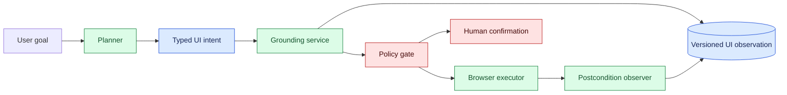
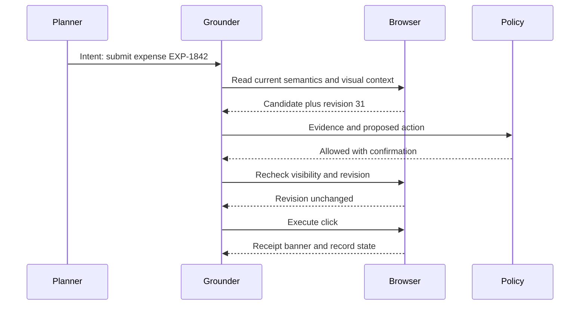

# UI state grounding

Status: emerging

Sources: [Google DeepMind news archive](https://deepmind.google/blog/) (issue discovery context); [W3C WebDriver specification](https://www.w3.org/TR/webdriver2/) (browser-automation context); [WAI-ARIA Authoring Practices Guide](https://www.w3.org/WAI/ARIA/apg/) (semantic UI context)

## In one sentence

UI state grounding is the discipline of connecting an agent’s intended action to verified, current interface state before it clicks, types, submits, or claims a task is done.

## Background: what existed before

Traditional browser automation usually relied on stable selectors: an engineer wrote a locator, a script found an element, and a test asserted the result. The script did not need to infer which button might be relevant; its author encoded that decision. Computer-use agents change the input. A model may receive a screenshot, accessibility tree, DOM snapshot, task instruction, or mixture of these and must infer an action. That creates a grounding problem: language such as “click Save” must resolve to one specific, actionable interface element in the current state.

Screenshots are useful but incomplete. They can hide off-screen content, fail under scaling, and make duplicate labels ambiguous. DOM-only automation is also incomplete: hidden nodes, stale references, dynamic overlays, and custom controls can make an element technically present but not safely actionable. Accessibility semantics provide another view, exposing roles, names, values, and focus, but these can be incorrect or missing. Robust systems combine signals and check the result immediately before an effect.

The baseline failure is a plausible but unverified action. An agent sees a “Delete” button near the place it expected “Save,” uses an old screenshot after navigation, or types confidential data into a search field rather than a support form. The problem is not solved by asking the model to be careful. The application needs a state model, action preconditions, and an evidence trail.

## What changed and why now

As tool-using systems increasingly operate web applications and desktop interfaces, reliability depends on more than language understanding. A browser can change between planning and execution because of a network response, an A/B test, a modal, a session timeout, or another user’s update. Grounding turns a one-time perception result into a guarded interaction protocol.

The release-specific fact here is limited to the issue’s public source context around increasingly capable computer use. The techniques in this lesson—semantic element identity, action preconditions, confirmation, and recovery—are engineering inferences, not a claim about a particular vendor implementation. They are useful with vision-based agents, DOM-based automation, and ordinary scripted tests.

## What changed this month

The practical design change is to treat a proposed click as a request requiring revalidation, rather than an instruction that the execution layer obeys blindly. The planner proposes an intent: for example, “open the invoice with number 1842.” A grounding service resolves that intent to a candidate element and reports its evidence: role, accessible name, bounding box, page revision, and nearby context. Policy then decides whether that action is permitted for this run and whether confirmation is required.

This separation also makes product metrics clearer. A system can measure element-resolution ambiguity, stale-state rejection, blocked risky actions, successful postcondition checks, and recovery rate. Those metrics describe operational reliability better than a subjective impression that an agent “usually clicks the right thing.”

## Impact on current processing and architecture

Represent the UI as a versioned observation rather than a static picture. A useful observation contains the document URL or application route, timestamp, viewport, focus target, accessibility-tree revision, selected elements, screenshot artifact reference, and a small set of normalized interactive candidates. Each candidate has a stable internal ID for the observation, semantic role, accessible name, visible/enabled state, bounds, and allowed action types. It is not safe to reuse that ID after a material page change.

The action pipeline has distinct responsibilities. The planner turns a user goal into a typed intent. The grounding service finds candidates using semantic attributes, DOM relationships, and visual evidence. The policy gate checks domain, tenant, data classification, and action risk. The executor refetches critical element state immediately before acting. Finally, an observer verifies a postcondition: a new route, a confirmation banner, a changed record value, or a downloaded artifact. The system records both the intent and evidence so a reviewer can understand what occurred.



Use explicit preconditions. A click on a purchase button might require that the document revision still matches, the element is visible and enabled, the account identity is confirmed, the basket summary is unchanged, and the run has an approved spend limit. The executor should reject an action if a precondition is false and return a structured reason. It is better to ask for a new observation than to apply an action to a changed page.

Data handling deserves equal attention. Browser pages can contain secrets, customer records, and untrusted content that attempts to influence an agent. Separate page content from execution policy. Treat page text as data, not authority; an instruction embedded in a page cannot broaden the tool scope. Redact screenshots and logs where possible, and pass only needed element summaries to a model.

## Real-world applications and constraints

In a support workflow, an agent can locate an account, prepare a refund, and present the exact amount and reason to an authorized employee. The final submission is high impact, so it should require a current account identity, policy validation, and confirmation. A successful click is insufficient evidence; the system needs a receipt or updated transaction state.

In a coding workflow, an agent might use a browser to inspect a CI failure, compare a commit SHA, and draft a comment. It should ground the target pull request by repository and revision, not only by a visually similar title. If the page navigates after an authentication refresh, it must discard stale element references and observe again.

In enterprise back-office tools, forms can have duplicate “Save” controls for separate panels. Accessibility names, form ownership, and local labels help distinguish them. When evidence remains ambiguous, the agent should request clarification or hand off instead of using pixel position as a tiebreaker. A slightly slower correct workflow is better than a fast misfiled record.

Constraints include dynamic rendering, virtualized lists, nested frames, pop-ups, localization, responsive layout, accessibility defects, and latency. Do not write policies that depend exclusively on English button text or a fixed coordinate. Prefer semantic identity, scoped context, and observed postconditions. Maintain a fallback for inaccessible custom controls, but label the lower confidence and increase confirmation requirements.

## Mental model

Grounding is like matching a spoken instruction to an instrument in a cockpit. “Press the blue button” is not adequate when several blue buttons exist and the panel may have changed. The operator identifies the control by function, context, state, and the effect expected after using it. A UI agent should do the same.

Distinguish **target identity** from **screen position**. Position says where something was in one rendering. Identity says which resource or control it represents, such as a button with role `button`, name `Submit expense`, owned by expense form `EXP-1842`, enabled in page revision 31. Identity survives many visual changes and makes audit records understandable.



## Engineering consequence

Create a typed action schema with `intent`, `target_context`, `observation_id`, `risk`, `preconditions`, and `expected_postcondition`. Keep the executor narrow: it should accept only validated candidate IDs from the current observation, not arbitrary JavaScript, selectors, or coordinates from a model. Allowlisted domains and per-action permission scopes make the blast radius visible.

Implement a freshness budget. Low-risk read actions can tolerate a short observation age; state-changing actions should require a near-immediate recheck. Invalidate observations on navigation, significant DOM mutation, modal appearance, account changes, timeout, or focus loss. Log the invalidation cause so product teams can distinguish normal dynamic behavior from an unstable integration.

Build evaluation cases that intentionally contain duplicate labels, delayed rendering, session expiry, changed values, hidden controls, and adversarial page text. Score the system on safe refusal and recovery as well as successful completion. A benchmark that rewards only completed actions can encourage unsafe guessing.

Grounding should account for ownership and transaction boundaries. A page can display one account while the active session belongs to another tenant, or a tab can contain a draft another process has already submitted. Include tenant, session, route, and record identifiers in target context, and compare them with task authorization. For multi-step forms, checkpoint after material transitions so a restart does not repeat a submission merely because the final screen was not observed.

Roll out in shadow mode first. Let grounding resolve targets and produce evidence while a human or existing script performs the action. Compare proposed and actual targets, collect stale-state and ambiguity reasons, and repair application semantics before enabling autonomous effects. Enable low-risk reads first, then reversible writes; keep high-impact actions behind confirmation until duplicate-effect and postcondition metrics are stable.

Measure more than click accuracy. Track safe refusals, stale-observation catches, wrong-form attempts, confirmation overrides, canonical rereads, recovery time after navigation, and sensitive-data exposure in artifacts. Slice results by browser, locale, viewport, application version, and accessibility quality so a strong aggregate cannot hide a dangerous layout-specific failure.

Incident review should distinguish observation errors from execution errors. If the grounder chose the wrong candidate from a correct snapshot, improve identity features or application semantics. If the executor acted after a revision changed, improve freshness enforcement. If the postcondition was weak, improve the receipt path. Assigning failures to the correct layer prevents teams from answering every problem with a larger model.

In distributed deployments, carry an observation ID and action nonce across service boundaries. The browser worker should reject a nonce it already consumed and return the current observation when it rejects a stale one. Retries then become useful: the planner can reconsider from new evidence instead of replaying an obsolete command. Keep identifiers in traces and operator views while filtering page content unnecessary for diagnosis.

## Limits and failure modes

Semantic metadata can be wrong or absent. Visual detection can be fooled by layout changes. DOM references can become stale between checking and clicking. No single representation eliminates error, so high-impact actions need layered evidence and explicit human authority. A model’s confidence statement is not an independent safety check.

Postcondition verification can also be misleading. A toast message may disappear, an API response can be delayed, or a page can optimistically render a change that later fails. Prefer durable receipts and re-read canonical record state for consequential workflows. If the effect is uncertain, record it as uncertain and reconcile rather than blindly retrying.

## Build it locally

This example grounds an intent against a versioned, simplified accessibility snapshot. It demonstrates rejection when the page changed or the control is ambiguous.

```python
from dataclasses import dataclass

@dataclass(frozen=True)
class Element:
    role: str
    name: str
    form: str
    enabled: bool

def ground(snapshot_version: int, expected_version: int, elements: list[Element]) -> str:
    if snapshot_version != expected_version:
        return "reject: stale observation"
    matches = [e for e in elements if e.role == "button" and e.name == "Save" and e.form == "profile" and e.enabled]
    return "click profile Save" if len(matches) == 1 else "reject: ambiguous or unavailable target"

page = [Element("button", "Save", "profile", True), Element("button", "Save", "billing", True)]
print(ground(31, 31, page))
print(ground(32, 31, page))
```

1. Save the example as `grounding.py` and run `python3 grounding.py`.
2. Disable the profile button and confirm that grounding refuses the action.
3. Add an expected postcondition field, such as a changed profile version.
4. Add a risk classifier that requires confirmation for `submit`, `delete`, and `purchase` intents.
5. Write a test with two enabled profile Save buttons and confirm safe refusal.

## Grounding under interface change

State grounding must survive more than pixel movement. Responsive layouts can change coordinates when a window is resized; localization changes label length; permissions can hide controls; and asynchronous loading can replace a placeholder with a real row. A robust representation therefore stores semantic anchors—role, accessible name, container, relation to nearby content, and expected action—alongside a screenshot crop. The crop helps a reviewer understand the decision, while the semantic anchor gives the executor a way to re-locate the element.

Use a two-phase interaction for consequential actions. First, resolve the intended target and present a preview containing the target identity, current value, and proposed operation. Second, re-query the interface immediately before clicking or submitting. If the target’s role, text, container, or version has changed, invalidate the plan and ask the planner to ground again. This small delay trades a few milliseconds for protection against stale coordinates and unexpected navigation.

Evaluation should include adversarial but ordinary UI changes: a duplicate button, a reordered table, a disabled control, a modal overlay, a changed currency format, and a stale browser tab. Measure target-selection accuracy separately from action success. A click can land on a real element and still be wrong; the test must compare the semantic target and resulting state. Log the grounding evidence and rejection reason without retaining unnecessary user content.

## Mini exercise (15–30 min)

Pick a form your team automates. List the identity fields needed to distinguish its submit control from similar controls. Then define the exact preconditions and postcondition for a safe submission. Include what the system does after navigation, timeout, or an ambiguous target.

## Interview Q&A

**Why not use coordinates from a screenshot?** Coordinates are tied to one rendering and are fragile under layout changes. Semantic identity and current context are more auditable and robust.

**What is a stale element?** An element reference or observation that no longer reflects the current page after navigation or mutation.

**How do you handle ambiguous targets?** Refuse the action, request a more specific intent or current observation, and escalate if the risk warrants it.

**What makes a UI action reliable?** Current target evidence, scoped authority, rechecked preconditions, and a verified postcondition—not just a click event.

## Glossary

**Accessibility tree:** Semantic representation of interface elements exposed to assistive technology.

**Grounding:** Resolving an abstract instruction to a verified actionable target in current state.

**Observation:** Versioned capture of relevant UI state and evidence.

**Postcondition:** Observable state expected after an action succeeds.

**Precondition:** State that must hold before an action is allowed.

**Stale state:** Information invalidated by a later interface or data change.

## References

- [Google DeepMind news archive](https://deepmind.google/blog/) — issue discovery context.
- [W3C WebDriver specification](https://www.w3.org/TR/webdriver2/) — browser automation source context.
- [WAI-ARIA Authoring Practices Guide](https://www.w3.org/WAI/ARIA/apg/) — semantic UI source context.

## Claim ledger

| Claim | Source | Fact or inference |
| --- | --- | --- |
| WebDriver provides a standard browser-automation protocol. | W3C WebDriver | Source-context fact |
| Accessibility semantics provide useful target identity signals. | WAI-ARIA guidance | Source-context fact |
| State-changing UI actions should recheck current preconditions. | Lesson synthesis | Engineering inference |
| Completion needs postcondition evidence, not only a click. | Lesson synthesis | Engineering inference |
