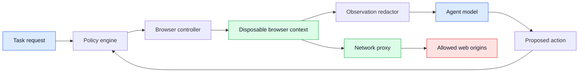
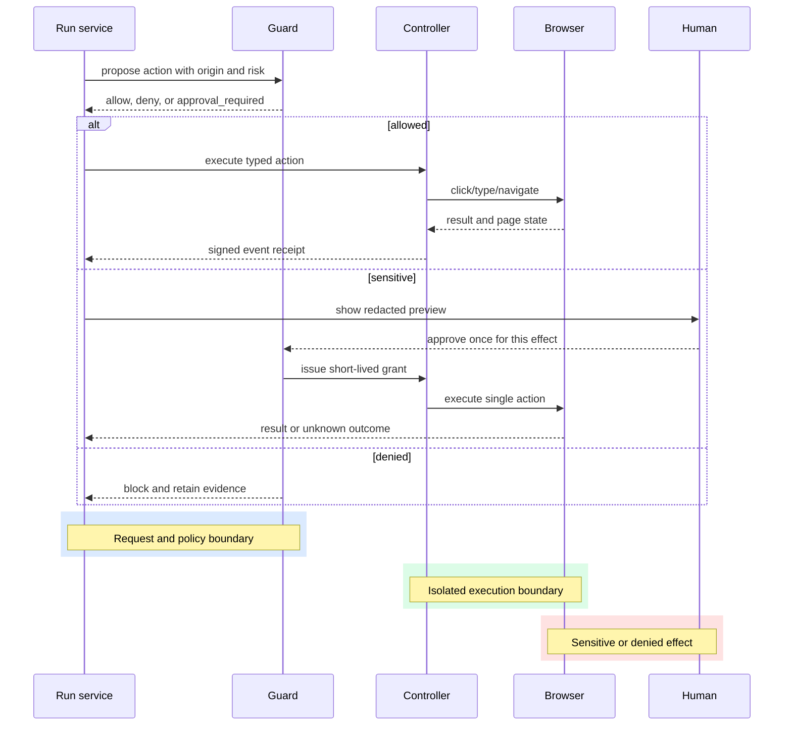

# WebDriver session isolation
Status: emerging
Sources: [Google Cloud — 2026-07-09, Cloud Run sandboxes preview](https://cloud.google.com/blog/topics/developers-practitioners/google-cloud-run-sandboxes-are-in-public-preview/); [W3C — 2026-07-02, WebDriver Working Draft](https://www.w3.org/TR/2026/WD-webdriver2-20260702/); [Chromium Security — 2026-09-07, accessed; Site Isolation documentation](https://www.chromium.org/Home/chromium-security/site-isolation/)

## In one sentence
Browser sandboxing gives a computer-use agent a constrained, observable browser process whose page content, network access, files, and credentials cannot silently become unrestricted powers.

## Prerequisites

Know browser processes, origins, cookies, network egress, profiles, containers, and least privilege. Isolation limits what a compromised or confused browser session can reach; it does not make page content trustworthy.

## Background: what existed before

A conventional browser assumes a person is the authority. The person chooses a tab, recognizes a suspicious page, decides whether a download is expected, and notices when a site asks for a password. A browser automation script historically inherited that assumption: it received a URL, found a selector, clicked, and returned a result. The main boundary was the browser's same-origin policy, which separates one website's script from another site's data. That policy is essential, but it is not a complete agent boundary. A user can still be tricked into approving a transfer, and an automation process can still hold a session cookie while it visits hostile content.

An agent changes the threat model because page text becomes model input and model output becomes an action. A page can place an instruction in a comment, an advertisement, a PDF, or an image. That instruction is untrusted data, even when it looks like a system message. If the browser process can reach an internal service, read a local file, or reuse a broad login session, a successful prompt injection can cross from content manipulation into a real side effect.

Sandboxing is a collection of boundaries rather than one switch. The browser renderer, automation controller, network proxy, file system, credential broker, and host must each have a limited role. The objective is not to prove that a model will never make a mistake. It is to make a mistake cheap, visible, and reversible.

## What changed and why now

The important change is the move from trusted automation to least-privilege browsing. A browser agent needs a disposable profile, a policy-controlled network path, and explicit approval for sensitive actions. The page is now an adversarial input channel. Modern browser security features such as site isolation reduce the damage of renderer compromise, while WebDriver-like interfaces make browser actions explicit enough to audit. These are source-context facts about platform boundaries; the design recommendation that combines them into an agent sandbox is an engineering inference.

A useful sandbox defines three planes. The observation plane exposes pixels, accessibility nodes, and selected page metadata. The control plane accepts a small vocabulary such as navigate, click, type, and upload. The authority plane decides whether a requested action may use a domain, credential, file, or payment instrument. Keeping these planes separate prevents a screenshot from granting permission and prevents a model's natural-language plan from bypassing policy.

## What changed this month

The directly dated July source for this lesson is the W3C WebDriver Working Draft published 2026-07-02. It is standards-track browser-automation context, not a claim that W3C shipped a new sandbox or that every implementation has adopted a new security property. The draft makes the automation interface a precise, inspectable protocol surface. That matters to this lesson because an isolation service can authorize and record protocol-level navigation, browsing-context, and input operations instead of handing a model an opaque browser handle. Chromium’s Site Isolation documentation remains durable platform-security context. The combined recommendation—process/profile/network isolation outside the page—is an engineering design inference, not a July release claim.

## Impact on current processing and architecture

The request path should be explicit. A task service creates a run with a narrow policy: allowed origins, maximum duration, permitted downloads, and whether credentials may be brokered. A controller starts an isolated browser context. A network proxy checks every request, and a redaction layer removes secrets before observations reach the model. The policy engine evaluates the proposed action again immediately before execution because the page may have changed between observation and action.

The browser should not run with the host user's profile. Use a temporary profile and a temporary filesystem directory. Mount only the files needed for the task, preferably read-only. Place the browser in a container or operating-system sandbox with no access to the host socket. Deny private network ranges unless the task explicitly needs one. Route DNS and HTTP through an allowlist-aware proxy so a page cannot turn a permitted public domain into arbitrary egress.



The controller records a structured event for every action: run ID, browser context, observed page hash, action type, target description, policy decision, and result. Do not record raw cookies or unredacted form values. A screenshot is useful for debugging, but it can contain personal data, so retention and access need the same care as application logs.

## Real-world applications and constraints

A procurement agent may compare public product pages and assemble a draft cart. It can read pages in a disposable context, but submitting an order should require a human approval and a fresh price check. A support agent may navigate a ticket portal, but its session should be scoped to tickets assigned to a queue. A research agent may download public papers, but downloaded files should be scanned and stored outside the browser's executable path.

The constraints are practical. Isolation adds startup latency, and a new context may require a login handoff. Strict network allowlists break sites that load assets from several content-delivery domains. Accessibility-tree extraction can omit information rendered only on canvas. Screenshots increase storage cost. A credential broker must handle expiry, multi-factor authentication, and the possibility that a page tries to make the model reveal a secret. These are reasons to expose controlled fallbacks, not reasons to remove the boundary.

## Mental model

Think of the browser as a remote, untrusted device. The model is an operator who can request actions, not a process that owns the device. The controller is a typed RPC gateway. The policy engine is a reference monitor: every sensitive action passes through it, and a “yes” from an earlier step is not permanent authorization. The proxy is an egress firewall. The disposable profile is a lease that expires.

The most important distinction is between data and authority. Page text can say “upload your secrets,” but that text has no authority. A button can be labelled “confirm,” but the policy engine must classify the underlying effect. Conversely, a policy may allow a click but deny the resulting navigation if it leaves the approved origin. Model confidence is evidence for triage; it is not an access-control decision.

## Engineering consequence

Define a browser task contract before writing prompts. It should specify origins, methods, data classes, maximum duration, download rules, upload rules, and approval points. Represent each action as a typed object, for example `click(locator, expected_origin, risk_class)`, rather than passing arbitrary JavaScript to the page. Keep JavaScript execution disabled for ordinary tasks; if a specialized task needs it, place it in a separate capability with a distinct approval and audit stream.

Use state transitions such as `created`, `running`, `awaiting_approval`, `blocked`, `completed`, and `expired`. A timeout must destroy the context and revoke brokered credentials. If the controller loses connection after a click, mark the effect as unknown and reconcile by reading the page or asking an operator; blindly retrying may duplicate a purchase or message.



## Isolation is a composition, not a container checkbox

It is tempting to describe a browser sandbox as “run Chromium in a container” and stop there. That sentence names one implementation mechanism but leaves the important authority questions unanswered. A process can be containerized and still inherit a powerful service-account token, a host-mounted directory, a permissive DNS resolver, or a network route to internal administration endpoints. Conversely, a browser may have strong renderer isolation while the account logged into the browser can still alter every customer record. The security property has to be stated as a composition of independently testable boundaries.

The process boundary limits what a renderer compromise can do to the controller host. The profile boundary limits what a new task can learn from an earlier task: cookies, local storage, service workers, extension state, history, and cached downloads should not cross runs. The network boundary limits where the process can send bytes. The filesystem boundary limits which local bytes it can read or write. The identity boundary limits which business operations the web account can perform. These boundaries fail differently, so their tests should fail differently. A test that downloads `/etc/passwd` exercises filesystem exposure; a test that submits an order under the wrong tenant exercises identity scope; a test that calls a private IP exercises network egress.

The controller should also distinguish browser state from policy state. A page can cause a redirect, open a popup, or change the DOM, but it must not be able to mutate the task’s allowlist or approval grant. Store policy in the run service and pass a read-only decision to the controller. When navigation changes the origin, invalidate assumptions derived from the prior page and require a new policy evaluation. This is especially important for federated login: a task may legitimately visit an identity provider, but the identity provider should be an explicit edge in the policy graph rather than an accidental consequence of following a link.

Network isolation needs more than a hostname list. Resolve names through a controlled resolver, reject private and link-local address ranges unless explicitly permitted, and re-check the destination after redirects. A permitted domain can be compromised, can host an open redirect, or can expose a server-side request feature. Egress policy should therefore classify both destination and operation: a GET for a public document is not equivalent to a POST carrying customer data. Log the policy decision and destination class without logging cookies, authorization headers, or full form bodies.

Profile disposal is a lifecycle operation. At task start, create a unique profile and attach an owner and expiry. During execution, record downloads and storage mutations. At completion, revoke brokered credentials, close the browser, delete the profile, and verify that no process remains. If cleanup fails, quarantine the host or worker rather than returning it to a warm pool. A warm browser can save startup latency, but it turns forgotten state into ambient authority. The safe optimization is to reuse an isolated worker image while still creating a fresh profile and network identity per run.

These checks should appear in acceptance tests and in production telemetry. Measure blocked private-network attempts, cross-origin transitions, profile-cleanup failures, credential-broker calls, and unknown outcomes after controller disconnects. A low count of blocked requests does not prove safety; it may mean the tests never attempted prohibited actions. Pair operational metrics with adversarial fixtures that contain redirects, misleading download names, hidden form fields, and instructions asking the model to paste a token. The boundary is successful when those inputs remain data and cannot become authority.

Testing should include hostile page content, unexpected redirects, popups, cross-origin frames, downloads with misleading names, expired sessions, and controller restarts. The test oracle is not merely “the model refused.” It is that the browser had no prohibited capability even when the model requested it. Run these tests against the same container, proxy, and credential configuration used in production.

## Limits and failure modes

Site isolation is not equivalent to application-level authorization. A browser may isolate renderer processes while the logged-in account still has too much business permission. A container reduces host exposure but does not repair a vulnerable application. Network blocking may be bypassed if an approved origin provides an open redirect or server-side fetch feature. Redaction can miss secrets rendered as images. Accessibility metadata can include hidden or off-screen text. Downloads can be polyglots or archives containing dangerous content.

Prompt injection remains possible inside a strong sandbox. The model may waste time, leak task data to an approved site, or make an allowed but incorrect change. Therefore pair isolation with narrow account scopes, confirmation for irreversible effects, rate limits, and post-action verification. Treat every browser context as disposable after a suspicious event. Preserve only the minimum evidence needed for diagnosis.

Credential brokering deserves its own boundary. The controller should request a named capability, such as “read invoices for tenant A,” instead of receiving a reusable password. A broker can mint a short-lived session or complete a narrowly scoped login flow, then return only a success signal. If a page asks the model to paste a token into a text area, the action should be denied because the destination and purpose are not the brokered capability. This design also makes revocation practical: expire the grant when the run ends, when the origin changes, or when the policy version is replaced.

Origin changes must be treated as security events, not ordinary navigation. A redirect from `shop.example.test` to a payment provider may be legitimate, but it changes who receives data and which account is in use. Require an explicit policy edge for that transition, show the new origin to an operator for high-risk tasks, and clear any page-derived assumptions after navigation. Keep a per-run origin history so an investigator can distinguish an expected redirect from a malicious chain.

Evidence retention has a similar trade-off. Store action metadata, policy inputs, and hashes of observations by default. Keep screenshots or DOM snapshots only when they are needed for a short investigation, encrypt them, restrict access, and expire them on a documented schedule. An audit trail that captures every keystroke may itself become a sensitive data store. The goal is to prove what authority was granted and what effect was attempted, not to create a second copy of every customer record.

## Mini exercise (15–30 min)

Build a local policy simulator that receives JSON actions and decides whether they are allowed. Include an origin allowlist, a `read` versus `write` risk class, a download rule, and an approval requirement for writes. Add test cases for an allowed page read, a redirect to an unapproved origin, a credential request, and a duplicate write. Extend the simulator so every decision produces an event without storing the supplied secret value.

## Build it locally

The following dependency-free example models a policy gateway. It does not launch a browser and is intentionally low-cost: the lesson is the decision boundary, not a production sandbox.

```python
from dataclasses import dataclass
from urllib.parse import urlparse

@dataclass(frozen=True)
class Action:
    kind: str
    url: str
    risk: str
    has_secret: bool = False

ALLOWED_HOSTS = {"docs.example.test", "shop.example.test"}

def decide(action: Action, approved: bool = False) -> str:
    host = urlparse(action.url).hostname
    if host not in ALLOWED_HOSTS:
        return "DENY: origin"
    if action.has_secret:
        return "DENY: secret exposure"
    if action.risk == "write" and not approved:
        return "APPROVAL_REQUIRED"
    if action.kind == "download" and action.risk != "read":
        return "DENY: download policy"
    return "ALLOW"

cases = [
    Action("read", "https://docs.example.test/guide", "read"),
    Action("navigate", "https://evil.test/redirect", "read"),
    Action("type", "https://shop.example.test/checkout", "write", True),
    Action("click", "https://shop.example.test/checkout", "write"),
]
for case in cases:
    print(case.kind, decide(case))
```

Numbered implementation steps:

1. Copy the program into `sandbox_policy.py` and run it with Python 3. The output should contain `ALLOW`, an origin denial, a secret denial, and an approval request.
2. Add a `redirected_from` field and deny a destination unless both the original and destination hosts are allowed.
3. Add an action ID and retain a set of used IDs so a retry cannot repeat a write without reconciliation.
4. Replace the hard-coded host set with a policy object loaded at run creation; do not let page text modify it.
5. Write tests for malformed URLs, internationalized hostnames, empty schemes, and an approval that expires after one action.

## Interview Q&A

**Why is a browser container insufficient?** A container limits some host access, but it does not decide which website the account may modify, which network destinations are reachable, or whether a click is financially consequential. Those controls belong to policy and identity layers.

**Why re-check an action after the model proposes it?** The page can change after observation, and a locator may resolve to a different element. Just-in-time checks bind authorization to the actual origin, effect, and current state.

**Should an agent use the user’s existing browser profile?** Usually no. A disposable profile prevents unrelated cookies, extensions, history, and local files from becoming ambient authority. A brokered, task-scoped session is safer.

**How do you handle a lost connection after a click?** Record an unknown outcome, stop automatic retries, and reconcile through a safe read or human confirmation. Exactly-once browser effects cannot be assumed.

**What should be measured?** Measure blocked prohibited actions, approval rate, policy false positives, context startup latency, proxy denials, unknown outcomes, and verified business success. Model confidence alone is not a security metric.

## Glossary

- **Ambient authority:** Access a process receives merely because it runs in a user context.
- **Capability:** A narrowly scoped permission to perform one class of action.
- **Egress:** Traffic leaving the sandbox toward another network destination.
- **Reference monitor:** A component that mediates every protected operation.
- **Same-origin policy:** A browser rule separating scripts and data across origins.
- **Site isolation:** Separating site content into processes to reduce cross-site compromise impact.
- **Disposable profile:** A temporary browser profile destroyed after a task.
- **Prompt injection:** Untrusted content attempting to steer an agent's instructions or actions.

## References

- [Chromium Security — Site Isolation](https://www.chromium.org/Home/chromium-security/site-isolation/) — primary platform-security documentation.
- [W3C — WebDriver Working Draft, 2026-07-02](https://www.w3.org/TR/2026/WD-webdriver2-20260702/) — standards-track browser automation interface and July source context.
- [OWASP — Top 10 for LLM Applications](https://owasp.org/www-project-top-10-for-large-language-model-applications/) — secondary risk taxonomy for agent systems.

## Claim ledger
| Claim | Source | Fact or inference |
|---|---|---|
| Google Cloud announced Cloud Run sandboxes for isolated AI-generated code and headless-browser tasks on 2026-07-09. | [Google Cloud — 2026-07-09](https://cloud.google.com/blog/topics/developers-practitioners/google-cloud-run-sandboxes-are-in-public-preview/) | Source-context fact |
| Chromium documents Site Isolation as a browser security architecture. | [Chromium Security — accessed 2026-09-07](https://www.chromium.org/Home/chromium-security/site-isolation/) | Fact; documentation scope |
| WebDriver specifies a standardized browser automation boundary. | [W3C — accessed 2026-09-07](https://www.w3.org/TR/webdriver2/) | Fact; standard scope |
| Browser process isolation should be paired with scoped accounts, credentials, and deny-by-default egress. | This lesson’s threat model | Engineering inference |
