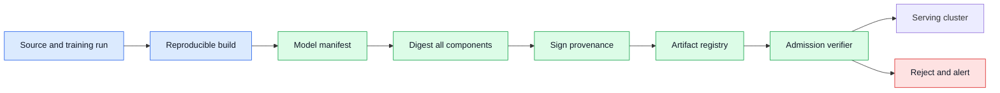
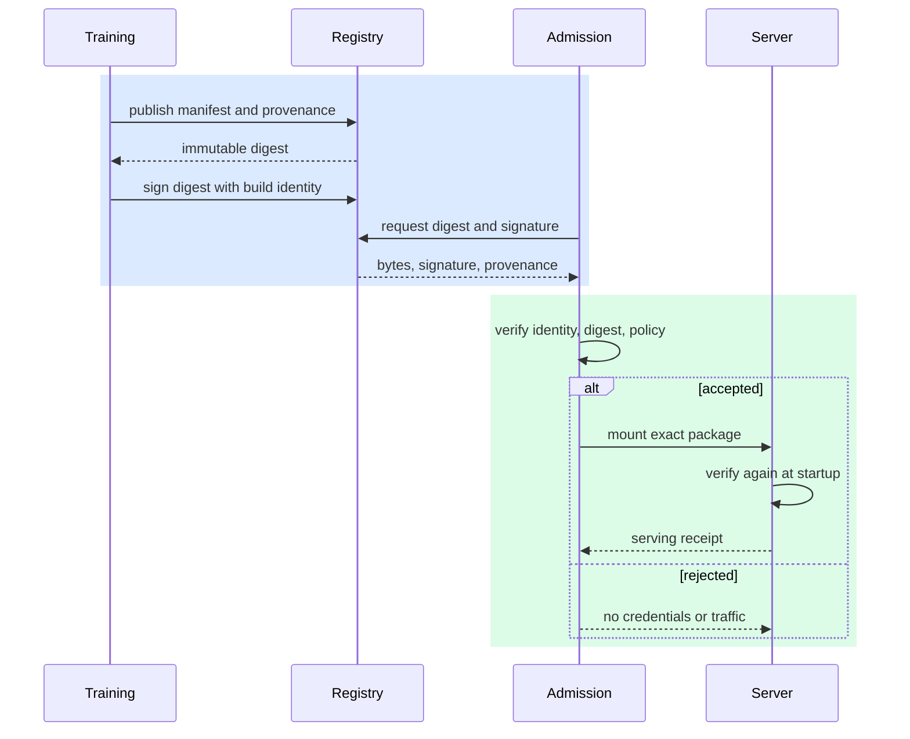

# Model artifact signing
Status: emerging
Sources: [OpenSSF — 2026-07-14, Model Signing podcast](https://openssf.org/tag/model-signing/); [SLSA — 2026-09-07, accessed; current v1.2 specification](https://slsa.dev/spec/v1.2/); [Sigstore — 2026-09-07, accessed; official Cosign documentation](https://docs.sigstore.dev/cosign/)

## In one sentence
Model artifact signing binds a particular model file, tokenizer, configuration, and build record to an issuer so deployment systems can reject tampered or unexplained artifacts.

## Prerequisites

Know SHA-256 digests, public-key signatures, identity trust, manifests, provenance, key rotation, revocation, and admission control. A digest identifies bytes; a signature binds those bytes to an issuer under a verifier’s trust policy.

## Background: what existed before

Teams once treated a model as a large file copied from a shared directory. A training job produced weights, an engineer uploaded them to object storage, and a serving process downloaded the newest path. Checksums could detect accidental corruption during transfer, but a checksum alone does not answer who produced the file, what source data or code was used, or whether an attacker replaced both the file and its checksum. A filename such as `production-latest` is a pointer, not provenance.

Machine-learning systems have more artifacts than weights. A deployable package may include tokenizer vocabulary, architecture configuration, adapters, safety classifiers, preprocessing code, prompt templates, CUDA kernels, and evaluation reports. A mismatch can produce silent quality or safety changes even when the main weight file is authentic. The package boundary must therefore be explicit.

## What changed and why now

The important change is to treat model delivery as a software supply chain. SLSA describes provenance and verifiable build relationships; Sigstore documents signing and verification workflows. These sources provide supply-chain context. Applying those controls to a model registry is an engineering inference: the registry should store immutable digests, signatures, signer identity, build provenance, and policy decisions together.

Signing does not certify that a model is good. It answers a narrower question: did the artifact observed by the verifier come from an expected identity and remain unchanged since signing? Quality, licensing, bias, privacy, and capability require separate evaluations. A signed malicious model is still malicious; an unsigned safe model is still unverifiable.

## Impact on current processing and architecture

Package the complete serving unit into a manifest. The manifest lists each component by cryptographic digest, expected interface, license metadata, evaluation references, and compatibility constraints. A build service produces the package, generates provenance, signs a statement over the manifest, and publishes it to a registry. Admission control verifies the signature and policy before a workload receives credentials or traffic.



Verification belongs close to use. A registry check can be bypassed if a worker downloads a direct URL, so the serving image should verify again during startup. A node agent can verify the image and model before mounting them. The deployment controller can verify policy, such as an approved signer, minimum evaluation version, and allowed license. Each layer should emit a concise reason for acceptance or rejection.

## Real-world applications and constraints

A company may sign a fine-tuned support model before promoting it from staging. A robotics team may sign a perception model and calibrations as one release. A research group may sign published checkpoints so collaborators can distinguish the original from a modified copy. In regulated settings, provenance can help answer which model version handled a request, but it does not replace retention and access controls.

Signing introduces key-management constraints. Keys need rotation, revocation, backup, and separation of duties. A long-lived private key in a build container is a high-value target. Short-lived identity credentials and a transparency log can reduce reliance on manually distributed public keys. Offline or disconnected environments may need a locally mirrored trust root and a documented update process.

## Mental model

Think of a signature as a tamper-evident seal plus an issuer label. The digest says “these exact bytes.” The signature says “the holder of this identity authorized that digest.” Provenance says “this build relationship and inputs were recorded.” Policy says “this identity and provenance are acceptable here.” All four are different.

## What changed this month

OpenSSF’s July 14 Model Signing material gives this lesson a direct issue-month anchor: the OpenSSF AI/ML Working Group was formalizing OpenSSF Model Signing as a flexible, implementation-agnostic approach for model artifacts. The source establishes the motivation and ecosystem direction, not a guarantee that every registry or serving runtime already verifies OMS statements. SLSA and Sigstore remain the durable standards context used to explain provenance, identity, and verification. The engineering consequence is to model a release as an immutable, verifiable bundle rather than a mutable model name, then test admission against the identity and policy actually trusted in each environment.

“Implementation-agnostic” has a practical consequence: the signed statement must be portable enough for different registries and deployment tools, while the local policy remains explicit. Do not make a verifier infer trust from the storage URL or from a model filename. Normalize the statement into a canonical representation, bind the artifact digest and component manifest to that representation, and record the authenticated issuer separately from descriptive metadata. A consumer may use a registry-native signature, Cosign, or another conforming mechanism, but it still needs to answer the same admission questions: what was signed, who signed it, which environment trusts that identity, and which policy version made the decision.

The manifest is the handoff contract between build and serving. A builder should publish the exact bytes or content digests for weights, tokenizer, adapter, configuration, preprocessing, and runtime dependencies that affect execution. An evaluator attaches results to that manifest rather than to a mutable tag. The promotion service then creates an immutable release record containing the manifest digest, provenance reference, evaluation status, signer identity, allowed environments, and expiry or revocation state. The server consumes that record and emits a startup receipt with the same identifiers. This makes a later incident queryable without requiring the operator to reconstruct which files a container happened to mount.

Verification should return typed failures. `digest_mismatch` means the observed bytes differ; `unknown_issuer` means the signature may be intact but its identity is outside the trust policy; `unauthorized_environment` means the signer is trusted elsewhere; `expired` or `revoked` means a previously accepted release is no longer eligible; and `manifest_incomplete` means the signed boundary does not describe the effective package. These distinctions matter for response. A transfer retry may fix corruption, while an issuer or revocation event requires security review. A generic “signature invalid” message encourages unsafe manual bypasses.

Identity and provenance also have different lifecycles. A build identity may remain trusted while one release is withdrawn because an evaluation exposed a problem. Conversely, a key or workload identity may be compromised while the artifact bytes remain unchanged. Store release status separately from signer status and preserve historical verification records with their policy version and verification time. A rollback should point to a prior signed manifest, not recreate it from source or re-sign it opportunistically during an outage. This preserves the evidence that the rollback package was reviewed before the incident.

The local HMAC demonstration is intentionally narrower than production signing: it can show that bytes change when the message changes, but a shared secret does not establish an independently verifiable issuer. A real deployment needs public verification material, protected signing authority, issuer constraints, expiry, and revocation handling. The July OpenSSF direction is therefore a useful adoption signal, while the engineering work is to make every verifier decision observable and to prove that the server executes the same signed boundary that the reviewer approved.

## Engineering consequence

Use immutable references in deployment specifications. Resolve a human label to a digest during promotion and record the digest in the release record. Never let a serving process resolve `latest` at request time. Include the tokenizer and safety policy in the signed manifest. Require two independent approvals for a production signer or make the build identity policy-controlled and auditable.

### What a verifier must actually establish

A production verifier answers several different questions, and a valid signature answers only one of them. First, do the bytes match the digest that was signed? Second, was the digest signed by an identity trusted for this environment? Third, is that identity authorized for this model family and release channel? Fourth, is the release still allowed by policy, or has it expired, been revoked, or failed a required evaluation? Keep these decisions separate in the admission result so an operator can distinguish tampering from an intact but unauthorized build.

The signed boundary must be explicit. If the manifest signs only the weight archive but the server loads a tokenizer, adapter, prompt template, custom kernel, or configuration from a mutable path, the effective model is not the signed object. Build a canonical manifest that lists every execution-relevant component, its digest, format, and expected role. Canonicalization matters because two serializers can represent the same fields in different byte orders; the builder and verifier must agree on the exact bytes before any signature operation occurs.

Identity should come from the build context, not from a free-form field inside the manifest. An attacker can write `issuer: trusted-production` into an unsigned JSON object. Bind the issuer to the signature or to a certificate/verification record, then apply a trust policy that maps the authenticated identity to permitted repositories, environments, and model families. The local teaching example can use a generated key pair or a well-defined Cosign flow; it should not imply that a shared HMAC secret proves who signed the artifact.

Admission is temporal. A key may be trusted when a release is built and revoked later. Store the verification time, trust-policy version, certificate or key identity, expiry, and revocation result with the deployment record. For disconnected devices, define whether the device may continue serving an already-verified artifact during a registry outage and for how long. Do not silently accept a stale trust bundle; surface the policy age and require an explicit emergency decision when it exceeds the permitted window.

These details make the audit trail useful. A reviewer can reconstruct the source revision, builder identity, manifest bytes, signature, evaluation references, policy decision, and deployment target. A server can expose that release record in health metadata without exposing private keys or protected weights. The security benefit is not the decorative presence of a signature; it is the ability to reject a changed or unauthorized effective bundle and explain the rejection afterward.



Verification failures should be fail-closed for production, with an emergency process that is separately authorized and time-limited. Cache verified content by digest, not by mutable name. Monitor for unexpected signer changes, repeated verification failures, and a package whose manifest changes without a new release record. Keep rollback artifacts signed too; rollback is a controlled transition, not a bypass.

## Limits and failure modes

A signature cannot detect a poisoned training dataset unless the poison is represented in provenance or evaluations. It cannot guarantee that an evaluation was honestly run. It cannot protect a model after a privileged operator extracts it. A valid signature can be copied with the artifact, so confidentiality needs encryption and access control. Signatures also do not solve dependency vulnerabilities in the serving runtime.

Promotion should be an explicit state machine. A build begins as `created`, receives automated checks, becomes `candidate`, is reviewed, and then becomes `approved` for a named environment. The state record stores the digest, signer, policy version, and evaluation references. A deployment controller consumes only `approved` records. This makes “why is this model live?” answerable without reconstructing a sequence of mutable registry operations.

Trust policy should be environment-specific. Development may accept a developer identity, while production accepts only a hardened build identity and requires a current evaluation. A model signed for staging should not automatically gain production trust. Include tenant and purpose constraints where a shared registry serves multiple teams. Verify the artifact’s declared framework and accelerator compatibility before scheduling it, since a package that can execute arbitrary custom code deserves stricter review than a data-only tensor file.

Key custody is part of the threat model. Prefer a signing service or hardware-backed key rather than exporting a private key into every build worker. Bind the signer to an authenticated build identity and record the source revision. Rotation should not make historical incident analysis impossible: retain public verification material and a timestamped trust policy, while revoking identities that are compromised. Recovery procedures should be tested before a key outage blocks every deployment.

Model registries also need lifecycle controls. Mark vulnerable or withdrawn artifacts as revoked, but do not silently delete the evidence needed to understand prior decisions. A running server can periodically re-check revocation policy, with a carefully designed grace period for disconnected environments. If a component must be replaced, produce a new manifest and signature. Editing a package in place destroys the link between the release record and the bytes that were reviewed.

Operational metrics should include verification failures by reason, unsigned download attempts, signer distribution, time from build to approval, and percentage of production traffic attached to an immutable digest. Track whether rollback artifacts still verify. Alert on a production deployment whose digest has no corresponding reviewed record. These measures reveal bypasses that a simple “signature valid” dashboard would miss.

There is an important separation between identity and authorization. A signature can identify the build pipeline, but deployment policy decides whether that pipeline may publish a particular model family or environment. Use repository and project boundaries so a compromised experiment cannot sign a production artifact with the same authority. Require a human or policy approval when the model’s data classification, capability profile, or serving destination changes, even if the bytes were produced by a familiar pipeline.

The verifier must be conservative about parsing. Archive extraction should prevent path traversal and duplicate names. Reject manifests with unknown required fields when compatibility is not guaranteed. Normalize encodings before hashing, and define whether metadata such as file mode, symlink targets, or compression headers is inside the signed boundary. A mismatch between what the builder signs and what the server executes is a supply-chain defect, not merely a tooling inconvenience.

For multi-region serving, replicate signed bytes and verification material, not mutable tags. Each region records the same digest and local admission decision. If an edge cache serves an artifact that is unavailable in the registry, it must still prove the digest and preserve the release record. Disconnected inference devices can use a pinned trust bundle, but operators need a controlled way to update that bundle and report stale or revoked artifacts.

Finally, educate on the limits. Developers should not infer that “signed” means “approved for every use.” Reviewers should inspect the provenance and evaluation references, and operators should know how to stop a signer, quarantine a digest, and identify running instances. The signature is one durable link in the chain from source to serving request; it is valuable precisely because the other links remain explicit.

Incident response should begin with the digest, not a filename. Locate every deployment, cache, and batch job using that digest; compare their manifests; and determine whether the signer, registry, or serving verifier was bypassed. Preserve the signature and provenance records before rotating keys. After containment, issue a new signed artifact rather than mutating the affected package, and add a regression test that exercises the original admission path.

This workflow gives engineers a concrete audit trail: source revision, build identity, component digests, policy decision, deployment, and request traffic. It also makes safe automation possible because the controller can reason over signed records rather than trusting a mutable human label.

When the evidence is incomplete, stop promotion and request review. An explicit pause is safer than silently substituting an unverified component or treating a missing provenance field as harmless metadata.

That pause should be visible to the owning team and should carry a reason code, so recovery is deliberate rather than an undocumented manual override.

This preserves accountability during incident response.

The manifest itself can be incomplete. If it omits a tokenizer, prompt template, or custom operation, an attacker may swap that component while leaving the weights authentic. If a verifier checks only the outer archive digest, it may miss a mutable path inside the package. If different environments interpret the same configuration differently, reproducibility claims are overstated. Test verification against malicious archives, path traversal, duplicate files, and missing components.

## Mini exercise (15–30 min)

Create a local manifest for a tiny model description, tokenizer label, and policy version. Hash each file, sign the manifest conceptually with a keyed message authentication code, and reject any changed component. Then add an issuer field and separate “trusted issuer” policy. The exercise demonstrates integrity and policy without requiring a cloud registry.

## Build it locally

```python
import hashlib
import hmac
import json

KEY = b"demo-only-key"

def digest(value):
    return hashlib.sha256(value.encode()).hexdigest()

def make_manifest(parts):
    return {name: digest(value) for name, value in parts.items()}

def seal(manifest):
    raw = json.dumps(manifest, sort_keys=True).encode()
    return hmac.new(KEY, raw, hashlib.sha256).hexdigest()

parts = {"weights": "model-v1", "tokenizer": "tokens-v2", "policy": "safe-v3"}
manifest = make_manifest(parts)
signature = seal(manifest)
print("verified", hmac.compare_digest(signature, seal(manifest)))
parts["tokenizer"] = "tokens-tampered"
changed = make_manifest(parts)
print("reject_changed", not hmac.compare_digest(signature, seal(changed)))
assert hmac.compare_digest(signature, seal(manifest))
assert not hmac.compare_digest(signature, seal(changed))


def admit_release(manifest, signature, issuer, now, revoked, max_age=3600):
    required = {"weights", "tokenizer", "policy", "issued_at"}
    if not required.issubset(manifest) or issuer != "build-bot":
        return "DENY: issuer or fields"
    if issuer in revoked or now - manifest["issued_at"] > max_age:
        return "DENY: revoked or expired"
    expected = seal({key: value for key, value in manifest.items() if key != "issued_at"})
    return "ALLOW" if hmac.compare_digest(signature, expected) else "DENY: signature"


policy_manifest = dict(manifest)
policy_manifest["issued_at"] = 100
policy_signature = seal({key: value for key, value in policy_manifest.items() if key != "issued_at"})
assert admit_release(policy_manifest, policy_signature, "build-bot", 200, set()) == "ALLOW"
assert admit_release(policy_manifest, policy_signature, "unknown", 200, set()).startswith("DENY")
assert admit_release(policy_manifest, policy_signature, "build-bot", 5000, set()).startswith("DENY")
assert admit_release(policy_manifest, policy_signature, "build-bot", 200, {"build-bot"}).startswith("DENY")
```

Numbered implementation steps:

1. Run the script with Python 3 and inspect the two boolean results.
2. Add an issuer and environment field to the manifest, then require an approved issuer before acceptance.
3. Include a model configuration and evaluation-report digest so the package is not only weights.
4. Replace the demo HMAC with a maintained signing library in a real system; do not treat this key as production security.
5. Add tests for missing fields, reordered JSON, changed bytes, unknown issuers, and an expired release.

## Interview Q&A

**What does a model signature prove?** It proves that a trusted identity authorized exact bytes, assuming the key and verification policy are sound. It does not prove quality or safety.

**Why sign a manifest instead of only weights?** Serving behavior depends on tokenizers, configuration, adapters, preprocessing, and policy components. The manifest binds those dependencies.

**Where should verification happen?** At admission and again at the serving boundary, because any intermediate cache or direct download can otherwise bypass registry checks.

**How is a digest different from provenance?** A digest identifies bytes; provenance records how and from which inputs a build was produced.

**What happens during key rotation?** Publish overlapping trust policy, verify old artifacts under the old identity, issue new signatures, and retain an auditable revocation and rollback path.

## Glossary

- **Artifact:** A deployable file or package.
- **Digest:** A cryptographic hash identifying exact bytes.
- **Manifest:** Structured list of package components and metadata.
- **Provenance:** Record of build inputs, process, and identity.
- **Signer:** Identity authorized to create a signature.
- **Admission control:** Gate deciding whether a workload may deploy.
- **Trust root:** Authority whose keys or identities a verifier accepts.
- **Rollback:** Controlled return to a previously approved release.

## References

- [OpenSSF Model Signing](https://openssf.org/tag/model-signing/) — July 2026 issue-month context.
- [SLSA v1.2 specification](https://slsa.dev/spec/v1.2/) — current supply-chain provenance specification.
- [Sigstore Cosign documentation](https://docs.sigstore.dev/cosign/) — official artifact-signing documentation.
- [NIST Secure Software Development Framework](https://csrc.nist.gov/Projects/ssdf) — primary secure-development guidance.

## Claim ledger
| Claim | Source | Fact or inference |
|---|---|---|
| OpenSSF published July material describing Model Signing as an AI/ML supply-chain solution. | [OpenSSF — 2026-07-14](https://openssf.org/tag/model-signing/) | Source-context fact |
| SLSA describes provenance and supply-chain assurance concepts. | [SLSA — accessed 2026-09-07](https://slsa.dev/spec/v1.0/) | Fact; specification scope |
| Sigstore documents signing and verification workflows. | [Sigstore — accessed 2026-09-07](https://docs.sigstore.dev/cosign/) | Fact; documentation scope |
| A signature binds bytes to an issuer under a trust policy but does not establish model quality or safety. | Cryptographic and systems analysis | Engineering inference |
