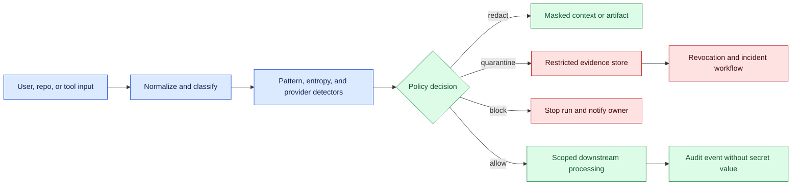
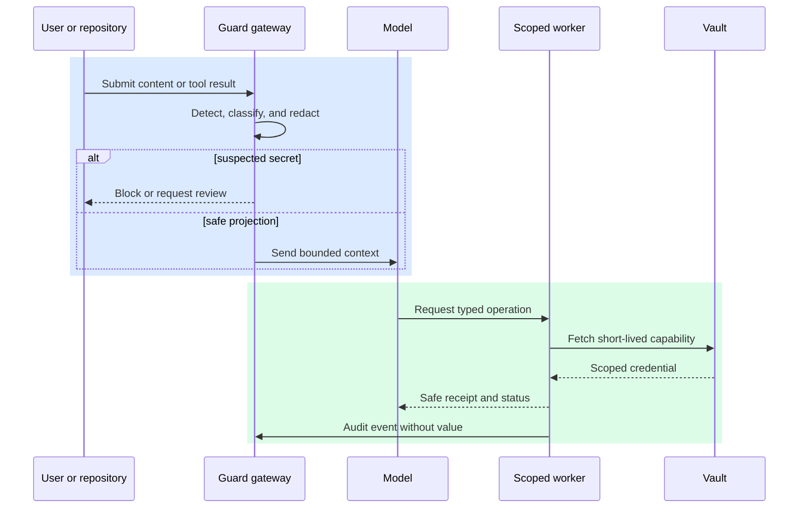

# Secret scanning for AI workflows

Status: emerging

Sources: [GitHub — 2026-07-07, secret scanning changelog](https://github.blog/changelog/2026-07-07-secret-scanning-extended-metadata-and-multipart-validation/); [GitHub — 2026-07-13, secret scanning API changelog](https://github.blog/changelog/2026-07-13-create-and-manage-secret-scanning-custom-patterns-via-rest-api/); [GitHub — 2026-07-15, secret scanning changelog](https://github.blog/changelog/2026-07-15-improvements-to-secret-scanning-and-public-monitoring/); [GitHub — 2026-09-07, accessed; secret scanning documentation](https://docs.github.com/en/code-security/secret-scanning/introduction/about-secret-scanning); [OWASP — 2026-09-07, accessed; LLM application risks](https://owasp.org/www-project-top-10-for-large-language-model-applications/)

## In one sentence

Secret scanning for AI systems must inspect source, prompts, model context, tool arguments, artifacts, and logs because credentials can enter any data path an agent is allowed to use.

## Prerequisites

Know regular expressions, entropy and false positives, redaction, credential rotation, CI boundaries, artifact stores, logs, and least privilege. A finding must be actionable without copying the secret into the finding, alert, prompt, or trace.

## Background: what existed before

Traditional secret scanning searched source repositories for API keys, passwords, private keys, and tokens before code was committed. Pattern rules, entropy checks, and provider verification caught many accidental leaks. CI pipelines then blocked a commit or revoked a detected credential. This approach assumed the repository was the main place where developers handled sensitive material.

AI applications widen the surface. A developer may paste a token into a prompt while debugging, an agent may read an environment file, a browser tool may return a credential-bearing page, or a model may echo a secret into a generated patch. Conversation transcripts, tool traces, vector indexes, screenshots, and evaluation fixtures can all become durable copies. A scanner that only runs on Git commits can miss the first leak and the most damaging replicas.

Detection is not the same as protection. A pattern match can be a test value, while a real credential may be encoded, split across messages, or returned in an unexpected format. The response also matters: logging the entire matched line can replicate the secret. A useful program combines detection, redaction, access controls, provider verification, and rapid revocation.

The historical baseline remains valuable. Repositories, CI, and developer workstations still need conventional scanning. The change is to treat AI boundaries as additional ingestion and egress points, with controls appropriate to their latency, cost, and uncertainty.

## What changed and why now

Tool-using assistants make secret exposure an ordinary pipeline risk. A planner may need credentials to call a service, but placing those credentials in model context allows accidental disclosure, prompt injection, or retention in logs. Safer designs give workers short-lived, scoped credentials and return opaque operation receipts rather than raw authorization headers.

The issue’s source context reflects increasing agentic systems; it does not establish a specific July release of a secret scanner. The controls in this lesson are engineering inferences grounded in the cited security guidance. Capability—an agent can call an API—must be kept separate from the reliability claim that the API key will remain confidential.

The practical shift is to scan at trust-boundary transitions: before context construction, after tool responses, before model output is stored or published, and when artifacts leave a sandbox. Each transition needs a policy decision: block, redact, quarantine, allow with audit, or request human review. A single “secret detected” boolean is too coarse for different tenants, environments, and rotation obligations.

## What changed this month

GitHub’s July 7, 13, and 15 changelogs provide a concrete issue-month change: secret scanning gained richer provider metadata and multipart validation, REST management for custom patterns, and additional detector, webhook, and public-monitoring behavior. Those releases concern GitHub’s repository and public-content surfaces; extending the same reasoning to prompts, tool payloads, artifacts, and traces is an engineering inference. The lesson therefore separates provider-backed detection and remediation facts from the broader AI-boundary architecture that teams must implement themselves.

## Impact on current processing and architecture

Map data flows before choosing detectors. Identify inputs from repositories, tickets, email, browsers, shells, databases, and model outputs. Mark where data is transformed, persisted, indexed, displayed, or sent to an external provider. The map should include failure paths; a rejected tool result may still appear in a trace or error dashboard.

Use layered detectors. Provider-aware patterns recognize key prefixes and checksum formats. Generic high-entropy rules catch unknown tokens but create false positives. Parsers understand common files such as `.env`, JSON credentials, and cloud configuration. A verifier can make a low-risk, scoped call to determine whether a candidate is active, but verification itself must not expose the candidate to untrusted systems. Never send suspected secrets to a third-party scanner without an approved data-processing contract.



Redaction must preserve task usefulness. Replacing a credential with `[SECRET]` is safer than deleting an entire tool response, but the model may still need to know that an authenticated request succeeded. Return a typed status, resource ID, and safe summary. Keep the original evidence in a restricted store only when incident response requires it, with a retention deadline.

Scanning context is a token and latency budget. Run cheap local detectors before a model call, and use deeper parsing asynchronously for large artifacts. Cache results by content hash, but consider whether a cache can retain sensitive content. A hash can identify repeats without storing the source. Record detector version and policy version so a later review can explain why a value was allowed.

Credential injection belongs in the architecture too. Workers obtain secrets from a vault at execution time, with audience, scope, and expiry. The orchestrator passes a capability reference, not the value. Tool adapters strip authorization headers from responses and error messages. Environment variables should be filtered before a shell or notebook is exposed to an agent. These controls reduce the amount a scanner must discover after the fact.

## Real-world applications and constraints

A coding agent may inspect a repository containing test fixtures and deployment templates. It should distinguish a documented example key from a live credential, but the default should be conservative when the provider is unknown. Before opening a pull request, scan the diff and generated files; before publishing logs, scan stack traces and command output. If a token is found, stop publication, identify likely owners, and begin rotation rather than merely deleting the line.

An incident assistant may ingest chat transcripts and paste service logs into a model. Logs often contain authorization headers, session cookies, or customer identifiers. A preprocessing gateway can parse known fields, mask values, and retain a reversible mapping only in a restricted incident vault. The model receives a stable placeholder so it can correlate repeated occurrences without learning the credential.

An evaluation pipeline may intentionally include fake secrets to test defenses. Fixtures need unmistakable markers and isolated accounts so a verifier cannot accidentally contact production. Results should report detection, redaction, blocking, and alert latency separately. A scanner that catches obvious examples but misses secrets split across tool messages may give a misleading safety score.

Constraints include false positives, scanner latency, provider-specific formats, multilingual content, binary files, and encrypted archives. Do not promise complete detection. Use defense in depth: least-privilege credentials, short lifetimes, egress controls, redacted telemetry, and revocation runbooks. For high-impact systems, require a human decision when a suspected credential is about to cross a trust boundary.

## Mental model

Treat a secret like a toxic substance moving through a factory. A label on the original container helps, but spills can occur at transfer points, in waste bins, or in shipping documents. Scan and control every transfer, keep clean substitutes for normal work, and maintain a response plan for a confirmed spill.

The important distinction is **value** versus **capability**. A model rarely needs the literal token; it needs the capability to perform one permitted operation. Give that capability to a non-model worker and return a result that omits the credential. When a literal value is unavoidable for a narrow transformation, isolate the operation, prevent retention, and test the boundary explicitly.



This model also clarifies incident response. Detection should produce an evidence ID, source location, detector version, and probable owner—not the secret itself in a chat alert. Revocation and rotation are operational actions with their own authorization. A scanner is successful when exposure is contained and the system learns, not merely when a red pattern is highlighted.

## Engineering consequence

Define a secret-handling contract for every tool adapter. Specify accepted credential references, response fields that must be removed, maximum retention, and the policy action on detection. Test adapters with synthetic credentials and malformed responses. Reject tools that cannot guarantee header stripping or scoped access.

Use a decision table for trust-boundary crossings:

| Situation | Default action | Evidence retained |
| --- | --- | --- |
| Known test marker in an isolated fixture | Allow in test scope | Hash and detector result |
| Candidate in model context | Redact before inference | Location and rule ID |
| Candidate in outbound artifact | Block publication | Restricted incident ID |
| Active credential confirmed | Revoke and quarantine | Provider receipt, never value |
| Ambiguous high-entropy string | Review or isolate | Masked sample and owner |

Instrument metrics that lead to action: findings by boundary, false-positive rate, redaction latency, blocked publication attempts, time to revoke, and repeated source locations. Alert fatigue is a security failure; route findings to owners with enough context to fix the source but not enough to reproduce the secret.

## Limits and failure modes

Pattern detectors miss novel formats, split values, encrypted payloads, and secrets encoded as images or audio. Entropy rules flag hashes and random test data. Use multiple detectors and adversarial tests, but describe coverage honestly. A model-based detector can add semantic context while introducing its own data-disclosure and nondeterminism risks.

Redaction can fail through logs, exception traces, caches, telemetry labels, or screenshots. Apply masking at each sink and prohibit raw values in structured event fields. Be careful with debugging modes that intentionally capture full requests. A “temporary” trace often outlives the incident.

Rotation can break active runs. Record which run and worker used a credential, revoke the old value, issue a replacement, and decide whether queued work must be cancelled. Do not automatically replay an irreversible operation after rotation; reconcile its external effect first.

## Build it locally

This example detects a few synthetic token shapes and returns a masked projection. It is a teaching sample, not a production detector.

```python
import re

PATTERNS = [
    ("provider", re.compile(r"\bsk-[A-Za-z0-9]{12,}\b")),
    ("aws", re.compile(r"\bAKIA[0-9A-Z]{16}\b")),
]

def redact(text: str) -> tuple[str, int]:
    hits = 0
    for _, pattern in PATTERNS:
        text, count = pattern.subn("[SECRET]", text)
        hits += count
    return text, hits

sample = "deploy with sk-example123456789 and keep the region us-west-2"
masked, count = redact(sample)
print(masked)
print("findings:", count)
assert "sk-example" not in masked and count == 1
false_positive, false_count = redact("docs mention sk-PLACEHOLDER and region us-west-2")
assert false_count == 0 and "sk-PLACEHOLDER" in false_positive
split_value = "sk-example123" + "456789"
split_masked, split_count = redact(split_value)
assert split_count == 1 and split_value not in split_masked
assert "sk-example" not in masked
```

1. Save the code as `scan.py` and run `python3 scan.py`.
2. Add a provider-specific pattern and a test fixture that should not match.
3. Return a finding ID and source label instead of printing the original text.
4. Add a boundary argument (`prompt`, `artifact`, or `log`) and choose block versus redact policy.
5. Write tests asserting that the masked output never contains the synthetic credential.

## Designing a useful finding

A finding should be actionable without disclosing the value. Record the boundary, source component, byte or line range, detector rule, confidence, first-seen time, and owning team. A masked fingerprint can correlate repeats while preventing an alert channel from becoming another leak. Keep raw evidence behind a separate permission and require an incident role to retrieve it.

Prioritize findings by exposure, not only detector confidence. A suspected token in a public artifact deserves urgent containment; a test marker in an isolated fixture may be accepted with a documented exception. Include business impact and whether the credential is still active. The scanner can recommend an action, but revocation should use a controlled provider workflow with an audit receipt.

Scanning should be continuous enough to catch delayed publication. Run at commit and CI boundaries, on artifact upload, before indexing content for retrieval, and when exporting traces. Re-scan when detector rules or provider formats change. A content hash lets the system identify unchanged data without retaining another copy, while a policy version explains why an older finding was allowed.

## Scanning boundaries and detector design

The boundary determines what “scan” can safely mean. At a source-control boundary, the scanner can inspect a diff, file path, and commit metadata before publication. At a prompt boundary, it should return a safe projection quickly because the next model call may already be queued. At a tool boundary, the scanner needs to inspect both arguments and results, including structured fields that a pretty printer might hide. At an artifact boundary, it may need archive traversal, file-type detection, and a block decision before a package becomes downloadable. At a log boundary, it must protect the alerting system itself: an incident event cannot contain the value it is supposed to contain.

These boundaries need different false-positive policies. A documentation example can be allowed if it is an unmistakable placeholder and cannot authenticate, while an unknown token in a public release should be blocked until reviewed. A candidate in a private prompt might be redacted so the task can continue, but a candidate in a customer export should normally stop publication. Classify findings with at least source, destination, credential family, confidence, and reversibility. “High confidence” is not enough to choose an action without knowing where the data is going.

Split secrets expose a common mistake in detector design. If a token is divided across two tool messages, scanning each message independently misses it. Joining every adjacent message indiscriminately creates false positives and may combine unrelated text. A practical gateway can keep a short-lived, bounded window for each logical stream, normalize only approved separators, and attach the finding to the smallest set of source segments that produced the match. The window must be cleared at a trust-boundary transition and must never be written to a debug log. This is a streaming-state problem, not just a better regular expression.

Encoded values require a similar trade-off. Base64 is an encoding, not encryption, so a detector can decode candidate strings before applying provider rules. But decoding every long string is expensive and can turn arbitrary binary data into noisy text. Limit decoding by alphabet, padding, length, and context; cap the number of attempts per event; and record the decoder rule without retaining the decoded value. The same idea applies to URL encoding, JSON escaping, and Unicode confusables. Canonicalization should be explicit and testable because aggressive normalization can change the meaning of user content.

Findings should be designed as safe objects. Store a keyed or unkeyed fingerprint, rule ID, boundary, source component, position, confidence, and an inert preview such as `sk-live-…<24 bytes>`. Do not store the matched value, a reversible encryption key beside the event, or the entire surrounding line. If incident response needs raw evidence, put it in a separate vault with a different role, short retention, access logging, and an approval path. The default alert should let an owner locate and rotate the credential without copying it into chat, issue trackers, or model context.

The scanner’s test corpus should include positive, negative, and ambiguous fixtures. Positive cases include a direct token, a token split across messages, a base64-wrapped token, a JSON field, and a shell error. Negative cases include documentation placeholders, hashes, UUIDs, and ordinary prose. Ambiguous cases include a high-entropy test value and a token-like string in a screenshot OCR result. Assert both detection behavior and non-disclosure: the raw fixture must not occur in the finding object, logs, exception text, or serialized report. Measure recall separately for each representation, because an aggregate score can hide a complete failure on encoded or split values.

## Mini exercise (15–30 min)

Draw the data path for one agent feature from user input to final artifact. Mark every place a credential or customer record could appear. Choose one detector, one redaction projection, one scoped worker capability, and one revocation owner for each boundary. Then inject a fake token into a tool error and verify that no output sink receives the raw value.

## Implementation exercises

### Suggested implementation stack

Use a small, reproducible stack for demonstrations:

| Layer | Recommended tool | Demonstration purpose |
| --- | --- | --- |
| Networking code | Python | Build local scanners, mock providers, and redaction gateways. |
| Experiments | Linux/macOS command-line tools | Inspect files, hashes, processes, and test fixtures quickly. |
| Packet inspection | Wireshark | Verify that credentials and raw findings do not cross an unexpected boundary. |
| Reproducible environments | Docker | Run isolated client/server fixtures with repeatable dependencies. |
| Primer format | Markdown + Mermaid diagrams | Explain data flow, policy decisions, and failure recovery alongside code. |

Keep all demonstrations local and synthetic. A Wireshark capture should contain fake tokens only; Docker services should use throwaway credentials and a network with no production route. The command-line examples should show safe summaries, hashes, or masked values rather than dumping files. This stack makes the security claim testable: learners can observe the boundary, reproduce the finding, and inspect the resulting artifact without needing a paid API.

1. **Boundary scanner:** Extend `redact` so it accepts a boundary name and returns a policy decision. Block outbound artifacts, redact prompts, and quarantine logs. Add tests for each decision and ensure the original value is never included in the returned finding.
2. **Finding store:** Create an in-memory store keyed by a SHA-256 fingerprint. Save only the fingerprint, masked preview, source component, rule ID, confidence, and owner. Demonstrate that two occurrences of the same synthetic token correlate without storing the token itself.
3. **Rotation drill:** Model a confirmed finding with `detected`, `quarantined`, `revocation_requested`, and `revoked` states. Reject an automatic replay of an affected run until a mock provider returns a revocation receipt and a reconciler confirms no duplicate external operation.
4. **Regression corpus:** Build ten fixtures: a fake provider key, an example key, a split token, a token in JSON, a token in a stack trace, an image placeholder, a high-entropy hash, and three clean documents. Track precision, recall on the synthetic corpus, and the latency added at each boundary.

## Interview Q&A

**Why scan model context?** Credentials can enter through prompts, retrieved files, browser pages, and tool results even when source control is clean.

**Should the model receive API keys?** Usually no. Give a worker a short-lived scoped capability and return a typed result without the literal value.

**How do you handle a confirmed live key?** Quarantine evidence, identify the owner, revoke or rotate through the provider, and reconcile affected runs.

**What metric matters beyond detection rate?** Time from detection to containment, including redaction, notification, revocation, and prevention of repeated exposure.

## Glossary

**Capability reference:** Opaque handle a worker exchanges for narrowly scoped authority.

**Entropy detector:** Rule that flags unusually random strings likely to be tokens.

**Redaction:** Replacing sensitive content with a safe representation.

**Secret scanning:** Automated detection of credential-like values in data or artifacts.

**Trust boundary:** Point where data enters a component or leaves a security domain.

**Revocation:** Invalidating a credential so it can no longer authorize operations.

## References

- [GitHub July secret-scanning changelog](https://github.blog/changelog/2026-07-15-improvements-to-secret-scanning-and-public-monitoring/) — issue-month release context.
- [GitHub secret scanning](https://docs.github.com/en/code-security/secret-scanning/introduction/about-secret-scanning) — primary documentation for repository detection and response.
- [OWASP Top 10 for LLM Applications](https://owasp.org/www-project-top-10-for-large-language-model-applications/) — application-security risk context.

## Claim ledger
| Claim | Source | Fact or inference |
|---|---|---|
| GitHub expanded secret-scanning metadata and multipart validation in July. | [GitHub — 2026-07-07](https://github.blog/changelog/2026-07-07-secret-scanning-extended-metadata-and-multipart-validation/) | Source-context fact |
| GitHub added REST management for custom secret-scanning patterns in July. | [GitHub — 2026-07-13](https://github.blog/changelog/2026-07-13-create-and-manage-secret-scanning-custom-patterns-via-rest-api/) | Source-context fact |
| GitHub expanded secret types, public monitoring, and webhook categorization in July. | [GitHub — 2026-07-15](https://github.blog/changelog/2026-07-15-improvements-to-secret-scanning-and-public-monitoring/) | Source-context fact |
| GitHub documents secret scanning as a way to detect credential-like material and support remediation. | [GitHub — accessed 2026-09-07](https://docs.github.com/en/code-security/secret-scanning/introduction/about-secret-scanning) | Fact; documentation scope |
| The July cyber release describes commit-scanning workflows, but as vulnerability scanning rather than secret detection. | [Google DeepMind — 2026-07-21](https://deepmind.google/blog/introducing-gemini-3-5-flash-cyber/) | Fact; source distinction |
| Prompts, tool payloads, artifacts, and traces are additional scanning boundaries. | This lesson’s architecture | Engineering inference |
