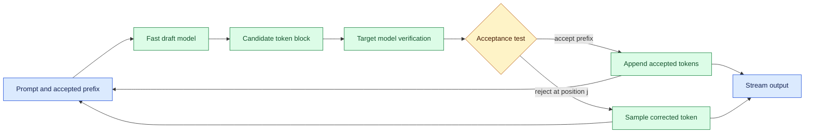
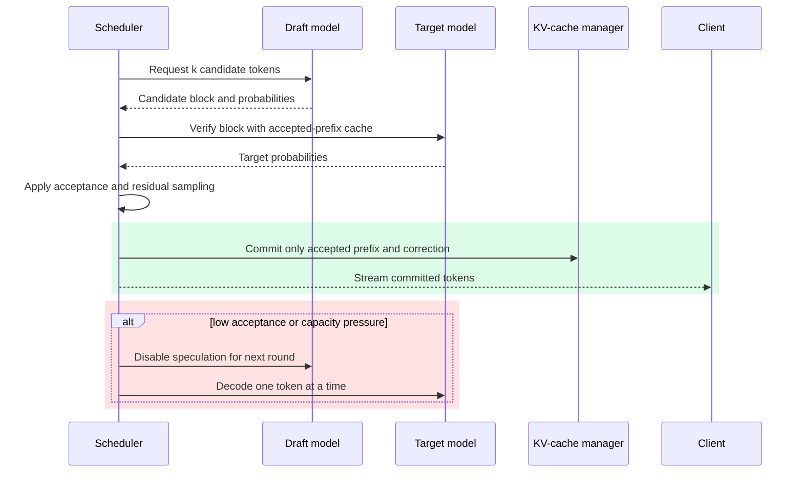

# Speculative decoding

Status: emerging

Sources: [Liu et al. — 2026-07-28, AngelSpec paper](https://arxiv.org/abs/2607.25852); [Google Research — publication date not stated, accessed 2026-09-07; primary research post](https://research.google/blog/accelerating-large-language-model-decoding-with-speculative-sampling/); [Hugging Face — publication date not stated, accessed 2026-09-07; official implementation documentation](https://huggingface.co/docs/transformers/main/en/generation_strategies#speculative-decoding)

## In one sentence

Speculative decoding uses a fast draft model to propose several tokens and a slower target model to verify them in parallel, reducing latency without changing the target model’s accepted distribution when implemented correctly.

## Prerequisites

Know autoregressive decoding, logits, sampling, batching, acceptance/rejection, and GPU cost. Speculation changes execution scheduling, not the target model’s authority over committed tokens.

## Background: what existed before

Autoregressive language models normally generate one token at a time. The model reads the prompt plus all accepted tokens, computes logits, samples or selects the next token, appends it, and repeats. Even with a key-value cache, each step requires a target-model forward pass. The target may have billions of parameters, so memory bandwidth and kernel launch overhead dominate interactive latency.

Batching improves throughput by serving many requests together, but a single user still waits for sequential decoding. Quantization and optimized attention reduce the cost of each step. Streaming makes waiting feel shorter, yet it does not reduce time to produce the sequence. These techniques are complementary to speculative decoding.

The key observation is that not every token needs a full expensive computation. A smaller draft model can often predict a plausible continuation. The target model can then evaluate a block of proposed tokens in one wider forward pass. Accepted tokens advance the sequence; the first rejected token is sampled from a corrected distribution, and the process repeats.

This is not the same as letting a small model answer and checking it later. The target remains the authority for every accepted token. Correctness depends on a verification rule that accounts for both models’ probabilities, sampling temperature, and rejection behavior.

## What changed and why now

Speculative decoding has moved from a research technique toward production inference because serving costs and interactive latency are limiting agent and chat experiences. Coding assistants, browser agents, and voice interfaces generate many short continuations where a few milliseconds per token accumulate. The issue’s source context indicates active optimization of inference systems; the exact engineering stack remains deployment-specific.

The cited research describes speculative sampling and the implementation documentation exposes assisted-generation interfaces. Those are source-context facts. Choosing a draft model, acceptance length, routing policy, and fallback behavior for a particular service is an engineering inference that must be measured on that service’s prompts.

The practical change is to make decoding a two-model pipeline with observable economics. Operators need draft acceptance rate, target verification time, tokens per target pass, end-to-end latency, and memory overhead. A draft model that is cheap but poorly aligned can lower acceptance and make performance worse. Correctness and speed must therefore be evaluated together.

## What changed this month

The July 28 AngelSpec paper is a direct issue-month research anchor. It studies real-world speculative-decoding choices across multi-token prediction and block-parallel drafting, and treats verification as a shared batch-level resource whose depth depends on domain, load, and hardware. Those are research-paper claims about the reported experiments, not a promise that one drafting structure wins every production workload. This lesson focuses on the acceptance algorithm and its accounting, separate from lesson 08’s end-to-end optimization experiments and lesson 18’s continuous-batching scheduler policy.

## Impact on current processing and architecture

The serving request carries two model handles: a target model that defines output behavior and a draft model used only for proposals. The draft proposes up to `k` tokens from the current prefix. The target evaluates those tokens in a vectorized pass, returning probabilities for each position. A verifier accepts the longest prefix that passes the chosen sampling rule. At rejection, it samples one corrected token from the residual distribution and discards later draft tokens.



The target can verify a block more efficiently than `k` independent calls because matrix operations process multiple positions together and reuse the prefix cache. The draft still consumes compute and memory, so choose `k` dynamically. Short completions may not amortize the extra model; long, predictable continuations often benefit more. A scheduler can disable speculation for a request when the draft is cold, the target is underutilized, or acceptance has recently collapsed.

Caching becomes two-dimensional. The target cache contains accepted tokens only; draft speculation must not mutate authoritative state until verification. Keep separate cache metadata or clone the relevant suffix. A rejected suffix must be discarded, and a corrected token must be appended to both caches before the next round. Bugs that accidentally retain rejected tokens produce subtle quality and reproducibility failures.

Sampling configuration is part of the contract. Greedy decoding has a simple matching condition, while temperature, top-p, and other filters require a rejection-sampling correction. If the draft uses a different tokenizer, map candidate boundaries carefully or use a compatible tokenizer. Stop sequences and structured-output constraints must be applied during drafting and verification; otherwise the draft may propose tokens the target is not allowed to accept.

## Real-world applications and constraints

An IDE assistant benefits when the draft model predicts routine syntax, boilerplate, or familiar API names. The target still checks each token and preserves its configured safety and style behavior. Measure first-token latency separately from steady-state tokens per second; speculation may help the latter while the draft startup hurts the former.

An agent planner often emits short structured actions. A draft model trained on the same action grammar may achieve high acceptance, but a malformed candidate must be rejected before it reaches a tool adapter. Validate the complete structured object after decoding; token-level acceptance is not semantic authorization.

Voice interfaces have strict latency budgets and variable network conditions. Running draft and target colocated reduces round trips. If the target is remote, transmitting candidate blocks can add overhead and expose prompt data to another service. Encryption, tenancy, and data-processing policy remain requirements even when speculation is an optimization.

Constraints include GPU memory for two models, draft loading time, tokenizer compatibility, changing prompt distributions, and target batching. Acceptance can fall after a model update, new domain, or temperature change. Keep a non-speculative fallback and a feature flag. Cost accounting should include draft GPU time, memory reservation, and extra orchestration—not just target forward passes saved.

## Mental model

Imagine a junior editor drafting several words ahead while a senior editor reviews a whole sentence at once. The senior editor keeps the draft’s prefix only where it agrees with the authoritative style guide. At the first disagreement, the senior supplies the correct word and the junior starts again from that point. The junior accelerates routine work but never overrides the senior.

The distinction is **proposal** versus **authority**. The draft model proposes tokens; the target model defines the distribution. Acceptance rate measures how often proposals are useful, not whether the draft is independently safe or correct. A high rate can coexist with unsafe tool semantics, so downstream validators and policy gates remain necessary.



The system should expose this loop in traces. Record candidate length, accepted length, rejection position, target pass duration, draft duration, and fallback reason. Do not log full sensitive prompts merely to compute these metrics. Aggregates are enough for capacity planning; sampled traces can use redaction and access controls.

## Engineering consequence

Start with an offline corpus representative of production prompts. Compare target-only and speculative outputs under identical random seeds where possible. For stochastic sampling, compare distributions or task metrics rather than exact strings. Include structured generation, stop conditions, long contexts, and prompts that deliberately differ from the draft model’s training distribution.

Tune `k` as a control parameter. Larger blocks offer more potential savings but increase draft work and may waste tokens after an early rejection. A simple adaptive policy can increase `k` after high acceptance and decrease it after repeated rejections. Bound the range and add hysteresis so the policy does not oscillate under noise.

Use a clear service boundary. The scheduler owns request cancellation, deadlines, and fallback. The verifier owns probability correction and cache commits. The model runtime owns kernels and memory. This separation lets a target model update without silently changing the acceptance algorithm. Version the draft-target pair and record both versions in telemetry.

Tables help make the trade-off explicit:

| Condition | Likely choice | Reason |
| --- | --- | --- |
| High draft acceptance, long completion | Enable with larger `k` | Amortize target verification |
| Short response or cold draft | Disable or use small `k` | Avoid startup overhead |
| Target GPU saturated by other batches | Disable speculation | Preserve shared capacity |
| Structured output with strict grammar | Use grammar-aware draft | Prevent unusable candidates |
| Acceptance drops after update | Roll back pair or retune | Protect latency and cost |

## Limits and failure modes

Poor draft alignment can make speculation slower than baseline. A target update may change token probabilities while the draft remains old. Monitor acceptance by route, model pair, language, and prompt class rather than relying on one global average.

Implementation mistakes can change outputs. Reusing rejected cache entries, applying top-p differently in draft and target, or sampling the residual distribution incorrectly violates the intended target distribution. Keep a trusted target-only path for differential tests and audit the verifier as inference-critical code.

Two models double some operational concerns. Memory pressure can trigger eviction or out-of-memory failures. Draft and target failures need independent retry budgets; retrying both can multiply latency. Cancellation must stop speculation promptly and release both caches. A feature flag should allow operators to disable the draft without redeploying the target.

## Engineering analysis

Speculation is an algorithmic optimization with a strict authority boundary. The draft model is allowed to be wrong because its output is provisional; the target model is responsible for deciding which prefix can be committed. That makes the verifier the most important component to test. It must compare positions against the current accepted prefix, stop at the first rejection, sample or select a corrected token, and discard every later draft token. Accidentally appending the full draft is not a small performance bug: it changes the target’s output process.

The residual distribution matters when decoding is stochastic. At a rejected position, the corrected token is drawn from the portion of the target distribution not already explained by the draft distribution, with a special case when the draft probability is greater than or equal to the target probability. A toy example can use exact token equality, but it should name that simplification so readers do not mistake string matching for a production sampler. Production tests should compare distributions under fixed seeds, temperature, top-p, stop tokens, and grammar constraints. Greedy matching is a useful control, not a proof of sampling correctness.

Cache ownership is another source of subtle failures. The target cache may advance only over accepted tokens and the correction. The draft cache can speculate ahead, but its suffix must be truncated after rejection. Cache counters should be asserted against the committed prefix length after every round. This is especially important under cancellation: a request that is removed while a block is being verified must not return uncommitted tokens or leave a cache allocation attached to a dead stream.

Acceptance metrics need a denominator. Report proposed tokens, accepted tokens, corrected tokens, rejection position, target passes, draft time, target time, and end-to-end latency. “Acceptance rate” can otherwise look good because a system reports only successful rounds. Segment by prompt family and output length; a draft trained on code may be excellent for syntax completion and poor for legal text. Keep a target-only control group in the same batch and hardware conditions so scheduler contention is visible.

The safest rollout is shadow-first. Run the draft model and verifier without changing the response, compare the committed result and resource counters with a target-only trace, and enable speculation only when the overhead budget is met. Keep a kill switch at the scheduler, not inside the model prompt. The source material explains the technique; the production engineering work is preserving target authority while making every speed claim falsifiable.

## Verifier accounting in a real serving path

The verifier’s unit of work is a candidate block, not a completed answer. That distinction changes how a serving team should account for both quality and capacity. Suppose a draft proposes six tokens and the target accepts four before rejecting the fifth. The request has gained four useful draft tokens, consumed six draft predictions, consumed one target block pass, and still needs one corrected token before the next round. Counting the round as “six tokens accepted” hides the discarded suffix; counting it as “one token generated” hides the vectorized work. Store all four quantities so a capacity review can explain where time went.

The acceptance denominator also needs an explicit policy. A useful first metric is draft-token acceptance: accepted draft tokens divided by proposed draft tokens. A second is committed tokens per target pass: accepted draft tokens plus the correction, divided by verification passes. A third is useful speedup: target-only target passes divided by the total cost-equivalent passes after charging the draft model. These metrics answer different questions. The first tells whether the pair agrees, the second tells whether the target is being amortized, and the third tells whether the product actually got cheaper or faster. A high acceptance rate can still lose if the draft consumes a large GPU or if every response is too short to amortize startup.

Round boundaries must be represented in the request state. Keep `accepted_prefix_length`, `proposed_length`, `accepted_draft_length`, `corrected_length`, and `target_pass_id` in the trace. When a client cancels after the target returns probabilities but before the commit, discard the entire uncommitted block. When the target returns a stop token, commit only through the stop boundary and release the draft suffix. When a grammar rejects a token, classify it separately from ordinary model disagreement; otherwise the acceptance dashboard will confuse a policy constraint with a poor draft model.

The target-only comparison should use the same prompt set, tokenizer, sampling parameters, hardware class, and concurrency. Comparing a warm speculative request with a cold baseline produces a convincing but invalid result. For deterministic greedy decoding, compare exact committed token sequences and cache counters. For stochastic decoding, exact strings may differ even when both paths are correct; compare seeded distributions, log-probability checks, task-level success, and constraint violations. A target-only control remains necessary after rollout because a target model update can alter latency independently of the speculation feature.

There is a subtle residual-correction boundary in a production API. The correction is authoritative output, but it is not an accepted draft token. Report it separately so teams do not tune the draft based on tokens it did not predict. If every round reports only total committed tokens, a draft that frequently fails at position one can look healthy because the target keeps supplying corrections. That draft should probably be replaced or disabled for the affected route. Conversely, a draft that accepts long runs but occasionally fails on a safety delimiter needs route-specific grammar and stop-token tests, not simply a larger candidate block.

The rollout gate should therefore combine correctness and resource thresholds. Require zero uncommitted-token leaks in cancellation tests, no target-only divergence under the chosen decoding contract, bounded draft memory, and an improvement in p95 inter-token latency or cost per committed token. Break down failures by model pair, language, context length, and output type. This keeps the lesson’s boundary clear: speculative decoding is the verification algorithm and its accounting, while the neighboring inference-efficiency lesson owns the broader end-to-end experiment and the batching lesson owns queue policy.

## Build it locally

This low-cost example demonstrates multi-round acceptance accounting rather than neural inference. It treats a draft as a list of proposed tokens and uses the authoritative target token as a toy residual correction at the first mismatch; a real sampler compares probabilities.

```python
def verify_round(prefix: list[str], draft: list[str], target: list[str], max_k: int = 4):
    committed = list(prefix)
    accepted_draft = 0
    proposed = draft[:max_k]
    corrected = 0
    for proposed_token, target_token in zip(proposed, target[len(prefix):]):
        if proposed_token != target_token:
            committed.append(target_token)  # toy residual correction
            corrected = 1
            break
        committed.append(proposed_token)
        accepted_draft += 1
    return committed, len(proposed), accepted_draft, corrected

target = "the quick brave fox jumps over the log".split()
draft_rounds = [
    ["the", "quick", "brown"],  # two accepted, then one correction
    ["fox", "jumps", "over"],    # three accepted
    ["wrong", "tokens"],          # one correction
    ["log"],                       # final accepted token
]
prefix, proposed_total, accepted_draft_total = [], 0, 0
corrected_total, target_passes = 0, 0
for draft in draft_rounds:
    prefix, proposed, accepted_draft, corrected = verify_round(prefix, draft, target)
    proposed_total += proposed
    accepted_draft_total += accepted_draft
    corrected_total += corrected
    target_passes += 1

target_only_passes = len(target)
acceptance_rate = accepted_draft_total / proposed_total
print("committed:", prefix)
print("draft acceptance:", accepted_draft_total, "/", proposed_total, "=", round(acceptance_rate, 2))
print("corrected tokens:", corrected_total, "target passes:", target_passes)
assert prefix == target
assert accepted_draft_total == 6 and proposed_total == 9
assert corrected_total == 2 and target_passes < target_only_passes
assert 0 < acceptance_rate < 1
```

1. Save it as `verify.py` and run `python3 verify.py`.
2. Add a corrected token after the first mismatch and model the next draft round from the committed prefix.
3. Generate random draft/target sequences and report mean accepted tokens per round.
4. Add a `max_k` policy that shrinks the candidate block after two low-acceptance rounds.
5. Compare a simulated target-only loop with speculative rounds and include draft cost in the timing model.

## Capacity planning and debugging

Benchmark speculation under the same concurrency as the target service. At low concurrency, a draft may improve one request while wasting an otherwise idle target cycle; at high concurrency, the extra draft model can compete for memory and reduce batching efficiency. Measure p50 and tail latency separately, and include queue wait. A faster median with a worse p99 may be unacceptable for an interactive product.

When results regress, inspect the loop in order. First confirm that the target-only baseline still has the expected output and kernel timing. Next check tokenizer boundaries and stopping rules. Then compare draft and target probabilities at the first mismatch. Finally inspect cache commit counters: accepted-prefix length should increase by exactly the number of committed tokens, never by the entire proposed block. These counters often locate a bug faster than reading generated text.

Streaming protocols need a commit boundary. Do not send speculative tokens to a client before verification, because a later rejection would require retracting visible text. Buffer the candidate block internally and stream only committed tokens. For voice or real-time interfaces, this can be balanced with a small verified chunk size; perceived responsiveness is a product metric, but it cannot override output correctness.

Deployment should be gradual. Start with an opt-in route and shadow draft proposals without using them to establish acceptance and overhead. Compare target-only and speculative traces on the same request IDs, then enable a small traffic slice. Roll back when memory pressure, tail latency, output divergence, or error rates exceed a pre-set budget. Keep the target-only path operational throughout the experiment; an optimization that cannot be disabled is an availability risk.

## Mini exercise (15–30 min)

Choose a local text corpus and a deterministic toy target. Create two draft generators: one that copies common prefixes and one that guesses randomly. Measure acceptance, rounds, and simulated work for several `k` values. Plot where speculation wins and identify the acceptance threshold below which fallback is cheaper.

## Interview Q&A

**Does the draft model decide the final output?** No. It proposes; the target verifies and supplies a corrected token at the first rejection.

**Why can a larger draft block hurt?** It costs draft compute and may produce many discarded tokens after an early mismatch.

**What must be tested after changing temperature?** Acceptance behavior and output distribution, because sampling filters affect the verification correction.

**How is production benefit measured?** Track end-to-end latency, target passes per output token, accepted tokens per pass, draft overhead, memory, cost, and fallback rate.

## Glossary

**Acceptance rate:** Accepted draft tokens divided by proposed tokens.

**Draft model:** Smaller, faster model that proposes a candidate token block.

**Residual distribution:** Corrective probability distribution used after a draft rejection.

**Speculative decoding:** Draft-and-verify autoregressive generation.

**Target model:** Authoritative model whose distribution the output must follow.

**KV cache:** Stored attention keys and values reused during decoding.

## References

- [AngelSpec](https://arxiv.org/abs/2607.25852) — July 2026 primary research paper.
- [Google Research: Speculative sampling](https://research.google/blog/accelerating-large-language-model-decoding-with-speculative-sampling/) — primary research context; publication date not stated on the page.
- [Hugging Face assisted generation](https://huggingface.co/docs/transformers/main/en/generation_strategies#speculative-decoding) — implementation documentation.
- [Google DeepMind news archive](https://deepmind.google/blog/) — issue discovery context.

## Claim ledger
| Claim | Source | Fact or inference |
|---|---|---|
| AngelSpec studies multiple speculative-decoding drafting structures and adaptive verification in a July 2026 paper. | [Liu et al. — 2026-07-28](https://arxiv.org/abs/2607.25852) | Source-context fact |
| Google Research describes a draft model proposing tokens for target-model verification. | [Google Research — publication date not stated, accessed 2026-09-07](https://research.google/blog/accelerating-large-language-model-decoding-with-speculative-sampling/) | Fact; research description |
| Correct verification can preserve the target sampling distribution when implemented according to the algorithm. | [Google Research — publication date not stated, accessed 2026-09-07](https://research.google/blog/accelerating-large-language-model-decoding-with-speculative-sampling/) | Fact; research claim |
| Hugging Face documents assisted-generation implementation options. | [Hugging Face — publication date not stated, accessed 2026-09-07](https://huggingface.co/docs/transformers/main/en/generation_strategies#speculative-decoding) | Fact; documentation scope |
| Draft block size must be tuned against acceptance, target contention, and tail latency. | This lesson’s systems analysis | Engineering inference |
