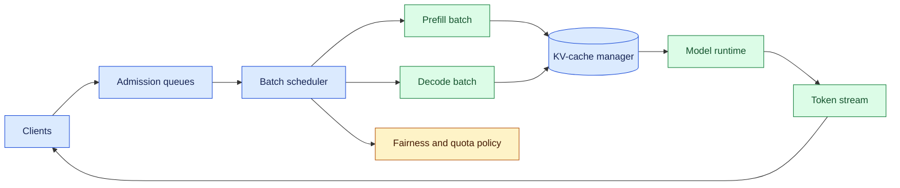
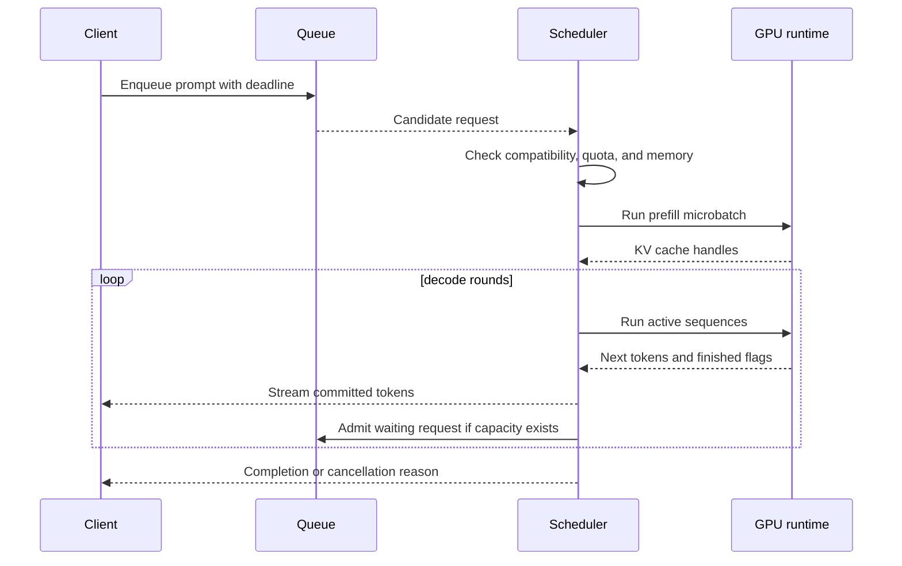

# Inference batching

Status: durable

Sources: [Google DeepMind news archive](https://deepmind.google/blog/) (issue discovery context); [NVIDIA Triton Inference Server documentation](https://docs.nvidia.com/deeplearning/triton-inference-server/user-guide/docs/user_guide/batcher.html); [Hugging Face continuous batching documentation](https://huggingface.co/docs/transformers/main/en/llm_tutorial_optimization)

## In one sentence

Inference batching combines compatible requests into shared model executions, improving accelerator utilization while requiring explicit controls for queueing, padding, fairness, memory, and tail latency.

## Background: what existed before

The simplest model service handles one request at a time. It tokenizes input, runs a forward pass, generates output, and returns a response. This is easy to reason about but leaves a GPU idle between requests and pays kernel-launch overhead repeatedly. A static batch fixes the batch size and waits until enough requests arrive; it can increase throughput but makes short requests wait behind long ones.

Language generation adds a second complication. Prefill processes the prompt and decode emits tokens repeatedly. Requests in one batch have different prompt lengths and finish at different times. Padding every sequence to the longest one wastes compute, while removing finished requests changes the active batch. A useful server must schedule work at token and sequence boundaries, not only at HTTP request boundaries.

Dynamic batching collects requests for a short window and forms a batch according to size, shape, priority, and available memory. Continuous batching admits new sequences as others finish. Both require a scheduler that can cancel work, enforce per-tenant quotas, and expose queue time separately from model time.

## What changed and why now

AI products now serve mixed workloads: chat turns, embeddings, tool calls, evaluation jobs, and long-context documents. Agent traffic is bursty and often has strict interactive deadlines. The issue’s source context reflects continued investment in model serving; the exact hardware and runtime are deployment-specific. The architectural lesson is an engineering inference: batching must be treated as a policy and observability problem, not merely a kernel optimization.

The target of optimization has also broadened. Throughput, measured as tokens per second, matters for cost. First-token latency matters for perceived responsiveness. Tail latency matters for user trust and service-level objectives. A scheduler that maximizes average utilization by allowing one long request to monopolize memory can degrade every interactive request.

## What changed this month

This month’s concept map treats batching as part of AI application architecture rather than a hidden runtime setting. New agent traffic mixes short interactive turns with long tool or evaluation jobs, so a single FIFO queue no longer describes the service. The scheduler has to understand deadlines, compatibility, cache reservations, and fairness while preserving runtime correctness.

The source-linked serving documentation provides batching primitives; selecting classes and budgets for a deployment is an engineering inference. Record the policy version with every request so a latency regression can be tied to a scheduler change. A measured rollout can compare metrics under identical demand instead of relying on uniform benchmark prompts.

## Impact on current processing and architecture

A serving path typically includes an admission queue, tokenizer, batch scheduler, model runtime, cache manager, and response streamer. The scheduler groups requests with compatible model, adapter, precision, and decoding constraints. It chooses a token budget and reserves memory for key-value caches. The runtime executes prefill or decode work; the streamer emits only committed tokens.



Batch compatibility is stricter than “same model.” Requests may have different tokenizers, LoRA adapters, stop conditions, grammars, or privacy domains. Grouping incompatible requests can produce incorrect outputs or leak data through shared caches. Include these attributes in the batching key and make the decision visible in traces.

Padding and packing are central trade-offs. Padding aligns tensors but computes on empty positions. Packing concatenates variable-length sequences with position metadata, reducing waste but increasing implementation complexity. For decode, each active sequence usually contributes one token, so continuous batching can keep the device busy while completions finish at different times. For prefill, chunk long prompts to prevent one request from delaying every other request.



KV-cache memory often becomes the limiting resource. Cache size grows with context length, layers, heads, and precision. Reserve memory before admission and evict only at a defined boundary. Swapping cache blocks to host memory may prevent failure but adds latency. A request that exceeds its budget should be rejected or truncated explicitly, not allowed to trigger an out-of-memory crash that affects every tenant.

## Real-world applications and constraints

Chat serving benefits from continuous batching when many users generate short responses. Use a short batching window to avoid adding visible queue delay. A long-context research request should enter a separate class or receive a prefill budget; otherwise it can monopolize memory. Stream tokens as soon as they are verified and include queue and generation timing in telemetry.

Embedding services can use larger static or dynamic batches because each request has one forward pass and no decode loop. Group by input length buckets to reduce padding, and cap batch bytes rather than only item count. A batch of 1,000 tiny inputs may be cheaper than 100 maximum-length documents.

Evaluation and indexing jobs are throughput-oriented. Route them to a lower-priority queue with a concurrency cap. Fair scheduling prevents background work from starving interactive traffic. If evaluation prompts contain sensitive data, keep them in an isolated model pool or enforce tenant-aware cache boundaries.

Constraints include accelerator memory, kernel shape support, tokenizer CPU cost, network transfer, adapter loading, and cancellation semantics. A request timeout should remove it from future decode rounds and release cache blocks. A cancelled client may still leave an in-flight kernel; the server needs a safe point to reclaim resources.

## Mental model

Think of batching as a bus route. Filling every seat improves efficiency, but delaying the bus until it is full frustrates passengers. Short routes, long routes, priority passengers, and wheelchair access require scheduling rules. The right metric is not passengers per bus alone; it is useful passengers delivered within acceptable waiting time.

The key distinction is **queue latency** versus **compute latency**. Batching can reduce compute cost while increasing queue time. Measure both. Also distinguish throughput from goodput: a server that emits tokens for requests users cancel may show high throughput but poor useful work.

## Engineering consequence

Define service classes with explicit deadlines, maximum prompt and output tokens, priority, and cost budget. Implement weighted fair queuing or a simpler bounded round-robin policy before optimizing kernels. Record admission reason when a request waits: incompatible shape, quota, memory, or deliberate fairness delay.

Use microbatch limits based on tokens and cache bytes, not request count alone. Add backpressure at the edge and return a retry-after signal when admission is closed. A retry should carry an idempotency key for non-idempotent orchestration, but generation requests can usually be safely cancelled and retried if the product accepts different sampling outcomes.

Measure p50, p95, and p99 first-token and inter-token latency; queue time; tokens per GPU-second; padding ratio; cache occupancy; batch size; cancellation; and out-of-memory prevention. Compare homogeneous and mixed workloads. A change that improves mean throughput but worsens p99 should be evaluated against the product SLO, not celebrated automatically.

| Workload | Batching policy | Main risk |
| --- | --- | --- |
| Interactive chat | Short-window continuous batching | Queue delay and tail latency |
| Long-context request | Chunked prefill with reservation | Memory monopolization |
| Embeddings | Length-bucketed dynamic batches | Padding waste |
| Offline evaluation | Large low-priority batches | Starving interactive traffic |

## Limits and failure modes

### Scheduling details that matter in production

Admission should be atomic with cache reservation. If the scheduler accepts a request and discovers later that its context cannot fit, it creates avoidable retries and can starve other tenants. Reserve an estimated cache footprint, then adjust after tokenization; reject with a useful reason when the estimate exceeds a configured ceiling. Keep a small emergency margin for runtime overhead and allocator fragmentation.

Fairness is multidimensional. A tenant may have a request-count limit, token budget, and maximum concurrent cache blocks. Weighted fair queuing can give interactive traffic more service without completely stopping offline work. Add aging so a request waiting behind incompatible shapes eventually receives a scheduling opportunity. Priority must not bypass safety or privacy compatibility checks.

Prefill and decode compete differently. Prefill is compute-heavy and can delay decode tokens; decode is latency-sensitive and often memory-bandwidth-bound. Some runtimes separate them into pools or use prefill chunking. Measure the trade-off with realistic context lengths. A benchmark containing only short prompts can hide the production effect of a single 100,000-token request.

Failures should be explicit. If a worker dies, the scheduler marks the batch uncertain, releases leases after a timeout, and requeues only requests whose output stream was not committed. If a client disconnects, cancellation propagates to the scheduler and cache manager. If a model instance is draining for deployment, stop admitting new work while allowing active sequences to finish or migrate at a defined safe point.

Capacity planning should use demand distributions, not one average. Record burst size, prompt length, output length, concurrency, and cancellation rate. A simple queueing model can estimate required replicas, but validate it with load tests that include correlated bursts and long-tail requests. Keep a low-cost fallback model or a clear overload response; silently increasing queue delay is a poor degradation strategy.

## Operational experiment

Run a local experiment with a mock runtime before changing a production scheduler. Generate interactive requests with short deadlines and offline requests with no strict deadline. Compare three policies: FIFO, shortest-estimated-job-first, and weighted fair queuing. Report p95 first-token delay, completed tokens, deadline misses, and the share of service received by each class. The experiment makes policy trade-offs visible without requiring a large model.

Incorrect compatibility keys can mix adapters or privacy domains. Cache accounting bugs can cause out-of-memory failures. Scheduler starvation can hide behind healthy average latency. Instrument per-tenant and per-class metrics, and test admission under burst and cancellation.

Padding waste grows with length variance. Bucketing reduces waste but may increase waiting for a rare shape. Adaptive windows should have a maximum delay. A model update can change memory use and invalidate previous batch limits; capacity tests belong in deployment gates.

## Build it locally

This toy scheduler groups requests by model and token budget while respecting a maximum batch size.

```python
from collections import defaultdict

requests = [
    {"id": "a", "model": "small", "tokens": 80},
    {"id": "b", "model": "small", "tokens": 70},
    {"id": "c", "model": "large", "tokens": 80},
]

def batches(items, max_items=2, max_tokens=160):
    groups = defaultdict(list)
    for item in items:
        groups[item["model"]].append(item)
    result = []
    for model, group in groups.items():
        current, total = [], 0
        for item in group:
            if current and (len(current) == max_items or total + item["tokens"] > max_tokens):
                result.append((model, current))
                current, total = [], 0
            current.append(item)
            total += item["tokens"]
        if current:
            result.append((model, current))
    return result

for model, batch in batches(requests):
    print(model, [item["id"] for item in batch])
```

1. Save as `batch.py` and run `python3 batch.py`.
2. Add deadlines and sort each group by earliest deadline.
3. Track padding waste by comparing the longest item with total tokens.
4. Add a per-tenant quota and reject a batch that exceeds it.
5. Simulate cancellation between rounds and release the cancelled request.

## Implementation exercises

1. Build a Dockerized mock server with interactive and offline queues.
2. Use command-line timing to compare single requests, static batches, and a short dynamic window.
3. Capture only local synthetic traffic with Wireshark and verify that cancellation and retry metadata contain no prompt secrets.
4. Add a Markdown diagram of queue, scheduler, cache, and runtime, then document the latency and throughput trade-off.

## Interview Q&A

**Why does batching improve throughput?** Shared tensor operations and fewer kernel launches use accelerator resources more efficiently.

**Why can batching hurt latency?** Requests wait for a batch window or a long peer, and padding or cache pressure can increase compute.

**What is continuous batching?** Adding and removing sequences between decode rounds so the active batch stays productive as requests finish.

**Which metrics matter?** Queue and compute latency, tail latency, tokens per second, padding, cache occupancy, cancellations, and useful completion rate.

## Glossary

## Deployment checklist

Before enabling a new batching policy, replay a representative trace, verify compatibility keys, and set token and cache ceilings. Load-test bursty arrivals with cancellations and long prompts. Confirm that queue time, model time, cache occupancy, and deadline misses are visible by tenant and service class. Start with a small traffic slice and keep a target-only fallback. Document who can change batch limits, how to drain a replica, and which alert means capacity is unsafe rather than merely slow.

**Dynamic batching:** Forming batches from requests that arrive over time.

**Continuous batching:** Updating the active generation batch between decode rounds.

**KV cache:** Attention state retained for each active sequence.

**Microbatch:** Smaller execution group used to control memory and delay.

**Prefill:** Processing the input prompt before token generation.

## References

- [NVIDIA Triton batcher documentation](https://docs.nvidia.com/deeplearning/triton-inference-server/user-guide/docs/user_guide/batcher.html) — serving and batching context.
- [Hugging Face optimization documentation](https://huggingface.co/docs/transformers/main/en/llm_tutorial_optimization) — inference optimization context.
- [Google DeepMind news archive](https://deepmind.google/blog/) — issue discovery context.

## Claim ledger

| Claim | Source | Fact or inference |
| --- | --- | --- |
| Dynamic batching groups arriving inference requests for shared execution. | Triton documentation | Source-context fact |
| Continuous batching is useful for variable-length generation. | Serving practice and synthesis | Engineering inference |
| Queue, cache, and fairness policies are as important as kernel efficiency. | Lesson synthesis | Engineering inference |
